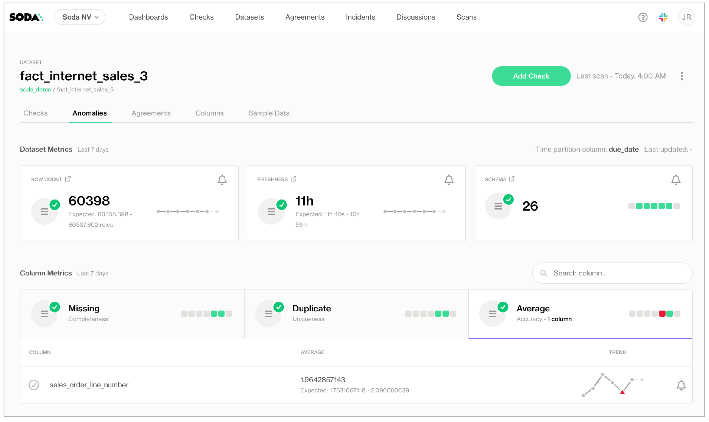

# anomaly-dashboard

Introducing Soda's **Anomaly Dashboard for observability**. Use the dashboard driven by machine learning to get automated insights into basic data quality metrics for your datasets. \[Learn more]\(

)

Supported by Soda deployments that use a self-hosted or Soda-hosted Agent to connect to data sources.

{:height="700px" width="700px"}
