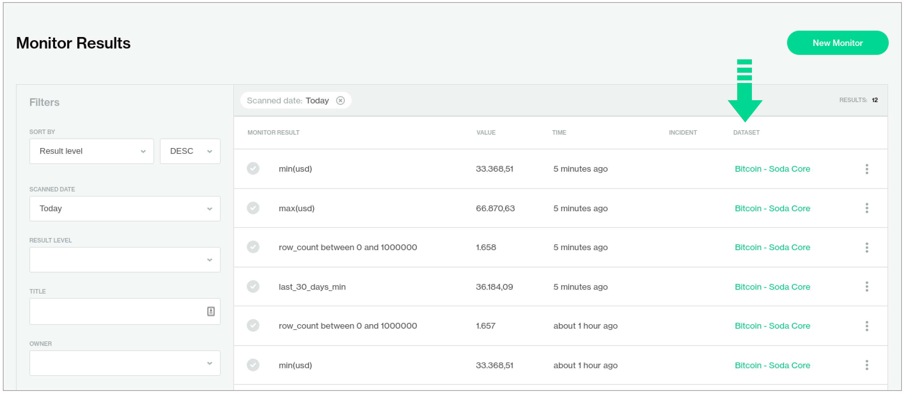

# improve-monitor-results-experience

In the [**Monitors**](https://cloud.soda.io/monitors) dashboard, the table of **Monitor Results** now includes the name of the dataset to which each monitor is associated.

{:target="\_blank"}
