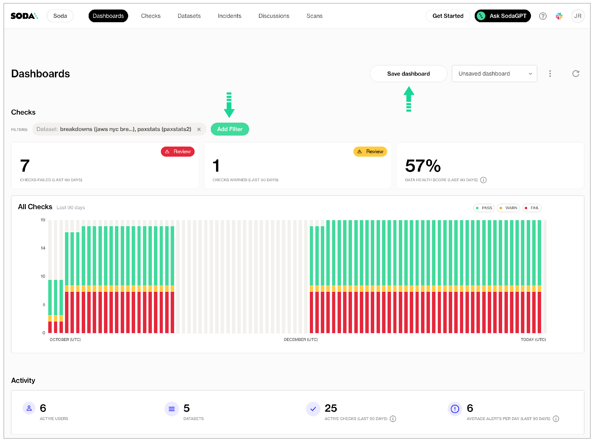
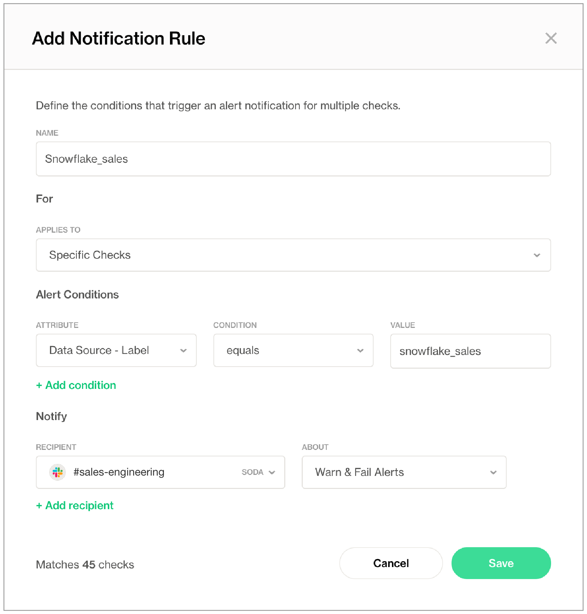
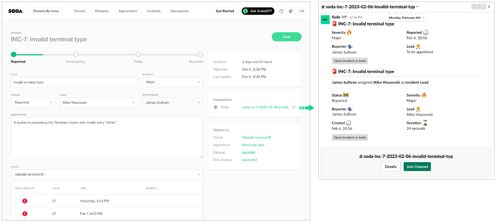

# Organize results, set alerts, investigate issues

After you have set up Soda, there are several recommended steps to take to customize your implementation and maximize your team's efficiency in monitoring data quality. Though recommended, these customizations are optional.

As the last step in the **Get started roadmap**, this guide offers instructions to organize your check results, customize alert notifications, open incidents to investigate issues, and more.

#### Get started roadmap

1. ~~Choose a flavor of Soda~~
2. ~~Set up Soda: install, deploy, or invoke~~
3. ~~Write SodaCL checks~~
4. ~~Run scans and review results~~
5. **Organize, alert, investigate** 📍 You are here!

***

## Customize your dashboard

Customize your dashboard by adding filters to distill the data the dashboard displays. Save your customized dashboard so you can easily return to your distilled view.

<figure><figcaption></figcaption></figure>

## Activate anomaly dashboards


**Available in 2025.**


_For preview participants, only._

✔️    Requires Soda Core Scientific (included in a Soda Agent)\
✖️    Supported in Soda Core\
✖️    Supported in Soda Library + Soda Cloud\
✔️    Supported in Soda Cloud + self-hosted Soda Agent connected to any Soda-supported data source, except Spark, and Dask and Pandas\
✔️    Supported in Soda Cloud + Soda-hosted Agent connected to a BigQuery, Databricks SQL, MS SQL Server, MySQL, PostgreSQL, Redshift, or Snowflake data source\


To automatically build an **anomaly dashboard** for one or more dataset in a data source, you can configure Soda Cloud to profile the columns in datasets. During the guided workflow to add a new data source, add profiling configuration to indicate the datasets to which you wish to activate an anomaly dashboard.

During the following five or more days, Soda's machine learning algorithm gathers measurements that allow it to recognize patterns in your data. When it has gathered enough information to reliably discern patterns, it automatically begin detecting anomalies in your data relative to the patterns. In the **Anomalies** tab of a dataset, you can access an anomaly dashboard displays the results of multiple automated anomaly detection checks that Soda calibrated to your data.

<figure><figcaption></figcaption></figure>

## Integrate with Slack

As a user with permission to do so in your Soda Cloud account, you can integrate your Slack workspace in your **Soda Cloud** account so that Soda Cloud can interact with individuals and channels in the workspace. Use the Slack integration to:

* send notifications to Slack when a check result triggers an alert
* create a private channel whenever you open new incident to investigate a failed check result
* track Soda Discussions wherein your fellow Soda users collaborate on data quality checks

1. In Soda Cloud, navigate to **your avatar** > **Organization Settings**, then navigate to the **Integrations** tab and click the **+** icon to add a new integration.
2. Follow the guided steps to authorize Soda Cloud to connect to your Slack workspace. If necessary, contact your organization’s Slack Administrator to approve the integration with Soda Cloud.
   * **Configuration** tab: select the public channels to which Soda can post messages; Soda cannot post to private channels.
   * **Scope** tab: select the Soda features (alert notifications and/or incidents) which can access the Slack integration.

Note that Soda caches the response from the Slack API, refreshing it hourly. If you created a new public channel in Slack to use for your integration with Soda, be aware that the new channel may not appear in the **Configuration** tab in Soda until the hourly Slack API refresh is complete.

Organize results, set alerts, investigate issues Alternatively, you can integrate Soda with [MS Teams](../integrate-soda/integrate-msteams.md) or another third-party ticketing or messaging tool using a [webhook](../integrate-soda/integrate-webhooks.md).

## Invite your team members

Invite the members of your team to join you in your work to monitor data quality in your organization.

In your Soda Cloud account, navigate to **your avatar** > **Invite Team Members** and fill in the blanks.

When your team members receive the invitation email, they can click the link in the email to create their own login credentials to access your Soda Cloud account directly. Refer to [Manage global roles, user groups, and settings](roles-global.md) to learn more about the default access rights Soda Cloud assigns to new users.

Note that if your organization uses a single sign-on (SSO) identity provider to access Soda Cloud, you cannot invite team members in Soda Cloud. Instead, contact your IT Admin to request access to Soda Cloud using your SSO. See also, [Single Sign-on with Soda Cloud](../integrate-soda/sso.md).

## Add check attributes

Define check attributes that your team can apply to checks to filter check results and customize alert notifications.

* Apply attributes to checks to label and sort them by department, priority, location, etc.
* Add a check attribute to identify, for example, checks that execute against personally identifiable information (PII).
* Define rules to route alert notifications according to check attributes.\


1. You must define check attributes first, before a user can apply the attribute to new or existing checks. In your Soda Cloud account, navigate to **your avatar** > **Attributes** > **New Attribute**.
2. Follow the guided steps to create and save a new attribute. [Learn more](check-attributes.md)
3. Apply the new attribute to SodaCL checks using key:value pairs, as in the following example which applies five attributes to a new `row_count` check.

```yaml
checks for dim_product:
  - row_count = 10:
      attributes:
        department: Marketing
        priority: 1
        tags: [event_campaign, webinar]
        pii: true
        best_before: 2022-02-20
```

## Set alert notification rules

Ascribing to a "No noise" policy, Soda enables you define rules to customize the alert notifications you receive when check results warn or fail. For example, you can define a notification rule to instruct Soda Cloud to send an alert to your `#sales-engineering` Slack channel whenever a data quality check on the `snowflake_sales` data source fails.

In Soda Cloud, navigate to **your avatar** > **Notification Rules**, then click **New Notification Rule** and follow the guided steps to complete the new rule. [Learn more](notif-rules.md)

<figure><figcaption></figcaption></figure>

## Build check collections

If there are checks which you wish to review frequently, consider building a **Collection**.

1. In your Soda Cloud account, navigate to the **Checks** dashboard.
2. Use a combination of Soda Cloud filters to display your ideal set of data quality checks, then click **Save Collection** to name the custom filtered view.
3. In the future, use the dropdown in the **Checks** dashboard to quickly access your collection again.

## Create incidents

When a check fails, you can create an incident in Soda Cloud to track your team’s investigation and resolution of a data quality issue. [Read more](incidents.md)

1. Log in to your Soda Cloud account, then navigate to the **Checks** dashboard.
2. For the check you wish to investigate, click the stacked dots at right, then select **Create Incident**. Provide a **Title**, **Severity**, and **Description** of your new incident, then save.
3. In the **Incident** column of the check result, click the Incident link to access the Incident page where you can record the following details:
   * **Severity**: Minor, Major, or Critical
   * **Status**: Reported, Investigating, Fixing, Resolved
   * **Lead**: a list of team members from whom you can assign the Lead Investigator role
4. Save your changes.
5. If you have connected your Soda Cloud account to Slack, navigate to the **Integrations** tile, then click the auto-generated link that connects directly to a newly-created, public channel in your Slack workspace that is dedicated to the investigation and resolution of the incident and invite team members to the channel to collaborate on resolving the data quality issue.\
   If you have integrated Soda Cloud with [MS Teams](../integrate-soda/integrate-msteams.md) or another [third-party tool](../integrate-soda/integrate-webhooks.md), like Jira or ServiceNow, you can access those tools via auto-generated links in the **Integrations** tile, as well.

If you have integrated your Soda Cloud account with a Slack workspace, you can use an incident's built-in ability to create an incident-specific Slack channel where you and your team can collaborate on the issue investigation.

<figure><figcaption></figcaption></figure>

## Add dataset attributes

With dozens, or even hundreds of datasets in your Soda Cloud account, it may be difficult to find the data quality information you’re looking for. To facilitate your search for specific data quality status, consider defining your own **Attributes** and **Tags** for datasets, then use filters to narrow your search.

Use dataset attributes to:

* identify datasets that are associated with a particular marketing campaign
* identify datasets that are relevant for a particular customer account
* identify datasets whose quality is critical to business operations, or to categorize datasets according to their criticality in general, such as “high”, “medium”, and “low”.
* identify datasets that populate a particular report or dashboard

1. You must define attributes first, before applying them to datasets. In your Soda Cloud account, navigate to **your avatar** > **Attributes** > **New Attribute**.
2. Follow the guided steps to create the new attribute. [Learn more](organize-datasets.md)
3. Navigate to the **Datasets** dashboard, click the stacked dots next to a dataset, then select **Edit Dataset**. Use the attributes fields to apply the appropriate attributes to the dataset, and add any tags you wish as further dataset identifiers.\
   4\. After saving your changes and applying tags and attributes to multiple datasets, use the **Filters** in the **Datasets** dashboard to display the datasets that help narrow your study of data quality.

## Integrate with a data catalog

If your team uses a data catalog such as Alation, Atlan, or Metaphor, consider integrating it with Soda to access details about the quality of your data directly within the data catalog.

* Run data quality checks using Soda and visualize quality metrics and rules within the context of a data source, dataset, or column in Alation.
* Use Soda Cloud to flag poor-quality data in lineage diagrams and during live querying.
* Give your Alation users the confidence of knowing that the data they are using is sound.

Use the links below to access catalog-specific integration instructions.

[Integrate with Alation](../integrate-soda/integrate-alation.md)

[Integrate with Atlan](../integrate-soda/integrate-atlan.md)

[Integrate with Metaphor](../integrate-soda/integrate-metaphor.md)

[Integrate with Microsoft Purview](../integrate-soda/integrate-purview.md)

## Go further

1. ~~Choose a flavor of Soda~~
2. ~~Set up Soda: install, deploy, or invoke~~
3. ~~Write SodaCL checks~~
4. ~~Run scans and review results~~
5. ~~Organize, alert, investigate~~

🌟 Well done! You've complete the roadmap! 🌟\


* Use the [Reporting API](../reporting-api-v1/) to access metadata about your Soda Cloud account.
* Are you a dbt user? Consider [ingesting dbt tests](../integrate-soda/integrate-dbt.md) into Soda Cloud for a single-pane-of-glass view of your data quality tests.
* Access the [Use case guides](../use-case-guides/) for example implementations of Soda.


