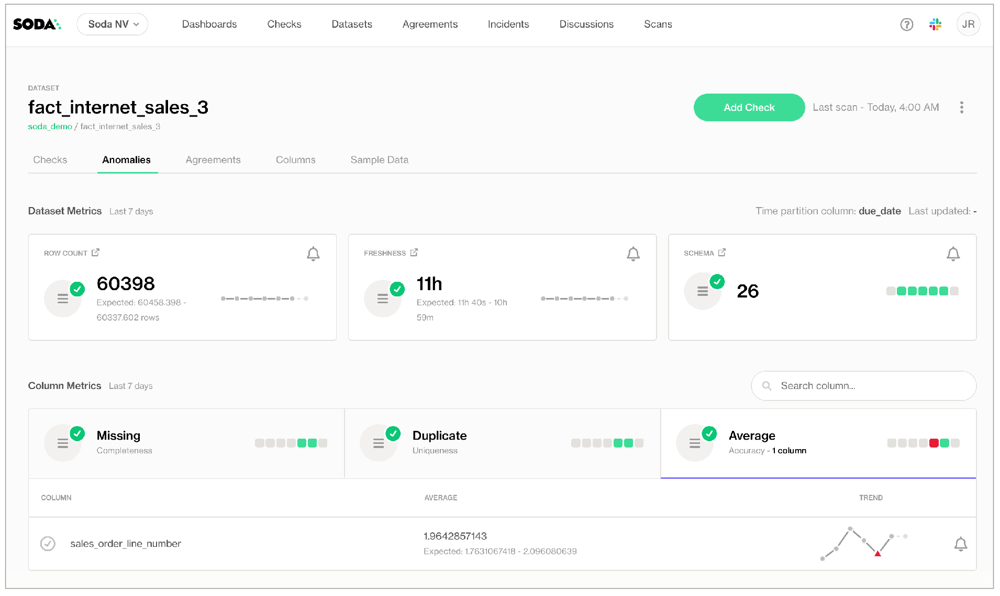

# Activate anomaly dashboards


**Available in 2025** — See [Soda Documentation v4](https://app.gitbook.com/o/ig9n9VJPAFRSFLtZKVB2/s/A2PmHkO5cBgeRPdiPPOG/)


Use Soda's **anomaly dashboards** to get automated insights into basic data quality metrics for your datasets.

<figure><figcaption></figcaption></figure>

To activate these out-of-the-box dashboards, Soda learns enough about your data to automatically create checks for your datasets that monitor several built-in metrics for anomalous measurements. To offer this observability into the basic quality of your data, the anomaly dashboard gauges:

* anomalies in a dataset's **row count** volume
* anomalies in the **timeliness** of new data in a dataset that contain a column with a TIME data type
* evolutions in a dataset's **schemas**, monitoring columns that have been moved, added, or removed
* anomalies in the volume of **missing** values in columns in a dataset
* anomalies in the volume of **duplicate** values in columns in a dataset
* anomalies in the calculated **average** of the values in columns in a dataset that contain numeric values

Using a self-hosted or Soda-hosted agent connected to your Soda Cloud account, you configure a data source to partition, then profile the datasets to which you wish to add an anomaly dashboard. Soda then leverages machine learning algorithms to run daily scans of your datasets to gather measurements which, after a few days, enable Soda to recognize patterns in your data.

After establishing these patterns, Soda automatically detects anomalies relative to the patterns and flags them for your review in each dataset's anomaly dashboard.

✔️    Requires Soda Core Scientific (included in a Soda Agent)\
✖️    Supported in Soda Core\
✖️    Supported in Soda Library + Soda Cloud\
✔️    Supported in Soda Cloud + self-hosted Soda Agent connected to a BigQuery, Databricks SQL, MS SQL Server, MySQL, PostgreSQL, Redshift, or Snowflake data source

## Compatibility

| <p>BigQuery<br>Databricks SQL<br>MS SQL Server<br>MySQL</p> | <p>PostgreSQL<br>Redshift<br>Snowflake<br> </p> |
| ----------------------------------------------------------- | ----------------------------------------------- |

## Set up anomaly dashboards


**Available in 2025.**


_For preview particpants, only_

Activate an anomaly dashboard to one or more datasets by configuring profiling for a new data source in Soda Cloud. Refer to the [Get started](../quick-start-sip/managed-agent.md#add-a-new-data-source) documentation for full data source onboarding instructions.

1. To activate anomaly dashboards, you must use a self-hosted or Soda-hosted agent to connect to your data sources.\
   If you already use a self-hosted Soda agent, [upgrade the agent](../quick-start-sip/upgrade.md#upgrade-a-self-hosted-soda-agent) to version 1.1.2 or greater.\
   If you do not already have an active Soda agent in your Soda Cloud account:
   * navigate to **your avatar** > **Organization Settings** to validate that the checkbox for **Enable Soda-hosted Agent** is checked\
     OR\

   * follow the instructions to [deploy self-hosted agent](../quick-start-sip/deploy.md) in Kubernetes cluster in your cloud services environment
2. You can activate anomaly dashboards on existing data sources or on new ones you add via a Soda agent.
   * For existing data sources, follow [the procedure](anomaly-dashboard.md) to activate an anomaly dashboard to an existing dataset.
   * For a new data source, navigate to **your avatar** > **Data Sources**, then click **Add New** to begin the guided data source onboarding workflow.
3.  In the editing panel of **4. Profile**, use the include and exclude syntax to indicate the datasets for which Soda must profile and prepare an anomaly dashboard. The default syntax in the editing panel instructs Soda to profile every column of every dataset in the data source, and, superfluously, all datasets with names that begin with prod. The `%` is a wildcard character. See [Add column profiling](../soda-cl-overview/profile.md#add-column-profiling) for more detail on profiling syntax

    ```yaml
    profile columns:  
      columns:
        - "%.%"  # Includes all your datasets
        - prod%  # Includes all datasets that begin with 'prod'
    ```
4. Continue the remaining steps to add your new data source, then **Test Connection**, if you wish, and **Save** the data source configuration. Soda begins profiling the datasets according to your **Profile** configuration while the algorithm uses the first measurements collected from a scan of your data to begin the work of identifying patterns in the data.
5. After approximately five days, during which Soda's machine learning studies your data, you can navigate to the **Dataset** page for a dataset you included in profiling. Click the **Anomalies** tab to view the issues Soda automatically detected.
6. (Optional) Consider setting up a notification for any of the automated anomaly detection checks in the dashboard; see [Add anomaly notification](anomaly-dashboard.md#add-anomaly-notifications).
7. (Optional) If you wish, you can adjust the time of day that the daily anomaly detection scan definition runs to collect its measurements. To do so, navigate to the **Scans** dashboard, then, for the scan definition that runs daily for your anomaly dashboard updates, click the stacked dots at right and select **Edit Scan Definition**. Adjust the time of day as you wish, then **Save**.

### Activate an anomaly dashboard to an existing dataset

Use the following procedure to activate the anomaly dashboard for an existing dataset in a data source you already connected to your Soda Cloud account via a self-hosted or Soda-hosted agent.

1. If you have the [permission](roles-dataset.md) to do so for a dataset, navigate to the **Datasets** dashboard, then open the dataset to which you wish to activate an anomaly dashboard.
2. Navigate to the **Anomalies** tab where a message appears that advises you that the anomaly dashboard has not been activated for this dataset. Click **Activate**.
3. Follow the guided steps and carefully read the warning about the changes to any existing profiling you have configured for the data source (see below). If you accept the permanent changes, specify the time of day you wish to run the daily anomaly scan, then proceed.


To activate the anomaly dashboard for this dataset, Soda creates a new, dedicated scan definition for its data source that runs dataset discovery, profiling, and anomaly detection on a daily schedule. With this activation, be aware that:

* Soda moves your existing dataset [discovery and profiling](../soda-cl-overview/profile.md) configurations from this data source’s default scan definition to the new scan definition to indicate which datasets the anomaly dashboard should profile.
* Any [automated monitoring](../soda-cl-overview/automated-monitoring.md) checks you previously configured for any datasets this data source cease to exist; the new scan definition runs all automated anomaly detection checks.


4. After approximately five days, during which Soda's machine learning studies your data, you can return to the **Anomalies** tab on the **Dataset** page to view the issues Soda automatically detected.
5. (Optional) Consider setting up a notification for any of the automated anomaly detection checks in the dashboard; see [Add anomaly notification](anomaly-dashboard.md#add-anomaly-notifications).
6. (Optional) If you wish, you can adjust the time of day that the daily anomaly detection scan definition runs to collect its measurements. To do so, navigate to the **Scans** dashboard, then, for the scan definition that runs daily for your anomaly dashboard updates, click the stacked dots at right and select **Edit Scan Definition**. Adjust the time of day as you wish, then **Save**.

## About the anomaly dashboard

To access a dataset's anomaly dashboard in Soda Cloud, navigate to the **Datasets** dashboard, then select a dataset from the presented list to open an individual dataset page. Navigate to the **Anomalies** tab.

<figure><figcaption></figcaption></figure>

The three **Dataset Metrics** tiles represent the most recent measurement or, in other words, one day’s worth of data anomaly detection. The three **Column Metrics** tiles display the last seven days’ worth of measurements and any anomalies that Soda detected.

When you click a **Column Metrics** tile to access more information, the list below details which columns contained anomalies.

* A red warning icon for a column indicates that Soda registered an anomaly in the last daily scan of the dataset.
* A green check icon for a column indicates that Soda resgisterd no anomalies in the last daily scan of the dataset.
* A grayed-out icon for a column indicates that Soda registered an anomaly for a check at least once in the last seven days, but not on the most recent daily scan.

Click a Dataset Metric tile or the column name for a Column Metric to open the **Check History** for the anomaly detection check. Optionally, you can add feedback to individual data points in the check history graph to help refine the anomaly detection’s algorithm pattern recognition and its ability to recognize anomalies.

<figure><figcaption></figcaption></figure>

### Empty metrics tiles

If, after the anomaly detection algorithm has completed its pattern training, the anomaly dashboard does _not_ display anomaly info in one or more tiles, it may be for one of a couple of reasons.

* There is no column that contains TIME type data (TIMESTAMP, DATE, DATETIME, etc.) which a freshness check requires. Where it cannot detect a column with the necessary data type, Soda leaves the **Freshness** tile blank.
* There is no column that contains NUMBER type data (INT, FLOAT, etc.) which an average metric check requires. Where it cannot detect a column with the necessary data type, Soda leaves the **Average** tile blank.

### Known issues and limitations

* Soda anomaly dashboard does not profile columns that contain timestamps or dates. As such, Soda only executes a freshness check for such columns for the anomaly dashboard to validate data freshness, but not anomalies in the columns that contain dates or timestamps.

## Add anomaly notifications

The anomaly dashboard adheres to Soda’s “no noise” policy when it comes to alert notifications for data quality issues. As such, the dashboard does not automatically send any notifications to anyone out of the box. If you wish to received alert notifications for any of the anomalies the dashboard detects, use the bell (🔔) icon.

If your Soda Admin has integrated your Soda Cloud account with [Slack](../integrate-soda/integrate-slack.md) or [MS Teams](../integrate-soda/integrate-msteams.md) to receive check notifications, you can direct anomaly dashboard alerts to those channels. The dashboard does not support sending alerts via [webhook](../integrate-soda/integrate-webhooks.md).

For a **Dataset Metric**, click the bell to follow the guided instructions to set up a rule that defines where to send an alert notification when Soda detects an anomalous measurement for the metric.

<figure><figcaption></figcaption></figure>

For a **Column Metric**, click the bell next to an individual column name from those listed in the table below the three column metric tiles. Follow the guided instructions to set up a rule that defines where to send an alert notification when Soda detects an anomalous measurement for the metric.

For example, if you want to receive notifications any time Soda detects an anomalous volume of duplicate values in an `order_id` column, click the **Duplicate** tile to display all the columns for which Soda automatically detects anomalies, then click the bell for `order_id` and set up a rule. If you also wish to receive notifications for anomalous volumes of missing values in the same column, click the **Missing** tile, then click the bell for `order_id` to set up a second rule.

<figure><figcaption></figcaption></figure>

## About profiling and partitioning

The anomaly dashboard is powered by a machine learning algorithm that works with measured values for a metric that occur over time. Soda leverages the [Facebook Prophet](https://facebook.github.io/prophet/) algorithm to learn patterns in your data so it can identify and flag anomalies.

As the checks in the dashboard track and analyze metrics over time, the algorithm learns from historical patterns in your data, including trends and seasonal variations in the measurements it collects. After learning the normal behavior of your data, the checks become capable of detecting variations from the norm which it flags as anomalies.

Notably, it takes some time – approximately five or more days – for the anomaly dashboard to learn the patterns of your data before it can display meaningful results.

When you set up or activate the anomaly dashboard, Soda begins by partitioning your data. To maximize efficiency, Soda does not profile the _entirety_ of data in a dataset; instead, it partitions your data so that it profiles only a sample of the data.

To partition the data, first, Soda detects a column that contains TIME type data that it can use to partition the data to only the last 30 days' worth of data. If it does not detect a column of TIME type data, it uses one million rows of data against which to perform its profiling. If there are fewer than one million rows in a dataset, it profiles all the data; if there are more than a million rows, it selects a random sample of a million rows to use to profile the data.

After partitioning a sample of data, Soda begins profiling it. The profiling activity collects metadata for your datasets such as the names of the columns in the datasets you configured for profiling, and the type of data that each contains. After profiling the data, Soda automatically creates relevant anomaly detection checks for the dataset and some of its columns.

### Change the time partitioning column

If you wish, you can change the column which Soda automatically selected to partition your data. For example, if Soda selected a column with TIMESTAMP data labeled `created_at` to partition your data, but you would prefer that it use a `last_updated` column instead, you can make the change in Soda Cloud.

When you choose a new time partition column, the anomaly dashboard algorithm _resets_, freshly partitioning the data based on the new column, then profiling the data and training on at least five days of measurements before displaying new results. The dashboard does not persist any existing anomaly dashboard measurements.

1. With Admin, Manager, or Editor rights to a dataset in Soda Cloud, navigate to the **Dataset** page, then access the **Anomalies** tab.
2. Click the stacked dots at the upper right of the page, then select **Edit dataset**.
3. In the dialog box that appears, access the **Profiling** tab, then use the dropdown list of columns to select the one that you want Soda to use to partition your data for profiling for use in the anomaly dashboard.
4. Carefully read the warning message about the consequences of the change, then **Save**.

## Go further

* Add your own [anomaly detection checks](../sodacl-reference/anomaly-detection.md) for other metrics for your data.


