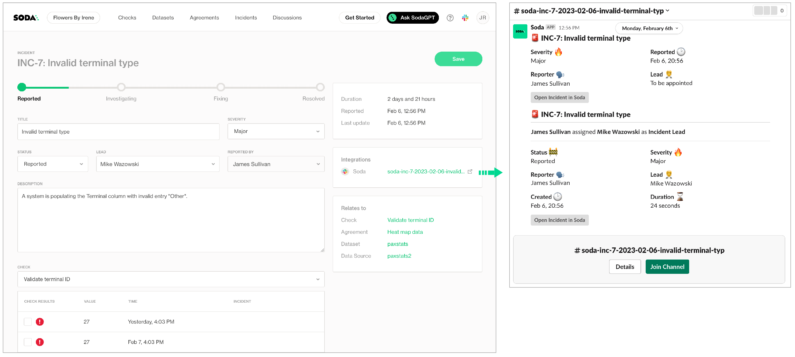

# Create and track incidents

When Soda runs a scan to execute the SodaCL checks you defined, Soda Cloud displays the checks and their latest scan results in the **Checks** dashboard. For a check that failed or triggered a warning, you have the option of creating an **Incident** for that check result in Soda Cloud to track your team's investigation and resolution of a data quality issue.

If you have integrated your Soda Cloud account with a [Slack workspace](../integrate-soda/integrate-slack.md), or [MS Teams channel](../integrate-soda/integrate-msteams.md), or another [third-party messaging or ticketing tool](../integrate-soda/integrate-webhooks.md) that your team uses such as [Jira](../integrate-soda/integrate-jira.md) or [ServiceNow](../integrate-soda/integrate-servicenow.md), you can use an incident’s built-in ability to create an incident-specific link where you and your team can collaborate on the issue investigation.

<figure><figcaption></figcaption></figure>

## Create Incidents

1. Log in to your Soda Cloud account, then navigate to the **Checks** dashboard.
2. For the check you wish to investigate, click the stacked dots at right, then select **Create Incident**. Provide a **Title**, **Severity**, and **Description** of your new incident, then save.
3. In the **Incident** column of the check result, click the Incident link to access the Incident page where you can record the following details:
   * **Severity**: Minor, Major, or Critical
   * **Status**: Reported, Investigating, Fixing, Resolved
   * **Lead**: a list of team members from whom you can assign the Lead Investigator role
4. Save your changes.
5. If you have connected your Soda Cloud account to Slack, navigate to the **Integrations** tile, then click the auto-generated link that connects directly to a newly-created, public channel in your Slack workspace that is dedicated to the investigation and resolution of the incident and invite team members to the channel to collaborate on resolving the data quality issue.\
   If you have integrated Soda Cloud with [MS Teams](../integrate-soda/integrate-msteams.md) or another [third-party tool](../integrate-soda/integrate-webhooks.md), like Jira or ServiceNow, you can access those tools via auto-generated links in the **Integrations** tile, as well.

## Track Incidents

* As your team works through the investigation of an Incident, use the Incident's **Status** field to keep track of your progress.
* In the **Incidents** dashboard, review all Incidents, their severity and status, and the assigned lead. Sort the list of Incidents by severity.
* From an Incident's page, link other check results to the same Incident to expand the investigation landscape.
* If you opened a Slack channel to investigate the incident, Soda archives the channel when you set the **Status** to Resolved.

## Go further

* [Organize your datasets](organize-datasets.md) to facilitate your search for the right data.
* [Manage failed row samples](../run-a-scan/failed-row-samples.md) for a check result.
* Collaborate with your team using a [Single Sign-on IdP](../integrate-soda/sso.md).
* Integrate Soda with your [data catalogs](../integrate-soda/integrate-alation.md) or [data pipeline tools](../_release-notes/integrate-dbt.md).


