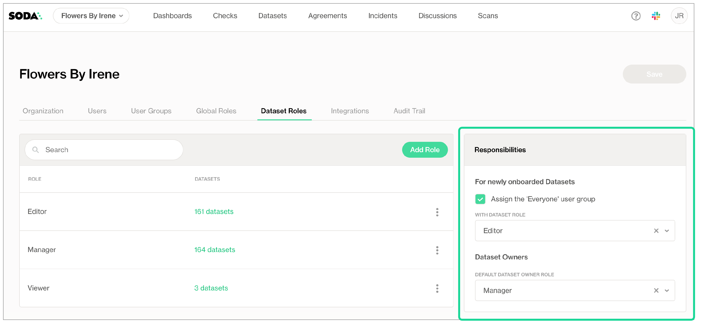

# Manage dataset roles

To manage the dataset-level permissions of users that belong to a single organization, Soda Cloud uses roles, groups, and access permissions. These role-based access permissions enforce limits on the abilities for people to make additions and changes to datasets in Soda Cloud.

There are two type of roles that regulate permissions in Soda Cloud: **Global** and **Dataset**. You can assign each type of role to users or user groups in Soda Cloud to organize role-based access control to resources and functionality in your account. You can also customize the permissions of the out-of-the-box roles Soda Cloud includes, or you can create new roles and assign permissions to roles as you wish.

The content that follows offers information about dataset roles. For details on terminology, global roles, custom user groups, and organizational settings, see [Manage global roles, user groups, and settings](roles-global.md#about-roles-groups-and-permissions).

## Dataset roles and permissions

The out-of-the-box roles that define who has permission to access or make changes to datasets in your Soda Cloud account are **Admin**, **Manager**, **Editor**, and **Viewer**. An Admin role has all permissions to access or act upon a dataset; the following table outlines the permission groups for the remaining out-of-the-box dataset roles.

| Permission group                                                                                                      | Manager | Editor | Viewer |
| --------------------------------------------------------------------------------------------------------------------- | :-----: | :----: | :----: |
| [View dataset](roles-dataset.md#view-dataset)                                                                         |    ✓    |    ✓   |    ✓   |
| 
<a href="roles-dataset.md#access-dataset-profiling-and-samples">Access dataset profiling and samples</a>
 |    ✓    |    ✓   |    ✓   |
| 
<a href="roles-dataset.md#access-failed-row-samples-for-checks">Access failed row samples for checks</a>
 |    ✓    |    ✓   |    ✓   |
| [Configure dataset](roles-dataset.md#configure-dataset)                                                               |    ✓    |    ✓   |        |
| [Manage dataset responsibilities](roles-dataset.md#manage-dataset-responsibilities)                                   |    ✓    |        |        |
| [Propose checks](roles-dataset.md#propose-checks)                                                                     |    ✓    |    ✓   |    ✓   |
| [Manage checks](roles-dataset.md#manage-checks)                                                                       |    ✓    |    ✓   |        |
| [Manage incidents](roles-dataset.md#manage-incidents)                                                                 |    ✓    |    ✓   |    ✓   |
| [Delete dataset](roles-dataset.md#delete-dataset)                                                                     |    ✓    |        |        |

\

#### View dataset

This permission group cannot be removed from any of the out-of-the-box or custom dataset roles.

* View a dataset in the list on the **Datasets** page
* View a dataset's checks in the **Checks** page
* Access a dataset via API
* Access a dataset's checks via API
* View a dataset **Checks** tab
* View a dataset's **Anomalies** tab
* View a dataset's **Agreements** tab
* View a dataset's **Columns** tab, schema info only
* View the check history for a dataset's checks, though not failed row samples

#### Access dataset profiling and samples

* View a dataset's **Columns** tab, schema and profiling info
* View a dataset's **Samples** tab

#### Access failed row samples for checks

* View the check history for a dataset's checks, including failed row samples

#### Configure dataset

* Edit a dataset's attributes
* Edit a dataset's profiling configuration

#### Manage dataset responsibilities

* Edit a dataset's responsibilities [Read more](roles-dataset.md#assign-dataset-roles)

#### Propose checks

* Select a dataset in a **New Discussion** form
* Select a dataset in an **Add Check** form
* Click **Propose Check** when creating a no-code check

#### Manage checks

* Push a dataset's check results from Soda Library scans to Soda Cloud.\
  At present, Soda Cloud does not reject check results from a Soda Library scan executed by a user without "Manage checks" permission for a dataset. Instead, Soda issues a soft warning to indicate that the user does not have permission to manage checks for the dataset. In future iterations, the warning will be changed to a rejection of any results pushed without proper permissions for the dataset.
* Edit the description of a dataset's checks
* Edit the owner of a dataset's checks
* Delete a dataset's checks
* Create no-code checks for a dataset
* Edit no-code checks for a dataset
* Delete no-code checks for a dataset
* Add proposed no-code checks to a dataset

#### Manage incidents

* Create an incident related to a dataset's check
* Update an incident related to a dataset's check

#### Delete dataset

* Delete a dataset

\

## Create dataset roles

You can create or edit dataset roles to assign to users or user groups in Soda Cloud.

As a user with permission to do so, navigate to **your avatar** > **Organization Settings**, then access the **Dataset Roles** tab. Click **Add Dataset Role**, then follow the guided workflow to name a role and add permissions groups. Refer to the [table above](roles-dataset.md#dataset-roles-and-permissions) for a list of permissions groups, and their associated permissions, that you can assign to global roles.

## Assign dataset roles

The only out-of-the-box user group that Soda Cloud provides is called **Everyone**. When a new user accepts an invitation to join an existing Soda Cloud organization, or when they gain access to an organization via SSO, Soda Cloud applies the the global role of user in the organization and, depending on the **Responsibilities** settings, may add the new user to the Everyone user group. You cannot add users to, or remove them from the Everyone user group. To learn about how to create your own user groups, see [Manage user groups](roles-global.md#manage-user-groups).

When setting responsibilities for newly-onboarded, or discovered, datasets, users with permissions to do so can access the **Organization Settings** to define:

* whether to add newly invited or added users to the out-of-the-box Everyone user group
* the default dataset role of the Everyone user group
* the default dataset role to assign to Dataset Owners to datasets that are onboarded in Soda Cloud

<figure><figcaption></figcaption></figure>

\

When any user uses Soda Library or Soda Cloud to add a new data source, and its datasets, to the Soda Cloud account, the user automatically becomes the Dataset Owner of each dataset in the data source. Depending upon the **Responsibilities** settings in the **Dataset Roles** tab of **Organization Settings**, the Dataset Owner is assigned a role according to the **Default Dataset Owner Role** setting.

Beyond the default users and roles assigned to a dataset upon addition to Soda Cloud, you can edit the responsibilities for an individual dataset to make changes to the way users and user groups can access or act upon the dataset.

1. As a user with the permission to do so, login to your Soda Cloud account and navigate to the **Datasets** dashboard.
2. Click the stacked dots to the right of the dataset for which you wish to adjust the role assignments, then select **Edit Responsibilities**.
3. Use the search bar to find specific users or user groups to which you wish to assign a role for the dataset, then use the dropdown next to each name to adjust their role, then **Save** your changes.

If you have added a user to a group to which you have assigned a level of permission for a dataset, then manually assigned a different level of permission to the individual user for a dataset, Soda honors the higher set of permissions.

For example, say you add Manny Jacinto to a user group called Marketing Team. For a new\_signups dataset, you assign the Marketing Team the out-of-the-box role of Viewer. Then, for the same dataset, you assign Manny's individual user the out-of-the-box role of Manager. Soda honors the permissions of the higher role, Manager, for Manny's access to new\_signups.

## Data source, dataset, agreement, and check owners

There are four types of resource owners in Soda Cloud that identify the user, or user group, that owns a data source, dataset, agreement, or check. These ownership roles do not enforce any permissions, they are simply resource metadata.

* By default, the user who added the data source becomes the **Data Source Owner** and **Dataset Owner** of all datasets in that data source. The default [dataset role](roles-dataset.md#dataset-roles-and-permissions) that Soda Cloud assigns to the Dataset Owner is that of Manager.
* By default, the user who creates an agreement becomes the **Check Owner** of all checks defined in the agreement.
* By default, the user who creates a no-code check becomes its **Check Owner**.
* By default, all Owners use an Author license, if you use the legacy license billing model.

\

### Change the Data Source Owner

1. With the permission to do so, login to your Soda Cloud account and navigate to **your avatar** > **Data Sources**.
2. In the **Data Sources** tab, click the stacked dots to the right of the data source for which you wish to adjust the ownership, then select **Edit Datasource**.
3. In the **Assign Owner** tab, use the dropdown to select the name of another user or user group to take ownership of the data source, then **Save**.

\

### Change the Dataset Owner

1. With the permission to do so, login to your Soda Cloud account and navigate to the **Datasets** dashboard.
2. Click the stacked dots to the right of the dataset for which you wish to adjust the ownership, then select **Edit Dataset**.
3. In the **Attributes** tab, use the dropdown to select the name of another user or user group to take ownership of the dataset, then **Save**.
4. Soda Cloud automatically assigns the role of Manager to the new Dataset Owner.

To bulk-change the owner of all new datasets added to a data source, follow the steps to [Change the Data Source Owner](roles-dataset.md#change-the-data-source-owner) and, in the **Assign Owner** tab, use the dropdown to change the owner of _all_ the datasets in the data source.

\

### Change the Check Owner

1. If you are the Admin of the organization, or have a Manager or Editor role for the check's dataset, login to your Soda Cloud account and navigate to the **Checks** dashboard.
2. Click the stacked dots to the right of the check for which you wish to adjust the ownership, then select **Edit Check**.
3. In the **Attributes** tab, use the dropdown to select the name of another user to take ownership of the check, then **Save**. Note that you cannot assign a user group as a check owner.

\

## Go further

* Learn more about the relationship between resources in [Soda’s architecture](../learning-resources/soda-cloud-architecture.md).
* [Organize your datasets](organize-datasets.md) to facilitate your search for the right data.
* [Invite colleagues](./#invite-your-team-members) to join your organization’s Soda Cloud account.
* Learn more about creating and tracking [Soda Incidents](broken-reference).


