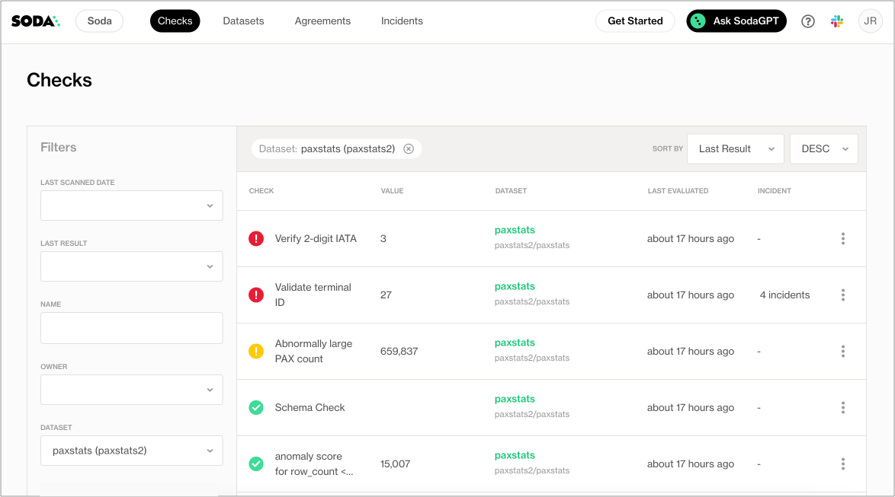

# MAD (Multivariate Anomaly Detection)


**Coming soon!**

MAD functionalities will be available soon for [Enterprise plan users](https://www.soda.io/pricing).


## What is MAD?

Ensuring data quality can be difficult, especially when you need broad coverage quickly. Checks and column monitors are great for enforcing specific rules, but they take time to set up and require a deep understanding of your data. Soda’s Multivariate Anomaly Detection (MAD) helps you get started fast, providing instant coverage across all columns, rows, and segments, without any configuration.

<figure><figcaption></figcaption></figure>

The algorithm analyzes historical data to build a clear picture of what normal data is supposed to look like. When incoming rows show unusual patterns, unexpected values, inconsistencies, or errors, MAD automatically triggers an alert and runs a Root Cause Analysis to pinpoint the issue. This provides quick, actionable insights while you work toward more detailed control using checks and column monitors.

## Why use MAD?

1. **Instant, broad coverage**\
   Monitor all columns, rows, and segments at once, detecting both known and unknown issues.
2. **No configuration needed**\
   Get started immediately: no metrics or checks need to be defined. MAD automatically determines which columns to use.
3. **One metric to track and alert on**\
   The Multivariate Drift Score provides a single, explainable metric to monitor data health.
   * **Assess the impact of data quality issues**: easily determine how many rows in your dataset are affected by data quality problems.
   * **Prioritize what matters**: use the Multivariate Drift Score consistently across datasets and data sources to rank and focus on the most critical data quality issues.
   * **Reduce false alerts**: traditional column-level monitoring increases the risk of false positives with every additional monitor. With MAD, you only need one anomaly detection monitor per dataset, minimizing noise.
   * **Optimize compute usage**: monitoring a single metric per dataset lowers computational overhead. Additionally, MAD can work with sampled data, further reducing processing demands.
4. **Built‑in root cause analysis**\
   Quickly understand what changed and why.
5. **Native support for backfilling and back‑testing**\
   Automatically generate and assess historical Multivariate Drift Scores to review past data quality trends.

## MAD intuition

How do you compare today's data with data from the past?

To understand MAD, it helps to first think about simpler methods of monitoring data changes. While MAD itself focuses on multivariate (multi‑column) monitoring, the following three approaches build up the intuition for how it works:

### **1. Univariate (single-column) metric monitoring**

This method tracks a **single summary statistic** for one column (e.g., the mean, standard deviation, or quartiles) over time. An anomaly detection algorithm then identifies unusual increases or decreases in these metrics.

<figure><figcaption></figcaption></figure>

### 2. Univariate distribution monitoring

Instead of tracking a single number, this approach compares the **entire distribution** of values in a single column over time.

* Today’s distribution is compared with yesterday’s (or a broader historical baseline) using statistical measures such as **Jensen–Shannon distance** or **KS‑tests** to determine whether the distributions differ significantly.
* If they do, this change is called **data drift**.
* Once drift is detected, the anomaly detection algorithm assesses whether this drift is expected or unusual by comparing it to past drift scores.

<figure><figcaption></figcaption></figure>

### 3. Multivariate (multi-column) distribution monitoring

This is the approach used by MAD. It monitors the joint distribution of multiple columns at the same time, capturing both individual column changes and **relationships between columns**.

* Today’s data is compared against historical data across all relevant columns and segments at once.
* This type of drift detection is called **multivariate drift detection**.
* After calculating the **Multivariate Drift Score**, the anomaly detection algorithm determines whether the drift is within expected limits or indicates a meaningful change worth investigating.

<figure><figcaption></figcaption></figure>

## What does MAD detect?

MAD detects **significant changes in the joint distribution of data**, meaning not only within columns, but also **across columns, rows, and segments**. Examples include:

* **Changes in missing values**: e.g. increase or decrease in missing/null data
* **Changes in duplicate values or rows**: e.g. sudden spikes in duplicate values
* **Changes in categories**:
  * New categories appearing: e.g., new `merchant_codes`
  * Categories disappearing: e.g., dropped `product_types`
* **Changes in the proportion of categories**: significant shifts in category distribution e.g., 20% of transactions were online before, now 40%
* **Changes in the distributions of columns**:
  * Altered shapes of numerical distributions (e.g., mean, variance, skewness, heavier tails, outlier patterns etc.)
  * Significant changes in value ranges or thresholds being crossed
* **Changes in the relationship between columns**: e.g. a change in correlation between price and sales
* **Changes within certain segments**: all of the above but only affecting specific subgroups or segments: e.g. drift only within a single region, device type, or customer segment.

## How does MAD work?

<figure><figcaption></figcaption></figure>

#### 1. Sampling

MAD does not require full data to detect pattern changes. Instead, it performs **daily sampling**, selecting a statistically representative subset of the dataset. Typically, this consists of approximately 5,000 to 20,000 records, depending on the number of columns. This approach preserves accuracy while significantly reducing computational overhead and streamlining operations.

#### 2. Multivariate Drift Score

MAD calculates the percentage of rows that exhibit significant drift compared to historical data. This is done using a proprietary multivariate drift detection algorithm, which answers the question: _Is today’s data meaningfully different from yesterday’s data?_

#### 3. Anomaly Detection

Once the Multivariate Drift Score is calculated, a proprietary anomaly detection algorithm evaluates whether this score is anomalous. This determines if more rows than usual are drifting, indicating a potential issue.

#### 4. Root Cause Analysis (RCA)

If the Multivariate Drift Score is determined to be anomalous, MAD performs a Root Cause Analysis using a proprietary RCA algorithm. This analysis diagnoses why today’s data differs from the past by identifying:

* Which columns contributed most to the drift
* How these columns have changed
* Which data segments show the strongest drift

## MAD Interface

The MAD Monitor page in Soda allows users to access all MAD capabilities in one simple, condensed view.

<figure><figcaption></figcaption></figure>

#### MAD top navigation bar

* **Pick the date of interest**: select the date for which the Root Cause Analysis results will be displayed. The bar plots below the Multivariate Drift Score update based on this selection.
* **Setup notifications**: configure alerts for anomalies detected by MAD.
* **Download report**: export the current analysis results for offline review or sharing.

<figure><figcaption></figcaption></figure>

#### Multivariate Drift Score Plot

* **Tracks the Multivariate Drift Score over time**: this score represents the proportion of rows that are exhibiting data drift.
* **Ranges slider**: move backward in time to view historical drift scores.
* **Interactive dots**: select any date on the plot to load Root Cause Analysis results for that point in time.
* **User feedback**: provide feedback to the anomaly detection algorithm to refine detection accuracy over time.

<figure><figcaption></figcaption></figure>

#### Root Cause Analysis (RCA) Plots

These plots are only available if the Multivariate Drift Score is flagged as anomalous.

* **First plot**
  * Shows the distribution of the column with the greatest impact on the Multivariate Drift Score
  * Includes a **picker** to select and view additional contributing columns
  * Compares the selected day’s distribution with historical distribution to highlight changes
* **Second plot**
  * Displays the **segment** where the drift effect is strongest
  * Includes a **picker** to select and other segments that had strong effects

<figure><figcaption></figcaption></figure>

#### Sample of rows

* **Comparison**: view a small sample of **normal rows** versus **anomalous rows** to better understand the differences.
* **Retrieval**: generate an **SQL query** to directly fetch these rows from the source system for further investigation.

<figure><figcaption></figcaption></figure>

### MAD Configuration

<figure><figcaption></figcaption></figure>

#### MAD is enabled during data source onboarding.

When connecting a new data source, you can immediately decide **which datasets (tables)** within that data source should be monitored by MAD. Configuration settings can be managed in two ways:

* **Globally**: apply settings to multiple datasets in bulk from the main dataset page.
* **Individually**: override settings for a single dataset directly on its dataset page.

#### Key configuration options:

* **Enable / disable MAD**: turn monitoring on or off for individual datasets
* **Monitor schedule**: currently runs daily, with MAD executing once per day
* **Historical metric collection (backfilling)**: enable or disable backfilling, allowing MAD to generate Multivariate Drift Scores for historical data. Backtesting of the Anomaly Detection algorithm, assessing which Drift Scores were anomalous will automatically be applied if backfilling is enabled
* **Start date**: specify when MAD should start collecting drift metrics (default 90 days in the past)
* **Time partition column**: identify which column is used to partition data by time (e.g., `created_at`), ensuring comparisons are made across consistent intervals

## Where does MAD run?

<figure><figcaption></figcaption></figure>

1. **Data sampling**: the Soda agent sends a query to the connected database to retrieve a sample of today’s data.
   * **Sample storage**: the primary keys, or ideally a full copy of the sample, are stored in the diagnostics warehouse. This storage is essential for comparing data at the same point in its lifecycle. For example, if a table is updated in place, storing a sample allows you to compare today’s data with yesterday’s data as it existed yesterday.
2. **Multivariate Drift Score calculation**: the Soda agent calculates the Multivariate Drift Score by comparing today’s sampled data with historical data.
3. **Anomaly detection**: this score is sent to Soda Cloud, where anomaly detection is performed to determine if the Multivariate Drift Score indicates abnormal drift.
4. **Root Cause Analysis (RCA)**: if the score is deemed anomalous, the Soda agent performs a Root Cause Analysis and sends the RCA results to Soda Cloud.
5. **Results availability**: the Multivariate Anomaly Detection results and RCA are available in Soda Cloud. Users can also view a subset of the anomalous rows.

#### Data handling and security

No raw rows are sent to or stored in Soda Cloud. Soda Cloud processes only aggregated, non‑sensitive data. The sample of anomalous records can be viewed through a live connection with the diagnostics warehouse, which is deployed on your premises. Viewing rows in Soda is permission‑controlled and can be disabled per feature, dataset, or data source.

## When to use MAD?

Order of operations to achieve the best coverage in the most efficient way:

1. Firstly, **dataset‑level metadata metrics**: always begin with high‑level monitors to verify if the right amount of data arrived on time and in the correct format. These require no configuration. They just need to be enabled
2. Secondly, **MAD**: apply Multivariate Anomaly Detection to validate the actual content of the data. This step also requires no configuration (only enablement) and provides broad coverage across all columns and segments.
3. Next, **column monitors**: apply column‑level monitoring for specific use cases where the potential data quality issue and metric are known but expected to change over time. These should be minimized as they are prone to generating false alerts.
4. Lastly, **checks**: use checks for critical tables where expectations are clearly defined. For example

<table><thead><tr><th>Data quality tool</th><th width="100">Column</th><th width="100">Metric</th><th width="100">Failure</th><th>Configuration</th></tr></thead><tbody><tr><td><strong>Checks</strong></td><td>Known</td><td>Known</td><td>Known</td><td><code>Missing values</code> in <code>Amount</code> <code>&#x3C; 5%</code></td></tr><tr><td><strong>Column monitors</strong></td><td>Known</td><td>Known</td><td>Unknown</td><td>Anomaly detection on <code>Amount</code> for <code>missing values</code></td></tr><tr><td><strong>MAD monitor</strong></td><td>Unknown</td><td>Unknown</td><td>Unknown</td><td>MAD on all columns</td></tr></tbody></table>

### MAD requirements

For a dataset to be monitored by MAD, the following conditions must be met:

* **Time partition column**: the dataset must include a column that partitions data by time (for example, `created_at`).
* **Primary key**: the dataset must have a primary key to uniquely identify rows.
* **Diagnostics warehouse setup**: a diagnostics warehouse must be configured to store the daily sample, consisting of either primary keys or, ideally, a full copy of the sampled rows.

### Limitations of MAD

#### Scope of detection

The current version of MAD only detects **significant structural changes** that impact a substantial proportion of rows.

* It does not detect single‑row anomalies, such as an isolated missing value of which there is only one appearance

#### Column exclusions

MAD currently ignores:

* **Columns with unstructured data**: for example, free‑text fields like comments or product descriptions.
* **Columns with only unique values**: where every row contains a different value.
* **Time‑correlated or always‑changing columns**: numerical or categorical columns that inherently change over time in one direction, making today’s data always different from past data.
  * _Example_: a `total_history_of_transactions` column
