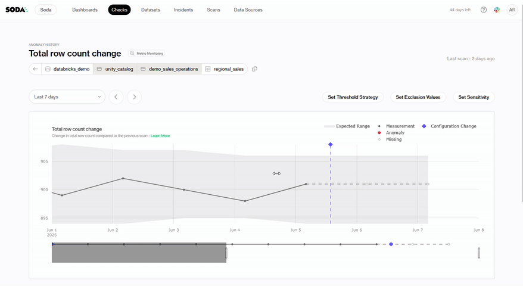
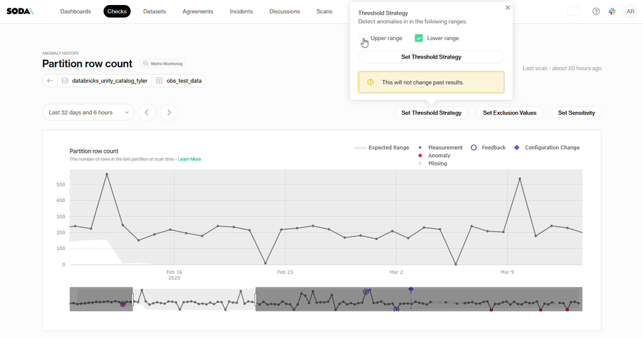
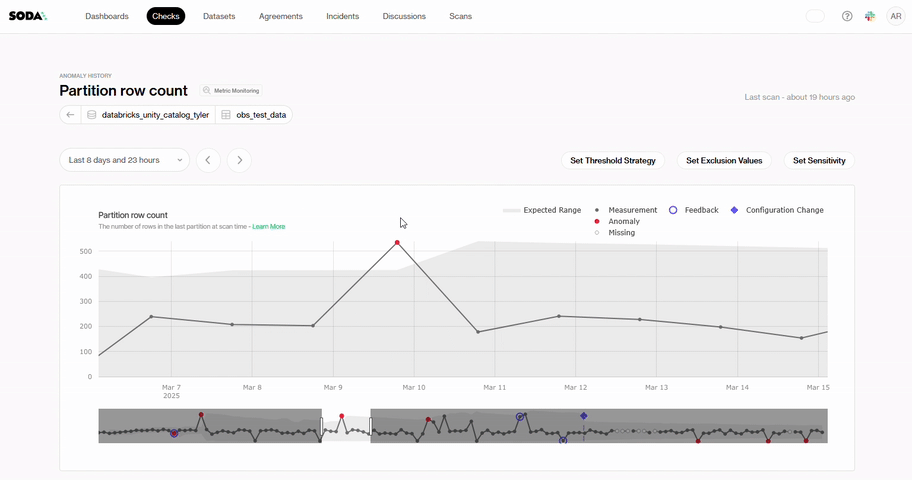
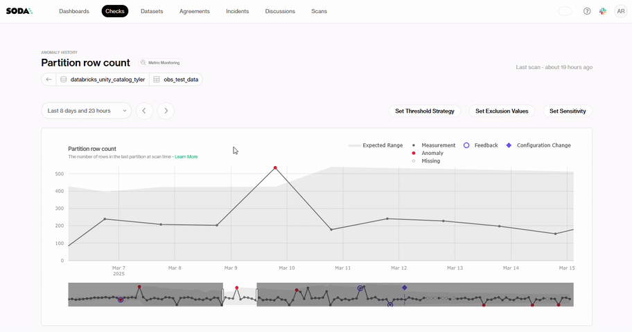
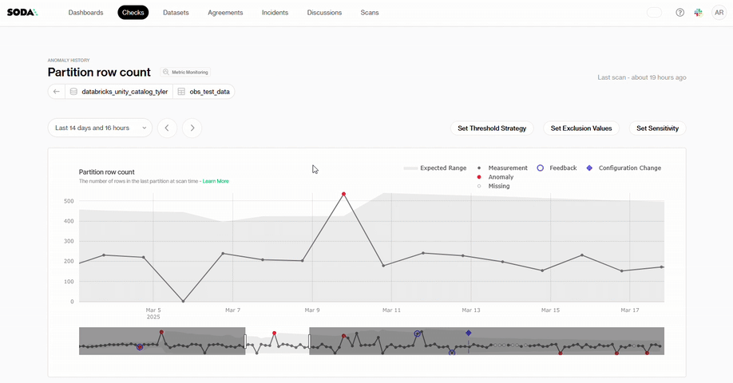
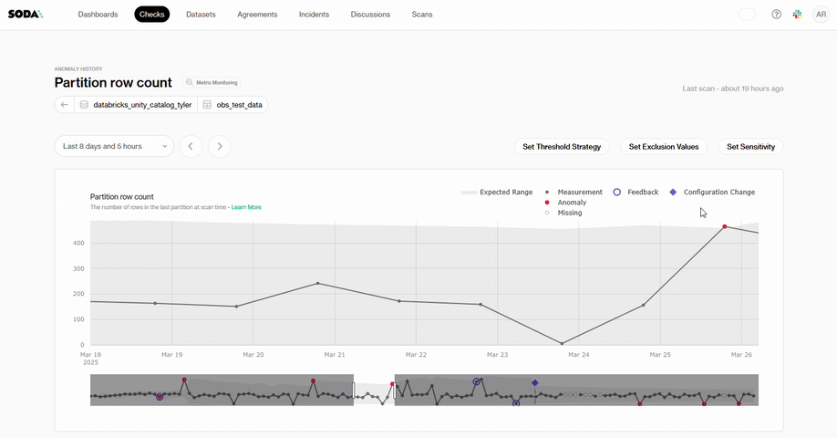
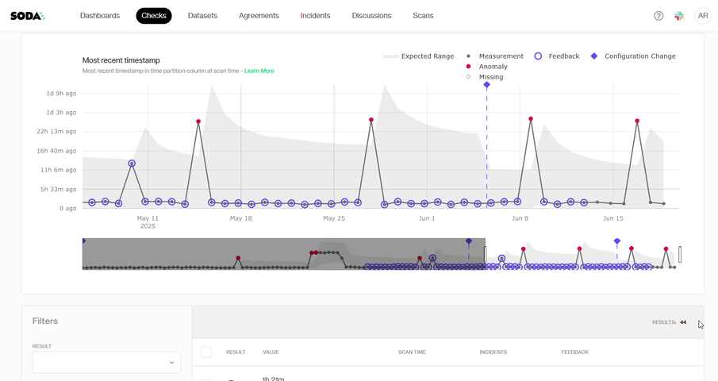

# Metric monitor page

Every monitor in Soda has its own dedicated detail page. This page is designed to help you explore the monitor's history, understand its behavior over time, and take action when needed. From here, you can investigate anomalies, give feedback to improve the detection algorithm, create incidents, and fine-tune the monitor's sensitivity or configuration.

The page consists of two main components:

1. **An interactive plot** that visualizes metric trends, anomalies, and historical context
2. **A results table** that lists all metric values and events visible in the plot

## **The Interactive Monitor Plot**

The interactive plot gives you a time-based view of how the monitor metric has evolved. It combines metric values, expected behavior, and any detected anomalies in a single visual.

<figure><figcaption></figcaption></figure>

#### **Navigating the Plot**

* **Select a time window** using the range slider below the plot to zoom in or out on a specific period

<figure><figcaption></figcaption></figure>

* **Click and drag** to zoom into a custom time range

<figure><figcaption></figcaption></figure>

* **Hover over data points** to view detailed information for each result

<figure><figcaption></figcaption></figure>

#### **What the plot shows**

* **Expected range:** the shaded area that represents the predicted normal behavior, as defined by the anomaly detection model
* **Measurement**: the actual metric value for each scan
* **Anomaly:** points marked when the metric falls outside the expected range and is flagged by the algorithm
* **Missing:** scans where no metric could be collected, typically due to unavailable data or delayed scans
* **Feedback:** shows if the user provided feedback on a result (e.g. confirmed or dismissed an anomaly)
* **Configuration change:** visual markers indicating when the monitor’s configuration was updated

<figure><figcaption></figcaption></figure>

#### **Key events in the plot**

* **Monitor created:** marks the date the monitor is created
* **Initial configuration:** shows the starting settings used when the monitor was first enabled
* **Configuration updated:** marks changes to thresholds, exclusions, or sensitivity applied over time

## **Using the Results Table**

Below the plot, the table lists all historical scan results, including metric values, anomaly status, and any user actions (like feedback or incidents). The plot is aligned with the table, so each data point in the plot directly corresponds to a result in the table

This makes it easy to correlate visual trends with specific events, compare changes, and drill into the context of any anomaly or data quality issue.

With the three dots it is possible to give feedback to the anomaly detection algorithm, in bulk for multiple results at once or create and link the results to an incident

<figure><figcaption></figcaption></figure>

## How to fine-tune Metric Monitoring

Soda's Observability tools work out of the box with predefined baselines, but you can fine-tune them to your specific needs. Do this from the page for each specific metric.

### Set Threshold Strategy

By default Soda uses an adaptive statistical method, but you can control which sides of the expected range should trigger an anomaly alert:

<figure><figcaption></figcaption></figure>

1. **Open the panel**

Click on "Set Threshold Strategy" button on the metric of your choice

<figure><figcaption></figcaption></figure>

2. **Choose your alert ranges**

* **Upper range**: when checked, Soda will flag any metric value that exceeds the upper bound of its statistical baseline.
* **Lower range**: when checked, Soda will flag any metric value that falls below the lower bound.

<figure><figcaption></figcaption></figure>

3. **Apply your settings**

Click **Set Threshold Strategy** to save.

With this simple toggle interface you can, for example, watch only for unexpectedly high values, only for drops below your baseline, or both.

### Set Exclusion Values

Exclude values from monitoring to tell Soda which specific values or ranges should be ignored when evaluating anomalies (e.g. test rows, manual overrides). The available inputs depend on the metric type.

1. **Open the panel**\
   Click on **Set Exclusion Values** button on the metric of your choice

<figure><figcaption></figcaption></figure>

2. **Define your exclusions**\
   Click on **+ Add exclusion**

<figure><figcaption></figcaption></figure>

* **Numeric metrics** (Total row count, Total row count change, Partition row count):
  * **Type**: **Value** or **Value range**
  * **Value**: enter the exact metric value (e.g. `205`) or, for a range, specify both lower and upper bounds.
* **Time-based metrics** (Last modification time, Most recent timestamp):
  * **Type**: **Value** or **Value range**
  * **Value**: enter the cutoff you want to ignore (e.g. `0 days, 10 hours, 49 minutes`) or, for a range, specify both lower and upper bounds.
* **Schema changes**: exclusions are not supported for schema-drift monitors.

<figure><figcaption></figcaption></figure>

You can stack multiple rules by clicking **+ Add exclusion**.

3. **Apply**\
   Click **Set Exclusion Values** to save your rules.


This will not retroactively change past results. It only affects future anomaly evaluations.


### Set Sensitivity

Soda uses a statistical baseline to define an “expected range” for anomaly detection. You can adapt how tight or loose that range is.

<figure><figcaption></figcaption></figure>

1. **Open the panel**\
   Click on **Set Sensitivity** button on the metric of your choice

<figure><figcaption></figcaption></figure>

2. **Adjust the sensitivity**

* **Provide a z-score**: enter a value between **0.3** and **6** to control the exact width of the expected range OR use the slider to drag between **Narrow** (lower z-score) and **Wide** (higher z-score).
* **Default**: `z = 3`

<figure><figcaption></figcaption></figure>

Preview how changing sensitivity widens or narrows the gray “expected” band in the plot

3. **Apply**

Click **Apply** sensitivity to save.


This will not retroactively change past results. It only affects future anomaly evaluations.


### Give feedback to improve detection

Our home-brewed anomaly detection algorithm draws trends from historical data, but it can also learn from your input as you give it feedback.

<figure><figcaption></figcaption></figure>

When a monitor flags an anomaly you can:

1. **Mark as expected**\
   Teach Soda that this deviation is acceptable: future similar variations will no longer trigger alerts.

<figure><figcaption></figcaption></figure>

2. **Mark as anomaly**\
   Explicitly flag a point as an anomaly, even if it fell inside the baseline. This helps refine your alert definitions.

<figure><figcaption></figcaption></figure>

### Create incidents

* **Create new incident**\
  Create a ticket in your incident management tool directly from the panel.

<figure><figcaption></figcaption></figure>

* **Link to existing incident**\
  Attach this scan to a ticket in your external system (Jira, ServiceNow, PagerDuty, etc.), keeping engineering triage in one place.

<figure><figcaption></figcaption></figure>

* **Bulk feedback**\
  More than one scan can be added to an incident or feedback. Simply check the boxes of the scans you want to add.

<figure><figcaption></figcaption></figure>


All feedback and incident links become part of the scan history, providing an auditable trail for both data engineers and business stakeholders.

