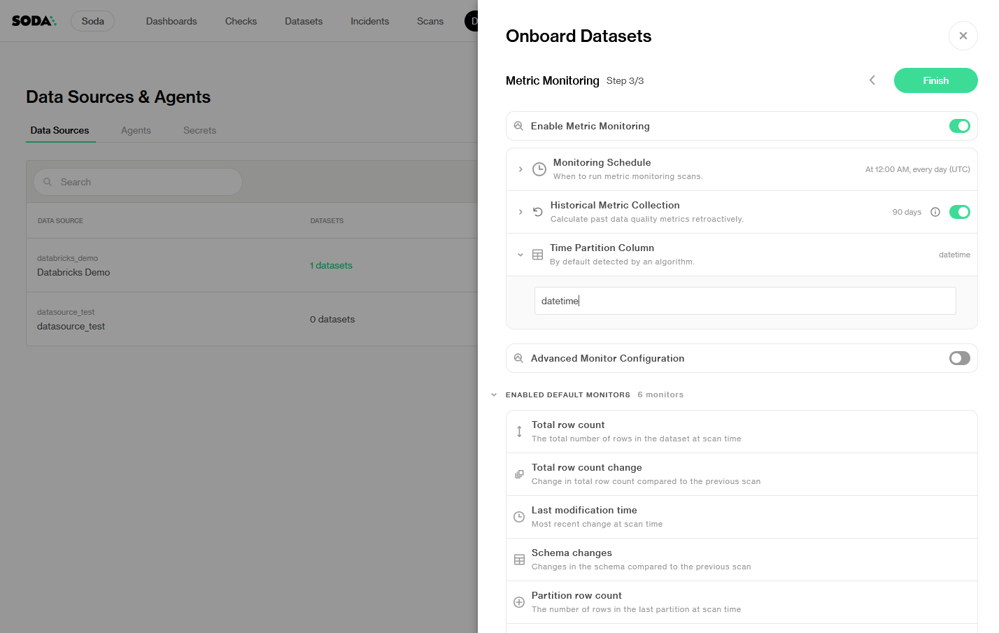

# Dataset monitors

## What is a Dataset Monitor?

A dataset monitor in Soda tracks a specific high-level metric for an entire table (or partition) over time. It helps detect unusual patterns or unexpected changes in overall data health, such as sudden spikes or drops in row count, delays in fresh data, or schema drift.&#x20;

You can find dataset monitors by opening the Metric Monitors tab on any dataset and looking at the top section labeled “Dataset Monitors.” This section lists all active dataset monitors—both metadata-based and partition-based—in a clear overview of monitor cards. This overview provides, at a glance, critical information about the status of each monitor, the value of the last scan and any detected anomalies, allowing you to have a one-look summary of the health of your data systems.

Unlike column monitors, which are configured at the dataset level but target individual columns, dataset monitors apply to the entire table (or its latest partition) and capture broad indicators of data quality. When the necessary data and metadata are available, dataset-level monitors work out of the box with no further configuration needed.

<figure><figcaption></figcaption></figure>

### Types of dataset monitors

Soda supports two categories of dataset‐level monitors: those that rely purely on system metadata, and those that compute values by querying a designated time‐partition column. Below is an in‐depth description of each built‐in monitor. For a more detailed discussion of monitors based on querying the metadata vs monitors based on querying the data, see the [Metadata vs Data-Based](./#metadata-vs-data-based-monitors) section in this page.

| Dataset monitor type               | Monitor                | Description                                                                                           |
| ---------------------------------- | ---------------------- | ----------------------------------------------------------------------------------------------------- |
| **Based on metadata**              | Total row count        | The total number of rows in the dataset at scan time.                                                 |
|                                    | Total row count change | Change in total row count compared to the previous scan                                               |
|                                    | Last modification time | Most recent time the data was changed relative to the last scan                                       |
|                                    | Schema changes         | Changes in the schema compared to the previous scan—any change is automatically flagged as an anomaly |
| **Based on time partition column** | Partition row count    | The number of rows in the last partition at scan time                                                 |
|                                    | Most recent timestamp  | Time difference between scan time and the maximum timestamp in the partition column (at scan time)    |


Monitors based on time partition columns look at data in the most recent partition **based on a timestamp**. If data is altered in an old partition, it will not be evaluated.

For example, data inserted today with timestamp of 2 days ago will not be evaluated if the partition interval is 1 day.



For **Schema Changes**, the expected result is always to have no schema changes, regardless of whether there have been frequent schema changes in the past or not.


## Understanding the monitor card

The dashboard provides a **health table** summarizing an overview of the monitors. Each monitor card is clickable and links to the Anomaly History page of the metric.

<figure><figcaption></figcaption></figure>

Each monitor card will have the following information:

* **Monitor name**: the given name of the specific monitor.
* **Monitor explanation**: a brief description of the metric used.
* **Status**: ✅ healthy / ⚠️ violated
* **Today's value at scan time**: last recorded value.
* **Expected range**: calculated by the anomaly detection algorithm, based on historical data.
* **Trend line with last 7 observations**: a sparkline that shows an overview of the monitor plot.
* **Bell icon**: to enable/disable opt-in alerts.

## Metadata vs Data based monitors

Dataset-level monitors fall into two categories depending on their source of truth:

#### Metadata-based dataset monitors

Metadata-based monitors rely solely on system metadata exposed by your data warehouse; fields like “row count,” “last modified time,” or “schema version” that the catalog provides without scanning table rows. Because they don’t touch actual data, **metadata monitors are extremely efficient and run quickly**. They alert you if your table grows, shrinks, stops updating, or changes structure.

#### Data-based dataset monitors

Data-based monitors look directly at the contents of a designated time-partition column (e.g., a date or timestamp field) and compute a value from the rows in that partition. Examples include “Partition Row Count” (how many rows landed in today’s partition) or “Most Recent Timestamp” (the newest timestamp in that partition). Data-based monitors require a full scan of each partition they monitor, but **they capture freshness and volume signals that metadata alone cannot provide**. If your dataset has no time-partition column defined (or your warehouse can’t surface the needed metadata), Soda will disable the appropriate monitors so you only see the metrics that can be collected.

## Configure Dataset Monitors

Use the **Configure Dataset Monitors** panel to pick which built-in metadata and partition-based metrics you want Soda to track at the dataset level.

1. **Open the panel** → From any dataset’s Metric Monitors dashboard, click Configure Dataset Monitors.
2. **Enable or disable** → Toggle metrics on/off directly from here. If the data source doesn't support a given metric, it will be automatically off.
3. **Modify the monitor**
4. **Auto-apply** → Changes take effect immediately for the next scan. Simply close the panel when you’re done.

### Time partition column

Many data‐based monitors—such as **Partition Row Count** and **Most Recent Timestamp**—rely on a designated “time partition” column to know which slice of data to scan. The time partition column should be a date or timestamp field that naturally groups rows into discrete, regularly updated partitions (for example, a daily `order_date` or `event_time`). When Soda cannot detect a time partition column, metrics based on that data will not be available.

<figure><figcaption></figcaption></figure>

#### What's a good time partition column?

A good time partition column meets all of the following criteria:

1. **Date or timestamp type**: Each row contains a valid date (or timestamp) value.
2. **Regular arrival cadence**: New rows for each date/timestamp appear on a predictable schedule (e.g., daily, hourly).
3. **Reflects ingestion/arrival time**: The column’s value must correspond to when the record actually landed in this dataset, **not when it was originally created upstream**. The partition column should always show arrival date to the dataset so freshness checks remain accurate.
4. **Logical partition boundary**: It matches how you want to slice your data (e.g., `order_date` for daily sales, `event_time` for hourly logs).

When these conditions hold, partition-based monitors will reliably focus on the correct slice of data—namely, the rows that truly arrived during each time window—so any delays or backfills become immediately visible.

#### Suggest a time partition column during onboarding

When you onboard a new dataset from your data source, Soda attempts to **automatically detect** the most likely time partition column. You can:

* **Finish** onboarding without editing the Time Partition Column field, allowing Soda to detect it.
* **Suggest** a Time Partition Column of your choice, forcing Soda to use that one for monitoring.

<figure><figcaption></figcaption></figure>

#### Find a time partition column

If you ever need to confirm or search for the right partition column:

1. Navigate to the **Datasets** page, select your dataset, and click the **Columns** tab.
2. Search columns with "timestamp" on them. Any column with a date or timestamp data type is a candidate.

<figure><figcaption></figcaption></figure>

#### Manually override time partition column

After onboarding, you can override the time partition column at any time. Changing it will reset Soda’s anomaly detection model for partition‐based metrics, so you’ll be retraining on historical data under the new partition definition. To override:

1. Acess the **Dataset Settings**

* Navigate to the **Datasets** tab

<figure><figcaption></figcaption></figure>

* From this list or from the dataset page itself, click on the (⋮) menu > **Edit Dataset**

<figure><figcaption></figcaption></figure>

2. Find Time Partition Columns

* Click on the **Profiling & Metric Monitoring** tab

Here you will see the current column being used for Time Partition.

<figure><figcaption></figcaption></figure>

* Reveal the Time Partition Column drop-down menu

<figure><figcaption></figcaption></figure>

This will show all **date** and **timestamp** columns that can be used as a Time Partition Column.

3. Select your new Time Partition Column


Changing this column resets the model and historical baselines.


4. Click **Save**. Soda will:
   * Reset the partition‐based monitors (Partition Row Count, Most Recent Timestamp) to “training mode” and retrain baselines on the new partition.
   * Preserve any metadata‐based monitors (Total Row Count, Schema Changes) unchanged.

By following these steps, you ensure that Soda’s data‐based monitors always reference the correct daily (or hourly) slice of your dataset, so partition‐level metrics and freshness checks produce accurate results.

## Unavailable metadata

When Soda Cloud cannot obtain the underlying metadata required to calculate a dataset-level metric, it prevents you from configuring or viewing a metric that would always fail. There are two cases:

### **Non-retrievable metadata from data source**

If a connected data source cannot provide the required metadata for a given dataset-level metric, such as row counts or schema timestamps, **Soda will automatically disable that metric** both on the Metric Monitors dashboard and in the **Configure Dataset Monitors** panel so you only see and configure metrics that your source can actually collect.

<figure><figcaption></figcaption></figure>

<figure><figcaption></figcaption></figure>

### Unavailable metadata (history)

Some warehouses expose current metadata but don’t provide historical snapshots (for example, systems that only track the latest row count). In this case, **Soda will compute the metric starting from your very first scan**, but it cannot backfill any history prior to that point. As a result, anomaly detection baselines for that metric begin only at scan #1 and there is **no retroactive historical data** to train against.

<figure><figcaption></figcaption></figure>

The **Schema changes** monitor will not add historical metadata and backfilling will not be available, unlike with other metrics. The monitor only starts recording from the moment the dataset is onboarded.

## Missing metric values

Even when a metric is enabled and historical baselines exist, you may occasionally see gaps due to delayed or skipped scans. A “missing” metric indicates that Soda attempted to run the scan but did not receive a valid result for that metric, either because the scan agent was down, the query timed out, or metadata couldn’t be retrieved in time. Missing values do not count as anomalies; they simply mark a gap in the time series.

In Soda Cloud, you can identify these gaps as follows:

* On the **Metric Monitors** dashboard, any missing value is shown either as a grey point or an empty checkbox in the metric sparkline:

<figure><figcaption></figcaption></figure>

* In the detailed anomaly plot, missing points render as open circles (◯) along the timeline, and the trend line becomes dashed.

<figure><figcaption></figcaption></figure>

* In **Schema changes**, no plot is available since the expected value is always 0. Hovering over an empty checkbox will display “No measurement” in the tooltip, making it easy to distinguish a gap from a healthy measurement or a flagged anomaly.

<figure><figcaption></figcaption></figure>

These visual cues allow to immediately recognize when a scan didn’t complete successfully, enabling further investigation and restoration of full observability before critical issues go unnoticed.

## Supported data sources

| Data source   | Onboarding    | Metadata             | Metadata history     | Querying data |
| ------------- | ------------- | -------------------- | -------------------- | ------------- |
| Databricks    | June 6th      | ✅                    | ✅                    | ✅             |
| Snowflake     | June 6th      | ✅                    | September 1st        | ✅             |
| PostgreSQL    | June 6th      | ✅                    | —                    | ✅             |
| AWS Aurora    | June 30th     | ✅                    | —                    | ✅             |
| MS SQL server | June 30th     | ✅                    | —                    | ✅             |
| Oracle        | June 30th     | June 30th            | —                    | ✅             |
| Redshift      | September 1st | June 30th | June 30th | ✅             |
| BigQuery      | September 1st | ✅                    | June 30th | ✅             |
| MySQL         | Upcoming      | —                    | —                    | ✅             |
| Trino         | Upcoming      | Upcoming             | —                    | ✅             |
| Athena        | Upcoming      | Upcoming             | —                    | ✅             |

