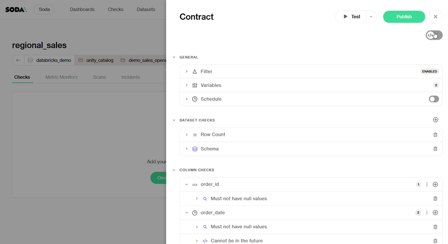

# Author a contract in Soda Cloud

Once your dataset is onboarded, you can begin defining the expectations that make up your Data Contract.

## Creating a Contract

To create a Data Contract, navigate to any **onboarded dataset** and click **Create Contract**.


This action requires the **Manage contract** permission on the dataset. Learn more about permissions here: [dataset-attributes-and-responsibilities.md](../../dataset-attributes-and-responsibilities.md "mention")


<figure><figcaption></figcaption></figure>

You’ll be taken to the **Contract Editor**, a powerful interface where you can define your contract in two ways:

* **No-code view**: Point-and-click UI to add quality checks and configure settings
* **Code view**: YAML editor for full control and advanced use cases.

> See language reference: [contract-language-reference.md](../../reference/contract-language-reference.md "mention")

You can switch between views at any time using the **editor toggle** in the top right corner.

<figure><figcaption></figcaption></figure>

## Key Concepts in Contract Authoring

Understanding how to structure your contract is essential. Soda supports several types of checks and configuration options:

* **Filter**: applies a global filter to limit which rows are considered across the entire contract (e.g., only the latest partition or rows from the past 7 days.)
* **Variables:** help you **parameterize** your contract, making it flexible and adaptable to different contexts (e.g., environments, schedules, or partitions.)
* **Dataset-level Checks**: rules that apply to the dataset as a whole, like row count, freshness, or schema checks.
* **Column-level Checks**: rules that apply to individual columns, like missing values, uniqueness, ranges, or regex formats.

All visible columns are detected during onboarding. You can also manually add columns if needed.

### Use Variables

Variables allow dynamic substitution of values in contracts. They help you:

* **Parameterize** values that differ across environments, datasets, or schedules.
* **Reuse values** in multiple places within the same contract to reduce duplication and improve maintainability.

You can define variables at the top of your contract:

<figure><figcaption></figcaption></figure>

Then use them throughout your contract using the `${var.VARIABLE_NAME}` syntax.

For example:

```javascript
filter: country = "${var.country}";
```

<figure><figcaption></figcaption></figure>

When running the contract, variable values must be provided unless a default is defined.

<figure><figcaption></figcaption></figure>

Variables are ideal for partitioned datasets, date-based rules, or customizing checks based on context.

#### Out of the box variables

**Now**: You can use `${soda.NOW}` in your Contract to access the current timestamp.


### Define Attributes

Use attributes to **label**, **sort**, and **route** your checks in Soda Cloud. Attributes help you organize checks by properties such as domain, priority, location, and sensitivity (e.g., PII).

> Learn how to leverage attributes with [notifications.md](../../manage-issues/notifications.md "mention") and [browse-datasets.md](../../manage-issues/browse-datasets.md "mention").&#x20;

**Apply Attributes to Checks**

You can add attributes directly to individual checks. For example:

<figure><figcaption></figcaption></figure>


**Set Default Attributes at the Top Level**

You can also define default attributes at the dataset level. These attributes apply to **all checks**, unless overridden at the individual check level.


<figure><figcaption></figcaption></figure>


#### **Attribute Validation in Soda Cloud**

When publishing contract results to Soda Cloud, **all check attributes must be pre-defined in Soda Cloud**. If any attribute used in a contract is not registered in your Soda Cloud environment, the results will **not be published**, and the data contract scan will be **marked as failed**.

> Learn how to configure attributes in Soda Cloud: [check-and-dataset-attributes.md](../../manage-issues/check-and-dataset-attributes.md "mention").&#x20;

***

## Testing the Contract

Before publishing, click **Test** to simulate a contract verification against your live data. Soda will:

* Run all defined checks
* Display which rules pass or fail
* Surface profiling and diagnostic insights

<figure><figcaption></figcaption></figure>

This dry run helps ensure your contract behaves as expected, before making it official.


This action requires the **Manage contract** permission on the dataset. Learn more about permissions here: [dataset-attributes-and-responsibilities.md](../../dataset-attributes-and-responsibilities.md "mention")


## Publishing the Contract

Once you're happy with the results, click **Publish**.

Publishing sets this version as the **source of truth** for that dataset. From this point on:

* Verifications will use the published version
* All users see this contract as the authoritative definition of data quality for that dataset
* Changes will require a new version or a proposal (depending on permissions)

Publishing ensures your data expectations are versioned, visible, and enforceable.


This action requires the **Manage contract** permission on the dataset. Learn more about permissions here: [dataset-attributes-and-responsibilities.md](../../dataset-attributes-and-responsibilities.md "mention")


<figure><figcaption></figcaption></figure>

***

You’re now ready to start verifying your contract and monitoring your data.
