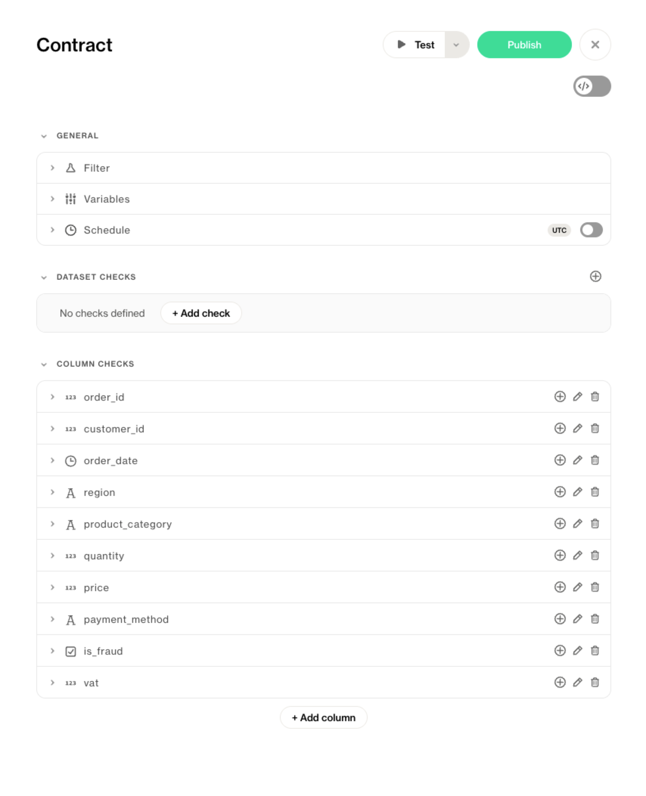

# Cloud-Managed Data Contract
Cloud-managed data contracts let you define and manage expectations for your data directly in the Soda Cloud UI.

This approach is perfect for data analysts, product owners, and business stakeholders who know what “good data” looks like but prefer intuitive tools over code. It’s also ideal for teams that want to move fast, collaborate visually, and integrate seamlessly with engineering workflows when needed.

With Soda Cloud, you can browse datasets, add quality rules, test and publish contracts, and set up scheduled or on-demand verification—all from your browser.

## Why Cloud-Managed?

- **Faster time to value** – no setup required
- **Accessible to everyone** – empower domain experts, not just engineers
- **Built for collaboration** – share, comment, and propose changes in a shared UI
- **Easily operationalized** – schedule tests and later trigger verifications programmatically

It’s a powerful way to bring your organization together around trusted data.

Gif with UI demo

## Prerequisites

Before creating contracts in Soda Cloud, make sure:

- You have a **Soda Cloud account**
- You have access to an organization in Soda Cloud
- You have connected at least one **data source** via a Soda Agent [Onboard datasets on Soda Cloud]()