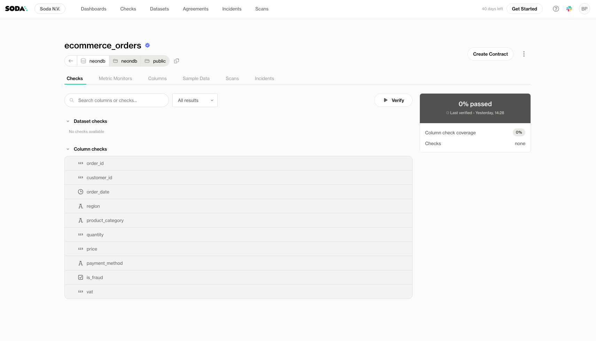
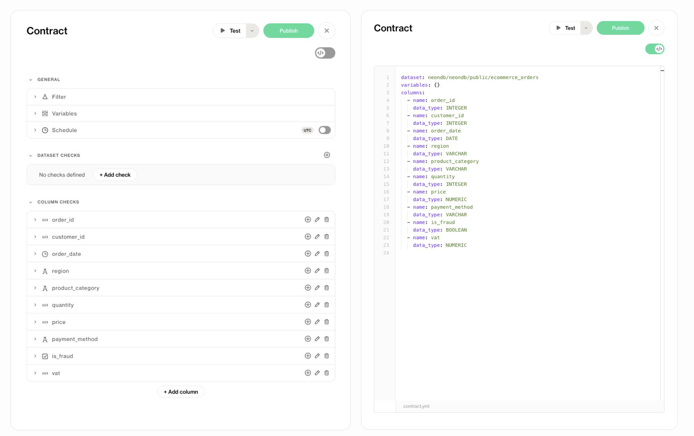
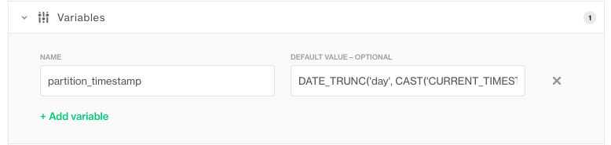
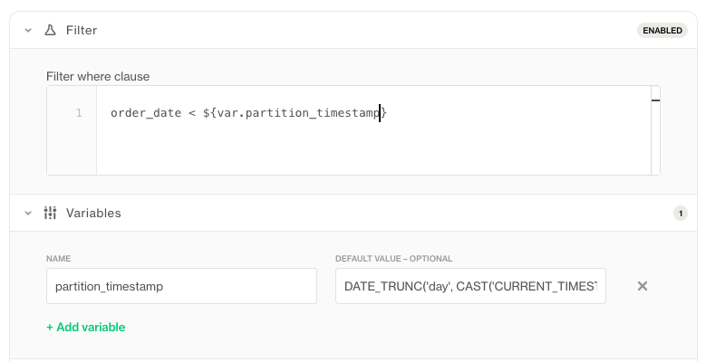

# Creating a Contract

Once your dataset is onboarded, you can begin defining the expectations that make up your data contract.

To create a contract, navigate to any **onboarded dataset** and click **Create Contract**.

This action requires the "Manage contract" permission on the dataset. Learn more about permissions here: [Dataset Settings & Responsibilities]()



You’ll be taken to the **Contract Editor**, a powerful interface where you can define your contract in two ways:

- **No-code view**: Point-and-click UI to add quality checks and configure settings
- **Code view**: YAML editor for full control and advanced use cases. See language reference: [Data Contract language reference]()

You can switch between views at any time using the **editor toggle** in the top right corner.

add a version with some checksadd a version with some checks



## Key Concepts in Contract Authoring

Understanding how to structure your contract is essential. Soda supports several types of checks and configuration options:

- **Filter**: Applies a global filter to limit which rows are considered across the entire contract (e.g., only the latest partition or rows from the past 7 days).
- **Dataset-level Checks**: Rules that apply to the dataset as a whole, like row count, freshness, or schema checks.
- **Variables:** help you **parameterize** your contract, making it flexible and adaptable to different contexts (e.g., environments, schedules, or partitions).
- **Column-level Checks**: Rules that apply to individual columns, like missing values, uniqueness, ranges, or regex formats.

All visible columns are detected during onboarding. You can also **manually add columns** if needed.

## Use Variables

Variables allow dynamic substitution of values in contracts. They help you:

- **Parameterize** values that differ across environments, datasets, or schedules.
- **Reuse values** in multiple places within the same contract to reduce duplication and improve maintainability.

You can define variables at the top of your contract:



Then use them throughout your contract using the `${var.VARIABLE_NAME}` syntax.

For example:

```
filter: country = '${var.country}'
```



When running the contract, variable values must be provided unless a default is defined.


Variables are ideal for partitioned datasets, date-based rules, or customizing checks based on context.

## Out of the box variables

**Now**: You can use ${soda.NOW} in your Contract to access the current timestamp

## Testing the Contract

Before publishing, click **Test Contract** to simulate a contract verification against your live data. Soda will:

- Run all defined checks
- Display which rules pass or fail
- Surface profiling and diagnostic insights

This dry run helps ensure your contract behaves as expected, before making it official.

This action requires the "Manage contract" permission on the dataset. Learn more about permissions here: [Dataset Settings & Responsibilities]()

### Publishing the Contract

Once you're happy with the results, click **Publish Contract**.

Publishing sets this version as the **source of truth** for that dataset. From this point on:

- Verifications will use the published version
- All users see this contract as the authoritative definition of data quality for that dataset
- Changes will require a new version or a proposal (depending on permissions)

Publishing ensures your data expectations are versioned, visible, and enforceable.

This action requires the "Manage contract" permission on the dataset. Learn more about permissions here: [Dataset Settings & Responsibilities]()


### Contract Proposal *(coming soon)*

We’re adding a **contract proposal workflow** to support collaborative authoring and approval. This will allow non-technical users to propose changes, which can then be reviewed and accepted by engineering or data owners, integrating governance into the editing process.

You’re now ready to start verifying your contract and monitoring your data.