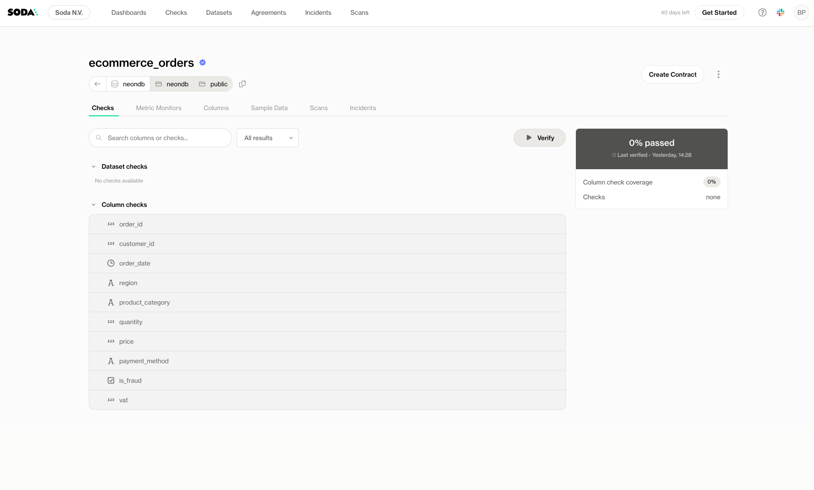
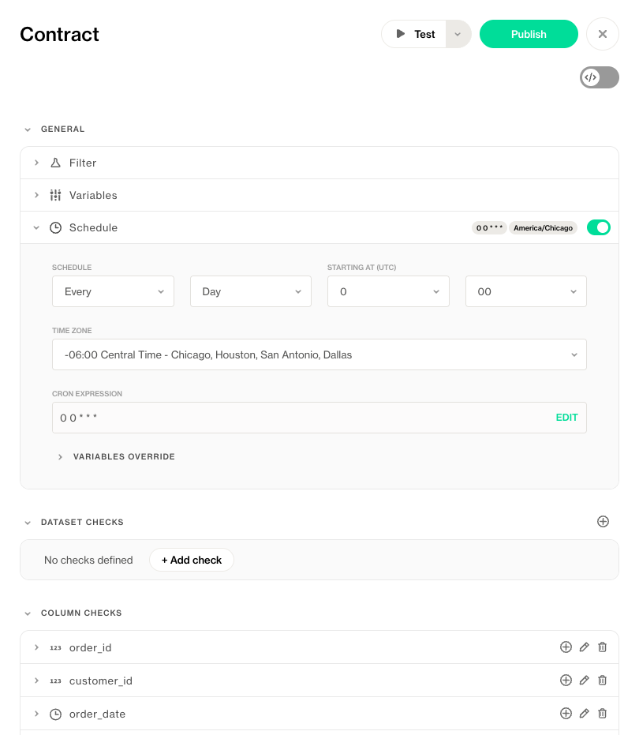

# Verify a Contract

Once a data contract is published, the next step is to **verify** that the actual data matches the expectations you’ve defined. Soda offers several flexible ways to execute contract verifications, depending on your needs and technical setup.

## Manual Verification (from the Dataset Page)

You can manually verify a contract at any time from the dataset page in Soda Cloud.

Simply open the dataset and click **Verify Contract**. This will:

- Execute the checks in the published contract
- Use the latest available data
- Display pass/fail results directly in the UI

This is especially useful for one-off validations, exploratory testing, or during incident investigations.

This action requires the "Manage contract" permission on the dataset. Learn more about permissions here: [Dataset Settings & Responsibilities]()



## Scheduled Execution (from the Contract Editor)

To monitor data quality over time, you can set up **scheduled verifications** directly in the contract editor.

When editing or viewing a contract:

1. Go to the **Schedule** section
2. Choose how often you want the contract to be verified (e.g., hourly, daily, weekly)
3. Save the schedule

Soda Cloud will automatically run the contract at the specified intervals, using the selected agent. All results will be stored and visualized in Soda Cloud, with alerts triggered when rules fail (if configured).



## Programmatic Execution (via CLI)

For advanced workflows and full automation, you can verify contracts programmatically using the Soda CLI and a Soda Agent.

This is ideal for:

- CI/CD pipelines
- Custom orchestration (e.g., Airflow, dbt Cloud, Dagster)
- Triggering verifications after data loads

**Step 1: Connect to Soda Cloud**

First, create a Soda Cloud configuration file:

```
soda cloud create -f sc.yml
```

This generates a basic config file. Open it and fill in your API key and organization details.

[Learn how to configure your Soda Cloud connection]()

This action requires the "Manage contract" permission on the dataset; the user is identified based on the API key provided in the Soda Cloud configuration. Learn more about permissions here: [Dataset Settings & Responsibilities]()

You can test the connection:

```
soda cloud test -sc sc.yml
```

---

**Step 2: Verify a Contract**

Now you can run a verification using the CLI and a remote Soda Agent.

To verify a dataset **without pushing the results to Soda Cloud:**

```
soda contract verify --dataset datasource/db/schema/table --use-agent --soda-cloud sc.yml
```

This allows you to verify the contract produces the expected results before pushing results to Soda Cloud.

To verify and also **push the results to Soda Cloud**:

```
soda contract verify --dataset datasource/db/schema/table --publish --use-agent --soda-cloud sc.yml
```

This makes the verification results available in the UI for stakeholders, trigger notifications and monitoring dashboards.