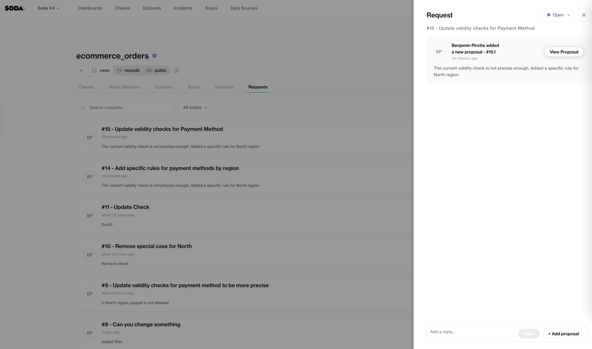

# Contract collaboration


Available on the 28th of September 2025


Data contracts define the expectations between data producers and data consumers, ensuring that the data delivered is fit for purpose and aligned with business needs. However, data requirements evolve, and consumers often identify gaps or new use cases that require adjustments.

To support this, Soda provides a collaborative process that allows **data consumers to request changes** to existing data contracts or propose the creation of new ones. Consumers can directly propose changes by editing the data contract with **Soda's no-code editor**, suggesting concrete modifications for the dataset owner to review.

This approach enables data consumers to express their requirements not just in abstract terms but in actionable, implementable contract changes. By doing so, the consumer helps the dataset owner by:

* Making their needs clearer and more concrete.
* Supporting faster alignment between producers and consumers.
* Contributing to quicker and smoother implementation.
* Reducing unnecessary communication overhead.

The dataset owner remains the final decision-maker, reviewing proposed changes, iterating with the consumer as needed, and then publishing the updated contract once consensus is reached.

This collaborative workflow ensures that **data contracts remain living agreements** that continuously adapt to evolving business use cases while maintaining producer accountability.


## Initiating a request

Users can:

* **Request a change** by simply describing their needs and use cases.
* **Propose changes directly** by editing the data contract, suggesting concrete modifications for the dataset owner to review.


This action requires the **Propose checks** permission on the dataset. Learn more about permissions here: [dataset-attributes-and-responsibilities.md](../dataset-attributes-and-responsibilities.md "mention")


When a request is created, dataset owners automatically receive an email notification, ensuring they can promptly review and collaborate with the requester.

### Initiate a request with a proposal&#x20;

To propose a change or create a new contract, data consumers can initiate a request directly from the dataset page.

1. **Navigate to a dataset**\
   Go to any onboarded dataset in Soda.
2. **Start editing**
   * If the dataset does not yet have a contract, click **Create Contract**.
   * If a contract already exists, click **Edit Contract**.
3. **Make changes**\
   Update the contract based on your needs and use case. You can add, modify, or remove elements to ensure the contract reflects the requirements you want to address.
4. **Create a new request**\
   After making your edits, click **Create a Request**.

<figure><figcaption></figcaption></figure>

5. **Provide details**\
   You will be prompted to:
   1. Enter a **title** for the request.
   2. Provide a **reasoning** or description of the changes, explaining why they are needed.

<figure><figcaption></figcaption></figure>

6. **Save the request**\
   Once you click **Save**, a new request is created containing your proposed changes. This proposal is then shared with the dataset owner for review and follow-up.

<figure><figcaption></figcaption></figure>

### Initiate a request without a proposal&#x20;

In some cases, data consumers may want to request changes without directly editing the contract themselves. This allows them to highlight a need while leaving the implementation details to the dataset owner.

1. **Navigate to the dataset**\
   Open the dataset in Soda.
2. **Go to the Requests tab**\
   Select the **Requests** tab for that dataset.
3. **Create a new request**\
   Click **Create a Request**.

<figure><figcaption></figcaption></figure>

4. **Provide details**\
   You will be prompted to:
   1. Enter a **title** for the request.
   2. Provide a **reasoning** or description of the changes, explaining why they are needed.

<figure><figcaption></figcaption></figure>

5. **Save the request**\
   Once you click **Save**, the request is created. The dataset owner will be notified and can review, clarify, and propose changes to the contract based on your input.


## Collaborating over a Request

Each dataset page includes a **Requests** tab where all requests related to that dataset are listed. From here, users can:

* **Search** for a request by name.
* **Filter** requests by status: _Open_, _Done_, or _Won’t Do_.
* **Click on any request** to access collaboration tools.

<figure><figcaption></figcaption></figure>


Once inside a request, users can collaborate in the following ways:

### Review Proposals

Click **View Proposal** to examine an existing proposal associated with the request.


<figure><figcaption></figcaption></figure>

When viewing a proposal, visual indicators show exactly what has changed in the contract:

* **Blue icon** → element was **modified** (M).
* **Red icon** → element was **removed** (R).
* **Green icon** → element was **added** (A).
* **Blue dot** → a parent element has one or more **children that were updated**.

<figure><figcaption></figcaption></figure>

### Exchange Messages

Participants can post text messages within the request to clarify needs, align on requirements, and discuss next steps.

<figure><figcaption></figcaption></figure>

### Create a New Proposal

Users can contribute new proposals to move the request forward.&#x20;

**Iterate on an existing proposal:** while viewing a proposal, click the **pen icon** to edit and build upon it.

<figure><figcaption></figcaption></figure>


**From scratch:** click **Add Proposal** to create a brand-new proposal.

<figure><figcaption></figcaption></figure>


In both cases:

1. Make your edits.

<figure><figcaption></figcaption></figure>

2. Click **Save**.
3. Provide a message to explain what you have done.

<figure><figcaption></figcaption></figure>

4. Click **Save** again

All participants are automatically **notified by email** when a new proposal is created or an iteration is made, ensuring everyone stays aligned and can respond promptly.

<figure><figcaption></figcaption></figure>


## Publish a proposal


This action requires the **Manage checks** permission on the dataset. Learn more about permissions here: [dataset-attributes-and-responsibilities.md](../dataset-attributes-and-responsibilities.md "mention")


### Publishing to Soda Cloud

After reviewing a proposal, you can **publish it** by clicking the **Publish** button. Once published, all participants associated with the request will automatically receive a notification, ensuring they are informed of the update.

<figure><figcaption></figcaption></figure>

<figure><figcaption></figcaption></figure>

#### Resolving conflict

In case a new version of the contract has been published, it is required to sync the proposal with the latest version to publish it.


1. When reviewing a proposal, click on **Sync to latest**

<figure><figcaption></figcaption></figure>

2. There are then 2 scenarios that can arise:&#x20;
   1. Soda can **automatically merges the 2 versions**. You can then proceed to the next step
   2. **There are conflicts that Soda cannot resolve**. In this case, you will be required to resolve the conflict. Soda offers a tool allowing you to compare the latest published version (left side) with the version of the proposal (right side). You can then edit the proposal version to resolve the conflicts. Click **Continue** to proceed

<figure><figcaption></figcaption></figure>

3. Optionally, do extra edits
4. Click **Save** to create a new proposal, which you can now publish


### Publish to Git

You can fetch the content of a proposal from Soda Cloud and save it as a contract file, which can then be published to Git. This allows you to incorporate approved changes into version-controlled data contracts.

```bash
soda request fetch -r 7 -p 1 -sc soda-cloud.yaml --f ./contracts/ecommerce_orders.yamlRe
```

<table><thead><tr><th width="225.433349609375">Parameter</th><th width="123.8499755859375">Required</th><th>Description</th></tr></thead><tbody><tr><td><code>-r</code></td><td>Yes</td><td>The request number. Identifies the request to fetch. Request numbers can be found when reviewing a proposal. See screenshot below.</td></tr><tr><td><code>-p</code></td><td>No</td><td>The proposal number. Defaults to the latest proposal if not specified. Proposal numbers are shown as the decimal part when reviewing a proposal. See screenshot below.</td></tr><tr><td><code>--soda-cloud, -sc</code></td><td>Yes</td><td>Path to the Soda Cloud config file (e.g., <code>soda-cloud.yaml</code>).</td></tr><tr><td><code>--f</code></td><td>Yes</td><td>Path to the output file where the contract will be written.</td></tr></tbody></table>


Request and proposal numbers can be found on Soda Cloud when reviewing a proposal. The first number is the request, and the decimal is the proposal.

<figure><figcaption></figcaption></figure>


After fetching the proposal, you can optionally use the **publish command** to publish it from Soda Cloud to Git:  [#publish-a-contract](../reference/cli-reference.md#publish-a-contract "mention")

## Close a request

Each request in Soda has a **status** to reflect its lifecycle. Initially, a request is created in the **Open** state. Once the requested changes have been implemented and published, the request can be moved to **Done**. If the decision is made not to implement the request, it can be transitioned to **Won’t Do**. Whenever a request’s status is updated, all participants are automatically notified by email, ensuring transparency and alignment across the collaboration process.

<figure><figcaption></figcaption></figure>

