# Dataset Attributes & Responsibilities

Dataset settings allow you to define key metadata, ownership, and business context for your datasets. This information helps ensure data governance, accountability, and seamless integration with other tools like your data catalog.

## Dataset Owner

#### Purpose of the Dataset Owner

Each dataset should have a designated **dataset owner**: a person or team responsible for the dataset's quality, availability and usage.

**Typically, the role of a Dataset Owner includes:**

* Defining and maintaining the dataset's purpose and documentation.
* Ensuring the dataset meets data quality standards and contract requirements.
* Responding to issues, such as failed checks or data quality alerts.
* Reviewing and approving changes to the dataset schema or contract.

#### Updating the Dataset Owner

Updating the Dataset Owner requires the following dataset role: "Configure dataset".

To assign a **Dataset Owner**:

1. Open the **dataset page**.
2. Click the **context menu** (⋮) in the top-right corner and select **Edit Dataset**.

<figure>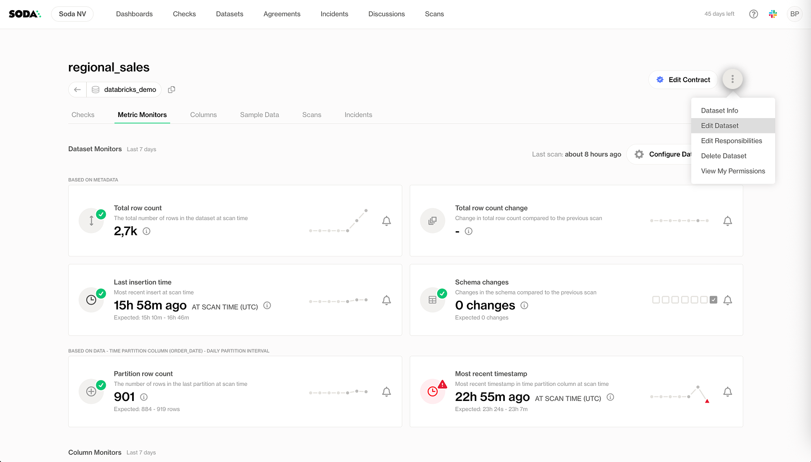<figcaption></figcaption></figure>

3. In the **Owned by** section, select one or more users and/or user groups.

<figure>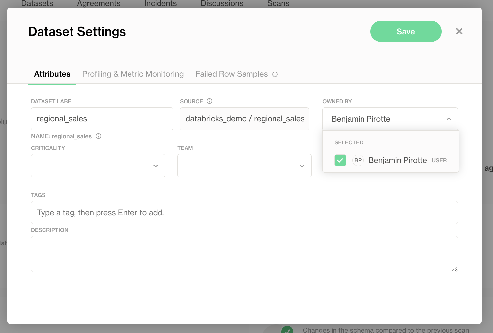<figcaption></figcaption></figure>

4. Click **Save** to apply the changes.

<figure>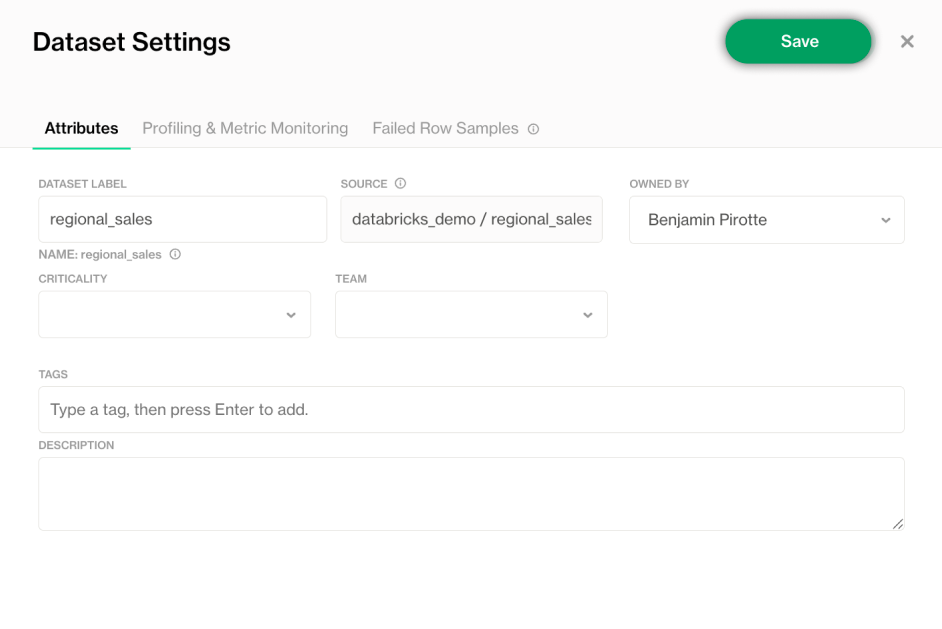<figcaption></figcaption></figure>

## Responsibilities

#### What are Responsibilities?

**Responsibilities** allow you to assign permissions to users or user groups, ensuring they have the access they need to work with a dataset.

A **Responsibility** is a combination of:

* A **User** or **User Group**.
* A **Dataset Role**, which is a predefined collection of permissions (such as the ability to edit contracts, view checks, or manage settings).

By assigning Responsibilities, you define **who can do what** for each dataset, supporting clear ownership, governance, and collaboration.

Learn about defining custom roles [organization-and-admin-settings](organization-and-admin-settings/ "mention")

#### How to Add Responsibilities

Managing responsibilities requires the following dataset role: "Manage dataset responsibilities"

To assign a Responsibility to a user or group:

1. Open the **dataset page**.
2. Click the **context menu** (⋮) in the top-right corner and select **Edit Responsibilities**.

<figure><figcaption></figcaption></figure>

3. Add the desired **users** or **user groups**.

<figure>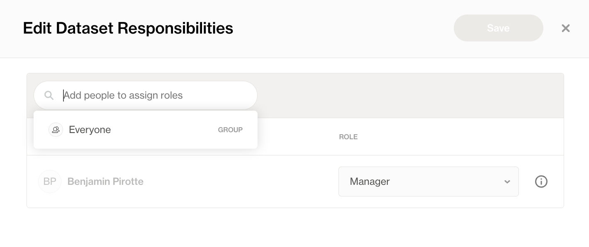<figcaption></figcaption></figure>

4. Select the appropriate **Dataset Role** for each.

<figure>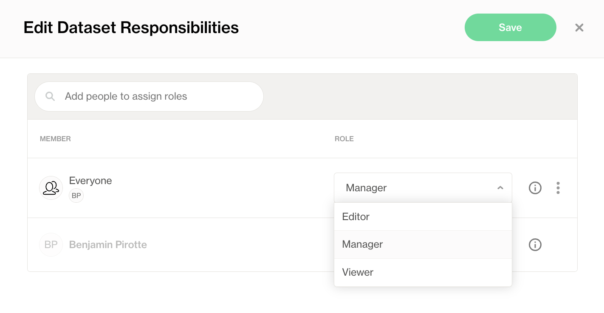<figcaption></figcaption></figure>

5. Click **Save** to apply the changes.

<figure>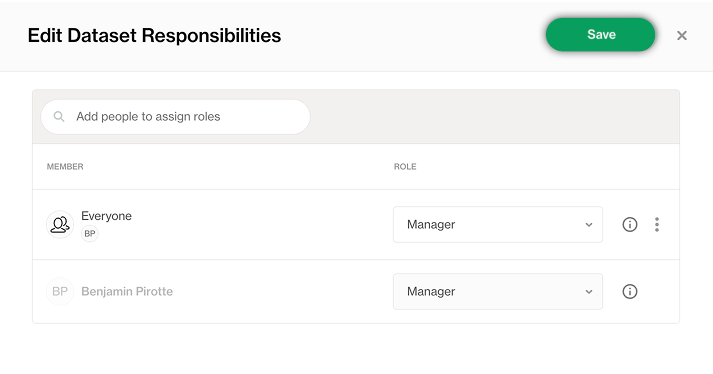<figcaption></figcaption></figure>

### Default Dataset Owner Role

Every dataset has a **default Dataset Owner role**, automatically assigned to the designated Dataset Owner(s).

* This role provides essential permissions to manage and maintain the dataset.
* The Dataset Owner role **cannot be removed**, but it can be combined with other roles for additional permissions.

<figure>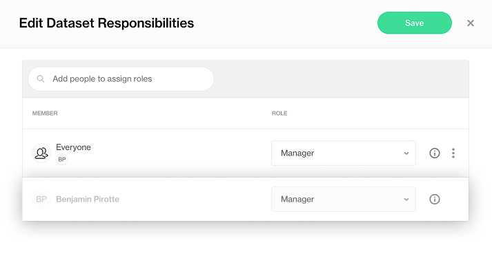<figcaption></figcaption></figure>


The **default permissions** granted to the Dataset Owner role are customizable at the organization level. For more details on configuring the default Dataset Owner role and other roles, see the [Organization and Admin Settings](organization-and-admin-settings/)


## Dataset Attributes

Updating the dataset attributes requires the following dataset role: "**Configure dataset**".

#### Purpose of Attributes

Dataset attributes allow you to add descriptive **metadata** to your datasets. This metadata can then be:

* **Used for filtering** in Soda Cloud, making it easier to search and organize datasets and checks based on specific criteria (e.g., business domain, sensitivity, criticality).
* **Leveraged in reporting**, enabling you to group datasets, track ownership, and monitor data quality across different categories or dimensions.

Adding meaningful attributes enhances discoverability, governance, and collaboration within Soda and its integrations.

Learn how to define attribute types: [check-and-dataset-attributes.md](manage-issues/check-and-dataset-attributes.md "mention")

#### Adding Dataset Attributes

You can add or modify dataset attributes in the Dataset Settings page:

1. Click the **context menu** (⋮) in the top-right corner and select **Edit Dataset**.

<figure><figcaption></figcaption></figure>

2. Set a value for the existing attribute type. They are all optional.

<figure>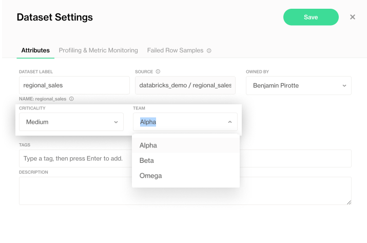<figcaption></figcaption></figure>

3. **Save** your changes.

<figure>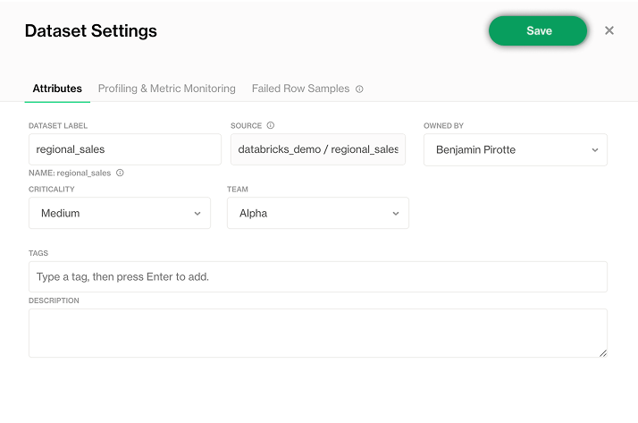<figcaption></figcaption></figure>

### Bulk Edit of Attributes and Responsibilities

When managing multiple datasets, you can save time by applying changes in bulk using the **Bulk Edit** feature.

#### How to Bulk Edit Datasets

1. Go to the **Datasets** page.
2. Select the datasets you want to edit using the checkboxes.

<figure><figcaption></figcaption></figure>

3. Click **Edit** in the action bar.

<figure>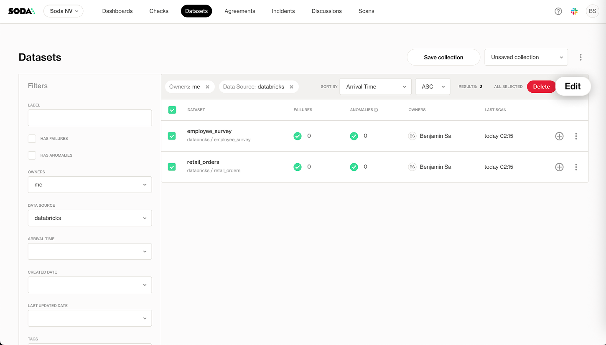<figcaption></figcaption></figure>

4. Define attributes you want to add or modify across the selected datasets.

<figure><figcaption></figcaption></figure>

5. Define responsibilities you want to add or modify across the selected datasets.
   1. Choose whether to **update existing** responsibilities (add new without removing existing) or **reset** (replace all existing responsibilities with the new definition).

<figure><figcaption></figcaption></figure>

6. Click **Continue** to review your changes.

<figure>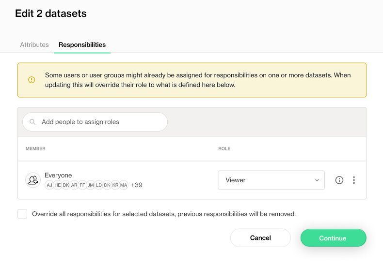<figcaption></figcaption></figure>

### Integrate With Data Catalog

You can automate the management of **dataset attributes** and **responsibilities** in Soda Cloud using our **REST API**. This allows you to:

* Programmatically **set or update attributes** for multiple datasets.
* Assign **responsibilities** (users, groups, and roles) to datasets at scale.
* Keep your Soda Cloud configuration in sync with your data catalog or external metadata management systems.

This automation ensures that your metadata stays up-to-date and consistent across your ecosystem, supporting seamless governance and discoverability.

To do so, you can leverage our APIs: [Update dataset](https://docs.soda.io/api-docs/public-cloud-api-v1.html#/operations/POST/api/v1/datasets/{datasetId}) and [Update dataset responsibilities](https://docs.soda.io/api-docs/public-cloud-api-v1.html#/operations/POST/api/v1/datasets/{datasetId}/responsibilities).
