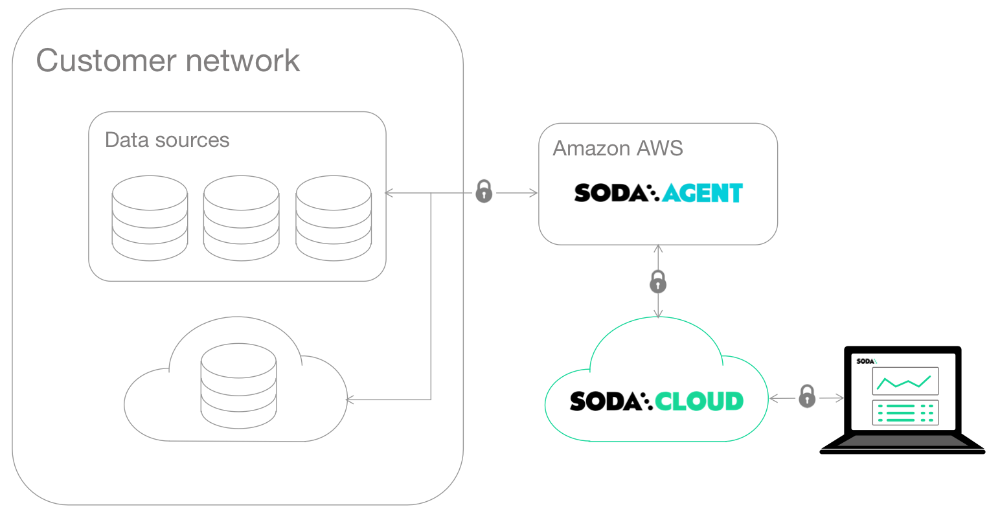

# Deployment options

Soda offers flexible deployment models to suit your team’s infrastructure, scale, and security needs. Whether you want to embed Soda directly into your pipelines, use a centrally managed deployment, or rely on Soda’s fully-hosted solution, there’s an option for you.

This guide provides an overview of the three main deployment models: **Soda Core**, **Soda-hosted Agent, and Self-hosted Agent**, to help you choose the right setup for your organization.

***

## Overview of Deployment Models

<table><thead><tr><th width="112">Deployment Model</th><th width="148">Description</th><th width="138">Ideal For</th><th>Key Features</th><th>Considerations</th><th>Plans</th></tr></thead><tbody><tr><td><strong>Soda Core</strong></td><td>Open-source Python library (with commercial extensions) and CLI for running Data Contracts in your pipelines.</td><td>Data engineers integrating Soda into custom workflows.</td><td><ul><li>Full control over orchestration</li><li>In-memory data support</li><li>Contract verification</li></ul></td><td><strong>No observability features</strong>.  Required for in-memory sources (e.g., Spark, DataFrames).  Data source connections managed at the environment level.</td><td>Open Source. Available for Free, Team and Enterprise Plans.</td></tr><tr><td><strong>Soda-hosted Agent</strong></td><td>Fully-managed Soda Agent, hosted by Soda.</td><td>Teams seeking a simple, managed solution for data quality.</td><td><ul><li>Centralized data source access</li><li>No setup required</li><li>Observability features enabled</li></ul>
Enables users to create, test, execute, and schedule contracts and checks directly from the Soda Cloud UI.
</td><td><strong>Required for observability features</strong>.  Cannot scan in-memory sources like Spark or DataFrames.</td><td>Available for Free, Team and Enterprise Plans.</td></tr><tr><td><strong>Self-hosted Agent</strong></td><td>Same as Soda-hosted Agent, but deployed and managed in your own Kubernetes environment.</td><td>Teams needing full control over infrastructure and deployment.</td><td>
Similar to Soda-hosted Agent, but deployed within the customer’s environment; data stays within your network. 
<ul><li>Full control over deployment</li><li>Integration with secrets managers</li><li>Customization to meet your organization’s specific requirements</li></ul></td><td><strong>Required for observability features</strong>.  Cannot scan in-memory sources like Spark or DataFrames. Kubernetes expertise required.</td><td>Available for Enterprise Plan. Contact us <a href="https://www.soda.io/contact">https://www.soda.io/contact</a></td></tr></tbody></table>

## Deployment Models in Detail

### Soda Core

Soda Core is an open-source Python library and CLI that allows you to embed Soda directly in your data pipelines. You can orchestrate scans using your preferred orchestration tools or pipelines, and execute them within your own infrastructure.

Key points:

* Ideal for teams who want **full control** over scan orchestration and execution.
* Data source connections are configured and managed **at the environment level**.
* Required for working with **in-memory data sources** like Spark and Pandas DataFrames.

<figure><figcaption></figcaption></figure>

Get started with Soda Core [install-and-configure.md](../data-testing/git-managed-data-contracts/install-and-configure.md "mention")

### Soda-hosted Agent

Soda-hosted is a fully-managed deployment of the Soda Agent, hosted by Soda in our infrastructure. It allows you to connect to your data sources and manage data quality directly from the Soda Cloud UI without any infrastructure setup on your end.

Key points:

* **No setup or management required**. Soda handles deployment and scaling.
* **Data source connections are centralized** in Soda Cloud, and users can leverage the Soda Agent to execute scans across those data sources.
* Enable **observability features** in Soda Cloud, such as profiling, metric monitoring, and anomaly detection.
* Enables users to create, test, execute, and schedule **contracts** and checks directly from the **Soda Cloud UI**.

<figure><figcaption></figcaption></figure>

***

Onboard your datasets in Soda Cloud with Soda-hosted agent: [onboard-datasets-on-soda-cloud](../onboard-datasets-on-soda-cloud/ "mention")

***

### Soda Agent

The Self-hosted Agent offers the same capabilities as the Soda-hosted Agent, but it is deployed and managed by your team within your own Kubernetes environment (e.g., AWS, GCP, Azure). This model provides full control over deployment, infrastructure, and security, while enabling the same centralized data source access and Soda Cloud integration for scans, contract execution, and observability features.

<figure><figcaption></figcaption></figure>

Learn how to deploy the Self-hosted Soda Agent: [deploy-soda-agent](deploy-soda-agent/ "mention")

Onboard your datasets in Soda Cloud with self-hosted agent: [onboard-datasets-on-soda-cloud](../onboard-datasets-on-soda-cloud/ "mention")
