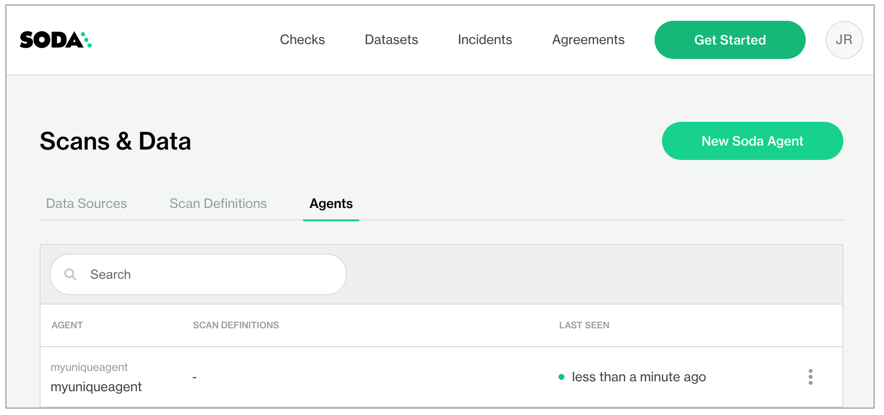

# Deploy a Soda Agent in an Azure AKS cluster


Soda-hosted agents are included in all Free, Team, and Enterprise plans at no additional cost. However, self-hosted agents require an Enterprise plan.

If you wish to use self-hosted agents, please contact us at [https://www.soda.io/contact](https://www.soda.io/contact)  to discuss Enterprise plan options or via the support portal for existing customers.


## Prerequisites <a href="#prerequisites-2" id="prerequisites-2"></a>

* You have an Azure account and the necessary permissions to enable you to create, or gain access to an existing AKS cluster in your region. Consult the [Azure access control documentation](https://learn.microsoft.com/en-us/azure/role-based-access-control/overview) for details.
* You have installed the [Azure CLI tool](https://learn.microsoft.com/en-us/cli/azure/install-azure-cli). This is the command-line tool you need to access your Azure account from the command-line. Run `az --version` to check the version of an existing install. Consult the [Azure Command-Line Interface documentation](https://learn.microsoft.com/en-us/cli/azure/) for details.
* You have logged in to your Azure account. Run `az login` to open a browser and log in to your account.
* You have installed v1.22 or v1.23 of [kubectl](https://kubernetes.io/docs/tasks/tools/#kubectl). This is the command-line tool you use to run commands against Kubernetes clusters. If you have already installed the Azure CLI tool, you can install kubectl using the following command: `az aks install-cli`.\
  Run `kubectl version --output=yaml` to check the version of an existing install.
* You have installed [Helm](https://helm.sh/docs/intro/install/). This is the package manager for Kubernetes which you will use to deploy the Soda Agent Helm chart. Run `helm version` to check the version of an existing install.

## System requirements <a href="#system-requirements-2" id="system-requirements-2"></a>

Kubernetes cluster size and capacity: 2 CPU and 2GB of RAM. In general, this is sufficient to run up to six scans in parallel.

Scan performance may vary according to the workload, or the number of scans running in parallel. To improve performance for larger workloads, consider fine-tuning the cluster size using the `resources` parameter for the `agent-orchestrator` and `soda.scanlauncher.resources` for the `scan-launcher`. Adding more resources to the `scan-launcher` can improve scan times by as much as 30%. Be aware that allocating too many resources may be costly relative to the small benefit of improved scan times.

To specify resources, add the following parameters to your `values.yml` file during deployment. Refer to Kubernetes documentation for [Resource Management for Pods and Containers](https://kubernetes.io/docs/concepts/configuration/manage-resources-containers/) for information on values to supply for `x`.

```
soda:
  agent:
    resources:
      limits:
        cpu: x
        memory: x
      requests:
        cpu: x
        memory: x
  scanlauncher:
    resources:
      limits:
        cpu: x
        memory: x
      requests:
        cpu: x
        memory: x
```

For reference, a Soda-hosted agent specifies resources as follows:

```
soda:
  agent:
    resources:
      limits:
        cpu: 250m
        memory: 375Mi
      requests:
        cpu: 250m
        memory: 375Mi
```

## Deploy an agent <a href="#deploy-an-agent-2" id="deploy-an-agent-2"></a>

The following table outlines the ways you can install the Helm chart to deploy a Soda Agent in your cluster.

| Method                                                                                                                       | Description                                                                         | When to use                                                                                                                                                                                                                                                                                                                                                                                                                                                            |
| ---------------------------------------------------------------------------------------------------------------------------- | ----------------------------------------------------------------------------------- | ---------------------------------------------------------------------------------------------------------------------------------------------------------------------------------------------------------------------------------------------------------------------------------------------------------------------------------------------------------------------------------------------------------------------------------------------------------------------- |
| [#deploy-using-cli-only](deploy-a-soda-agent-in-an-azure-aks-cluster.md#deploy-using-cli-only "mention")                     | Install the Helm chart via CLI by providing values directly in the install command. | Use this as a straight-forward way of deploying an agent on a cluster.                                                                                                                                                                                                                                                                                                                                                                                                 |
| [#deploy-using-a-values-yaml-file](deploy-a-soda-agent-in-an-azure-aks-cluster.md#deploy-using-a-values-yaml-file "mention") | Install the Helm chart via CLI by providing values in a values YAML file.           | <p>Use this as a way of deploying an agent on a cluster while keeping sensitive values secure.<br>- provide sensitive API key values in this local file or in an external secrets manager<br>- store data source login credentials as environment variables in this local file; Soda needs access to the credentials to be able to connect to your data source to run scans of your data.  See: <a data-mention href="soda-agent-extra.md">soda-agent-extra.md</a></p> |

## **Deploy using CLI only**

1. (Optional) You have familiarized yourself with [basic Soda, Kubernetes, and Helm concepts](https://docs.soda.io/soda-agent/basics.html).
2. Create or navigate to an existing Kubernetes cluster in your environment in which you can deploy the Soda Agent helm chart.
3.  Use Helm to add the Soda Agent Helm chart repository.

    ```
    helm repo add soda-agent [REPOSITORY_URL_PROVIDED]
    ```
4. Use the following command to install the Helm chart which deploys a Soda Agent in your cluster. (Learn more about the [`helm install` command](https://docs.soda.io/soda-agent/deploy.html#about-the-helm-install-command-2).)
   * Replace the values of `soda.apikey.id` and `soda-apikey.secret` with the values you copy+pasted from the New Soda Agent dialog box in your Soda Cloud. By default, Soda uses [Kubernetes Secrets](https://kubernetes.io/docs/concepts/configuration/secret/) as part of the Soda Agent deployment. The agent automatically converts any sensitive values you add to a values YAML file, or directly via the CLI, into Kubernetes Secrets.
   * Replace the value of `soda.agent.name` with a custom name for your agent, if you wish.
   * Specify the value for `soda.cloud.endpoint` according to your local region: `https://cloud.us.soda.io` for the United States, or `https://cloud.soda.io` for all else.
   * (Optional) Specify the format for log output: `raw` for plain text, or `json` for JSON format.
   *   (Optional) Specify the level of log information you wish to see when deploying the agent: `ERROR`, `WARN`, `INFO`, `DEBUG`, or `TRACE`.

       ```
       helm install soda-agent soda-agent/soda-agent \
        --set soda.agent.name=myuniqueagent \
        # Use https://cloud.us.soda.io for US region; use https://cloud.soda.io for EU region
        --set soda.cloud.endpoint=https://cloud.soda.io \
        --set soda.apikey.id=*** \
        --set soda.apikey.secret=**** \
        --set soda.agent.logFormat=raw \
        --set soda.agent.loglevel=ERROR \    
        --namespace soda-agent
       ```

       The command-line produces output like the following message:

       ```
       NAME: soda-agent
       LAST DEPLOYED: Mon Nov 21 16:29:38 2022
       NAMESPACE: soda-agent
       STATUS: deployed
       REVISION: 1
       ```
5.  (Optional) Validate the Soda Agent deployment by running the following command:

    ```
    kubectl get pods -n soda-agent
    ```

    ```
    NAME                                     READY   STATUS    RESTARTS   AGE
    soda-agent-orchestrator-ffd74c76-5g7tl   1/1     Running   0          32s
    ```
6. In your Soda Cloud account, navigate to **your avatar** > **Agents**. Refresh the page to verify that you see the agent you just created in the list of Agents.\
   \
   Be aware that this may take several minutes to appear in your list of Soda Agents.&#x20;

<figure><figcaption></figcaption></figure>

If you do no see the agent listed in Soda Cloud, use the following command to review status and investigate the logs.

```
kubectl logs -l agent.soda.io/component=orchestrator -n soda-agent -f
```

\


## **Deploy using a values YAML file**

1. (Optional) You have familiarized yourself with [basic Soda, Kubernetes, and Helm concepts](https://docs.soda.io/soda-agent/basics.html).
2. Create or navigate to an existing Kubernetes cluster in your environment in which you can deploy the Soda Agent helm chart.
3.  Use Helm to add the Soda Agent Helm chart repository.

    ```
    helm repo add soda-agent [REPOSITORY_URL_PROVIDED]
    ```
4. Using a code editor, create a new YAML file called `values.yml`.
5. To that file, copy+paste the content below, replacing the following values:
   * `id` and `secret` with the values you copy+pasted from the New Soda Agent dialog box in your Soda Cloud account. By default, Soda uses [Kubernetes Secrets](https://kubernetes.io/docs/concepts/configuration/secret/) as part of the Soda Agent deployment. The agent automatically converts any sensitive values you add to a values YAML file, or directly via the CLI, into Kubernetes Secrets.
   * Replace the value of `name` with a custom name for your agent, if you wish.
   * Specify the value for `endpoint` according to your local region: `https://cloud.us.soda.io` for the United States, or `https://cloud.soda.io` for all else.
   * (Optional) Specify the format for log output: `raw` for plain text, or `json` for JSON format.
   *   (Optional) Specify the level of log information you wish to see when deploying the agent: `ERROR`, `WARN`, `INFO`, `DEBUG`, or `TRACE`.

       ```
       soda:
          apikey:
            id: "***"
            secret: "***"
          agent:
            name: "myuniqueagent"
            logformat: "raw"
            loglevel: "ERROR"
          cloud:
            # Use https://cloud.us.soda.io for US region; use https://cloud.soda.io for EU region
            endpoint: "https://cloud.soda.io"
       ```
6.  Save the file. Then, create a namespace for the agent.

    ```
    kubectl create ns soda-agent
    ```

    ```
    namespace/soda-agent created
    ```
7.  In the same directory in which the `values.yml` file exists, use the following command to install the Soda Agent helm chart.

    ```
    helm install soda-agent soda-agent/soda-agent \
      --values values.yml \
      --namespace soda-agent
    ```
8.  (Optional) Validate the Soda Agent deployment by running the following command:

    ```
    kubectl describe pods -n soda-agent
    ```
9. In your Soda Cloud account, navigate to **your avatar** > **Agents**. Refresh the page to verify that you see the agent you just created in the list of Agents.&#x20;


If you do no see the agent listed in Soda Cloud, use the following command to review status and investigate the logs.

```
kubectl logs -l agent.soda.io/component=orchestrator -n soda-agent -f
```

<figure><figcaption></figcaption></figure>

### About the `helm install` command <a href="#about-the-helm-install-command-2" id="about-the-helm-install-command-2"></a>

```
helm install soda-agent soda-agent/soda-agent \
  --set soda.agent.name=myuniqueagent \
  --set soda.apikey.id=*** \
  --set soda.apikey.secret=**** \
  --namespace soda-agent
```

| Command part                  | Description                                       |
| ----------------------------- | ------------------------------------------------- |
| `helm install`                | the action helm is to take                        |
| `soda-agent` (the first one)  | a release named soda-agent on your cluster        |
| `soda-agent` (the second one) | the name of the helm repo you installed           |
| `soda-agent` (the third one)  | the name of the helm chart that is the Soda Agent |

The `--set` options either override or set some of the values defined in and used by the Helm chart. You can override these values with the `--set` files as this command does, or you can specify the override values using a values.yml file.

| Parameter key                | Parameter value, description                                                                                                                                                                                                                                      |
| ---------------------------- | ----------------------------------------------------------------------------------------------------------------------------------------------------------------------------------------------------------------------------------------------------------------- |
| `--set soda.agent.name`      | A unique name for your Soda Agent. Choose any name you wish, as long as it is unique in your Soda Cloud account.                                                                                                                                                  |
| `--set soda.apikey.id`       | With the apikey.secret, this connects the Soda Agent to your Soda Cloud account. Use the value you copied from the dialog box in Soda Cloud when adding a new agent. You can use a values.yml file to pass this value to the cluster instead of exposing it here. |
| `--set soda.apikey.secret`   | With the apikey.id, this connects the Soda Agent to your Soda Cloud account. Use the value you copied from the dialog box in Soda Cloud when adding a new agent. You can use a values.yml file to pass this value to the cluster instead of exposing it here.     |
| `--set soda.agent.logFormat` | (Optional) Specify the format for log output: `raw` for plain text, or `json` for JSON format.                                                                                                                                                                    |
| `--set soda.agent.loglevel`  | (Optional) Specify the leve of log information you wish to see when deploying the agent: `ERROR`, `WARN`, `INFO`, `DEBUG`, or `TRACE`.                                                                                                                            |
| `--namespace soda-agent`     | Use the namespace value to identify the namespace in which to deploy the agent.                                                                                                                                                                                   |

\


## Decommission the Soda Agent and the AKS cluster <a href="#decommission-the-soda-agent-and-the-aks-cluster" id="decommission-the-soda-agent-and-the-aks-cluster"></a>

1.  Delete everything in the namespace which you created for the Soda Agent.

    ```
    kubectl delete ns soda-agent
    ```
2.  Delete the cluster. Be patient; this task may take some time to complete.

    ```
    az aks delete --resource-group SodaAgent --name soda-agent-cli-test --yes
    ```

\


## Troubleshoot deployment <a href="#troubleshoot-deployment-2" id="troubleshoot-deployment-2"></a>

**Problem:** After setting up a cluster and deploying the agent, you are unable to see the agent running in Soda Cloud.

**Solution:** The value you specify for the `soda-cloud-enpoint` must correspond with the region you selected when you signed up for a Soda Cloud account:

* Use`https://cloud.us.soda.io` for the United States
* Use `https://cloud.soda.io` for all else

\


**Problem:** You need to define the outgoing port and IP address with which a self-hosted Soda Agent can communicate with Soda Cloud. Soda Agent does not require setting any _inbound_ rules as it only polls Soda Cloud looking for instruction, which requires only _outbound_ communication. When Soda Cloud must deliver instructions, the Soda Agent opens a bidirectional channel.

**Solution:** Use port `443` and passlist the fully-qualified domain names for Soda Cloud:

* `cloud.us.soda.io` for Soda Cloud account created in the US region\
  OR\

* `cloud.soda.io` for Soda Cloud account created in the EU region\
  AND\

* `collect.soda.io`

\


**Problem:** When you attempt to create a cluster, you get an error that reads, `An RSA key file or key value must be supplied to SSH Key Value. You can use --generate-ssh-keys to let CLI generate one for you`.

**Solution:** Run the same command to create a cluster but include an extra line at the end to generate RSA keys.

```
az aks create \
>   --resource-group SodaAgent \
>   --name SodaAgentCluster \
>   --node-count 1 \
>   --generate-ssh-keys
```
