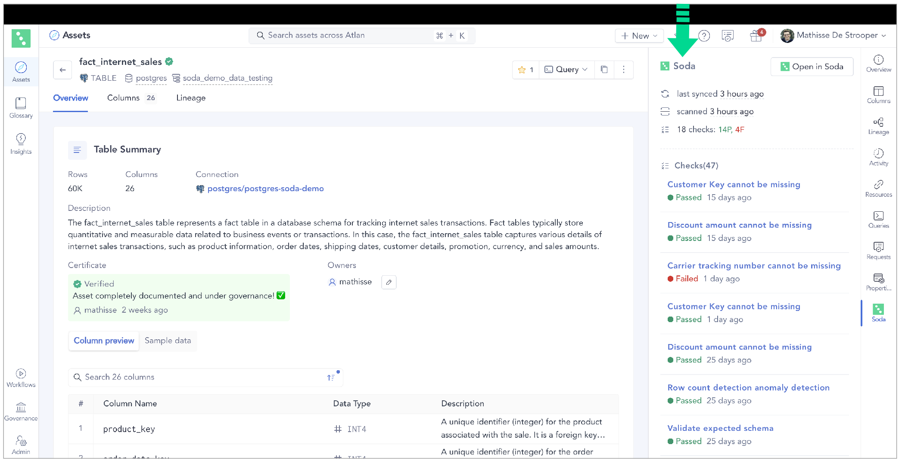
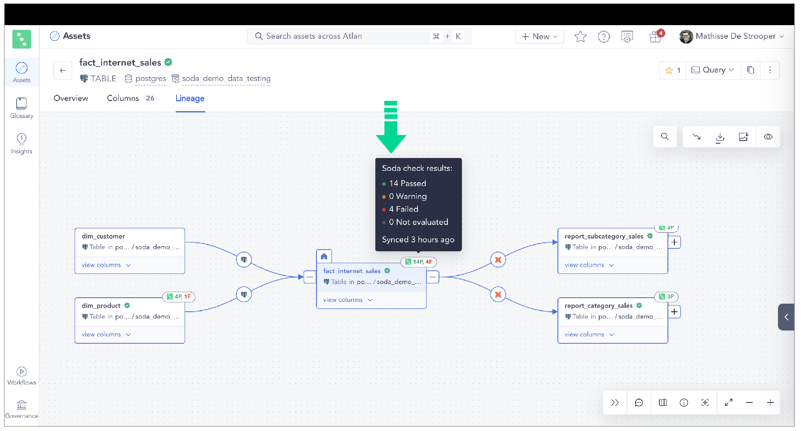

# Integrate Soda with Atlan

Integrate Soda with Atlan to access details about the quality of your data from within the data catalog.

* Run data quality checks using Soda and visualize quality metrics and rules within the context of a data source, dataset, or column in Atlan.
* Use Soda Cloud to flag poor-quality data in lineage diagrams.
* Give your Atlan users the confidence of knowing that the data they are using is sound.

<figure><figcaption></figcaption></figure>

<figure><figcaption></figcaption></figure>

\

## Prerequisites

* You have completed at least one [Soda scan](../run-a-scan/) to validate that the data source’s datasets appear in Soda Cloud as expected.
* You have an Atlan account with the privileges necessary to allow you to set up a Connection in your Atlan workspace.

## Set up the integration

1. Follow the instructions to [Generate API keys](../use-case-guides/api-keys.md) in Soda to use for authentication in your Atlan connection.
2. Follow [Atlan's documentation](https://ask.atlan.com/hc/en-us/articles/7524581020175-How-to-crawl-Soda#select-the-source-0-0) to set up the Connection to Soda in your Atlan workspace.

🎥 Watch the [Atlan-Soda integration](https://www.soda.io/resources/achieving-trusted-data-atlan-soda-integration-showcase) in action!

## Go further

* Access a list of [all integrations](https://www.soda.io/integrations) that Soda Cloud supports.
* Use a webhook to integrate with Jira, ServiceNow, and other tools your team already uses.


