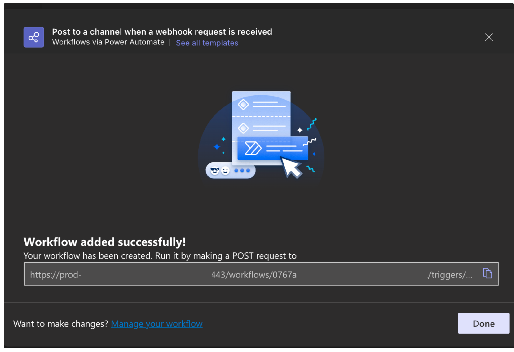

# Integrate Soda with Microsoft Teams

Configure Soda Cloud to connect your account to MS Teams so that you can:

* send [alert notifications](../collaborate/notif-rules.md) for failed or warning check results to MS Teams channel
* start conversations to track and resolve data quality [incidents](broken-reference) with MS Teams

## Configure an MS Teams integration

1. As a user with permission to do so, log in to your Soda Cloud account, navigate to **your avatar** > **Organization Settings**, then select the **Integrations** tab.
2. Click the **+** at the upper right of the table of integrations to add a new integration.
3. In the **Add Integration** dialog box, select **Microsoft Teams**.
4. In the first step of the guided integration workflow, follow the instructions to navigate to your MS Teams account to create a Workflow; see Microsoft's documentation for [Creating a workflow from a channel in Teams](https://support.microsoft.com/en-us/office/creating-a-workflow-from-a-channel-in-teams-242eb8f2-f328-45be-b81f-9817b51a5f0e). Use the Workflow template to **Post to a channel when a webhook request is received**.
5.  In the last step of the guided Workflow creation, copy the URL created after successfully adding the workflow.\

    <figure><figcaption></figcaption></figure>
6. Returning to Soda Cloud with the URL for Workflow, continue to follow the guided steps to complete the integration. Reference the following tables for guidance on the values to input in the guided steps.\

| Field or Label                                                                         | Guidance                                                                                                                     |
| -------------------------------------------------------------------------------------- | ---------------------------------------------------------------------------------------------------------------------------- |
| Name                                                                                   | Provide a unique name for your integration in Soda Cloud.                                                                    |
| URL                                                                                    | Input the Workflow URL you obtained from MS Teams.                                                                           |
| Enable to send notifications to Microsoft Teams when a check result triggers an alert. | Check to allow users to select MS Teams as a destination for alert notifications when check results warn or fail.            |
| Use Microsoft Teams to track and resolve incidents in Soda Cloud.                      | Check to automatically send incident information to an MS Teams channel.                                                     |
| Channel URL                                                                            | Provide a channel identifier to which Soda Cloud sends all incident events.                                                  |
| Use Microsoft Teams to track discussions in Soda Cloud.                                | Check to automatically send notifications to an MS Teams channel when a user creates or modifies a discussion in Soda Cloud. |
| Channel URL                                                                            | Provide a channel identifier to which Soda Cloud sends all discussion events.                                                |

\

### About integration scopes

Use the **Alert Notification** scope to enable Soda Cloud to send alert notifications to an MS Teams channel to notify your team of warn and fail check results. With such an integration, Soda Cloud enables users to select MS Teams as the destination for an alert notification of an individual check or checks that form a part of an agreement, or multiple checks. To send notifications that apply to multiple checks, see [Set notification rules](../collaborate/notif-rules.md).

Use the **Incident** scope to notify your team when a new incident has been created in Soda Cloud. With such a scope, Soda Cloud displays an external link to the MS Teams channel in the **Incident Details**. Soda Cloud sends all incident events to only one channel in MS Teams. As such, you must provide a separate link in the **Channel URL** field in the **Define Scope** tab. For example, `https://teams.microsoft.com/mychannel`. To obtain the channel link in MS Teams, right-click on the channel name in the overview sidebar. Refer to [Incidents](broken-reference) for more details about using incidents in Soda Cloud.

Use the **Discussions** scope to post to a channel when a user creates or modifies a Soda Cloud discussion. Soda Cloud sends all incident events to only one channel in MS Teams. As such, you must provide a separate link in the **Channel URL** field in the **Define Scope** tab. For example, `https://teams.microsoft.com/mychannel`. To obtain the channel link in MS Teams, right-click on the channel name in the overview sidebar. Refer to [Begin a discussion and propose checks](../use-case-guides/quick-start-end-user.md#begin-a-discussion-and-propose-checks) for more details about using incidents in Soda Cloud.

### Troubleshoot

**Problem:** You encounter an error that reads, "Error encountered while rendering this message."

**Solution:** A fix is [documented](https://www.anyviewer.com/kb/microsoft-teams-error-encountered-while-rendering-this-message-2996-ac.html), the short version of which is as follows.

1. Restart MS Teams.
2. Clear your cache and cookies.
3. If you have not already done so, update to the latest version of MS Teams.

\

## Go further

* Learn more about general [webhooks](integrate-webhooks.md) to integrate Soda Cloud with other third-party service providers.
* Set [notification rules](../collaborate/notif-rules.md) that apply to multiple checks in your account.
* Access a list of [all integrations](https://www.soda.io/integrations) that Soda Cloud supports.


