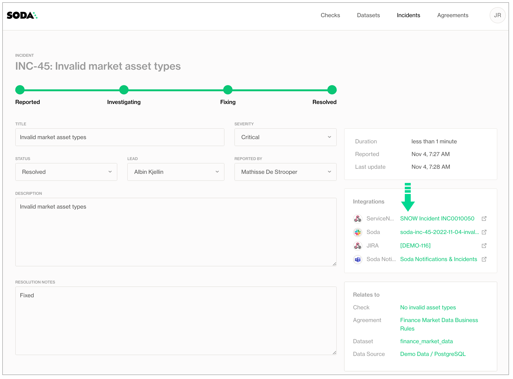

# Integrate Soda with ServiceNow

Configure a [webhook](integrate-webhooks.md) in Soda Cloud to connect to your ServiceNow account.

In ServiceNow, you can create a Scripted REST API that enables you to prepare a resource to work as an incoming webhook. Use the **ServiceNow Resource Path** in the URL field in the Soda Cloud integration setup.

This example offers guidance on how to set up a Scripted REST API Resource to generate an external link which Soda Cloud displays in the **Incident Details**; see image below. When you change the status of a Soda Cloud incident, the webhook also updates the status of the SNOW issue that corresponds with the incident.

Refer to [Event payloads](integrate-webhooks.md#event-payloads) for details information.

<figure><figcaption></figcaption></figure>

\


The following steps offer a brief overview of how to set up a ServiceNow Scripted REST API Resource to integrate with a Soda Cloud webhook. Reference the ServiceNow documentation for details:

* [Create a Scripted REST API](https://docs.servicenow.com/en-US/bundle/tokyo-application-development/page/integrate/custom-web-services/task/t_CreateAScriptedRESTService.html) and [Create a Scripted REST API Resource](https://docs.servicenow.com/bundle/tokyo-application-development/page/integrate/custom-web-services/task/t_CreateAScriptedRESTAPIResource.html)
* [ServiceNow Developer: Creating Scripted REST APIs](https://developer.servicenow.com/dev.do#!/learn/courses/quebec/app_store_learnv2_rest_quebec_rest_integrations/app_store_learnv2_rest_quebec_scripted_rest_apis/app_store_learnv2_rest_quebec_creating_scripted_rest_apis)

1. In ServiceNow, start by navigating to the **All** menu, then use the filter to search for and select **Scripted REST APIs**.
2. Click **New** to create a new scripted REST API. Provide a name and API ID, then click **Submit** to save.
3. In the Scipted Rest APIs list, find and open your newly-created API, then, in the **Resources** tab, click **New** to create a new resource.
4. Provide a **Name** for your resource, then select POST as the **HTTP method**.
5. In the **Script** field, define a script that creates new tickets when a Soda Cloud incident is opened, and updates existing tickets when a Soda Cloud incident status is updated. Use the example below for reference. You may also need to define Security settings according to your organizations authentication rules.
6. Click **Submit**, then copy the value of the **Resource path** to use in the URL field in the Soda Cloud integration setup.

```javascript
(function process(/*RESTAPIRequest*/ request, /*RESTAPIResponse*/ response) {


	var businessServiceId = '28***';
	var snowInstanceId = 'dev***';
	
	var requestBody = request.body;
	var requestData = requestBody.data;
	gs.info(requestData.event);
	if (requestData.event == 'incidentCreated'){
		gs.log("*** Incident Created ***");
		var grIncident = new GlideRecord('incident');
		grIncident.initialize();
		grIncident.short_description = requestData.incident.description;

		grIncident.description = requestData.incident.sodaCloudUrl;
		grIncident.correlation_id = requestData.incident.id;
		if(requestData.incident.severity == 'critical'){
			grIncident.impact = 1;
		}else if(requestData.incident.severity == 'major'){
			grIncident.impact = 2;
		}else if(requestData.incident.severity == 'minor'){
			grIncident.impact = 3;
		}
		
		grIncident.business_service = businessServiceId;
		grIncident.insert();
		var incidentNumber = grIncident.number;
		var sysid = grIncident.sys_id;
		var callBackURL = requestData.incidentLinkCallbackUrl;
		var req, rsp;
		
		req = new sn_ws.RESTMessageV2();


		req.setEndpoint(callBackURL.toString());
		req.setHttpMethod("post");
		var sodaUpdate = '{"url":"https://'+ snowInstanceId +'.service-now.com/incident.do?sys_id='+sysid + '", "text":"SNOW Incident '+incidentNumber+'"}';
		req.setRequestBody(sodaUpdate.toString());
		resp = req.execute();
		gs.log(resp.getBody());
		

	}else if(requestData.event == 'incidentUpdated'){
		gs.log("*** Incident Updated ***");
		var target = new GlideRecord('incident');
		target.addQuery('correlation_id', requestData.incident.id);
		target.query();
		target.next();

		if(requestData.incident.status == 'resolved'){
			//Change this according to how SNOW is used.
			target.state = 6;
			target.close_notes = requestData.incident.resolutionNotes;
		}else{
			//Change this according to how SNOW is used.
			target.state = 4;
		}
		target.update();
		
	}


})(request, response);
```

\


## Go further

* As a business user, learn more about [writing no-code checks](../soda-cl-overview/#define-sodacl-checks) in Soda Cloud.
* Set [notification rules](../collaborate/notif-rules.md) that apply to multiple checks in your account.
* Learn more about creating, tracking, and resolving data quality [Incidents](broken-reference).
* Access a list of [all integrations](https://www.soda.io/integrations) that Soda Cloud supports.


