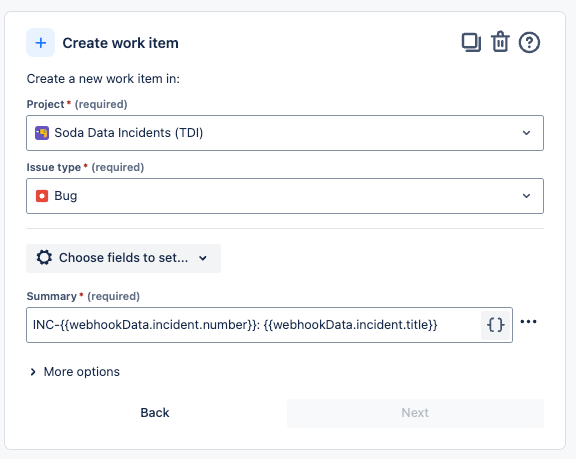

# Jira

Configure a [webhook.md](webhook.md "mention") in Soda Cloud to connect to your Jira workspace.

In this guide, we will show how you can integrate Soda Cloud Incidents with Jira. After the integration is set up, then creating an incident in Soda will automatically trigger the creation of corresponding bug ticket in Jira. The Jira ticket will include information related to the incident created in Soda, including:

* The number and title of the Incident
* The description of the Incident
* The severity of the incident
* The status of the incident
* The user who reported the Incident
* A link to the Incident in Soda Cloud
* A link to the associated Check in Soda Cloud

A link to this Jira ticket will be sent back to Soda and displayed on the Incident page in the Integrations box. Any updates to the status of the Incident in Soda Cloud will trigger corresponding changes to the Status of the Jira ticket. Any updates to the status of the Jira ticket will trigger corresponding changes to the Status of the Incident in Soda Cloud.

In Jira, you can set up an Automation Rule that enables you to define what you want an incoming webhook to do, then provides you with a URL that you use in the URL field in the Soda Cloud integration setup.

This integration is built on two webhook events IncidentCreated and IncidentUpdated (Soda -> Jira; [Event payloads](https://docs.soda.io/soda/integrate-webhooks.htmll#event-payloads)), as well as the Soda Cloud API endpoint for updating incidents (Jira -> Soda; [API](https://docs.soda.io/api-docs/public-cloud-api-v1.html)).

<figure><figcaption></figcaption></figure>

### Create a Jira project for DQ tickets <a href="#create-a-jira-project-for-dq-tickets" id="create-a-jira-project-for-dq-tickets"></a>

In Jira, start by creating a new project dedicated to tracking data quality tickets. Navigate to the **Project settings** > **Work Items**, and make sure you have a bug type work item with the fields, as shown in the image below:

* Summary
* Description
* Assignee
* IncidentSeverity
* IncidentID
* IncidentURL
* CheckURL

<figure><figcaption></figcaption></figure>

From the same page, next click the **Edit Workflow** button, and make sure your workflow includes the following statuses:

* Reported
* Investigating
* Fixing
* Resolved\


<figure><figcaption></figcaption></figure>

## Automation Rule (Inbound) <a href="#automation-rule-inbound" id="automation-rule-inbound"></a>

### Initialize the webhook-trigger <a href="#initialize-the-webhook-trigger" id="initialize-the-webhook-trigger"></a>

Here we will set up the automation in Jira so that when an Incident is created or updated in Soda, then a bug ticket will automatically be created or updated in Jira.

Navigate to `Project settings` > `Automation`, then click `Create rule` and, for the type of `New trigger`, select `Incoming webhook`.

<figure><figcaption></figcaption></figure>

Under the `When: Incoming webhook trigger`, click `Add a component`, select `IF: Add a condition`, then smart values condition.

<figure><figcaption></figcaption></figure>

What this means is that, **if** an incoming webhook has the `incidentCreated` event, then we will do something.

### Automatic creation of the Jira ticket <a href="#automatic-creation-of-the-jira-ticket" id="automatic-creation-of-the-jira-ticket"></a>

Next we will add another component: `THEN: Add an action`.

The action will be to **Create work item** and the **Issue Type** should be `Bug` and the **Project** should be our new project.

<figure><figcaption></figcaption></figure>

Next we add some steps to fill out our ticket with extra information obtained from the webhook data.

We start by creating a branch rule to identify our ticket:

<figure><figcaption></figcaption></figure>

Then we Edit the ticket fields:

<figure><figcaption></figcaption></figure>

Finally, the last step in our incident _creation_ workflow is to send a post request back to Soda with a link to the issue in Jira:

<figure><figcaption></figcaption></figure>

### Automatic updates to the Jira ticket <a href="#automatic-updates-to-the-jira-ticket" id="automatic-updates-to-the-jira-ticket"></a>

The remaining parts of this automation rule cover the scenarios where the status of the incident is updated in Soda, then we will detect this change and make the corresponding updates to the issue in Jira.

When the status changes to `Reported`:

<figure><figcaption></figcaption></figure>

The same logic is used for other status changes such as `Investigating` and `Fixing`.

In case the status changes to `Resolved`, our rule uses a similar logic, but with the additional step of adding resolution notes as a comment to the issue in Jira:

<figure><figcaption></figcaption></figure>

Once you save/enable this new rule, then you can access a URL and secret that you will provide to Soda when setting up the new webhook integration.

After saving or enabling the rule, you can view details of the webhook trigger as shown below:

<figure><figcaption></figcaption></figure>

### Define the Webhook integration in Soda <a href="#define-the-webhook-integration-in-soda" id="define-the-webhook-integration-in-soda"></a>

Next, you create a new webhook integration in Soda and provide the details from the webhook trigger above, as shown in the image below.

Paste the Webhook URL from Jira into the URL field in Soda and paste the Secret from Jira into a custom HTTP header called `X-Automation-Webhook-Token`.

Finally, in the `Define Scope` tab, make sure to select `Incidents - Triggered when users create or update incidents`.

<figure><figcaption></figcaption></figure>

## Automation Rule (outbound) <a href="#automation-rule-outbound" id="automation-rule-outbound"></a>

We will set up a second automation rule in Jira so that when the status of the ticket changes in Jira, these changes are also reflected in Soda.

First, we set up the trigger for this automation to be when a Work item is transitioned:

<figure><figcaption></figcaption></figure>

Finally, we send a post request to the Soda Cloud API `incidents` endpoint [https://docs.soda.io/soda/integrate-jira.html#automation-rule-outbound](https://docs.soda.io/soda/integrate-jira.html#automation-rule-outbound), using information from our Jira ticket to update the severity and status of the corresponding incident in Soda:

<figure><figcaption></figcaption></figure>

Note that the `Authorization` header value must be formatted like:

`Basic <base64_encoded_credentials>`. Base64-encoded credentials can be generated using Soda Cloud API keys in Python like so:

```bash
import base64
api_key_id = "your_api_key_id"
api_key_secret = "your_api_key_secret"

credentials = f"{api_key_id}:{api_key_secret}"
encoded_credentials = base64.b64encode(credentials.encode()).decode()
print(f"Basic {encoded_credentials}")
```
