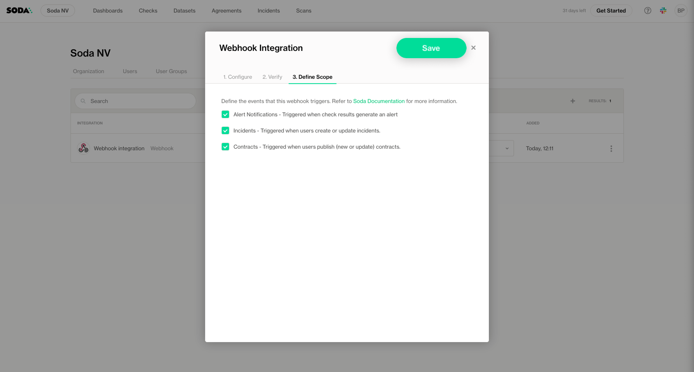

# Webhook

The **Webhook Integration** in Soda Cloud allows you to send notifications about **check results** (based on notification rules) and **incident updates** to external systems, such as monitoring tools, incident management platforms, or custom endpoints.

This integration is ideal for teams who want to build custom workflows or integrate Soda Cloud alerts into their existing tools.

### Set Up a Webhook Integration


Only users with the **Manage Organization Settings** global role can define webhook integrations.


Follow these steps to configure a Webhook integration in Soda Cloud:

1. Go to the **Integrations** section in **Settings**.
2. Click the **+** button to add a new integration.

<figure><figcaption></figcaption></figure>

3. Select the integration type: **Webhook,** and click next.

<figure><figcaption></figcaption></figure>

4. Configure the Webhook
   * **Name**: Provide a clear name for your integration.
   * **URL**: Enter the Webhook endpoint where Soda Cloud should send notifications. **Headers**: (Optional)
   * Add authentication or custom headers required by your endpoint.

<figure><figcaption></figcaption></figure>

5. Test the Webhook
   * Use the built-in testing tool to simulate events and validate your Webhook integration.
   * You can select different event types to test and develop your integration.
   * For the exact payload structure and details, see the [Webhook reference ✅](https://slite.com/api/public/notes/5e-Y6TfFiYmlii/redirect)

<figure><figcaption></figcaption></figure>

6. Choose the events to send
   * **Alert Notifications**: The integration becomes **available for use in notification rules**. It will only send notifications when you explicitly configure a notification rule to use this Webhook.
   * **Incidents**: Triggered when users create or update incidents in Soda Cloud.
   * **Contracts**: Triggered when users publish new or updated contracts in Soda Cloud.

<figure><figcaption></figcaption></figure>

6. Click Save to apply

### Use in Notification Rules

After configuring your Webhook integration with the Alert Notification scope, you can use it in your **notification rules** to send alerts when specific checks fail.

When creating or editing a notification rule, select your configured **Webhook** integration as the recipient.

For detailed steps and advanced examples, see the [notifications.md](../manage-issues/notifications.md "mention")
