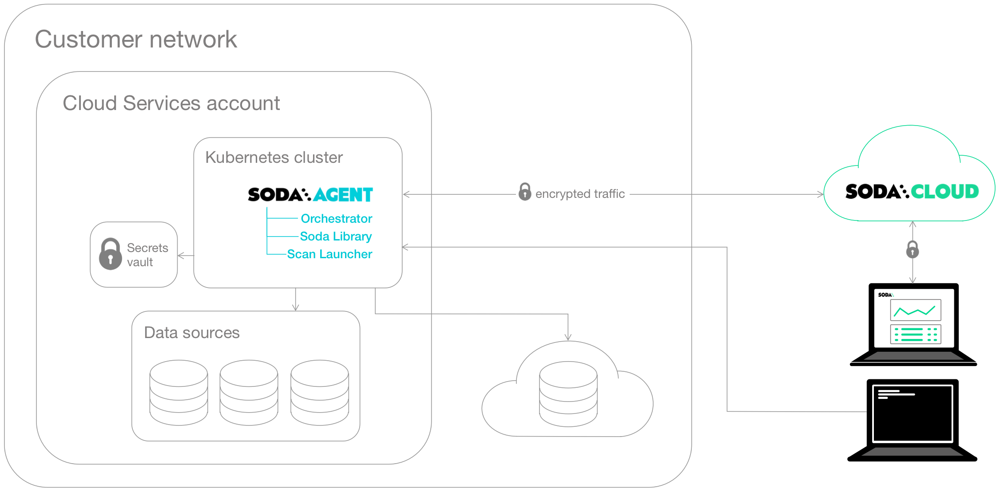

# Soda Agent basic concepts

The **Soda Agent** is a tool that empowers Soda Cloud users to securely access data sources to scan for data quality. For a self-hosted agent, create a Kubernetes cluster in a cloud services provider environment, then use Helm to deploy a Soda Agent in the cluster.

This setup enables Soda Cloud users to securely connect to data sources (Snowflake, Amazon Athena, etc.) from within the Soda Cloud web application. Any user in your Soda Cloud account can add a new data source via the agent, then write their own no-code checks to check for data quality in the new data source.

What follows is an extremely abridged introduction to a few basic elements involved in the deployment and setup of a self-hosted Soda Agent.

<figure><figcaption></figcaption></figure>

**Soda Library** is a Python library and command-line tool that serves as the backbone of Soda technology. It is the software that performs the work of converting user-defined input into SQL queries that execute when you run scans for data quality in a data source. Connect Soda Library to a **Soda Cloud** account where you and your team can use the web application to collaborate on data quality monitoring.

Both Soda Library and Soda Cloud make use of **Soda Checks Language (SodaCL)** to write checks for data quality. The checks are tests that Soda Library executes when it runs a scan of your data.

**Soda Agent** is essentially Soda Library functionality that you deploy in a Kubernetes cluster in your own cloud services provider environment. When you deploy an agent, you also deploy two types of workloads in your Kubernetes cluster from a Docker image:

* a **Soda Agent Orchestrator** which creates Kubernetes Jobs to trigger scheduled and on-demand scans of data
* a **Soda Agent Scan Launcher** which wraps around Soda Library, the tool which performs the scan itself

**Kubernetes** is a system for orchestrating containerized applications; a **Kubernetes cluster** is a set of resources that supports an application deployment.

You need a Kubernetes cluster in which to deploy the containerized applications that make up the **Soda Agent**. Kubernetes uses the concept of **Secrets** that the Soda Agent Helm chart employs to store connection secrets that you specify as values during the Helm release of the Soda Agent. Depending on your cloud provider, you can arrange to store these Secrets in a specialized storage such as [Azure Key Vault](https://learn.microsoft.com/en-us/azure/key-vault/general/basic-concepts) or [AWS Key Management Service (KMS)](https://docs.aws.amazon.com/kms/latest/developerguide/overview.html). See: [Integrate with a secrets manager](../use-case-guides/quick-start-secrets.md).

The Jobs that the agent creates access these Secrets when they execute. Learn more about [Kubernetes concepts](https://www.youtube.com/watch?v=BOj1sgWVXko).

Within a cloud services provider environment is _where_ you create your Kubernetes cluster. You can deploy a Soda Agent in any environment in which you can create Kubernetes clusters such as:

* Amazon Elastic Kubernetes Service (EKS)
* Microsoft Azure Kubernetes Service (AKS)
* Google Kubernetes Engine (GKE)
* Any Kubernetes cluster version 1.21 or greater which uses standard Kubernetes
* Locally, for testing purposes, using tools like [Minikube](https://minikube.sigs.k8s.io/docs/), [microk8s](https://microk8s.io/docs), [kind](https://kind.sigs.k8s.io/), [k3s](https://docs.k3s.io/), or [Docker Desktop](https://www.docker.com/products/docker-desktop/) with Kubernetes support.

**Helm** is a package manager for Kubernetes which bundles YAML files together for storage in a public or private repository. This bundle of YAML files is referred to as a **Helm chart**. The Soda Agent is a Helm chart. Anyone with access to the Helm chart’s repo can deploy the chart to make use of YAML files in it. Learn more about [Helm concepts](https://www.youtube.com/watch?v=-ykwb1d0DXU).

The Soda Agent Helm chart is stored on a [public repository](https://helm.soda.io/soda-agent/) and published on [ArtifactHub.io](https://artifacthub.io/packages/helm/soda-agent/soda-agent). Anyone can use Helm to find and deploy the Soda Agent Helm chart in their Kubernetes cluster

## Go further

* [Deploy a Soda Agent](../quick-start-sip/deploy.md) in a Kubernetes cluster.


