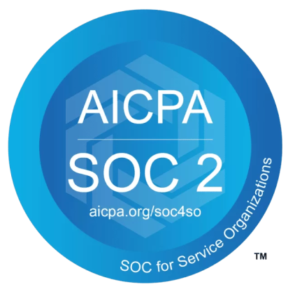

# Data security and privacy

Soda works in several ways to ensure your data and systems are secure and remain private.

See also: [Soda Privacy Policy](https://www.soda.io/privacy-policy)\

## Compliance and reporting

As a result of an independent review in July 2025, Soda has been found to be **SOCII Type 2** compliant. Contact [support@soda.io](mailto:support@soda.io) for more information.

<figure><figcaption></figcaption></figure>

## Using a Soda-hosted agent

Soda hosts agents in a secure environment in Amazon AWS. As a SOC 2 Type 2 certified business, Soda responsibly manages Soda-hosted agents to ensure that they remain private, secure, and independent of all other hosted agents.

* Soda encrypts values pertaining to data source connections and only uses the values to access the data to perform scans for data quality. It uses [asymmetric keys in AWS KMS](https://docs.aws.amazon.com/kms/latest/developerguide/symmetric-asymmetric.html) to encrypt and store the values you provide for access to your data source. AMS KMS keys are certified under the [FIPS 140-2 Cryptographic Module Validation Program](https://csrc.nist.gov/projects/cryptographic-module-validation-program/certificate/4523).
* Soda encrypts the secrets you provide via Soda Cloud both in transit and at rest. This [end-to-end encryption](https://en.wikipedia.org/wiki/End-to-end_encryption) means that secrets leave your browser already encrypted and can only be decrypted using a Private Key that only the Soda Agent can access.
* Once you enter data source access credentials into Soda Cloud, neither you or any user or entity can access the values because they have been encrypted and can only be decrypted by the Soda Agent.
* If your data source accepts allowlisted IP addresses, add the Soda Cloud IP address to the allowlist to access your data sources via the Soda-hosted Agent. Obtain this IP address in Soda Cloud when connecting a new data source.

## Connecting with Soda Library

Installed in your environment, you use the Soda Library command-line tools to securely connect to a data source using system variables to store login credentials.

## Sending data to Soda Cloud

Soda Library uses a secure API to connect to Soda Cloud. When Soda Library completes a scan, it pushes the scan results to your Soda Cloud account where you can log in and examine the details in the web application.

Notably, your Soda Cloud account does _not_ store the raw data that Soda Library scans. Soda Library pushes metadata to Soda Cloud; by default all your data stays inside your private network.

Soda Cloud does store the following:

* metadata, such as column names
* aggregated metrics, such as averages
* sample rows and failed rows, if you explicitly set up your configuration to send this data to Soda Cloud

Where your datasets contain [sensitive data](https://ec.europa.eu/info/law/law-topic/data-protection/reform/rules-business-and-organisations/legal-grounds-processing-data/sensitive-data/what-personal-data-considered-sensitive_en) or private information, you may _not_ want to send failed row samples from your data source to Soda Cloud. In such a circumstance, you can [disable the failed row samples feature entirely](../run-a-scan/failed-row-samples.md#disable-failed-row-samples-in-soda-cloud) in Soda Cloud.

Read more about Soda’s [Privacy Policy](https://www.soda.io/privacy-policy).

## Receiving events from Soda Cloud

You can set up Soda Cloud to send events to your services using integrations like Soda Webhooks. If your destination services are behind a firewall, you may need to passlist Soda Cloud's egress IP addresses to allow communication. The current IP addresses used by Soda Cloud are:

* EU: `54.78.91.111`, `52.49.181.67`
* US: `34.208.202.240`, `52.35.114.145`

Ensure these addresses are allowed in your firewall settings to avoid any disruptions in receiving events from Soda Cloud.

## Single sign-on with Soda Cloud

Organizations that use a SAML 2.0 single sign-on (SSO) identity provider can add Soda Cloud as a service provider. Once added, employees of the organization can gain authorized and authenticated access to the organization’s Soda Cloud account by successfully logging in to their SSO. Refer to [Set up single sign-on with Soda Cloud](../integrate-soda/sso.md) for details.
