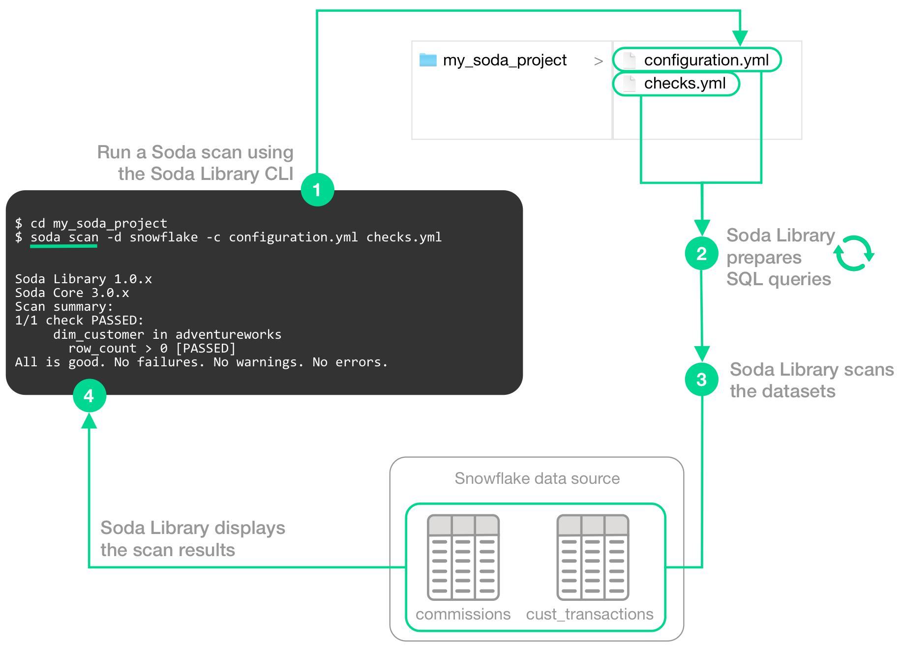
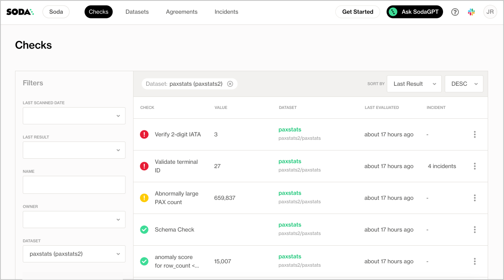

# How Soda works

**Soda Library** is Python library and CLI tool that enables Data Engineers to test data for quality where and when they need to. The **Soda Agent** is a self-hosted or Soda-hosted containerized Soda Library deployed in a Kubernetes cluster, so the behavior described below for Soda Library is more or less the same for Soda Agent.

Soda Library utilizes user-defined input to prepare SQL queries that run checks on datasets in a data source to find invalid, missing, or unexpected data. When checks fail, they surface the data that you defined as “bad” in the check. Armed with this information, you and your data engineering team can diagnose where the “bad” data entered your data pipeline and take steps to prioritize and resolve issues.

Use Soda Library to manually or programmatically scan the data that your organization uses to make decisions. Optionally, you can integrate Soda Library with your data orchestration tool, such as Airflow, to schedule scans and automate actions based on scan results. Connect Soda Library to a Soda Cloud account where you and your team can use the web application to monitor check results and collaborate to keep your data issue-free.

## Soda Library basics

This tool checks the quality of data inside [data sources](glossary.md#data-source). It enables you to perform four basic tasks:

* connect to your data source
* connect to a Soda Cloud account
* define checks to surface bad-quality data
* run a scan for data quality against your data

To connect to a data source such as Snowflake, Amazon Athena, or GCP BigQuery, you use a `configuration.yml` file which stores access details for your data source and connection details for your Soda Cloud account. (Except for connections to Spark DataFrames which do not use a configuration YAML file.) Refer to [Configure Soda](../quick-start-sip/install.md#configure-soda) for details and links to data source-specific connection configurations.

#### Configuration YAML example

```yaml
data_source adventureworks:
  type: postgres
  host: localhost
  port: '5432'
  username: postgres
  password: secret
  database: postgres
  schema: public

soda_cloud:
  host: cloud.soda.io
  api_key_id: 2e0ba0cb-**7b
  api_key_secret: 5wdx**aGuRg
```

To define the data quality checks that Soda Library runs against a dataset, you use a `checks.yml` file. A Soda Check is a test that Soda Library performs when it scans a dataset in your data source. The checks YAML file stores the Soda Checks you write using [SodaCL](../soda-cl-overview/).

For example, you can define checks that look for things like missing or forbidden columns in a dataset, or rows that contain data in an invalid format. See [Metrics and checks](../sodacl-reference/metrics-and-checks.md) for more details.

#### Checks YAML example

```yaml
# Check for absent or forbidden columns in dataset
checks for dataset_name:
  - schema:
      warn:
        when required column missing: [column_name]
      fail:
        when forbidden column present: [column_name, column_name2]

# Check an email column to confirm that all values are in email format
checks for dataset_name:
  - invalid_count(email_column_name) = 0:
      valid format: email
```

In your own local environment, you create and store your checks YAML file anywhere you wish, then identify its name and filepath in the scan command. In fact, you can name the file whatever you like, as long as it is a `.yml` file and it contains checks using the SodaCL syntax.

You write Soda Checks using SodaCL’s built-in metrics, though you can go beyond the built-in metrics and write your own SQL queries, if you wish. The example above illustrates two simple checks on two datasets, but SodaCL offers a wealth of [built-in metrics](../sodacl-reference/metrics-and-checks.md#list-of-sodacl-metrics-and-checks) that enable you to define checks for more complex situations.

\


To scan your data, you use the `soda scan` CLI command. Soda Library uses the input in the checks YAML file to prepare SQL queries that it runs against the data in one or more datasets in a data source. It returns the output of the scan with each check's results in the CLI.

```shell
soda scan -d adventureworks -c configuration.yml checks.yml
```

## Soda Library operation

The following image illustrates what Soda Library does when you initiate a scan.

<figure><figcaption></figcaption></figure>

**1** - You trigger a scan using the `soda scan` CLI command from your Soda project directory which contains the `configuration.yml` and `checks.yml` files. The scan specifies which data source to scan, where to get data source access info, and which checks to run on which datasets.

**2** - Soda Library uses the checks you defined in the checks YAML to prepare SQL queries that it runs on the datasets in your data source.

**3** - When Soda Library runs a scan, it performs the following actions:

* fetches column metadata (column name, type, and nullable)
* executes a single aggregation query that computes aggregate metrics for multiple columns, such as `missing`, `min`, or `max`
* for each column each dataset, executes several more queries

**4** - As a result of a scan, each check results in one of three default states:

* **pass**: the values in the dataset match or fall within the thresholds you specified
* **fail**: the values in the dataset _do not_ match or fall within the thresholds you specified
* **error**: the syntax of the check is invalid

A fourth state, **warn**, is something you can explicitly configure for individual checks. See [Add alert configurations](../sodacl-reference/optional-config.md#add-alert-configurations).

The scan results appear in your Soda Library command-line interface (CLI) and the latest result appears in the **Checks** dashboard in the Soda Cloud web application; examples follow.

Optionally, you can add `--local` option to the scan command to prevent Soda Library from sending check results and any other metadata to Soda Cloud.

```sh
Soda Library 1.0.x
Soda Core 3.0.x
Sending failed row samples to Soda Cloud
Scan summary:
6/9 checks PASSED: 
    paxstats in paxstats2
      row_count > 0  [PASSED]
        check_value: 15007
      Look for PII  [PASSED]
      duplicate_percent(id) = 0  [PASSED]
        check_value: 0.0
        row_count: 15007
        duplicate_count: 0
      missing_count(adjusted_passenger_count) = 0  [PASSED]
        check_value: 0
      anomaly detection for row_count  [PASSED]
        check_value: 0.0
      Schema Check [PASSED]
1/9 checks WARNED: 
    paxstats in paxstats2
      Abnormally large PAX count [WARNED]
        check_value: 659837
2/9 checks FAILED: 
    paxstats in paxstats2
      Validate terminal ID [FAILED]
        check_value: 27
      Verify 2-digit IATA [FAILED]
        check_value: 3
Oops! 2 failure. 1 warning. 0 errors. 6 pass.
Sending results to Soda Cloud
Soda Cloud Trace: 4774***8
```

<figure><figcaption></figcaption></figure>

The **Soda Cloud** web application integrates with your Soda Library implementation giving your team broader visibility into your organization’s data quality. Soda Library pushes scan results to your Soda Cloud account where you can examine the results.

Soda Library does not send data to Soda Cloud; it only ever pushes _metadata_ to the cloud. All your data stays inside your private network. An exception to this rule is when Soda collects failed row samples that it presents in scan output to aid with issue investigation, a feature you can [disable](../run-a-scan/failed-row-samples.md#disable-failed-row-samples).

The web app serves to complement Soda Library. Use Soda Cloud to:

* access visualized check results
* track check results over time with the Cloud Metric Store that records past measurements
* set up and send alert notifications when bad-quality data surfaces
* examine failed row samples
* profile columns and examine sample data
* create and track data quality [incidents](broken-reference) so your team can collaborate in Slack to resolve them
* collaborate with team members to review details of scan results that can help you to diagnose data issues

## Soda Library automation

To automate scans on your data, you can use **Soda Library** to programmatically execute scans. Based on a set of conditions or a specific schedule of events, you can instruct Soda Library to, for example, automatically run scans in your development workflow in GitHub. Refer to the [Test data during development](../use-case-guides/quick-start-dev.md) for details.

Alternatively, you can integrate Soda Library with a **data orchestration tool** such as, Airflow, Dagster, or Prefect to schedule automated scans. You can also configure actions that the orchestration tool can take based on scan output. For example, you may wish to scan your data at several points along your data pipeline, perhaps when new data enters a warehouse, after it is transformed, and before it is exported to another data source or tool. Refer to [Test data in an Airflow pipeline](../use-case-guides/quick-start-prod.md) for details.

## Go further

* Learn more about the [Metrics and checks](../sodacl-reference/metrics-and-checks.md) you can use to check for data quality.
* Learn how to prepare [programmatic scans](../quick-start-sip/programmatic.md) of your data.
* Learn more about the ways you can use Soda in [Use case guides](../use-case-guides/).
* Use [failed row samples](../run-a-scan/failed-row-samples.md) to investigate data quality issues.
* Write [custom SQL checks](../sodacl-reference/user-defined.md) for your own use cases.
