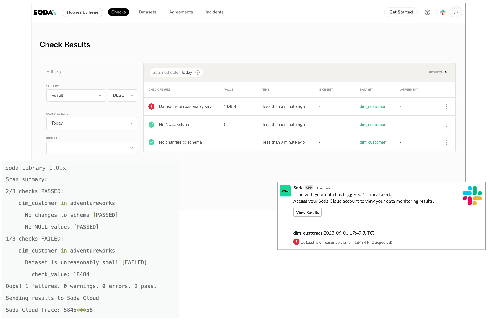
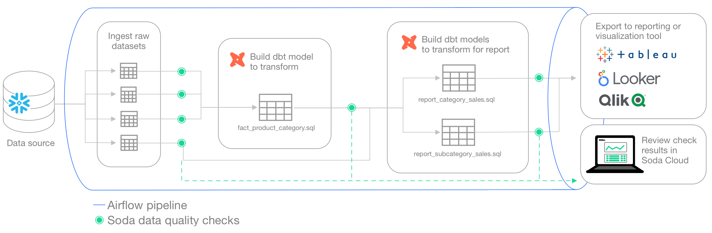
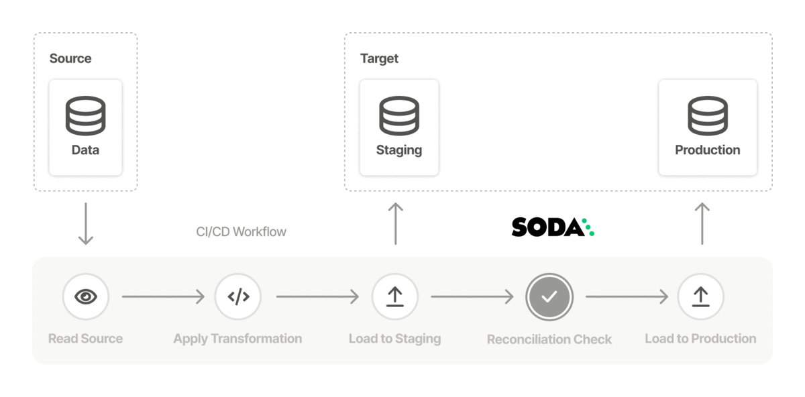

# Soda overview

Soda is a tool that enables Data Engineers, Data Scientists, and Data Analysts to test data for quality where and when they need to.

* Is your data fresh?
* Is it complete or missing values?
* Are there unexpected duplicate values?
* Did something go wrong during transformation?
* Are all the date values valid?
* Are anomalous values disrupting downstream reports?

These are questions that Soda answers.

## What does Soda do?

Soda works by taking the data quality checks that you prepare and using them to run a scan of datasets in a data source.

A scan is a command which instructs Soda to execute data quality checks on your data source to find invalid, missing, or unexpected data. When data quality checks fail, they surface bad-quality data and present check results that help you investigate and address quality issues.

Working together, **Soda Library** or a **Soda Agent**, **Soda Cloud** and **Soda Checks Language (SodaCL)** empower you and your colleagues to collaborate on data quality testing.

* **Soda Library** is a Python library and CLI tool that performs the work of converting user-defined input into SQL queries that execute when you run scans for data quality. This "engine" of Soda uses the data source connection information you provide in a configuration YAML file, and the data quality checks you define in a checks YAML file, to run on-demand or scheduled scans of your data. Soda Library pushes scan results to your Soda Cloud account to enable you and your colleagues to analyze check results, investigate issues, and track dataset health over time.
* The **Soda Agent** is a self-hosted or Soda-hosted containerized Soda Library deployed in a Kubernetes cluster in a cloud services provider environment, such as Azure or AWS. Deploy a self-hosted Soda Agent to use Soda Library while meeting infrastructure team’s security rules and requirements. See [Soda Agent basic concepts](basics.md) for details.
* **Soda Cloud** communicates with Soda Library installed as a library and CLI tool in your development environment, or as an agent in your cloud service-based environment. While Soda Library is the mechanism that executes scans, Soda Cloud is what makes data quality results accessible and shareable by multiple team members. Use it to access visualized scan results, discover data quality anomalies, set up alerts for quality checks that fail, and track data quality health over time. Connect your Soda Cloud account to the ticketing, messaging, and data cataloging tools you already use to embed Soda quality checks into your team's existing processes and pipelines.
* To define data quality checks, you use the **Soda Checks Language (SodaCL)**, which is a YAML-based, domain-specific language for data quality testing. A Soda check is a test that Soda Library executes when it scans a dataset in your data source. Technically, it is a Python expression that checks metrics to see if they match the parameters you defined for a measurement.\
  Designed as a human-readable language, SodaCL includes over 25 built-in metrics and checks that you can use to write Soda Checks for data quality, including metrics for missing values, duplicates, schema changes, and freshness; see example below.


**Soda Core**, the free, open-source Python library and CLI tool from which Soda Library extends, continues to exist as an OSS project in GitHub, including all [Soda Core documentation](https://github.com/sodadata/soda-core/blob/main/docs/overview-main.md).\
\
[Migrate to Soda Library](../quick-start-sip/upgrade.md#migrate-from-soda-core) to connect to Soda Cloud and access all the newest Soda features.\



#### Example SodaCL checks

```yaml
checks for CUSTOMERS:
  - row_count > 0:
    name: Dataset is not empty
  - missing_count(last_name) = 0:
      missing values: [N/A, None]
      name: No NULL values
  - duplicate_count(phone) < 0:
      name: All phone numbers unique
  - schema:
      name: Columns have been added, removed, or changed
      warn:
        when required column missing: [id, size, distance]
        when forbidden column present: [pii_%]
        when wrong column type:
          id: varchar
          distance: integer
        when wrong column index:
          id: 0

checks for ORDERS:
  - freshness(created_at) < 2h:
      name: Data is recent
```

Soda uses the input in the checks YAML files to prepare SQL queries that it runs against your data during a scan. During a scan, Soda does not ingest your data, it only scans it for quality metrics, then uses the metadata to prepare scan results. (An exception to this rule is when Soda collects failed row samples that it presents in scan output to aid with issue investigation, a feature you can [disable](../run-a-scan/failed-row-samples.md).

After a scan, each check results in one of three default states:

* pass: the values in the dataset match or fall within the thresholds you specified
* fail: the values in the dataset do not match or fall within the thresholds you specified
* error: the syntax of the check is invalid
* A fourth state, warn, is something you can explicitly configure for individual checks.

Soda makes the results available in the command-line and in your online account, and notifies you of failed checks by email, Slack, MS Teams, or any messaging platform your team already uses.

<figure><figcaption></figcaption></figure>

## Where do you use Soda?

You can programmatically embed Soda scan executions in your data pipeline after ingestion and transformation to get early and precise warnings in Soda about data quality issues before they have a downstream impact. Upon receiving a data quality alert in Slack, for example, your team can take quick action in Soda Cloud to identify the issue and open an incident to investigate the root cause. See [Test data quality in a data pipeline](../use-case-guides/quick-start-prod.md).

<figure><figcaption></figcaption></figure>

\


You can also add Soda scans to your CI/CD development lifecycle to ensure that any changes you make to dbt models or other changes or added transformations are checked for data quality before merging into production, preventing data quality issues from impacting business operations. In conjunction with GitHub Actions, for example, you can automate scans for data quality whenever a team member creates a new pull request to ensure that “checking for data quality” is a regular part of your software development lifecycle. An ounce of prevention in development is worth a pound of cure in production! See [Test data quality during CI/CD development](../use-case-guides/quick-start-dev.md).

<figure><figcaption></figcaption></figure>

Use Soda to test the quality in a data migration project at both source and target, both before and after migration to prevent data quality issues from polluting a new data source. See [Test data quality before migration](../use-case-guides/quick-start-migration.md).

<figure><figcaption></figcaption></figure>

## Go further

* Learn more about the ways you can use Soda in [Use case guides](../use-case-guides/).
* [Integrate Soda](../integrate-soda/) with your data catalog.
* Auto-generate [check suggestions](../soda-cl-overview/check-suggestions.md) tailored to your data.
* Set up bulk [notification rules](../collaborate/notif-rules.md) to send alerts for failed checks.
* Create [incidents](broken-reference) to track issue investigation.
* Use the Soda Cloud Reporting API to [prepare reports](../use-case-guides/reporting-api-to-overview-dashboards.md) on dataset test coverage and overall health.
* Automatically [profile](../soda-cl-overview/profile.md) your datasets.
* Use [failed row samples](../run-a-scan/failed-row-samples.md) to investigate data quality issues.
* Write [custom SQL checks](../sodacl-reference/user-defined.md) for your own use cases.
* [Ingest dbt test results](../integrate-soda/integrate-dbt.md) into your Soda Cloud account to visualize results and track trends over time.


