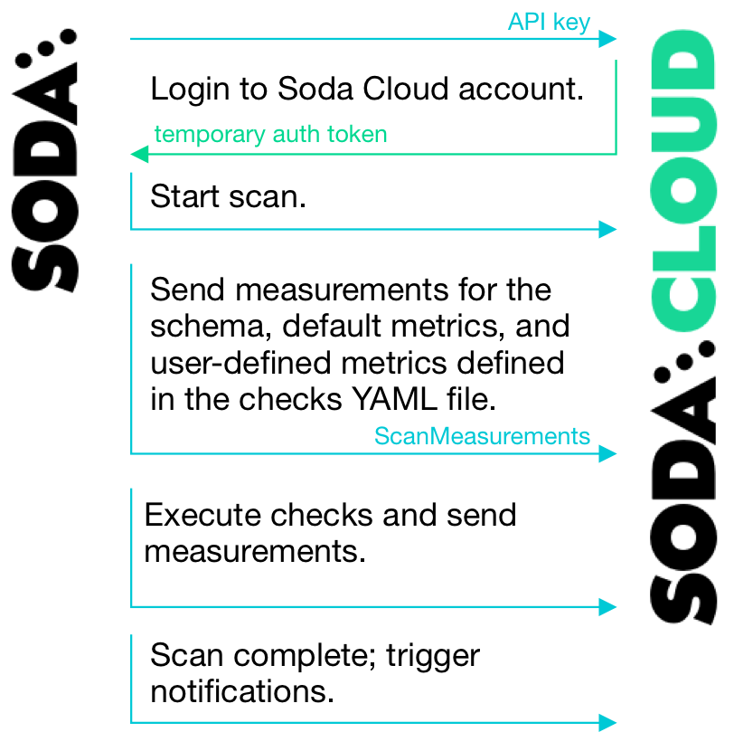
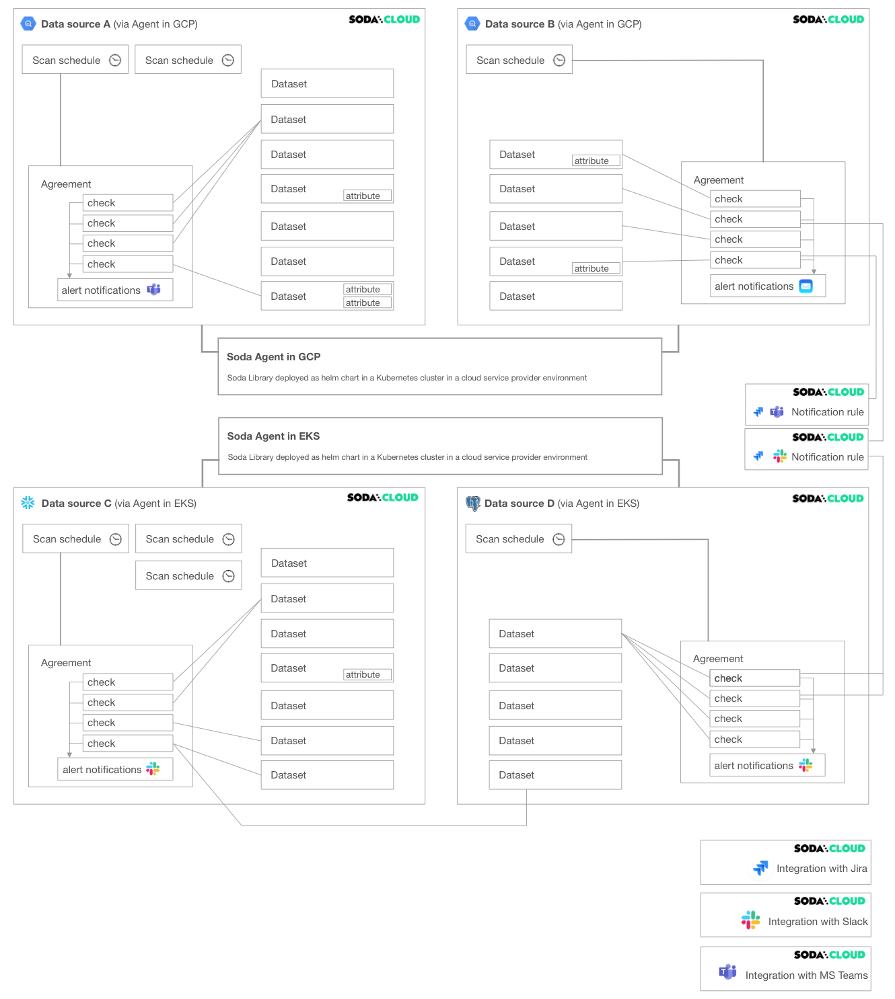
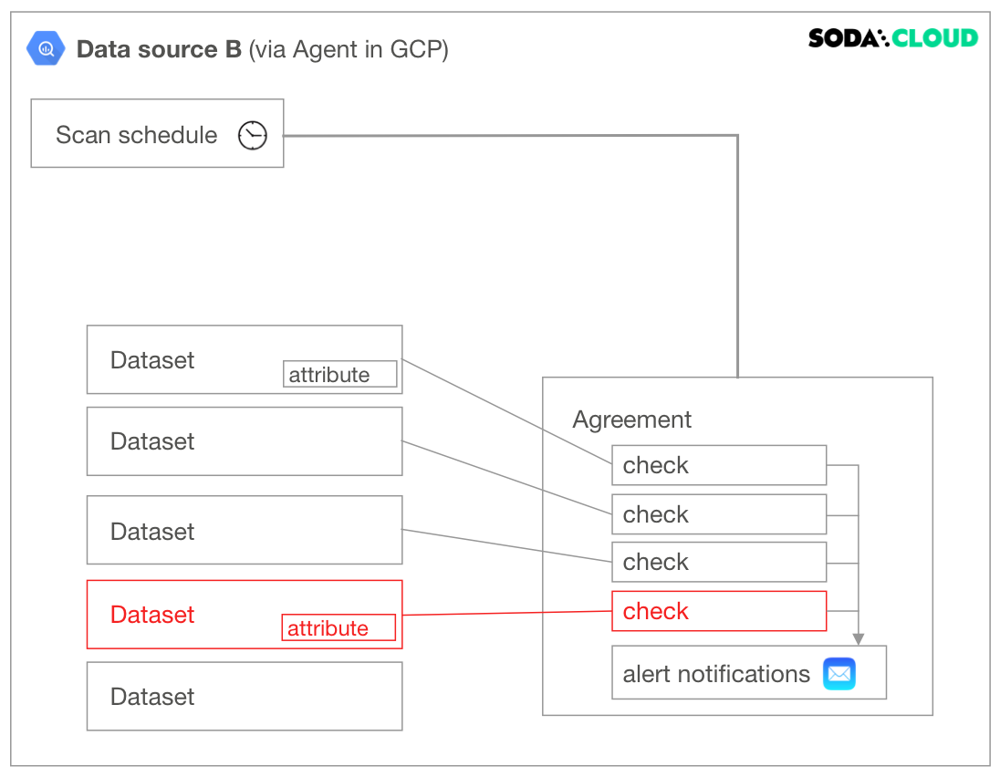
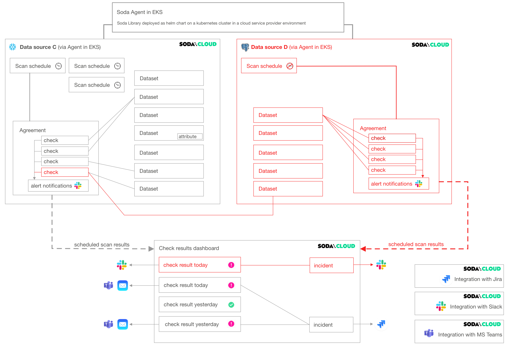
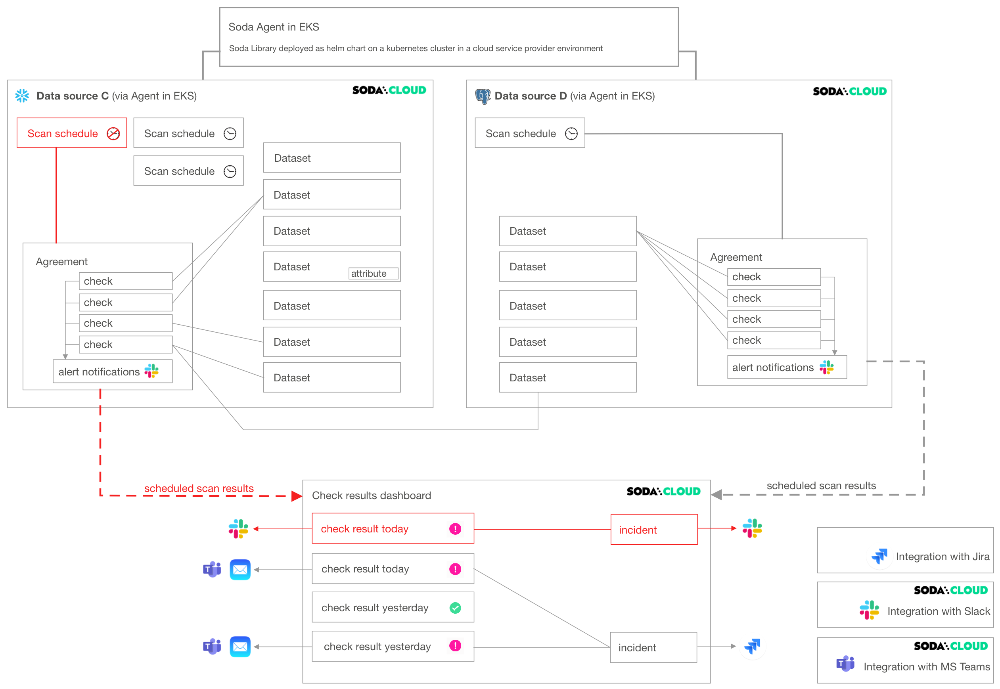
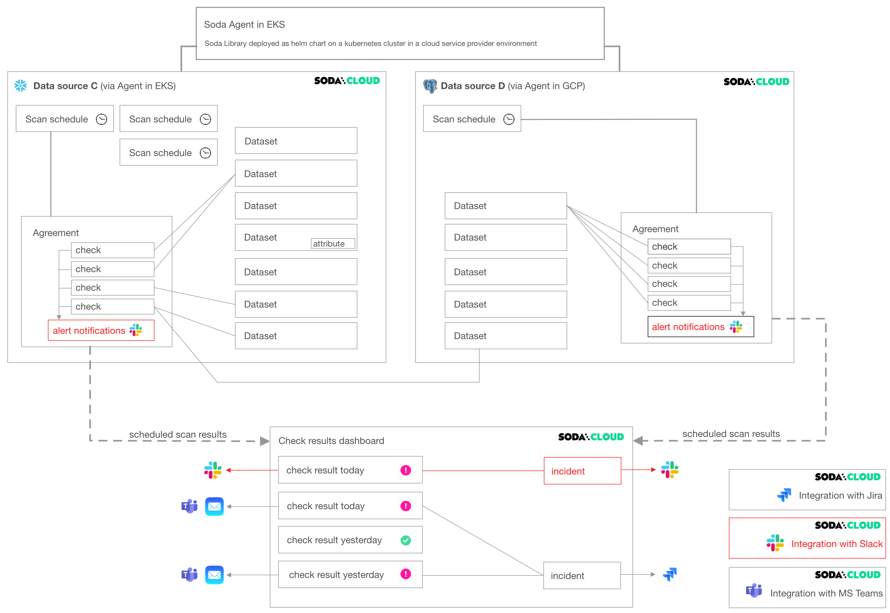
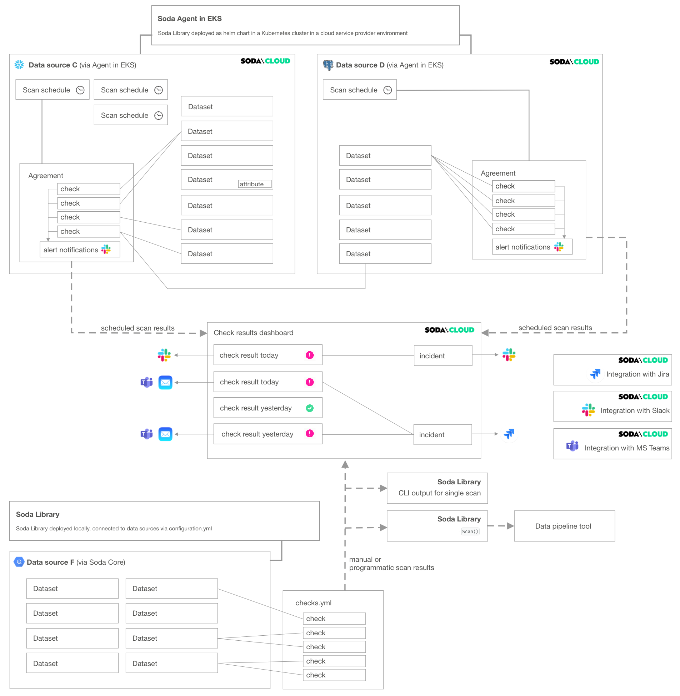

# Soda architecture

Your Soda architecture depends upon the flavor of Soda (deployment model) you chose when you set up your environment. The following offers a high-level view of the architecture of a few flavors of Soda.

## Self-operated deployment

This deployment model is a simple setup in which you install Soda Library locally and connect it to Soda Cloud via API keys.

<figure><figcaption></figcaption></figure>

**Soda Library** connects to data sources and performs scans of each dataset in a data source. When you connect Soda Library to a **Soda Cloud** account, it pushes scan results to Soda Cloud where users in your organization can view check results, access Cloud Metric Store data, and integrate with Slack to investigate data quality Incidents.

When Soda Library completes a scan, it uses a secure API to push the results to your Soda Cloud account where you can log in and examine the details in the web application. Notably, Soda Library only pushes _metadata_ to Soda Cloud, barring any failed rows you explicity instruct Soda Library to send to Soda Cloud. By default all your data stays inside your private network. See [Data security and privacy](data-privacy.md).

<figure><figcaption></figcaption></figure>

You can use checks to view samples of data that [failed a check](../run-a-scan/failed-row-samples.md), and track data quality over time. Soda Cloud stores your scan results and prepares charts that represent the volume of failed checks in each scan. These visualizations of your scan results enable you to see where your data quality is improving or deteriorating over time.

## Soda-hosted agent deployment

This deployment model provides a secure, out-of-the-box Soda Agent to manage access to data sources from within your Soda Cloud account. Quickly configure connections to your data sources in the Soda Cloud user interface, then empower all your colleagues to explore datasets, access check results, customize collections, and create their own no-code checks for data quality. Soda-hosted agent supports connections to BigQuery, Databricks SQL, MS SQL Server, MySQL, PostgreSQL, Redshift, and Snowflake data sources.

<figure><figcaption></figcaption></figure>

## Self-hosted agent deployment

This deployment model enables a data or infrastructure engineer to deploy Soda Library as an agent in a Kubernetes cluster within a cloud-services environment such as Google Cloud Platform, Azure, or AWS.

The engineer can manage access to data sources while giving Soda Cloud end-users easy access to Soda check results and enabling to write their own checks for data quality. Users connect to data sources and write checks for data quality directly in the Soda Cloud user interface.

<figure><figcaption></figcaption></figure>

## Soda Cloud resources

Soda Cloud is made up of several parts, or **resources**, that work together to define checks, execute scans, and display results that help you gauge the quality and reliability of your data.

It is helpful to understand these resources and how they relate, or connect, to each other if you are establishing [role-based access rules](../collaborate/roles-global.md) for your organization’s Soda Cloud account, or if you are planning to delete an existing resource.

The following diagram illustrates an example deployment of a single Soda Cloud account with two Soda Agents, each of which connects to two data sources. A Soda Cloud Administrator has also created integrations with Slack, Jira (via a webhook), and MS Teams.

<figure><figcaption></figcaption></figure>

* A **Soda Agent** is Soda Library that has been deployed in Kubernetes cluster in a cloud services provider environment. It enables Soda Cloud users to securely connect to data sources such as Snowflake, BigQuery, and PostgreSQL.

> [Read more](basics.md) about Soda Agent.

* A **data source** in Soda Cloud is a representation of the connection to your data source. Notably, it does not contain any of your data<sup>†</sup>, only data source metadata that it uses to check for data quality.

> [Read more](../quick-start-sip/deploy.md#add-a-new-data-source) about adding new data sources.

Within the context of Soda Cloud, a data source contains:

* **datasets** which represent tabular structures with rows and columns in your data source; like data sources, they do not contain your data<sup>†</sup>, only metadata. Datasets can contain user-defined **attributes** that help filter and organize check results.
* **scan definitions**, sometimes referred to as a scan schedule, which you use to define a Soda scan execution schedule for the data source.
* **agreements** in which you write **checks** to define what good data looks like. Agreements also specify where to send alert notifications when a check result warns or fails, such as to a Slack channel in your organization.
* An **integration** is a built-in Soda Cloud feature that enables you to connect with a third-party service provider, such as Slack.
* A **notification rule** is a tool to bulk-edit where and when to send alert notifications when check results warn or fail.

> [Read more](../collaborate/notif-rules.md) about notification rules.

<sup>†</sup> An exception to this rule exists when you configure Soda Cloud to collect sample data from a dataset, or samples of failed rows from a dataset when a check result fails.

## Delete resources

As the example deployment diagram illustrates, the different resources in Soda Cloud have several connections to each other. You can responsibly delete resources in Soda Cloud -- it warns you about the relevant impact before executing a deletion! -- but it may help to visualize the impact a deletion may have on your deployment before proceeding.

The following non-exhaustive list of example deletions serve to illustrate the potential impact of deleting.

### Delete a dataset

Deleting a dataset affects individual checks defined inside an agreement. If you have multiple agreements which contain checks against a particular dataset, all of those checks, and consequently the agreements they are in, are impacted when you delete a dataset. Further, if the dataset contains attributes, those attributes disappear with the dataset upon deletion.

<figure><figcaption></figcaption></figure>

### Delete a data source

Deleting a data source affects many other resources in Soda Cloud. As the following diagram illustrates, when you delete a data source, you delete all its datasets, scan definitions, agreements, and the checks in the agreements.

If an agreement contains a [cross check](../sodacl-reference/cross-row-checks.md) that compares the row count of datasets between data sources (as does the agreement in Data source C in the diagram), deleting a data source affects more than the checks and agreements it contains.

<figure><figcaption></figcaption></figure>

### Delete a scan definition

Deleting a scan definition has the potential to impact multiple agreements in a data source. Among other things, the scan definition defines the cadence that Soda Cloud uses to execute scans of data in the data source.

Soda does not scan any agreements that reference a deleted scan definition. Consequently, your **Checks** dashboard in Soda Cloud no longer displays checks for the agreement, nor would Soda Cloud send alert notifications.

<figure><figcaption></figcaption></figure>

### Delete an integration

A Soda Cloud Administrator has the ability to add, edit, and delete integrations with third-party service providers.

As the example diagram indicates, deleting a Slack integration prevents Soda Cloud from sending alert notifications to Slack when check results warn or fail, and prevents users from connecting an [incident](broken-reference) to a Slack channel to collaborate on data quality issue resolution.

<figure><figcaption></figcaption></figure>

## Example combination deployment

If your Soda Cloud account is also connected to Soda Library, your deployment may resemble something like the following diagram.

Note that you can delete resources that appear in Soda Cloud as a result of a manual or programmatic Soda Library scan. However, unless you delete the reference to the resource at its source – the `checks.yml` file or `configuration.yml` file – the resource will reappear in Soda Cloud when Soda Library sends its next set of scan results.

For example, imagine you use Soda Library to run scans and send results to Soda Cloud. In the `checks.yml` file that you use to define your checks, you have the following configuration:

```yaml
checks for dataset-q:
  - missing_count(last_name) < 10
```

In Soda Cloud, you can see `dataset-q` because Soda Library pushed the scan results to Soda Cloud which resulted in the creation of a resource for that dataset. In Soda Cloud, you can use the UI to delete `dataset-q`, but unless you also remove the `checks for dataset-q` configuration from your `checks.yml` file, the dataset reappears in Soda Cloud the next time you run a scan.

<figure><figcaption></figcaption></figure>

## Go further

* Create a Soda Cloud account at [cloud.soda.io](https://cloud.soda.io/signup).
* As a business user, learn how to write SodaCL checks in [agreements](../soda-cl-overview/#define-sodacl-checks) in Soda Cloud.
* Learn more about viewing [failed row samples](../run-a-scan/failed-row-samples.md) in Soda Cloud.


