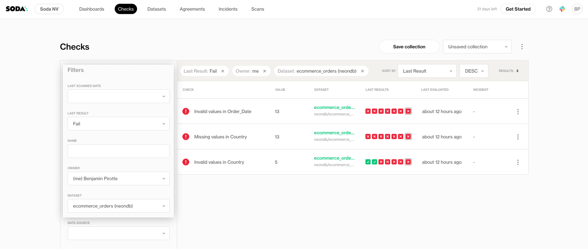
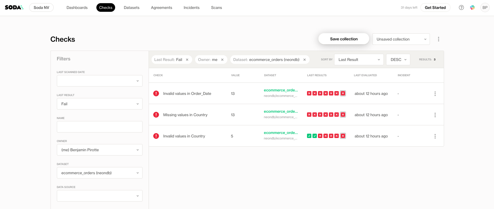

# Browse Checks

The **Checks** page displays all checks defined in a data contract and tracked in Soda Cloud. It provides a quick overview of check health across datasets, allowing you to create **custom groupings** by applying filters such as data source, dataset, owners, or status (pass, fail, warning). This helps you focus on specific areas or teams that matter most.

You can also review key details like the check type, the dataset it belongs to, and the time of the last scan. Use the search bar to quickly find a specific check by name, and sort the list by name, last run time, or check status.

You can filter checks by properties such as data source, dataset, owners, attributes, or status (pass, fail, warning). Use the search bar to quickly find a specific check by name.

_Learn more about custom attributes:_ [check-and-dataset-attributes.md](check-and-dataset-attributes.md "mention")

<figure><figcaption></figcaption></figure>

You can also sort the list by name, last run time, or check status.

<figure><figcaption></figcaption></figure>

## Customize your check view

You can tailor the Checks view to focus on the areas that matter most to you:

1. Use the filter options to narrow down the view
2. Click the **Save Dashboard** button to store your current filter configuration as a **collection**.

<figure><figcaption></figcaption></figure>

3. Enter a name for the collection and click Save

<figure><figcaption></figcaption></figure>

4. Once saved, your collection will be available in the dropdown at the top right of the dashboard. Simply select it to switch views.

<figure><figcaption></figcaption></figure>

5. Use the context menu next to the collection name to:

* **Delete** the collection if it’s no longer needed.
* **Share** the collection with others in your organization.

<figure><figcaption></figcaption></figure>
