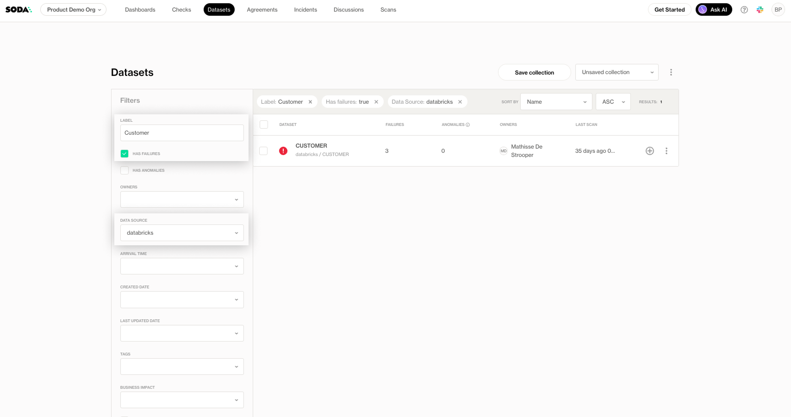
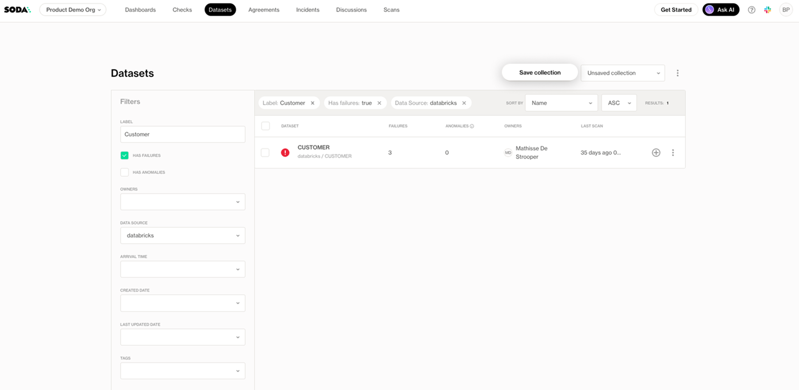

# Browse Datasets

The **Datasets** page displays all datasets that have been onboarded into Soda Cloud—either through publishing a contract or via the onboarding process:  [onboard-datasets-on-soda-cloud](../onboard-datasets-on-soda-cloud/ "mention") .

It provides a quick overview of each dataset’s health, showing at a glance if a dataset has issues, how many checks from its contract are failing, how many anomalies were detected through metric monitoring, and when the last scan was executed.

You can filter datasets by properties like data source, owners, arrival time, attributes, or flags such as failures or anomalies. Use the search bar to quickly find a specific dataset by name, and sort the list by name, creation time, or data quality status.

Learn more about custom attributes:  [dataset-attributes-and-responsibilities.md](../dataset-attributes-and-responsibilities.md "mention")

<figure><figcaption></figcaption></figure>

You can also sort the datasets list by name, creation date, check failures, or anomalies to prioritize your focus.

<figure><figcaption></figcaption></figure>

## Customize your datasets' view

You can tailor the Datasets view to focus on the areas that matter most to you:

1. Use the filter options to narrow down the view
2. Click the **Save Dashboard** button to store your current filter configuration as a **collection**.

<figure><figcaption></figcaption></figure>

3. Enter a name for the collection and click **Save**

<figure><figcaption></figcaption></figure>

4. Once saved, your collection will be available in the dropdown at the top right of the dashboard. Simply select it to switch views.

<figure><figcaption></figcaption></figure>

5. Use the context menu next to the collection name to:

<figure><figcaption></figcaption></figure>

* **Delete** the collection if it’s no longer needed.
* **Share** the collection with others in your organization.
