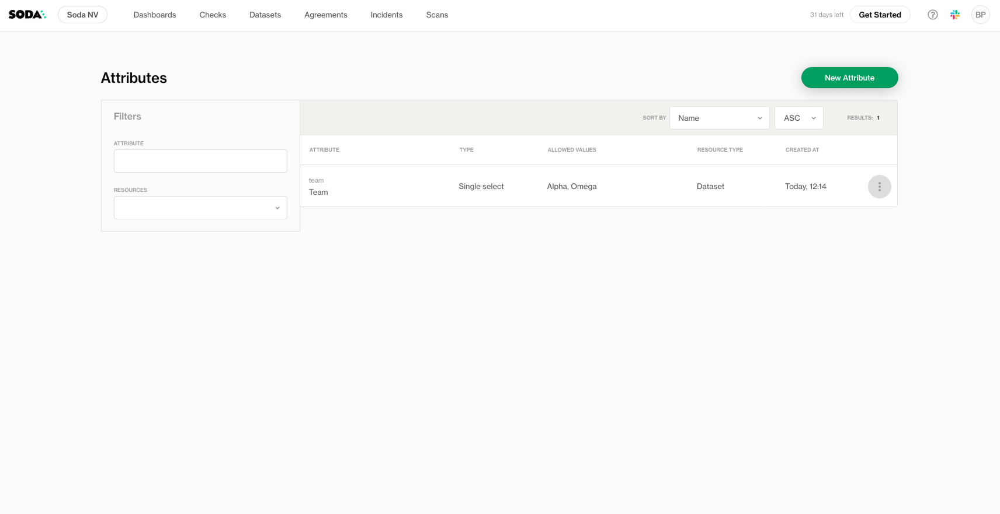
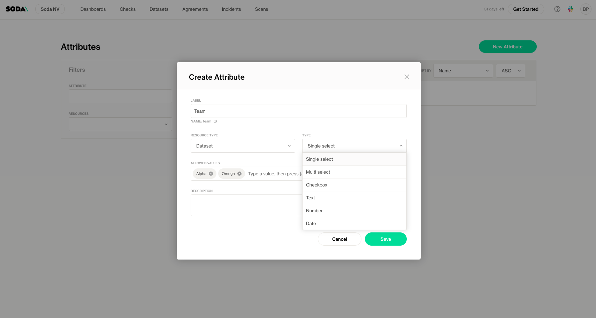
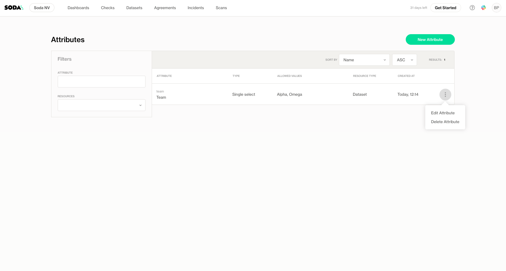

# Check and dataset attributes

Attributes allow you to add descriptive **metadata** to your datasets and checks. This metadata can then be:

* **Used for filtering** in Soda Cloud, making it easier to search and organize datasets and checks based on specific criteria (e.g., business domain, sensitivity, criticality).
* **Leveraged in reporting**, enabling you to group datasets, track ownership, and monitor data quality across different categories or dimensions.

Adding meaningful attributes enhances discoverability, governance, and collaboration within Soda and its integrations.

## Creating an Attribute


Only users with the **Manage Attributes** permission can create or edit attributes. [global-and-dataset-roles.md](../organization-and-admin-settings/global-and-dataset-roles.md "mention")


To create a new attribute:

1. Click your profile icon in the top-right corner and select **Attributes** from the menu.

<figure><figcaption></figcaption></figure>

2. Click **New Attribute**.

<figure><figcaption></figcaption></figure>

3. Provide a **Label** for the attribute. Note that a unique **name** will be generated from this label. This name is immutable and is used in Data Contract definitions to reference the attribute.

<figure><figcaption></figcaption></figure>

4. Select the **Resource Type** where the attribute applies: **Dataset or Check**

<figure><figcaption></figcaption></figure>

5. Choose the **Type** of attribute: Single select, Multi select, Checkbox, Text, Number, Date

<figure><figcaption></figcaption></figure>

4. Add a **Description** for context.
5. Click Save

## Edit attributes

To edit an attribute, use the context menu next to the attribute name and select **Edit Attribute**.

<figure><figcaption></figcaption></figure>

Note that the name property and the assigned resource type cannot be changed.

## Attributes in Datasets

Learn how to set attributes for datasets: [dataset-attributes-and-responsibilities.md](../dataset-attributes-and-responsibilities.md "mention")

## Attributes in Checks

Attributes for checks will be defined as part of the **Data Contract**.&#x20;

Learn how to set attributes for datasets:&#x20;

* Authoring in Soda Cloud: [#define-attributes](../data-testing/cloud-managed-data-contracts/author-a-contract-in-soda-cloud.md#define-attributes "mention")
* Data Contract as code: [#check-attributes](../reference/contract-language-reference.md#check-attributes "mention")

## Attributes in Filters

Once an attribute has been assigned at least once, either to a dataset or a check, it becomes available as a filter in Soda Cloud. Attributes that have not yet been used will not appear in filter options.

<figure><figcaption></figcaption></figure>
