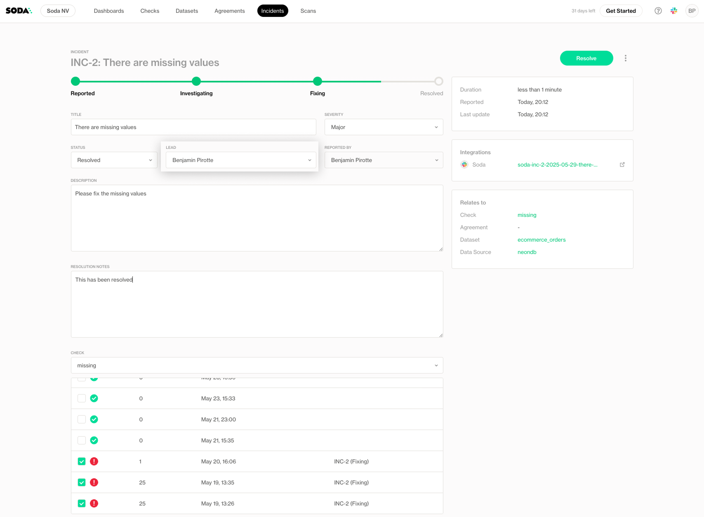
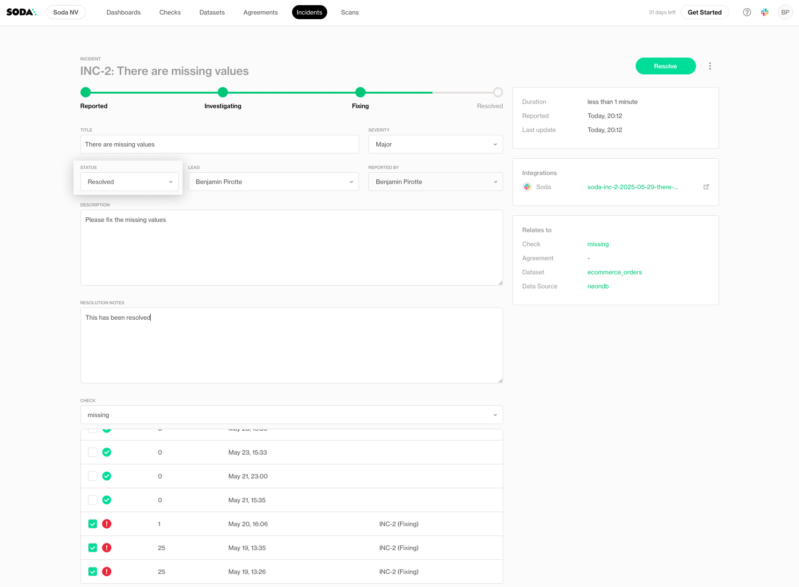
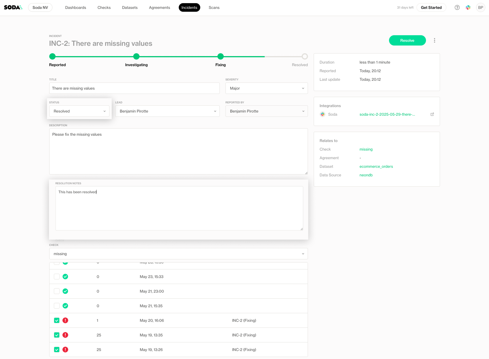
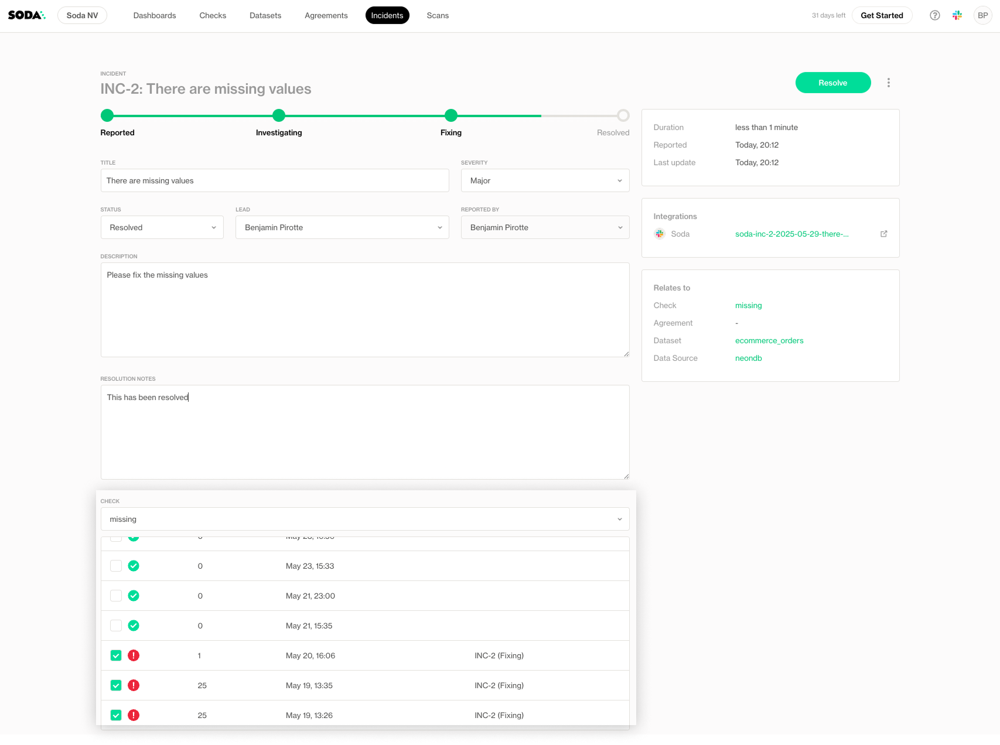
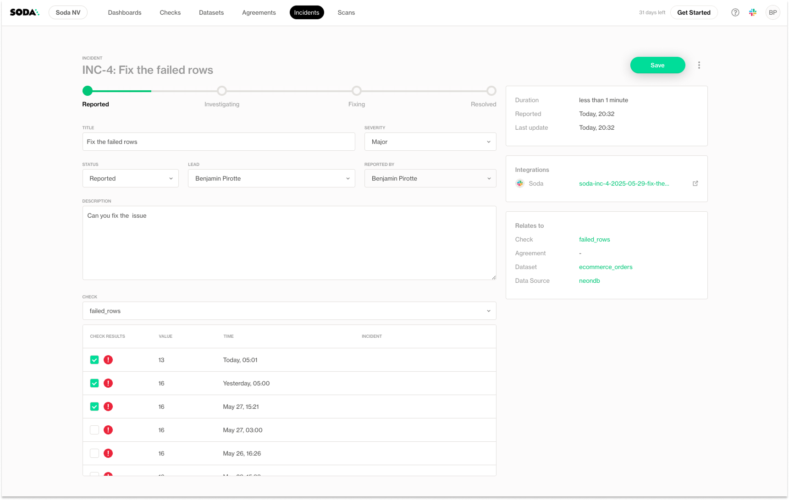
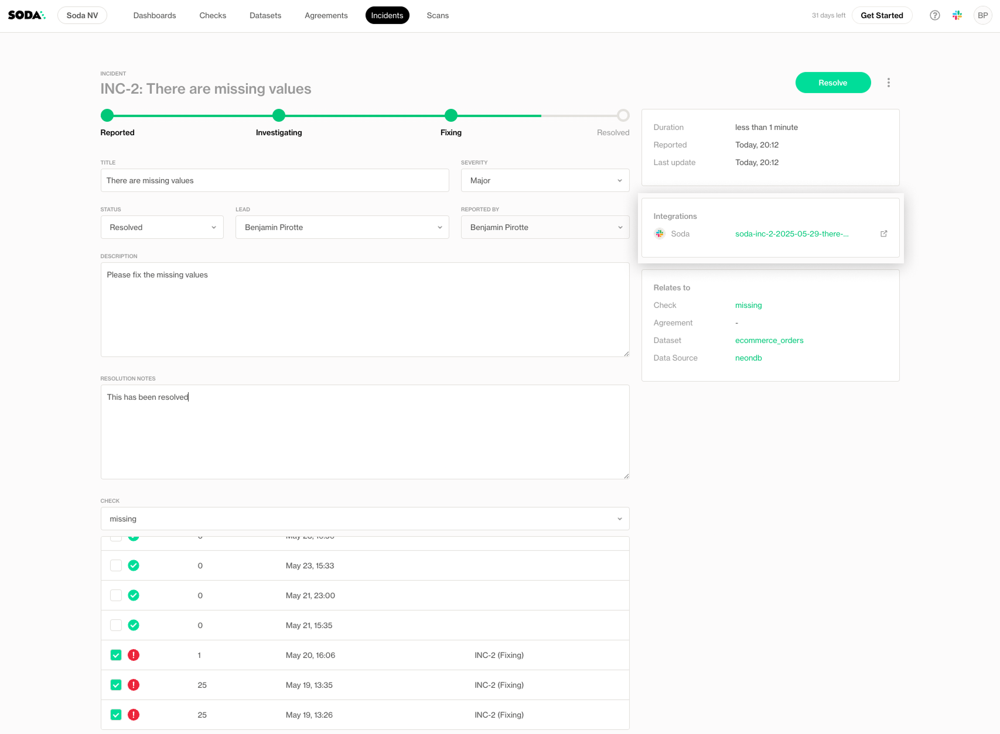

# Incidents

Incidents help you track, investigate, and resolve data quality issues when they occur. An incident is created when a data issue, such as a failed or warning check, has been confirmed and assigned to someone for resolution.

To create or update an incident, the user has to have "Manage Incidents" on the related dataset.

## Creating an Incident


Only users with the **Manage Incidents** permission for the dataset can create or edit incidents. All users with access to the dataset can view existing incidents. Read about [global-and-dataset-roles.md](../organization-and-admin-settings/global-and-dataset-roles.md "mention")


You can create an incident directly from a check result when an issue has been identified:

1. On a check page, use the **context menu** to select **Create Incident**.

<figure><figcaption></figcaption></figure>

2. Provide a **name** and **description** for the incident.

<figure><figcaption></figcaption></figure>

3. Select one or multiple related check results that you want to associate with the incident.

<figure><figcaption></figcaption></figure>

4. Click **Save** to proceed

## View incidents for a dataset

Once created, the incident will appear in the **Incidents tab** of the corresponding **Dataset Page**

It is possible to filter incidents based on lead, status, reporter, and severity.

<figure><figcaption></figcaption></figure>

## View incidents across the organization

Incidents can also be seen in a central place in Soda Cloud. In the top navigation, click on Incidents to see all the incidents of the organization.

Use the filters and the title search to find relevant incidents.

<figure><figcaption></figcaption></figure>

## Updating an Incident

**Assign a lead**: Every incident requires a **lead:** the user responsible for resolving the issue.

<figure><figcaption></figcaption></figure>

**Update status**: Track progress by updating the incident’s status as the investigation and resolution evolve.

<figure><figcaption></figcaption></figure>

**Add a resolution note**: When marking an incident as **resolved**, a resolution note is mandatory to document what was done.

<figure><figcaption></figcaption></figure>

**Include more check results**: If new results are failing, you can include them in the incident.

<figure><figcaption></figcaption></figure>

After any changes, click **Save** to apply them.

<figure><figcaption></figcaption></figure>

## Integration with External Systems

You can integrate incidents with Slack, MS Teams, or other external systems using Soda’s **webhook** capabilities or the **Incidents API**. Learn on how to integrate with Soda: [integrations](../integrations/ "mention")

<figure><figcaption></figcaption></figure>
