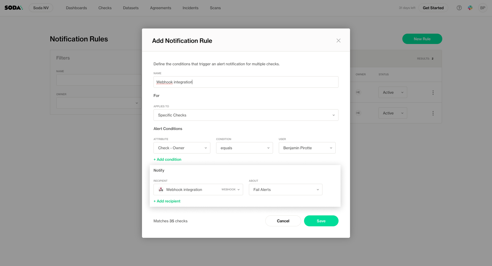
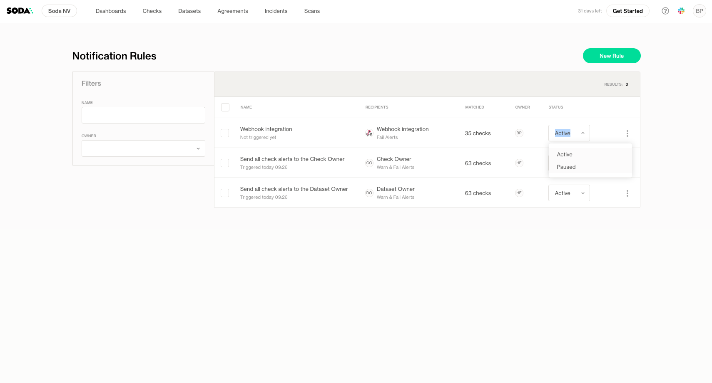

# Notifications

Soda’s **notification system** helps you stay informed when data issues occur—whether it’s a failed check or an anomaly detected through metric monitoring. Notifications are dynamically dispatched using **notification rules**, allowing you to target alerts based on specific properties, attributes, or datasets.

## How Notification Rules Work

Notification rules define **when** and **to whom** a notification is sent. Rules can be configured to match specific checks or anomalies, ensuring the right people are notified at the right time.

## Creating a Notification Rule


Only users with the **Manage Notification Rules** permission can create or edit rules. All users can view rules. Read about [global-and-dataset-roles.md](../organization-and-admin-settings/global-and-dataset-roles.md "mention")


To create a new notification rule:

1. Click on your profile in Soda Cloud and select **Notification Rules** from the menu.

<figure><figcaption></figcaption></figure>

2. Click **New Rule**.

<figure><figcaption></figcaption></figure>

3. Provide a **name** for the rule.

<figure><figcaption></figcaption></figure>

4. Define the Rule Scope

**Checks**:

* **All checks**: The rule applies to every check in your organization.
* **Specific checks**: Build custom rules by filtering on check properties, dataset properties, or attributes.

<figure><figcaption></figcaption></figure>

* **Anomalies from Metric Monitoring**: Select specific datasets where the rule applies.

<figure><figcaption></figcaption></figure>

5. Define the **recipients** (users, groups, or integrations like Slack, Teams, or webhooks).

<figure><figcaption></figcaption></figure>

6. ...and choose the **alert type (only applicable for checks, not anomalies)**:

* **Only failures**
* **Failures and warnings**
* **All statuses**

7. **Save** to create the notification rule

***

## Pausing Notification Rules

You can **pause a notification rule** at any time to temporarily disable alerts without deleting the rule.

<figure><figcaption></figcaption></figure>
