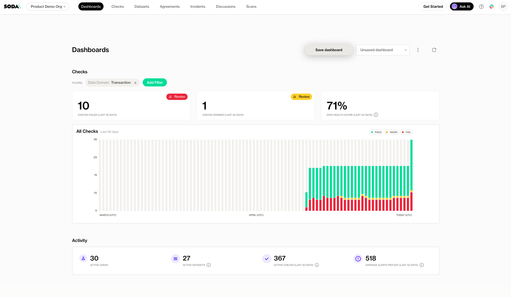

# Organization dashboard

The **Organization Dashboard** provides a high-level overview of your data quality across datasets and checks in Soda Cloud. It shows key trends over time, such as the number of checks that are passing, failing, or in a warning state, helping you identify issues early.

You’ll also find key metrics, including:

* **Scans in failed mode**: Datasets that are currently blocked due to failing checks.
* **Checks currently failing**: Active checks that need attention.
* **Overall Health Score**: The number of failing checks out of the total number of checks

These insights allow you to quickly identify where action is needed.

<figure><figcaption></figcaption></figure>

## **Customize your dashboard**

You can tailor the Organization Dashboard to focus on the areas that matter most to you:

1. **Apply filters based on attributes**: Use the filter options to narrow down the view by attributes

<figure><figcaption></figcaption></figure>

2. Click the **Save Dashboard** button to store your current filter configuration as a **collection**.

<figure><figcaption></figcaption></figure>

3. Enter a name for the collection and click Save

<figure><figcaption></figcaption></figure>

4. Once saved, your collection will be available in the dropdown at the top right of the dashboard. Simply select it to switch views.

<figure><figcaption></figcaption></figure>

5. Use the context menu next to the collection name to:

* **Delete** the collection if it’s no longer needed.
* **Share** the collection with others in your organization.

## Activity section

The **Activity section** offers insights into how Soda is being used across your organization. It tracks adoption metrics, such as active users, active checks, active datasets, and the number of alerts in the last 90 days.

#### Custom Dashboards

In addition to the built-in dashboards in Soda Cloud, you can build **custom dashboards** tailored to your organization’s specific needs. By leveraging the **Soda REST API**, you can programmatically retrieve data quality metrics, check results, and incident details, and integrate them into external dashboarding tools such as Power BI, Tableau, or Looker.

This enables you to create tailored views and reports that align with your business logic and audience, ensuring stakeholders get the right insights in the tools they already use.

Learn more on [https://docs.soda.io/api-docs/public-cloud-api-v1.html](https://docs.soda.io/api-docs/public-cloud-api-v1.html)
