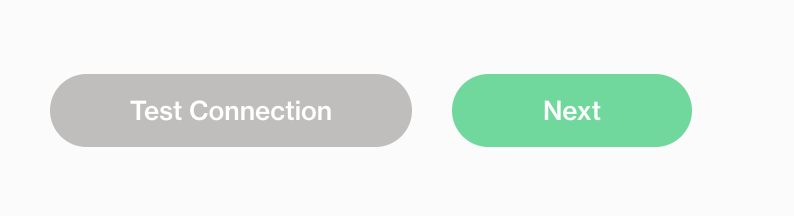
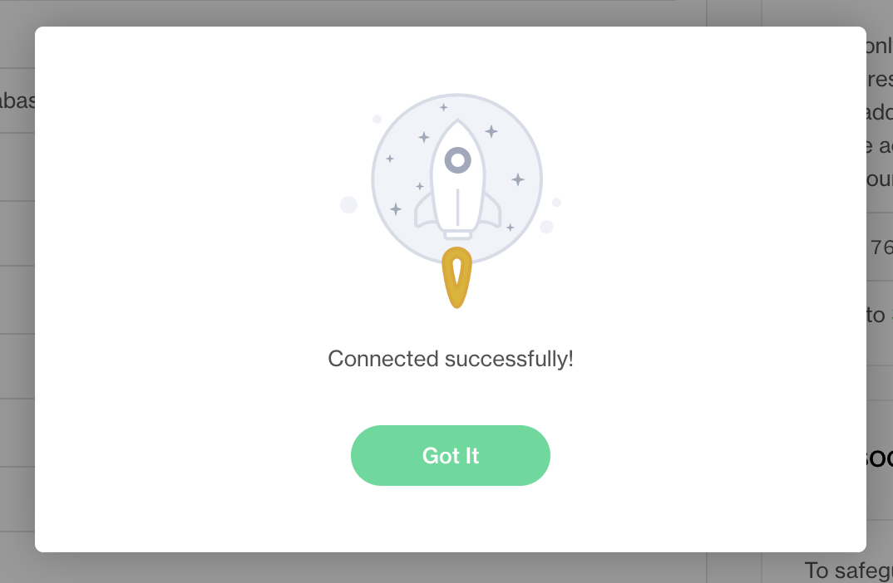
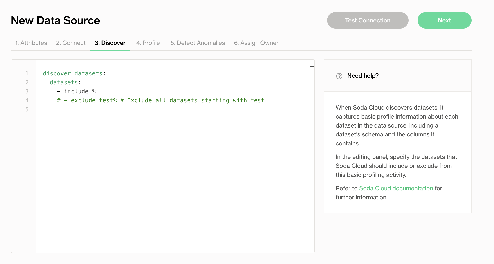
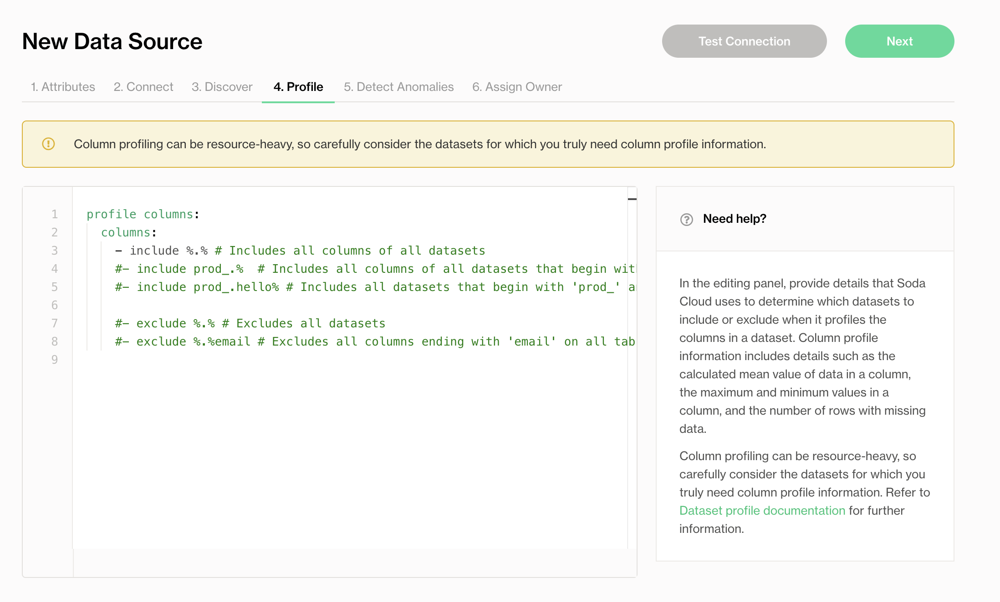
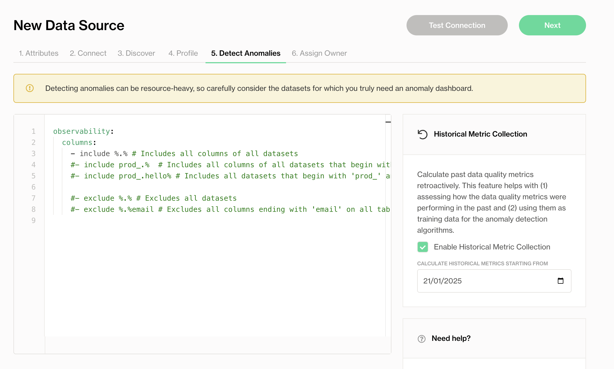
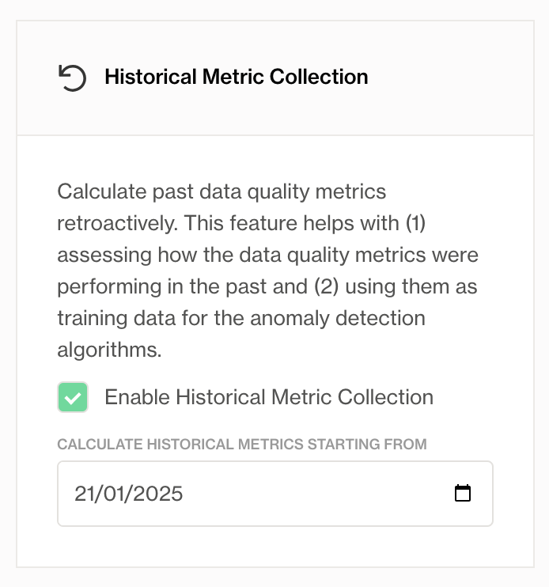
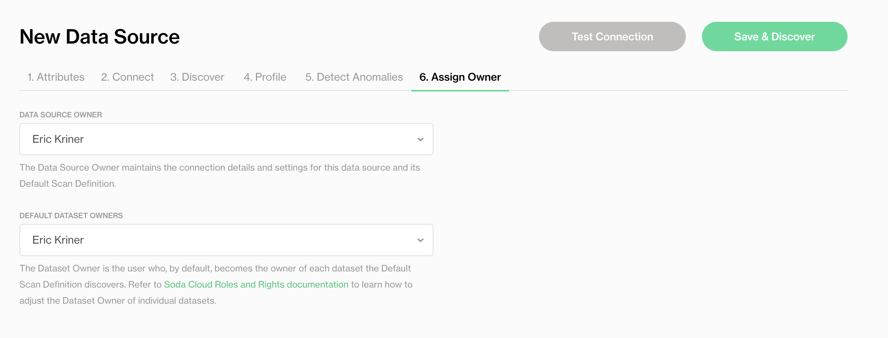
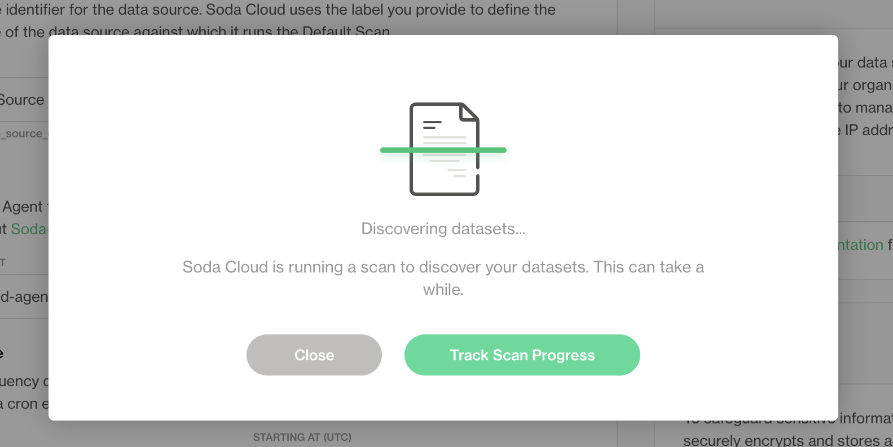

# Get Started
*Last modified on *

This guide walks you through how to add a data source and get started with observability on a single dataset as quick as possible.

You will:

- Connect a data source
- Configure your first dataset to enable observability

> 💡 We recommend enabling observability for a single dataset that updates daily and has been in use for a while. This gives you more meaningful results, faster.
> 
> You can always update or remove the data source later—this is just a test connection to explore the platform.
> 

## Step 1: Add a Data Source

1. In Soda Cloud, go to **your avatar** > **Data Sources**.
2. Click **New Data Source**, then follow the guided steps to create the connection. Use the table below to understand what each field means and how to complete it:
3. Complete the connection configuration. These settings are specific to each data source (PostgreSQL, MySQL, Snowflake, etc) and usually include connection details such as host, port, credentials, and database name.

### New Data Source Attributes

| **Field or Label**                        | **Guidance**                                                                                                                                                                                                                                                                                                                                                         |
|------------------------------------------|---------------------------------------------------------------------------------------------------------------------------------------------------------------------------------------------------------------------------------------------------------------------------------------------------------------------------------------------------------------------|
| Data Source Label                        | Provide a unique identifier for the data source. Soda Cloud uses the label you provide to define the immutable name of the data source against which it runs the Default Scan.                                                                                                                                                                                       |
| Agent                                    | Select the Soda-hosted agent, or the name of a Soda Agent that you have previously set up in your secure environment. This identifies the Soda Agent to which Soda Cloud must connect in order to run its scan.                                                                                                                                                     |
| Check Schedule                           | Provide the scan frequency details Soda Cloud uses to execute scans according to your needs. If you wish, you can define the schedule as a cron expression.                                                                                                                                                                                                          |
| Starting At (UTC)                        | Select the time of day to run the scan. The default value is midnight.                                                                                                                                                                                                                                                                                               |
| Custom Cron Expression                   | (Optional) Write your own cron expression to define the schedule Soda Cloud uses to run scans.                                                                                                                                                                                                                                                                       |
| Column Profiling Scan Schedule           | Specify the time of day at which Soda runs the Automation scan.                                                                                                                                                                                                                                                                                                      |
| Automation Scan Schedule                 | Specify the time of day at which Soda runs the daily anomaly dashboard scan.                                                                                                                                                                                                                                                                                         |
| Partition column suggestion - Optional   | Add any amount of partition column suggestions. If a suggested column name fully matches a column discovered during metric monitoring or profiling, that column will be used as the partition column. The order of the suggested columns matters, as they will be checked sequentially from top to bottom until a match is found. If no match is found, heuristics will be applied to determine the partition column. You can change the partition column at any time in the dataset settings. |

Add any amount of partition column suggestions. If a suggested column name fully matches a column discovered during metric monitoring or profiling, that column will be used as the partition column. The order of the suggested columns matters, as they will be checked sequentially from top to bottom until a match is found. If no match is found, heuristics will be applied to determine the partition column. You can change the partition column at any time in the dataset settings.

Use the appropriate guide below to complete the connection:

## Step 2: Test Data Source Connection

Click **Test Connection** at the top to verify that all connection settings are configured correctly.

If everything is configured properly, you’ll see a success screen like the one below.

## Step 3: Configure Dataset Discovery, Profiling and Anomaly Detection

In this step, you define which datasets and columns Soda will monitor, and enable anomaly detection to automatically surface issues.

### 3.1 Dataset Discovery

Dataset discovery collects metadata about each dataset, including its schema and the data types of each column.

Specify the datasets you want to profile. Because dataset discovery can be resource-intensive, only include datasets that are important for observability.

See [Compute consumption and cost considerations](https://deploy-preview-947--jovial-piroshki-65ff4d.netlify.app/soda-cl/profile#compute-consumption-and-cost-considerations) for more detail.

### 3.2 Column Profiling

Column profiling captures metrics such as the mean, minimum, and maximum values in a column, as well as the number of missing values.

Use include/exclude patterns to specify which columns Soda should profile. These metrics feed into the anomaly dashboard.

By default, Soda includes all datasets in the data source. If you’re just testing the functionality, you can leave the default settings and click Next to continue.

### 3.3 Anomaly Detection

In the Detect Anomalies tab, define which datasets should be monitored for anomalies like schema changes or unusual metric behavior.

Use include/exclude filters to specify the datasets to monitor with Metric Monitors.

You can also enable historical metric collection to calculate past metrics and provide training data for the anomaly detection engine. This helps with:

1. Assessing how the data quality metrics were performing in the past.
2. Using them as training data for the anomaly detection algorithms.

## Step 4: Assign a Data Source and Dataset Owner

Assign responsibility for maintaining the data source and each dataset.

- **Data Source Owner:** Manages the connection settings and scan configurations for the data source.
- **Dataset Owner:** Becomes the default owner of each dataset for monitoring and collaboration.

For more details, see [Roles and rights in Soda Cloud](https://deploy-preview-947--jovial-piroshki-65ff4d.netlify.app/soda-cloud/roles-global).

## Step 5: Test Connection and Save

- Click **Test Connection** to verify your configuration.
- Click **Save** to start profiling the selected datasets.

Once saved, Soda runs a first scan using your profiling settings. This initial scan provides baseline measurements that Soda uses to begin learning patterns and identifying anomalies.