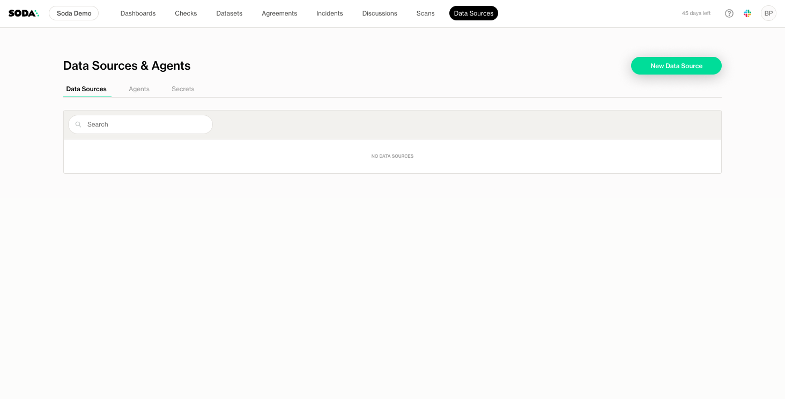

# Onboard datasets on Soda Cloud

## Step 1: Connect a data source

Before you can define contracts, you need to connect Soda Cloud to your data source. This allows Soda to access your datasets for profiling, metric monitoring, and contract verification.

### 1.1 Navigate to the Data Sources page

From the top navigation bar in Soda Cloud, click **Data Sources**.

On this page, you’ll see a list of connected sources and an **Add Data Source** button.

<figure><figcaption></figcaption></figure>


You need the "**Manage data sources**" global permission to add a new data source.

Learn more about [global-and-dataset-roles.md](../organization-and-admin-settings/global-and-dataset-roles.md "mention")


### 1.2 Add a new Data Source

Click **Add Data Source** and select your data source from the list of supported data source types.

<figure><figcaption></figcaption></figure>

After selecting a source, you’ll be presented with a configuration form.

<figure><figcaption></figcaption></figure>

#### **1.2.1 Data source label**

Enter a friendly, unique label. A unique name will be automatically generated from this label. This becomes the immutable ID of the data source and can also be used to reference the same connection in Soda Core.

#### **1.2.2 Choose your agent**

You’ll be asked to select an agent. This is the component that connects to your data source and runs scans.

You can choose from:

* **Soda-hosted agent** – Quickest option, fully managed by Soda (recommended for getting started)
* **Self-hosted agent** – For custom or secure deployments where you manage the agent yourself

> Learn more about deployment options: [deployment-options](../deployment-options/ "mention")

#### **1.2.3 Secure your credentials with secrets**

You’ll need to fill in the connection details. Soda uses the **official Python packages** for each supported data source, which means you can define any properties required by those libraries, flexibly and reliably.

This includes common fields like host, port, database name, username, and more, depending on the data source.

#### **1.2.4 Using secrets for sensitive credentials**

For sensitive values such as passwords, tokens, or keys, you should use **Soda Secrets** instead of entering them directly in the configuration.

* Secrets are **encrypted and securely stored** in Soda Cloud.
* They can be safely referenced in your data source configuration without exposing them in plain text.

To add secrets:

1. Navigate to the **Data Sources** tab in the top navigation.
2. Click the **Secrets** tab.
3. Define key-value pairs for your sensitive credentials.

You can then reference a secret in your data source configuration using this syntax:

```javascript
${secret.SECRET_NAME}
```

This ensures your sensitive values stay secure while still being accessible to the agent at runtime.

<figure><figcaption></figcaption></figure>

#### **1.2.5 Test and Connect**

Once the form is complete:

* Click **Test Connection** to validate that Soda can successfully connect to your data source.
* If the test passes, click **Connect** to finalize the setup.

<figure><figcaption></figcaption></figure>

## Step 2: Onboard Datasets

After connecting, Soda will prompt you to **onboard your datasets**.

You can:

* Select **all datasets** or just a **subset**
* Choose which schemas or tables to include
* Complete onboarding in just a few clicks

Once onboarded, datasets will appear in your Soda Cloud UI and become available for contract creation or metric monitoring.

<figure><figcaption></figcaption></figure>

## Step 3: Enable Metric Monitoring (optional)

Through Metric Monitoring, you can enable built-in monitors to automatically track row counts, schema changes, freshness, and more across your datasets. This step is optional but recommended. **This can be enabled in bulk when onboarding data sources and datasets**.

> Learn more about Metric Monitoring: [metric-monitoring-dashboard](../data-observability/metric-monitoring-dashboard/ "mention")

1. **Toggle on Metric Monitoring**

<figure><figcaption><p>Enable Metric Monitoring</p></figcaption></figure>

When metric monitoring is enabled it's possible to later add column monitors on dataset level or overwrite any of the settings.

2. Set a **Monitoring Schedule**

<figure><figcaption><p>Monitoring Schedule</p></figcaption></figure>

The monitoring schedule defines when Soda scans a dataset to capture and evaluate metrics. While scans may run slightly later due to system delays, Soda uses the **actual execution time,** not the scheduled time, when visualizing **time-sensitive metadata metrics** like insert lag or row count deltas. This ensures accuracy.

> Learn more about [how to pick a scan time](scan-time-and-scan-time-strategy.md).

Data-based metrics like averages or null rates are not affected by small delays, as Soda only scans complete partitions, keeping these metrics stable and reliable.


3. **Toggle on/off Historical Metric Collection**

<figure><figcaption></figcaption></figure>

When **Historical Metric Collection** is enabled, Soda automatically calculates past data quality metrics through backfilling and applies the anomaly detection algorithm to that historical data through backtesting. This gives you immediate visibility into past data quality issues, even before monitoring was activated. The historical data also helps train the anomaly detection algorithm, improving its accuracy from day one. You can specify a start date to control how far back the backfilling process should begin.

4. **Suggest a Time Partition Column**

<figure><figcaption></figcaption></figure>

Metrics that are not based on metadata require a **time partition column** to group data into daily intervals or 24-hour buckets, depending on the monitoring schedule. This column must be a **timestamp field**, ideally something like a `created_at` or `last_updated` column. It's important that this timestamp reflects **when the data arrives in the database**, rather than when the record was originally created.

Soda uses a list of **suggested time partition columns** to determine which column to apply. If multiple columns are suggested, Soda checks them **in the order they are listed**, starting with the first. It will try to match one by validating that the column is a proper timestamp and suitable for partitioning.

If none of the suggested columns match, Soda falls back to a **heuristic approach**. This heuristic looks at metadata, typical naming conventions, and column content to infer the most likely time partition column.

If the heuristic fails to find a suitable column or selects the wrong one, the time partition column can be manually configured under **dataset settings**.

<figure><figcaption></figcaption></figure>


Available monitors **will be enabled by default** based on the information on the datasets.


## Step 4: Access the datasets

Once completed, your data source will appear in the **Data Sources** list. You can click the **Onboarded Datasets** link to access the connected datasets.

<figure><figcaption></figcaption></figure>

🎉 **Congrats! You’ve successfully onboarded your data source.**\
You’re now ready to create data contracts and start monitoring the quality of your data.

***

## Onboard new datasets

Note that you can repeat the datasets onboarding process at any time to add more datasets from the same data source. Datasets that previously have been onboarded will not re-appear in the data selection step. Simply return to the data source page and click **Onboard Datasets** to update your selection.

<figure><figcaption></figcaption></figure>


You need the **Manage data sources** global permission to add a new data source. Learn about [global-and-dataset-roles.md](../organization-and-admin-settings/global-and-dataset-roles.md "mention")

