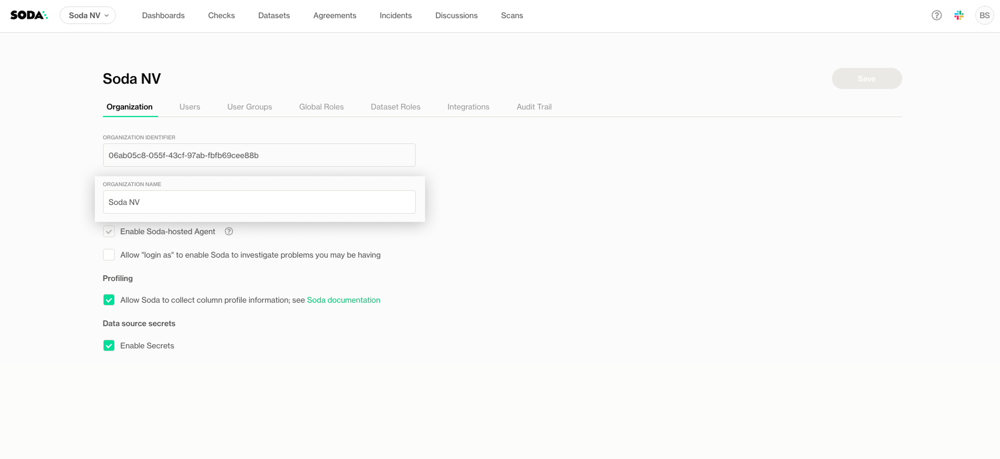
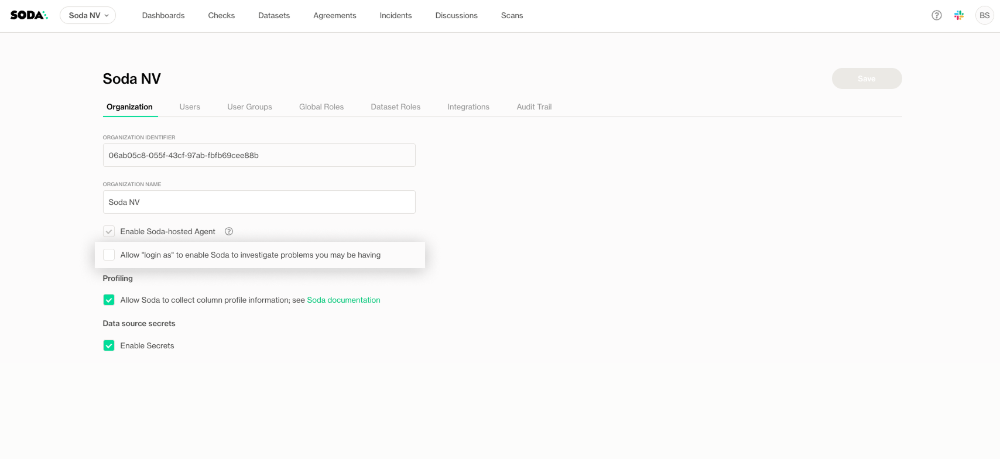
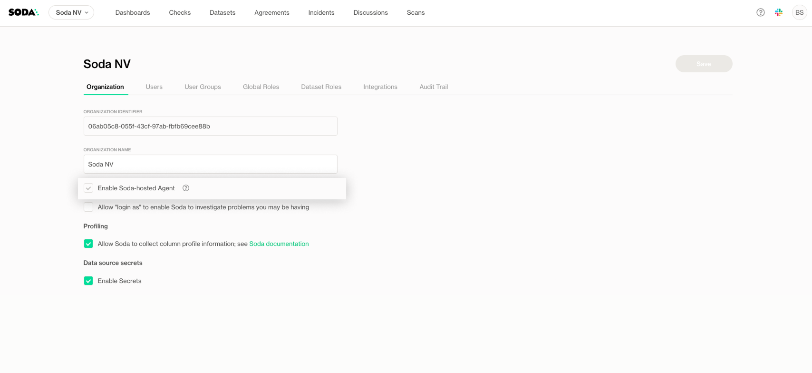
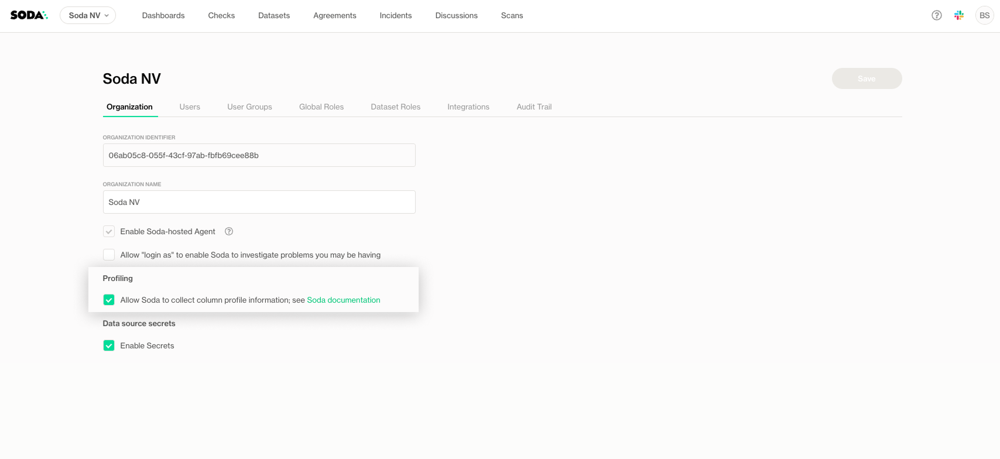

# General settings

The **General Settings** page allows you to configure foundational settings for your organization in Soda Cloud. These settings impact how your organization operates and how users interact with the platform.

## Organization Name

Set the name of your organization. This name appears throughout Soda Cloud, such as in dashboards, reports and notifications.

<figure><figcaption></figcaption></figure>

## Allow "Login As"

Enable the **Login As** feature to allow the Soda Support team to log in as an admin within your organization. This can be useful when troubleshooting issues or providing assistance.

<figure><figcaption></figcaption></figure>

## Enable or Disable the Soda-hosted Agent

You can choose whether to use the Soda-hosted Agent by enabling or disabling it in the Organization Settings:

* Toggle the **Soda-hosted Agent** option to **enable** or **disable** the agent for your organization.
* Disabling the agent prevents Soda Cloud from running scans or checks via the managed agent. You’ll need to use a self-hosted agent or Soda Core in your environment instead.

<figure><figcaption></figcaption></figure>

## Profiling Data Collection

By default, the Soda-hosted Agent collects profiling information (such as column-level statistics and schema details) to support features like dataset discovery and monitoring in Soda Cloud.

You can choose to disable profiling if you prefer not to send profiling data to Soda Cloud: Toggle the **Profiling Data Collection** option to **disable** profiling for your organization.

This ensures that no profiling information is collected or pushed to Soda Cloud. Only check results and metadata necessary for contract validation will be processed.

<figure><figcaption></figcaption></figure>

## Enable Data Source Secrets

Manage secure storage of secrets such as API keys, credentials or connection details. Secrets can be used in data source configurations, checks, and other automated processes.

For more information, see the [#id-1.-2.-3-secure-your-credentials-with-secrets](../onboard-datasets-on-soda-cloud/#id-1.-2.-3-secure-your-credentials-with-secrets "mention")
