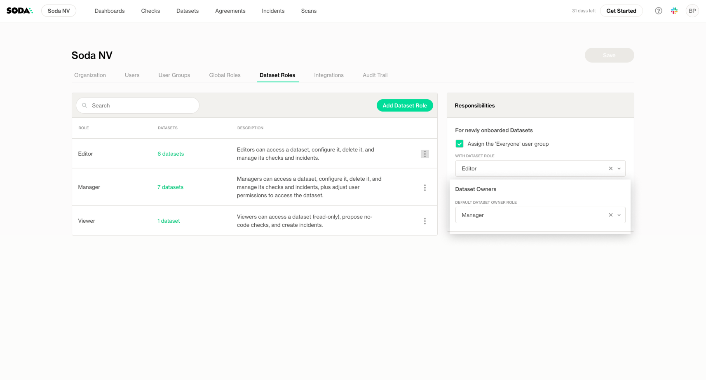
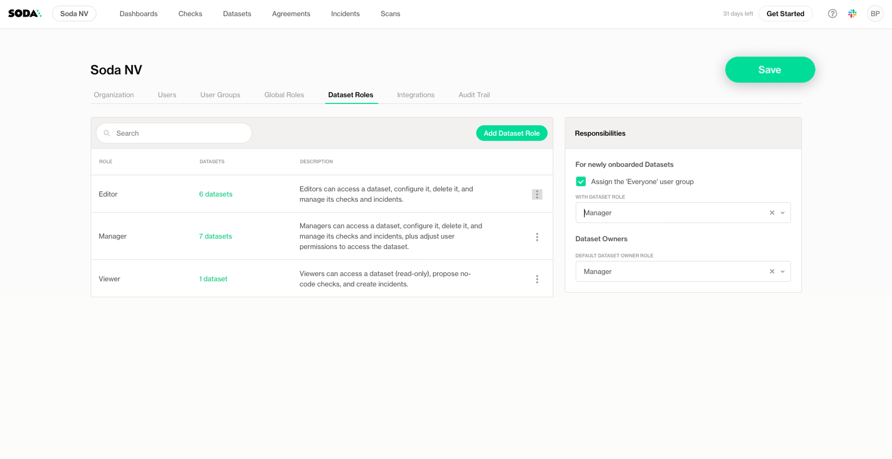
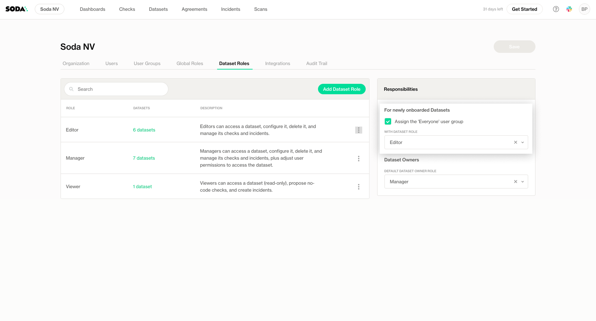

# Global and Dataset Roles

Soda Cloud uses **Global Roles** and **Dataset Roles** to manage access and permissions. These roles ensure users and user groups have the right level of access based on their responsibilities.

## Global Roles

Global roles define permissions across the entire organization in Soda Cloud.

By default, Soda Cloud provides to Global Roles: Admin and Users. You can create custom roles with a subset of the permissions

<table><thead><tr><th>Permission Group</th><th>Descriptions</th><th width="100">Admin</th><th width="100">User</th></tr></thead><tbody><tr><td>Manage data sources and agents</td><td>
Allow to deploy a new Soda Agent as well as configure data source connections in Soda Cloud.

Allow to enable Metric Monitors, and onboard datasets at the data source level.

See <a data-mention href="../onboard-datasets-on-soda-cloud/">onboard-datasets-on-soda-cloud</a>
</td><td>✓</td><td></td></tr><tr><td>Create data sources via Soda Core</td><td>Allow the creation of new data sources in Soda Cloud when using the Soda Core library.  By default, a data source created with Soda Core doesn't contain a connection for Soda Agent.  The connection has to be set up by a user with "Manage data sources and agents" permission.</td><td>✓</td><td>✓</td></tr><tr><td>Onboard new datasets</td><td>Allow onboarding of new datasets in Soda Cloud for existing data sources.</td><td></td><td></td></tr><tr><td>Manage attributes</td><td>Allow to define which datasets and check attributes are available to use in the organization.</td><td>✓</td><td></td></tr><tr><td>Manage notification rules</td><td>Allow to manage how notifications are sent.</td><td>✓</td><td>✓</td></tr><tr><td>Manage organization settings</td><td>• Manage organization settings • Deactivate users • Create, edit, or delete user groups • Create, edit, or delete dataset roles • Create, edit, or delete global roles • Assign global roles to users or user groups • Add, edit, or delete integrations • Access and download the audit trail</td><td>✓</td><td></td></tr></tbody></table>

### Create Custom Global Roles

You can create custom global roles to match your organization’s needs.

To create a global role:

1. Go to the **Global Roles** section in **Settings**.
2. Click Add Global Role to create a new role.

<figure><figcaption></figcaption></figure>

3. Enter a **name** for the role.
4. Select the **permissions** the role should have.

<figure><figcaption></figcaption></figure>

5. Click **Save**.

### Edit Custom Global Roles

You can edit global roles at any time to adjust permissions as your organization’s needs evolve.

To edit a global role:

1. Go to the **Global Roles** section in **Settings**.
2. Find the global role you want to modify.
3. Click the context menu next to the role and select Edit Global Role.

<figure><figcaption></figcaption></figure>

1. Adjust the role’s **name** and **permissions** as needed.
2. Click **Save** to apply your changes.

### Assign Members to Global Roles

You can assign roles to individual users or user groups to grant them the associated permissions.

To assign a global role:

1. Go to the **Global Roles** section in **Settings**.
2. Find the global role you want to assign.
3. Click the context menu next to the role and select Assign Members
4. Select the users or user groups that should have the global roles

<figure><figcaption></figcaption></figure>

5. Click **Save** to apply your changes.

You can also assign roles on the Users and User groups tabs:

* For users: [user-management.md](user-management.md "mention")
* For user groups: [user-management.md](user-management.md "mention")

## Dataset roles

Dataset roles define permissions for specific datasets.

By default, Soda Cloud provides to Dataset Roles: Manager, Editor, and User. You can create custom roles with a subset of the permissions

<table><thead><tr><th>Permission Group</th><th>Description</th><th width="100">Manager</th><th width="100">Editor</th><th width="100">Viewer</th></tr></thead><tbody><tr><td>View dataset</td><td>Access the dataset and view checks</td><td>✓</td><td>✓</td><td>✓</td></tr><tr><td>Access dataset profiling and samples</td><td>Allow users to see insights about the data</td><td>✓</td><td>✓</td><td>✓</td></tr><tr><td>Access failed row samples for checks</td><td>Allow users to see samples of rows that are considered invalid</td><td>✓</td><td>✓</td><td>✓</td></tr><tr><td>Configure dataset</td><td>Allow users to define dataset attributes and owner, change settings, and add/enable/configure metric monitors at a dataset level </td><td>✓</td><td>✓</td><td></td></tr><tr><td>Manage dataset responsibilities</td><td>Allow users to grant and remove permissions through responsibilities.</td><td>✓</td><td></td><td></td></tr><tr><td>Manage Datas Contract</td><td>Allow users to modify as well as verifying the Data contract</td><td>✓</td><td>✓</td><td></td></tr><tr><td>Propose checks</td><td>Allow users to propose changes in the Data Contract</td><td>✓</td><td>✓</td><td>✓</td></tr><tr><td>Manage incidents</td><td>Allow users to edit and close incidents.</td><td>✓</td><td>✓</td><td>✓</td></tr><tr><td>Delete dataset</td><td>Allow users to remove a dataset and its checks.</td><td>✓</td><td></td><td></td></tr></tbody></table>

### Create Custom Dataset Roles

You can create custom dataset roles to match your organization’s needs.

To create a dataset role:

1. Go to the **Dataset Roles** section in **Settings**.
2. Click Add Dataset Role to create a new role.

<figure><figcaption></figcaption></figure>

3. Enter a **name** for the role.
4. Select the **permissions** the role should have.

<figure><figcaption></figcaption></figure>

* Click **Save** to apply your changes.

### Edit Dataset Roles

You can edit dataset roles at any time to adjust permissions as your organization’s needs evolve.

To edit a dataset role:

1. Go to the **Dataset Roles** section in **Settings**.
2. Find the dataset role you want to modify.
3. Click the context menu next to the role and select Edit Dataset Role.

<figure><figcaption></figcaption></figure>

4. Adjust the role’s **name** and **permissions** as needed.
5. Click **Save** to apply your changes.

### Assign dataset responsibilities

**Responsibilities** in Soda Cloud define who has access to a dataset and what they are allowed to do. They are assigned by mapping **users** or **user groups** to a **dataset role.**

This ensures that the right people have the appropriate permissions for each dataset, such as the ability to manage checks, propose new rules, or view profiling information.

For example:

* Assign a **Manager** role to a dataset owner who needs full control.
* Assign a **Viewer** role to a business user who only needs to monitor data quality results.

By assigning responsibilities, you ensure clear access control, accountability, and governance across your datasets.

Learn about how to set up responsibilities on a dataset: [dataset-attributes-and-responsibilities.md](../dataset-attributes-and-responsibilities.md "mention")

### Define default responsibilities

#### For the dataset owner

Soda Cloud allows you to define **default responsibilities** for the dataset owner, which will automatically be granted for all dataset owners. This ensures that all users have a consistent baseline level of access unless you choose to customize it.

By default, all dataset owners have the "Manager" role.

**How to Configure Default Responsibilities**

1. Go to the **Organization Settings** page in Soda Cloud.
2. Locate the **Datasets Roles** section.
3. Select the **dataset role** to assign to the Dataset Owners

<figure><figcaption></figcaption></figure>

4. Click save on the top right of the page to apply changes

<figure><figcaption></figcaption></figure>

**For everyone**

Soda Cloud allows you to define **default responsibilities** for the **Everyone** group, which will automatically apply to all newly onboarded datasets. This ensures that all users have a consistent baseline level of access unless you choose to customize it.

By default:

* The **Everyone** group is assigned as a "Viewer" for all new datasets.
* This setting applies to **all users** in your organization unless disabled.

You can either customize the default role or **disable** the default responsibilities if you do not want the Everyone group to receive any automatic access to new datasets.

**How to Configure Default Responsibilities**

1. Go to the **Organization Settings** page in Soda Cloud.
2. Locate the **Datasets Roles** section.
3. Select the **dataset role** to assign to the Everyone group for new datasets.
4. To disable default responsibilities, toggle the feature **off**.

<figure><figcaption></figcaption></figure>

5. Click save on the top right of the page to apply changes

<figure><figcaption></figcaption></figure>
