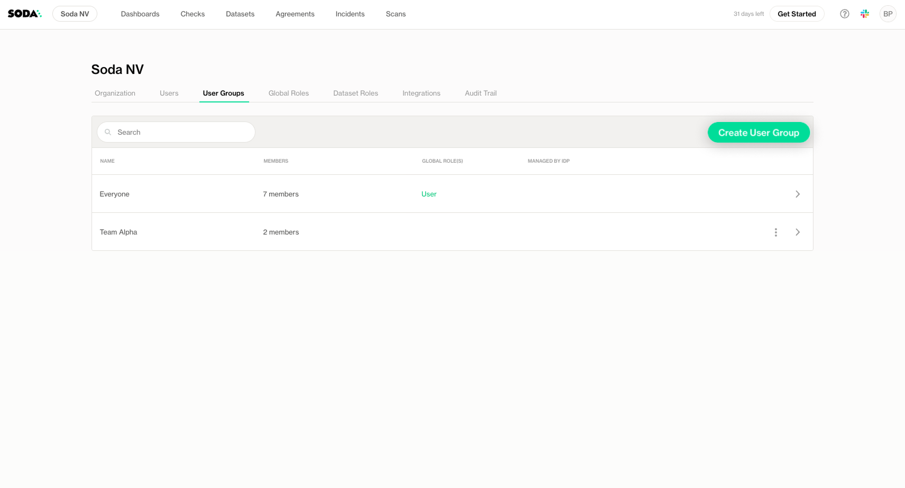

# User management

The **Users and User Groups** in Soda Cloud settings allows you to control access to your organization by managing individual users and user groups. This ensures that team members have the appropriate permissions to use Soda Cloud effectively.

With **SSO enabled**, users and groups can be synced directly from your identity provider, reducing manual effort and ensuring alignment with your organization’s access policies. Learn more about SSO configuration [user-and-user-group-management-with-sso.md](user-and-user-group-management-with-sso.md "mention").

## Invite Users

The **Invite Users** feature is only available when **SSO is not enabled**.

To invite users manually:

1. Go to the **Users** tab in **Settings**.
2. Click the **+** icon at the top of the user list

<figure><figcaption></figcaption></figure>

3. Enter the email addresses of the users you want to invite.

<figure><figcaption></figcaption></figure>

Invited users will receive an email with a link to set their password and join your organization in Soda Cloud. Once they complete the setup, they will have access to Soda Cloud based on the roles and permissions you assign.

## Deactivate Users

Deactivating a user **blocks their access to Soda Cloud** and **disables any existing API keys** associated with their account. This is useful when a user no longer needs access, but you want to retain their account for record-keeping or future reactivation.

To deactivate a user:

1. Go to the **Users** tab in **Settings**.
2. Find the user you want to deactivate.
3. Click the context menu for the user and select **Deactivate From This Organization**.

<figure><figcaption></figcaption></figure>

You can reactivate a user later if they need access again.

## Assign User to Groups

Assigning users to groups allows you to manage access and permissions more efficiently by applying global roles to groups rather than individual users.

To assign users to groups:

1. Go to the **Users** tab in **Settings**.
2. Find the user you want to assign to a group.
3. Click the content menu next to their name and select **Edit User Groups**.

<figure><figcaption></figcaption></figure>

4. Select one or more user groups from the list.

<figure><figcaption></figcaption></figure>

5. Click Save

## Assign Global Roles to Users

Global roles define a user’s permissions across Soda Cloud. Assigning global roles directly to users allows you to grant them specific access rights, such as managing datasets, running scans, or configuring organization settings.

To assign a global role to a user:

1. Go to the **Users** tab in **Settings**.
2. Find the user you want to assign a role to.
3. Click the context menu for the user and select **Assign Global Roles**.

<figure><figcaption></figcaption></figure>

4. Choose one or more global roles from the list.
5. Click Save

<figure><figcaption></figcaption></figure>

## User Groups

User groups allow you to manage access and permissions for multiple users at once, helping you simplify and scale permission management across your organization. By assigning global roles to groups, you ensure that all members of the group have consistent access rights, without the need to assign permissions individually.

If you have Single Sign-On (SSO) enabled, user groups can also be synced automatically from your identity provider, ensuring your Soda Cloud user management aligns with your existing access policies. [Learn more about SSO integration](user-and-user-group-management-with-sso.md) .

Note that by default, there is an Everyone group which is not editable and contains all the users from the organization

### Create User Groups

You can manually create user groups in Soda Cloud, whether you’re importing user groups SSO or not.

To create a user group:

1. Go to the **User Groups** tab in **Settings**.
2. Click Create User Group at the top of the user group list.

<figure><figcaption></figcaption></figure>

3. Enter a **name** for the group.
4. (Optional) Add users to the group immediately, or add them later.

<figure><figcaption></figcaption></figure>

### Edit Group Members

You can edit the members of user groups that you have created on Soda Cloud. SSO-managed user groups cannot be edited.

To edit a user group,

1. Go to the **User Groups** tab in **Settings**.
2. Find the group you want to modify.
3. Click the context menu next to the group and select **Edit Members**.

<figure><figcaption></figcaption></figure>

4. Select the users that should be in the user group and click save

<figure><figcaption></figcaption></figure>

### View Group Members

You can view the list of users in a group to understand who has access through that group and to help manage permissions across your organization.

To view the members of a group:

1. Go to the **User Groups** tab in **Settings**.
2. Click the group name or the row to open its details.
3. The list of users assigned to the group will be displayed.

<figure><figcaption></figcaption></figure>

This view helps you track group membership and verify that the correct users have the appropriate access.

<figure><figcaption></figcaption></figure>

### Assign Global Roles to User Group

Global roles define a user’s permissions across Soda Cloud. Assigning global roles directly to user groups allows you to grant them specific access rights, such as managing datasets, running scans, or configuring organization settings.

To assign a global role to a user:

1. Go to the **User Groups** tab in **Settings**.
2. Find the user group you want to assign a role to.
3. Click the context menu for the user and select **Assign Global Roles**.

<figure><figcaption></figcaption></figure>

4. Choose one or more global roles from the list.

<figure><figcaption></figcaption></figure>

5. Click Save
