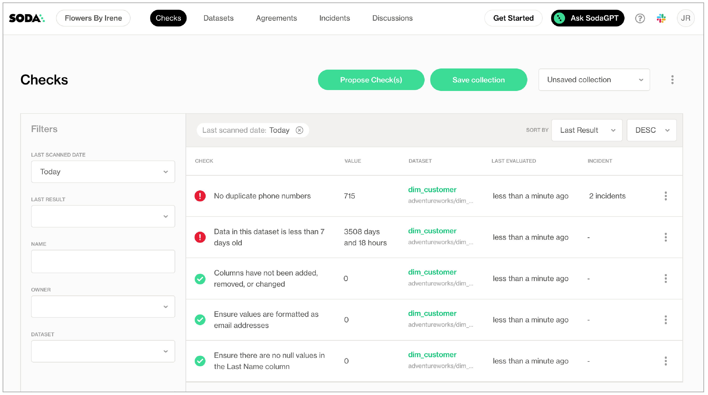
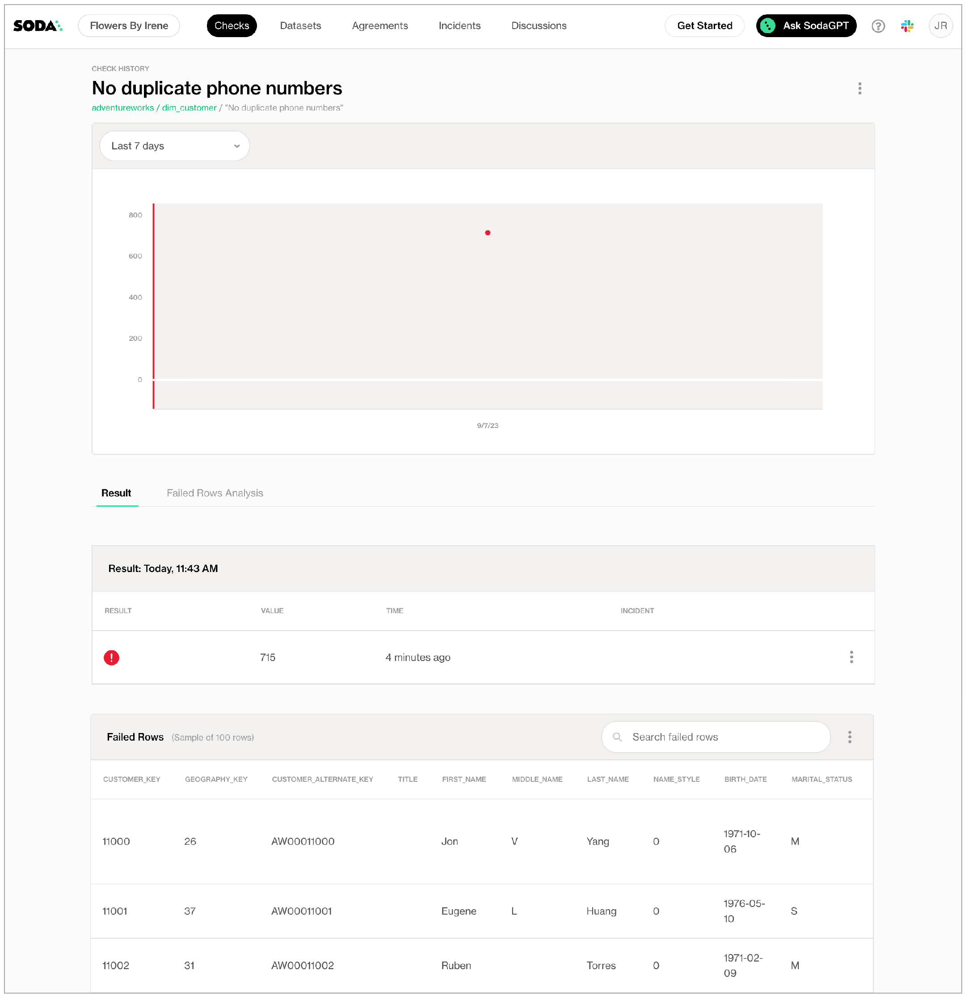

# Get started


The Soda environment has been updated since this tutorial.

> Refer to [v4 documentation](https://app.gitbook.com/s/A2PmHkO5cBgeRPdiPPOG/quickstart) for updated tutorials.


Is Soda the data quality testing solution you've been looking for? Take a sip and see! 🫧

Use the example data in this quick tutorial to set up and run a simple Soda scan for data quality.\


[Set up Soda](./#set-up-soda) | 3 minutes\
[Build an example data source](./#build-an-example-data-source) | 2 minutes\
[Connect Soda](./#connect-soda) | 5 minutes\
[Write some checks and run a scan](./#write-some-checks-and-run-a-scan) | 5 minutes\
\


> 💡 For standard set up instructions, access the [Get started roadmap](get-started-roadmap.md).
>
> ✨ Want a total UI experience? Use the out-of-the-box [Soda-hosted agent](managed-agent.md) to skip the CLI.

## Set up Soda

This tutorial references a MacOS environment.

1. Check the following prerequisites:

* You have installed Python 3.8, 3.9, or 3.10.
* You have installed Pip 21.0 or greater.
* (Optional) You have installed [Docker Desktop](https://www.docker.com/products/docker-desktop/) and have access to [GitHub](https://github.com/), to set up an example data source.

2. Visit [https://cloud.soda.io/signup](https://cloud.soda.io/signup) to sign up for a Soda Cloud account which is free for a 45-day trial.\

3. In your command-line interface, create a Soda project directory in your local environment, then navigate to the directory.

```shell
mkdir soda_sip
cd soda_sip
```

3. Best practice dictates that you install the Soda using a virtual environment. In your command-line interface, create a virtual environment in the `.venv` directory, then activate the environment.

```shell
python3 -m venv .venv
source .venv/bin/activate
```

3. Execute the following command to install the Soda package for PostgreSQL in your virtual environment. The example data is in a PostgreSQL data source, but there are 15+ data sources with which you can connect your own data beyond this tutorial.

```shell
pip install -i https://pypi.cloud.soda.io soda-postgres
```

4.  Validate the installation.

    ```shell
    soda --help
    ```

To exit the virtual environment when you are done with this tutorial, use the command `deactivate`.

## Build an example data source

To enable you to take a first sip of Soda, you can use Docker to quickly build an example PostgreSQL data source against which you can run scans for data quality. The example data source contains data for AdventureWorks, an imaginary online e-commerce organization.

* (Optional) Access the [`sodadata/sip-of-soda`](https://github.com/sodadata/sip-of-soda) repository in GitHub.
* (Optional) Access a quick view of the [AdventureWorks schema](https://github.com/aldibit/soda-docs/blob/main/assets/adventureworks_schema.png).

1. Open a new tab in Terminal.
2. If it is not already running, start Docker Desktop.
3. Run the following command in Terminal to set up the prepared example data source.

```shell
docker run \
 --name sip-of-soda \
 -p 5432:5432 \
 -e POSTGRES_PASSWORD=secret \
 sodadata/soda-adventureworks
```

When the output reads `data system is ready to accept connections`, your data source is set up and you are ready to proceed.

<details>

<summary>Troubleshoot</summary>


**Problem:** When you run `docker-compose up` you get an error that reads `[17168] Failed to execute script docker-compose`.



**Solution:** Start Docker Desktop running.


***


**Problem:** When you run `docker-compose up` you get an error that reads `Cannot start service soda-adventureworks: Ports are not available: exposing port TCP 0.0.0.0:5432 -> 0.0.0.0:0: listen tcp 0.0.0.0:5432: bind: address already in use`.



**Solution:**\
1\. Execute the command `lsof -i tcp:5432` to print a list of PIDs using the port.\
2\. Use the PID value to run the following command to free up the port: `kill -9 your_PID_value`. You many need to prepend the commands with `sudo` .\
3\. Run the `docker run` command again.


</details>

Alternatively, you can use your own data for this tutorial. To do so:

1. Skip the steps above involving Docker.
2. Install the Soda Library package that corresponds with your data source, such as `soda-bigquery`, `soda-athena`, etc. See full list.
3. Collect your data source's login credentials that you must provide to Soda so that it can scan your data for quality.
4. Move on to [Connect Soda](./#connect-soda).

## Connect Soda

To connect to a data source such as Snowflake, PostgreSQL, Amazon Athena, or GCP BigQuery, you use a `configuration.yml` file which stores access details for your data source.

This tutorial also instructs you to connect to a Soda Cloud account using API keys that you create and add to the same `configuration.yml` file. Available for free as a 45-day trial, your Soda Cloud account validates your free trial or license, gives you access to visualized scan results, tracks trends in data quality over time, lets you set alert notifications, and much more.

1. In a code editor such as Sublime or Visual Studio Code, create a new file called `configuration.yml` and save it in your `soda_sip` directory.
2.  Copy and paste the following connection details into the file. The `data_source` configuration details connect Soda to the example AdventureWorks data source you set up using Docker. If you are using your own data, provide the `data_source` values that correspond with your own data source.

    ```yaml
    data_source adventureworks:
      type: postgres
      host: localhost
      username: postgres
      password: secret
      database: postgres
      schema: public
    ```
3.  In your Soda account, navigate to **your avatar** > **Profile**, then access the **API keys** tab. Click the plus icon to generate new API keys. Copy+paste the `soda_cloud` configuration syntax, including the API keys, into the `configuration.yml` file, as in the example below.

    ```yaml
    data_source adventureworks:
      type: postgres
      host: localhost
      ...
      schema: public

    soda_cloud:
      host: cloud.soda.io
      api_key_id: 2e0ba0cb-**7b
      api_key_secret: 5wdx**aGuRg
    ```
4. Save the `configuration.yml` file and close the API modal in your Soda account.
5. In Terminal, return to the tab in which the virtual environment is active in the `soda_sip` directory. Run the following command to test Soda's connection to the data source.\
   Command:

```shell
soda test-connection -d adventureworks -c configuration.yml
```

Output:

```shell
Soda Library 1.x.x
Soda Core 3.x.x
Successfully connected to 'adventureworks'.
Connection 'adventureworks' is valid.
```

## Write some checks and run a scan

1. Create another file in the `soda_sip` directory called `checks.yml`. A check is a test that Soda executes when it scans a dataset in your data source. The `checks.yml` file stores the checks you write using the Soda Checks Language (SodaCL).
2. Open the `checks.yml` file in your code editor, then copy and paste the following checks into the file.

```yaml
checks for dim_customer:
  - invalid_count(email_address) = 0:
          valid format: email
          name: Ensure values are formatted as email addresses
  - missing_count(last_name) = 0:
          name: Ensure there are no null values in the Last Name column
  - duplicate_count(phone) = 0:
          name: No duplicate phone numbers
  - freshness(date_first_purchase) < 7d:
          name: Data in this dataset is less than 7 days old
  - schema:
          warn:
            when schema changes: any
          name: Columns have not been added, removed, or changed
```

<details>

<summary>What do these checks do?</summary>

* **Ensure values are formatted as email addresses** checks that all entries in the `email_address` column are formatted as `name@domain.extension`. See [Validity metrics](https://docs.soda.io/soda-cl/validity-metrics.html).
* **Ensure there are no null values in the Last Name column** automatically checks for NULL values in the `last_name` column. See [Missing metrics](https://docs.soda.io/soda-cl/missing-metrics.html).
* **No duplicate phone numbers** validates that each value in the `phone` column is unique. See [Numeric metrics](https://docs.soda.io/soda-cl/numeric-metrics.html#list-of-numeric-metrics).
* **Columns have not been added, removed, or changed** compares the schema of the dataset to the last scan result to determine if any columns were added, deleted, changed data type, or changed index. The first time this check executes, the results show `[NOT EVALUATED]` because there are no previous values to which to compare current results. In other words, this check requires a minimum of two scans to evaluate properly. See [Schema checks](https://docs.soda.io/soda-cl/schema.html).
* **Data in this dataset is less than 7 days old** confirms that the data in the dataset is less than seven days old. See [Freshness checks](https://docs.soda.io/soda-cl/freshness.html).

</details>

3. Save the changes to the `checks.yml` file, then, in Terminal, use the following command to run a scan. A scan is a CLI command which instructs Soda to prepare SQL queries that execute data quality checks on your data source. As input, the command requires:

* `-d` the name of the data source to scan
* `-c` the filepath and name of the `configuration.yml` file
* the filepath and name of the `checks.yml` file\
  \
  Command:

```shell
soda scan -d adventureworks -c configuration.yml checks.yml
```

Output:

```shell
Soda Library 1.0.x
Soda Core 3.0.x
Sending failed row samples to Soda Cloud
Scan summary:
3/5 checks PASSED: 
    dim_customer in adventureworks
      No changes to schema [PASSED]
      Emails formatted correctly [PASSED]
      No null values for last name [PASSED]
2/5 checks FAILED: 
    dim_customer in adventureworks
      No duplicate phone numbers [FAILED]
        check_value: 715
      Data is fresh [FAILED]
        max_column_timestamp: 2014-01-28 23:59:59.999999
        max_column_timestamp_utc: 2014-01-28 23:59:59.999999+00:00
        now_variable_name: NOW
        now_timestamp: 2023-04-24T21:02:15.900007+00:00
        now_timestamp_utc: 2023-04-24 21:02:15.900007+00:00
        freshness: 3372 days, 21:02:15.900008
Oops! 2 failures. 0 warnings. 0 errors. 3 pass.
Sending results to Soda Cloud
Soda Cloud Trace: 4417******32502
```

4.  As you can see in the Scan Summary in the command-line output, some checks failed and Soda sent the results to your Cloud account. To access visualized check results and further examine the failed checks, return to your Soda account in your browser and click **Checks**.

    <figure><figcaption></figcaption></figure>
5. In the table of checks that Soda displays, you can click the line item for one of the checks that failed to examine the visualized results in a line graph, and to access the failed row samples that Soda automatically collected when it ran the scan and executed the checks.\
   \
   Use the failed row samples, as in the example below, to determine what caused a data quality check to fail.

<figure><figcaption></figcaption></figure>

✨Well done!✨ You've taken the first step towards a future in which you and your colleagues can trust the quality and reliability of your data. Huzzah!

If you are done with the example data, you can delete it from your account to start fresh with your own data.

1. Navigate to **your avatar** > **Data Sources**.
2. In the **Data Sources** tab, click the stacked dots to the right of the `adventureworks` data source, then select **Delete Data Source**.
3. Follow the steps to confirm deletion.
4. Connect to your own data by [configuring your data source connections](install.md#configure-soda) in your existing `configuration.yml` file.\
   5\. Adjust your `checks.yml` to point to your own dataset in your data source, then adjust the checks to apply to your own data. Go ahead and run a scan!

## Go further

* Get inspired on how to set up Soda to meet your [use case needs](../use-case-guides/).
* Use [check suggestions](../soda-cl-overview/check-suggestions.md) to quickly get off the ground with basic checks for data quality.
* Learn [how to start](../soda-cl-overview/quick-start-sodacl.md) writing SodaCL checks.
* Read more about [SodaCL metrics and checks](../sodacl-reference/metrics-and-checks.md) in general.
* Learn more about [How Soda works](../learning-resources/how-library-works.md).

## Need help?

* What can Soda do for you? [Request a demo](https://www.soda.io/schedule-a-demo).
* Join the [Soda community on Slack](https://community.soda.io/slack).
