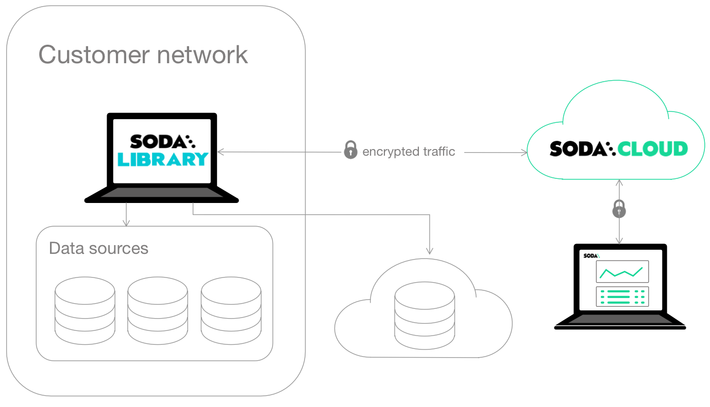
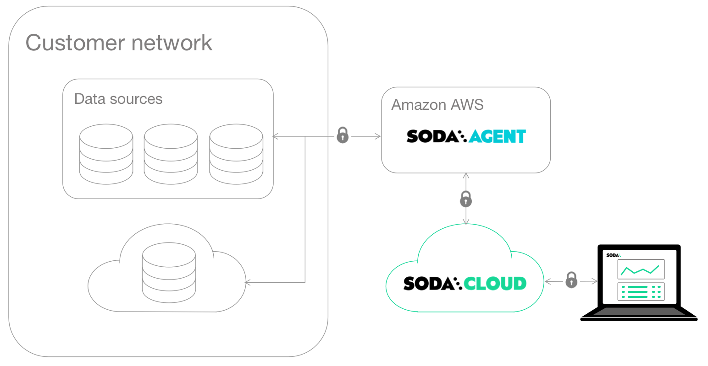
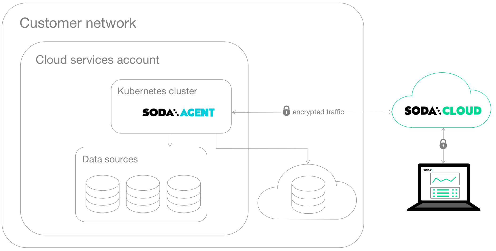
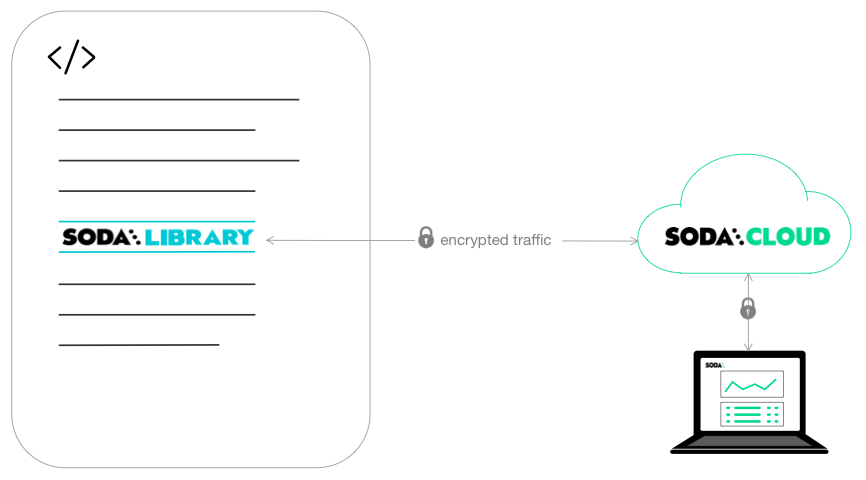

# Choose a flavor of Soda


The Soda environment has been updated since this tutorial.

> Refer to [v4 documentation](https://app.gitbook.com/s/A2PmHkO5cBgeRPdiPPOG/quickstart) for updated tutorials.


A lightweight, versatile tool for testing and monitoring data quality, you have several options for deploying Soda in your environment.

As the first step in the **Get started roadmap**, this guide helps you decide how to set up Soda to best meet your data quality testing and monitoring needs. After choosing a flavor of Soda (type of deployment model), access the corresponding [Set up Soda](setup-guide.md#next) instructions below.\

#### Get started roadmap

1. **Choose a flavor of Soda** 📍 You are here!
2. Set up Soda: sign up and install, deploy, or invoke
3. Write SodaCL checks
4. Run scans and review results
5. Organize, alert, investigate

## Choose a flavor of Soda

This guide helps you decide how to set up Soda to best meet your data quality testing and monitoring needs. You can set up Soda in one or more of four flavors.

<table data-header-hidden><thead><tr><th width="136.6666717529297">Flavor</th><th width="198.3333740234375">Description</th><th width="121.99993896484375" align="center">Soda Library</th><th width="143.33343505859375" align="center">Soda Agent</th><th align="center">Soda Cloud</th></tr></thead><tbody><tr><td><a href="setup-guide.md#self-operated">Self-operated</a></td><td>A simple setup in which you install Soda Library locally and connect it to Soda Cloud via API keys.</td><td align="center">✅</td><td align="center"></td><td align="center">✅</td></tr><tr><td><a href="setup-guide.md#soda-hosted-agent">Soda-hosted agent</a></td><td><em><strong>Recommended</strong></em> A Saas-style setup in which you manage data quality entirely from your Soda Cloud account.</td><td align="center"></td><td align="center">✅</td><td align="center">✅</td></tr><tr><td><a href="setup-guide.md#self-hosted-agent">Self-hosted agent</a> </td><td>A setup in which you deploy a Soda Agent in a Kubernetes cluster in a cloud-services environment and connect it to Soda Cloud via different API keys.</td><td align="center"></td><td align="center">✅</td><td align="center">✅</td></tr><tr><td><a href="setup-guide.md#programmatic">Programmatic</a></td><td>A setup in which you invoke Soda Library programmatically.</td><td align="center">✅</td><td align="center"></td><td align="center">✅</td></tr></tbody></table>

Why do I need a Soda Cloud account?

To validate your account license or free trial, Soda Library or a Soda Agent must communicate with a Soda Cloud account via API keys. You create a set of API keys in your Soda Cloud account, then use them to configure the connection to Soda Library or a Soda Agent.

> [Learn more](get-started-roadmap.md#about-soda)

\

### Self-operated

This simple setup enables you to `pip install` Soda Library from the command-line, then prepare YAML files to:

* configure connections to your data sources to run scans
* configure the connection to your Soda Cloud account to validate your license and visualize and share data quality check results
* write data quality checks

Use this setup for:

✅ **A small team**: Manage data quality within a small data engineering team or data analytics team who is comfortable working with the command-line and YAML files to design and execute scans for data quality.

✅ **POC**: Conduct a proof-of-concept evaluation of Soda as a data quality testing and monitoring tool. See: [Get started](./)

✅ **Basic DQ**: Start from scratch to set up basic data quality checks on key datasets. See: [Adopt check suggestions](../soda-cl-overview/check-suggestions.md)

✅ **Data migration**: Migrate good-quality data from one data source to another. See: [Test data before migration](../use-case-guides/quick-start-migration.md)

Requirements:

* Python 3.8, 3.9, or 3.10
* Pip 21.0 or greater
* Login credentials for your data source (Snowflake, Athena, MS SQL Server, etc.)

<figure><figcaption></figcaption></figure>

\

### Soda-hosted agent

_Recommended_

This setup provides a secure, out-of-the-box Soda Agent to manage access to data sources from within your Soda Cloud account. Quickly configure connections to your data sources in the Soda Cloud user interface, then empower all your colleagues to explore datasets, access check results, customize collections, and create their own no-code checks for data quality.

See also: [Soda-hosted vs. self-hosted agent](setup-guide.md#soda-hosted-vs.-self-hosted-agent)

Use this setup for:

✅ **A quick start**: Use the out-of-the-box agent to start testing data quality right away from within the Soda Cloud user interface, without the need to install or deploy any other tools.

✅ **Anomaly detection dashboard**:


Available in 2025


Use Soda's out-of-the-box **anomaly dashboards** to get automated insights into basic data quality metrics for your datasets. See: [Add anomaly dashboards](../use-case-guides/quick-start-automate.md)

✅ **Automated data monitoring**: Set up data profiling and automated data quality monitoring. See: [Automate monitoring](../use-case-guides/quick-start-automate.md)

✅ **Self-serve data quality**: Empower data analysts and scientists to self-serve and create their own no-code checks for data quality. See: [Self-serve Soda](../use-case-guides/quick-start-end-user.md)

✅ **Data migration**: Migrate good-quality data from one data source to another. See: [Test ](../use-case-guides/quick-start-dev.md)[data ](../use-case-guides/quick-start-dev.md)[before migration](../use-case-guides/quick-start-dev.md)

✅ **Data catalog integration**: Integrate Soda with a data catalog such as Atlan, Alation, or Metaphor. See: [Integrate Soda](../integrate-soda/)

Soda hosts agents in a secure environment in Amazon AWS. As a SOC 2 Type 2 certified business, Soda responsibly manages Soda-hosted agents to ensure that they remain private, secure, and independent of all other hosted agents. See [Data security and privacy](../learning-resources/data-privacy.md) for details.

Requirements:

* Login credentials for your data source (BigQuery, Databricks SQL, MS SQL Server, MySQL, PostgreSQL, Redshift, or Snowflake); Soda securely stores passwords as [Kubernetes secrets](https://kubernetes.io/docs/concepts/configuration/secret/)

<figure><figcaption></figcaption></figure>

### Self-hosted agent

This setup enables a data or infrastructure engineer to deploy Soda Library as an agent in a Kubernetes cluster within a cloud-services environment such as Google Cloud Platform, Azure, or AWS.

The engineer can manage access to data sources while giving Soda Cloud end-users easy access to Soda check results and enabling them to write their own checks for data quality. Users connect to data sources and create no-code checks for data quality directly in the Soda Cloud user interface.

See also: [Soda-hosted vs. self-hosted agent](setup-guide.md#soda-hosted-vs.-self-hosted-agent)

Use this setup for:

✅ **Self-serve data quality**: Empower data analysts and scientists to self-serve and create their own checks for data quality. See: [Self-serve Soda](../use-case-guides/quick-start-end-user.md)

✅ **Data migration**: Migrate good-quality data from one data source to another. See: [Test ](../use-case-guides/quick-start-dev.md)[data ](../use-case-guides/quick-start-dev.md)[before migration](../use-case-guides/quick-start-dev.md)

✅ **Anomaly detection dashboard**:


Available in 2025


Use Soda's out-of-the-box **anomaly dashboards** to get automated insights into basic data quality metrics for your datasets. See: [Add anomaly dashboards](../use-case-guides/quick-start-automate.md)

✅ **Data catalog integration**: Integrate Soda with a data catalog such as Atlan, Alation, or Metaphor. See: [Integrate Soda](../integrate-soda/)

✅ **Secrets manager integration**: Integrate your Soda Agent with an external secrets manager to securely access frequently-rotated data source login credentials. See: [Integrate with a Secrets Manager](../use-case-guides/quick-start-secrets.md)

Requirements:

* Access to your cloud-services environment, plus the authorization to deploy containerized apps in a new or existing Kubernetes cluster
* Login credentials for your data source (Snowflake, Athena, MS SQL Server, etc.)

<figure><figcaption></figcaption></figure>

### Programmatic

Use this setup to invoke Soda programmatically in, for example, and Airflow DAG or GitHub Workflow. You provide connection details for data sources and Soda Cloud inline or in external YAML files, and similarly define data quality checks inline or in a separate YAML file.

Use this setup for:

✅ **Testing during development**: Test data before and after ingestion and transformation during development. See: [Test data during development](../use-case-guides/quick-start-dev.md)

✅ **Circuit-breaking in a pipeline**: Test data in an Airflow pipeline so as to enable circuit breaking that prevents bad-quality data from having a downstream impact. See: [Test data in production](../use-case-guides/quick-start-prod.md)

✅ **Databricks Notebook**: Invoke Soda data quality scans in a Databricks Notebook. See: [Add Soda to a Databricks notebook](../use-case-guides/quick-start-databricks.md)\

Requirements:

* Python 3.8, 3.9, or 3.10
* Pip 21.0 or greater
* Login credentials for your data source (Snowflake, Athena, MS SQL Server, etc.)

<figure><figcaption></figcaption></figure>

## Soda-hosted vs. self-hosted agent

Though similar, the type of Soda agent you choose to use depends upon the following factors.

| Factor                               | Soda-hosted agent                                                                                  | Self-hosted agent                                                                                                                                                                               |
| ------------------------------------ | -------------------------------------------------------------------------------------------------- | ----------------------------------------------------------------------------------------------------------------------------------------------------------------------------------------------- |
| Data source compatibility            | Compatible with a [limited subset](managed-agent.md#compatibility) of Soda-supported data sources. | Compatible with [nearly all](deploy.md#compatibility) Soda-supported data sources.                                                                                                              |
| Upgrade maintenance                  | Soda manages all upgrades to the latest available version of the Soda Agent.                       | You manage all upgrades to your Soda Agent deployed on your Kubernetes cluster.                                                                                                                 |
| External Secrets manager integration | Unable to integrate with an External Secrets manager.                                              | Able to [integrate ](../use-case-guides/quick-start-secrets.md)with an External Secrets manager (Hashicorp Vault, Azure Key Vault, etc.) to better manage frequently-rotated login credentials. |
| Network connectivity                 | Access Soda Agent via public networks of passlisting.                                              | Deploy the Soda Agent inside your own private cloud on on premises network infrastructure.                                                                                                      |

## Next

1. ~~Choose a flavor of Soda~~
2. **Set up Soda.** Select the setup instructions that correspond with your flavor of Soda:

* [Self-operated](install.md)
* [Soda-hosted agent](managed-agent.md)
* [Self-hosted agent](deploy.md)
* [Programmatic](programmatic.md)

3. Write SodaCL checks
4. Run scans and review results
5. Organize, alert, investigate

> Need help? Join the [Soda community on Slack](https://community.soda.io/slack).
