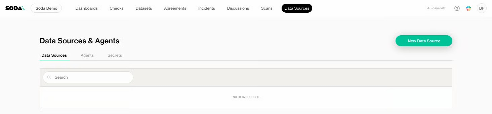
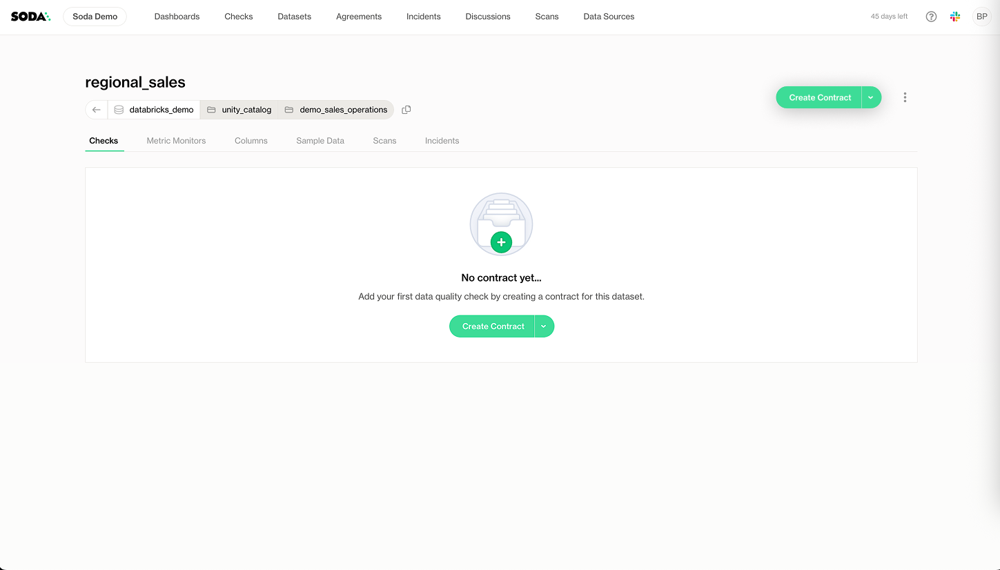
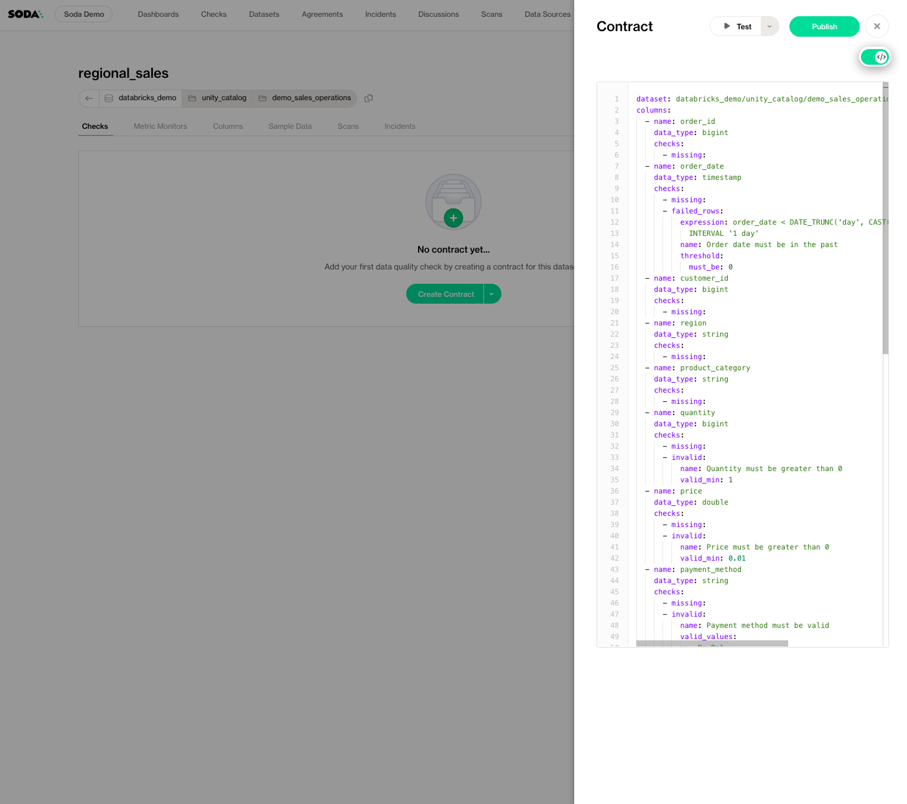
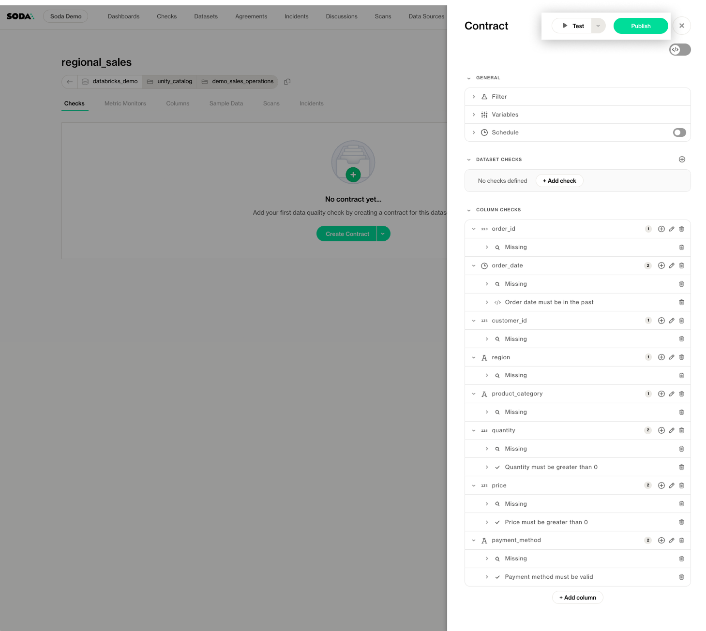
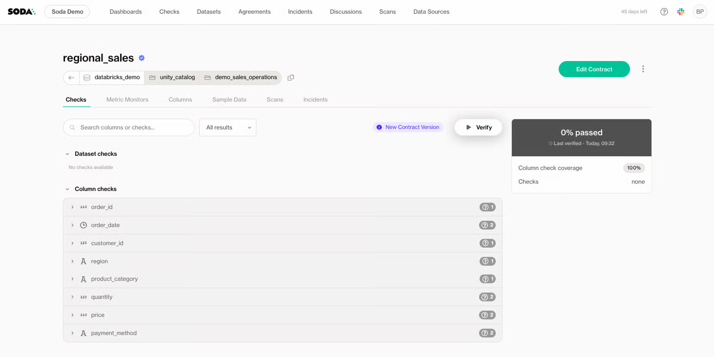

# Quickstart

This quickstart shows how Soda **detects unexpected data issues** by leveraging AI powered Anomaly Detection and **prevents future problems** by using data contracts. The example uses Databricks, but you can do the same with any other database.

### Scenario

A data engineer at a retail company needs to maintain the `regional_sales` dataset so their team can manage regional sales data from hundreds of stores across the country. The dataset feeds executive dashboards and downstream ML models for inventory planning. Accuracy and freshness are critical, so you need both:

* **Automated anomaly detection** on key metrics (row counts, freshness, schema drift)
* **Proactive enforcement** of business rules via data contracts

### Sign up

Contact us at [support@soda.io](mailto:support@soda.io) to get an account set up.

After signing up, you'll be guided through the setup flow with an in-product tour. Below are the steps to set up a data source and start improving data quality.

### Add a Data Source

Soda Cloud’s no-code UI lets you connect to any data source in minutes.

1. In [Soda Cloud](https://beta.soda.io/) , click on **Data Sources** → + **New Data Source**

<figure><figcaption></figcaption></figure>

2. Name your data source under Data Source Label.
3. Switch to the **Connect** tab and fill in the following credentials. The example below is meant to connect the Soda instance to Databricks:

<figure><figcaption></figcaption></figure>

4. Click **Connect**. This will test the connection and move to the next step.
5. Select the datasets you want to onboard on Soda Cloud.

<figure><figcaption></figcaption></figure>

6. Enable Monitoring and Profiling. By default, Metric Monitoring is enabled to automatically track key metrics on all the datasets you onboard and alert you when anomalies are detected. It is powered by built-in machine learning that compares current values against historical trends.

<figure><figcaption></figcaption></figure>

7. Click Finish to onboard your datasets. Soda Cloud will now spin up its **Soda-hosted Agent** and perform an initial **profiling** & **historical metric collection scan**. This usually takes only a few minutes.

### Part 1: Review Anomaly Detection Results

Congratulations, you’ve onboarded your first dataset! Now let’s make sure you always know what’s happening with it.

That’s where Metric Monitoring comes in. It automatically tracks key metrics like volume, freshness, and schema changes, with no manual setup required. You’ll spot anomalies, detect trends, and catch unexpected shifts before they become problems.

#### Step 1: Open the Metric Monitors dashboard

1. Go to **Datasets** → select the dataset to inspect.

<figure><figcaption></figcaption></figure>

2. Navigate to the **Metric Monitors** tab to learn more about the metrics calculated.

You'll immediately see that key metrics are automatically monitored by default, helping you detect pipeline issues, data delays, and unexpected structural changes as they happen.\
No setup needed, just visibility you can trust.

<figure><figcaption></figcaption></figure>

#### Step 2: View anomalies in a specific monitor

In this guide, we will focus on the **Most recent timestamp** monitor.  The panel shows that it was expected to be in a range of **0 - 5m 31s**, but the recorded value at scan time was **56m 49s**. In order to take a closer look:

1. Click the **Most recent timestamp** (or monitor of your choice) block.

<figure><figcaption></figcaption></figure>

2. In the monitor page you’ll see:

* measured value vs. expected range,
* any red-dot anomalies flagged by the model,
* buttons to **Mark as expected**, **Create new incident**, etc.

3. Flag an outlier as "expected" or investigate it further.


**Soda’s anomaly detection engine was built in-house** (no third-party libraries) and optimized for high precision. It continuously adapts to your data patterns, and it incorporates your feedback to reduce false alarms. Designed to minimize false positives and missed detections, it shows a 70% improvement in detecting anomalous data quality metrics compared to Facebook Prophet across hundreds of diverse, internally curated datasets containing known data quality issues.

The Anomaly Detection Algorithm offers complete control and transparency in the modeling process to allow for interpretability and adaptations. It features high accuracy while leveraging historical data, delivering improvements over time.

### Part 2: Attack the Issues at Source (No-Code)

Our automated anomaly detection has just done the heavy lifting for you, identifying unusual patterns and potential data issues without any setup required.

But to prevent those issues from happening again, you must define exactly what your data should look like; every column, every rule, every expectation.

That’s where **Data Contracts** come in. They let you proactively set the standards for your data, so problems like this are flagged or even prevented before they impact your business.

#### Step 1: Create a Data Contract

Create a new data contract to define and enforce data quality expectations.

1. In your **Dataset Details** page, go to the **Checks** tab.
2. Click **Create Contract**.

<figure><figcaption></figcaption></figure>

3. When creating a data contract, Soda will connect to your dataset and build a data contract template based on the dataset schema. From this point, you can start adding both dataset-level checks and column-level checks, as well as defining a verification schedule or a partition.

<figure><figcaption></figcaption></figure>

4. Toggle **View Code** if you’d like to inspect the generated SodaCL/YAML. This gives you access to the full contract code.

<figure><figcaption></figcaption></figure>

5. You can copy the following full example, paste it into the editor and edit it as you wish. You can toggle back to no-code view to see and edit the checks in the no-code editor.

```yaml
dataset: databricks_demo/unity_catalog/demo_sales_operations/regional_sales
filter: |
  order_date >= ${var.start_timestamp}
  AND order_date < ${var.end_timestamp}
variables:
  start_timestamp:
    default: DATE_TRUNC('week', CAST('${soda.NOW}' AS TIMESTAMP))
  end_timestamp:
    default: DATE_TRUNC('week', CAST('${soda.NOW}' AS TIMESTAMP)) + INTERVAL '7 days'
checks:
  - row_count:
  - schema:
columns:
  - name: order_id
    data_type: INTEGER
    checks:
      - missing:
          name: Must not have null values
  - name: customer_id
    data_type: INTEGER
    checks:
      - missing:
          name: Must not have null values
  - name: order_date
    data_type: DATE
    checks:
      - missing:
          name: Must not have null values
      - failed_rows:
          name: Cannot be in the future
          expression: order_date > DATE_TRUNC('day', CAST('${soda.NOW} ' AS TIMESTAMP)) +
            INTERVAL '1 day'
          threshold:
            must_be: 0
  - name: region
    data_type: VARCHAR
    checks:
      - invalid:
          valid_values:
            - North
            - South
            - East
            - West
          name: Valid values
  - name: product_category
    data_type: VARCHAR
  - name: quantity
    data_type: INTEGER
    checks:
      - missing:
          name: Must not have null values
      - invalid:
          valid_min: 0
          name: Must be higher than 0
  - name: price
    data_type: NUMERIC
    checks:
      - invalid:
          valid_min: 0
          name: Must be higher than 0
      - missing:
          name: Must not have null values
  - name: payment_method
    data_type: VARCHAR
    checks:
      - missing:
          name: Must not have null values
      - invalid:
          threshold:
            metric: count
            must_be: 0
          filter: region <> 'north'
          valid_values:
            - PayPal
            - Bank Transfer
            - Cash
            - Credit Card
          name: Valid values in all regions except North
      - invalid:
          name: Valid values in North
          filter: region = 'north'
          valid_values:
            - PayPal
            - Bank Transfer
            - Credit Card
          qualifier: ABC124

```

That’s right: with Soda, you can edit a contract using either a no-code interface or directly in code. This ensures an optimal experience for all user personas while also providing a version-controlled code format that can be synced with a Git repository.

#### Step 2: Publish & verify

1. Click **Test to verify the contract executes as expected**
2. When you are done with the contract, click **Publish**

<figure><figcaption></figcaption></figure>

3. Click **Verify**. Soda will evaluate your rules against the current data.

<figure><figcaption></figcaption></figure>

#### Step 3: Review check results

Review the outcomes of the contract checks to confirm whether the data meets expectations.\
You can drill into those failures in the **Checks** tab.

<figure><figcaption></figcaption></figure>

### Part 3: Attack the Issues at Source (Code)

You can trigger contract verification programmatically as part of your pipeline, so your data gets tested every time it runs.

We’ve prepared an example notebook to show you how it works:

Open the following Notebook example: [https://colab.research.google.com/drive/1zkV\_2tLJ4ohdzmKGS3LgdFDDnTNTUXew?usp=sharing](https://colab.research.google.com/drive/1zkV_2tLJ4ohdzmKGS3LgdFDDnTNTUXew?usp=sharing)

\
In your Python environment, first install the Soda Core library&#x20;

```sh
pip install -i https://pypi.dev.sodadata.io/simple -U soda-core
```

Then create a file with your API keys, which are necessary to connect to Soda Cloud. \
You can create one from your Profile: [generate-api-keys.md](reference/generate-api-keys.md "mention")

```python
import os

soda_cloud_config = f"""
soda_cloud:
  host: beta.soda.io
  api_key_id: {os.getenv("api_key_id")}
  api_key_secret: {os.getenv("api_key_secret")}
"""

with open("soda-cloud.yml", "w") as f:
    f.write(soda_cloud_config)

print("✅ soda-cloud.yml written.")
```


Now you are ready to trigger the verification of the contract. To do that just provide the identifier of your dataset as well as the path to the configuration file you just created in the previous step. This will trigger a verification using Soda Agent and return the logs.&#x20;

```python
from soda_core import configure_logging
from soda_core.contracts import verify_contracts_on_agent

configure_logging(verbose=False)

res = verify_contracts_on_agent(
    dataset_identifiers=["databricks_demo/unity_catalog/demo_sales_operations/regional_sales"],
    soda_cloud_file_path="soda-cloud.yml",
)


print(res.get_logs())
```


> You can learn more about the Python API here: [python-api.md](reference/python-api.md "mention")


**You’ve completed the tutorial and are now ready to start catching data quality issues with Soda**

### What’s Next?

* Explore **Profiling** in the **Discover** tab to curate column selections for deeper analysis.
* Set up **Notification Rules** (bell icon → Add Notification Rule) to push alerts to Slack, Jira, PagerDuty, etc.
* Dive into **Custom Monitors** via `scan.yml` or the UI for even more tailored metrics.
