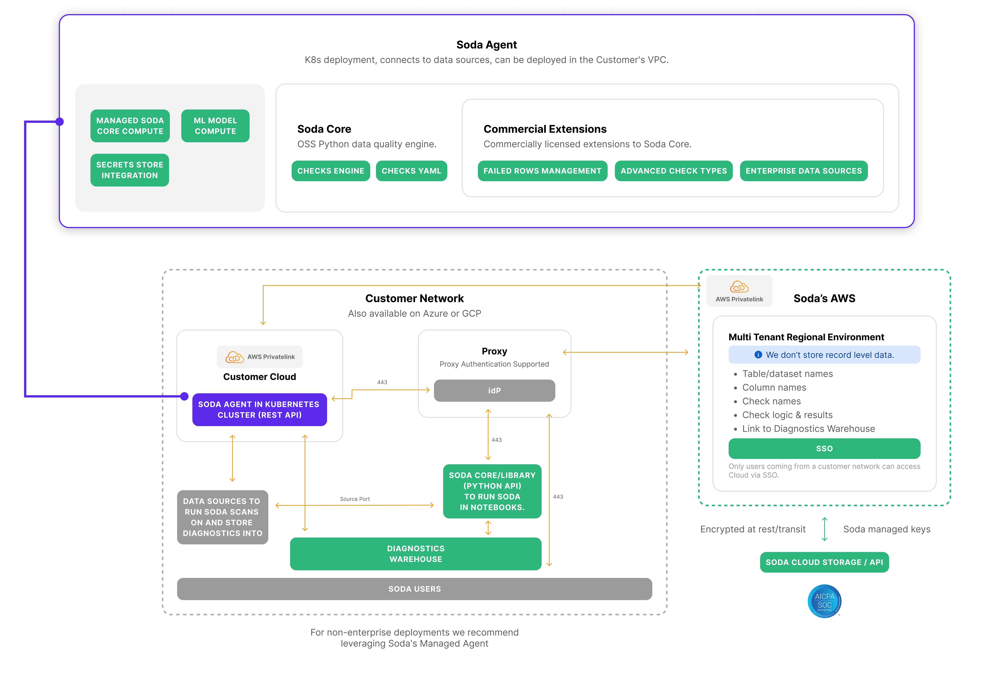

# Data flows between Soda & user

## Platform architecture

<figure><figcaption></figcaption></figure>

## 1. Instruction Retrieval by the Agent

1. The Soda Agent deployed in the customer’s Kubernetes cluster (within their VPC) continuously polls the Soda Cloud API for any new “instructions.”
2. If instructions are available, the Agent retrieves required resources from Soda Cloud, which include:
   * The contract file defining the data quality checks.
   * Data source connection details, where sensitive credentials are replaced by placeholders for environment variables.
   * Diagnostic warehouse connection details for failed-row storage.

## 2. Launching a Kubernetes Job

1. Once the resources are retrieved, the Agent launches a Kubernetes Job inside the customer environment to execute the data quality scan.
2. Files such as the contract and configuration are passed into the Job via mounted volumes.
3. Environment variables (or workload identities via ServiceAccounts) are injected into the Pod to supply secure credentials at runtime.

## 3. Data Source Connections

* The Soda process running inside the Job uses the provided details to connect directly to the customer’s data sources (e.g., databases or data warehouses).
* This connection stays entirely within the customer’s network, ensuring no row-level data leaves the environment.

## 4. Running the Data Quality Contract

1. The Soda Agent translates the data contract into optimized SQL statements
2.  The Soda process executes the contract verification, validating the datasets against the defined checks.

    During this process:

    * Data quality metrics (aggregated statistics, not raw data) are calculated.
    * Any rows failing validation checks are isolated for further inspection.

## 5. Reporting Results

1. Metrics and summaries are sent back to Soda Cloud via an API call.
   * These metrics include table/dataset names, check names, logic, and aggregated results.
2. No row-level data is transmitted to Soda Cloud.
3. Failed rows (if applicable) are written to the diagnostic warehouse inside the customer network, making them accessible for troubleshooting without ever leaving the environment.

## 6. Job Completion and Termination

* Once the Soda process completes:
  * The Kubernetes Job terminates automatically.
  * The Agent is aware of the termination and signals completion of the instruction back to Soda Cloud through an API call.

## Security and Isolation

* All communication between Soda Cloud and the Agent is encrypted at rest and in transit.
* Soda Cloud operates in a multi-tenant environment but does not store any record-level data.

## Summary

In this architecture, Soda Cloud orchestrates the scans and collects only aggregated metrics, while all sensitive data stays in the customer’s network. The failed rows go to a customer-controlled diagnostics warehouse, ensuring compliance with data privacy policies.
