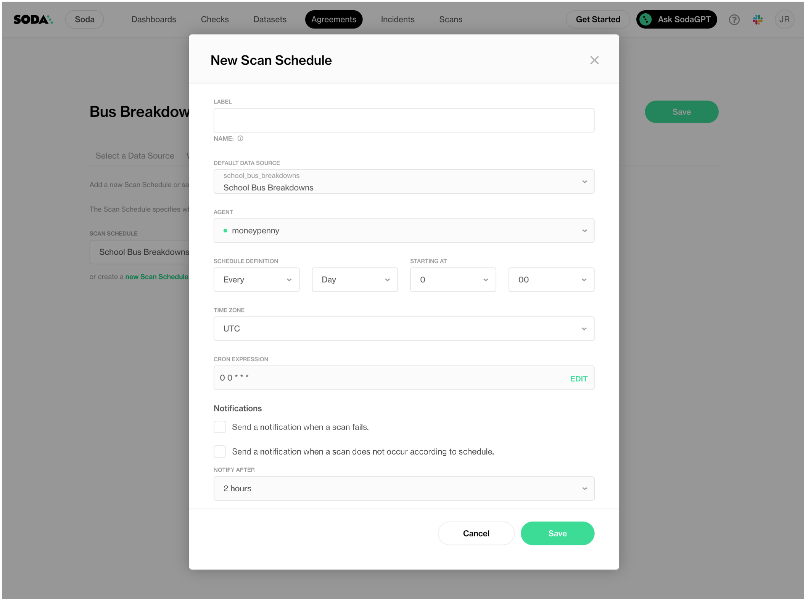
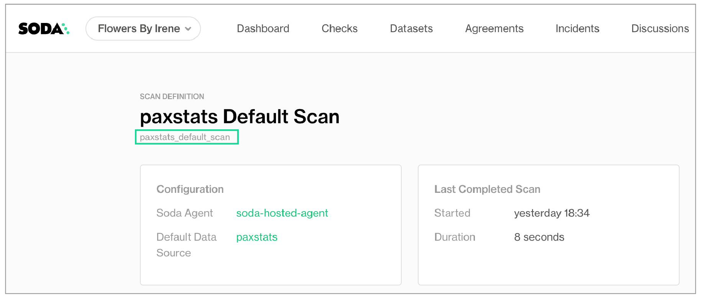
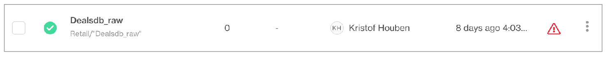
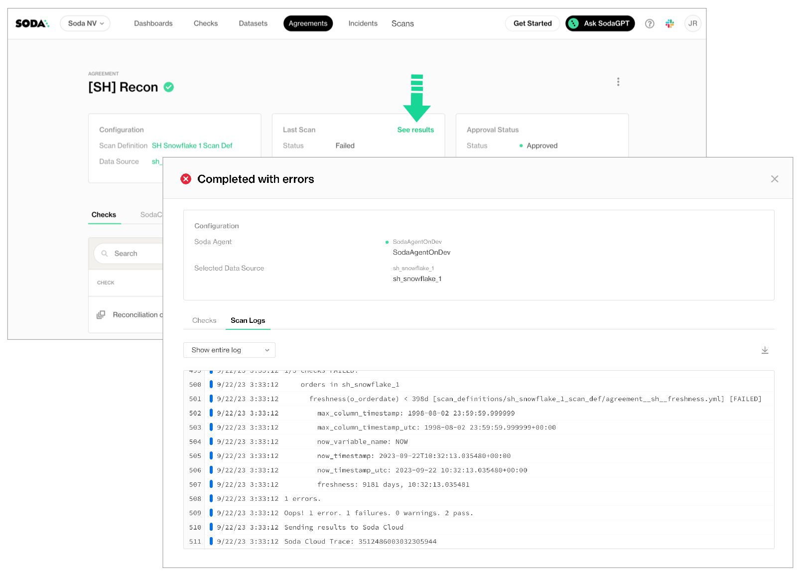

# Run a scan and view results

Soda uses checks and the data source connection configurations to prepare a scan that it runs against datasets to extract metadata and gauge data quality.

A check is a test that Soda performs when it scans a dataset in your data source. Soda uses the checks you defined as no-code checks in Soda Cloud, or wrote in a checks YAML file, to prepare SQL queries that it runs against the data in a dataset. Soda can execute multiple checks against one or more datasets in a single scan.

As a step in the **Get started roadmap**, this guide offers instructions to schedule a Soda scan, run a scan, or invoke a scan programmatically.

#### Get started roadmap

1. ~~Choose a flavor of Soda~~
2. ~~Set up Soda: install, deploy, or invoke~~
3. ~~Write SodaCL checks~~
4. **Run scans and review results** 📍 You are here!\
   &#x20;    a. [Scan for data quality](./#scan-for-data-quality)\
   &#x20;    b. [View scan results](./#view-scan-results)
5. Organize, alert, investigate

## Scan for data quality



#### Set a scan definition in a no-code check

✖️    Requires Soda Core Scientific\
✖️    Requires Soda Core\
✖️    Requires Soda Library + Soda Cloud\
✔️    Requires Soda Agent + Soda Cloud

***

When you create a no-code check in Soda Cloud, one of the required fields asks that you associate the check with an existing scan definition, or that you create a new scan definition.

If you wish to change a no-code check's existing scan definition:

1. As a user with permission to do so, navigate to the dataset in which the no-code check exists.
2. From the dataset's page, locate the check you wish to adjust, and click the stacked dots at right, then select **Edit Check**. You can only edit a check via the no-code interface if it was first created as a no-code check, as indicated by the cloud icon in the **Origin** column of the table of checks.
3. Adjust the value in the **Add to Scan Definition** field as needed, then save. Soda executes the check during the next scan according to the definition you selected.

If you wish to schedule a _new_ scan to execute a no-code check more or less frequently, or at a different time of day:

1. From the dataset's page, locate the check you wish to adjust and click the stacked dots at right, then select **Edit Check**. You can only edit a check via the no-code interface if it was first created as a no-code check, as indicated by the cloud icon in the **Origin** column of the table of checks.
2. Use the dropdown in the **Add to Scan Definition** field to access the **create a new Scan Definition** link.
3. Fill out the form to define your new scan definition, then save it. Save the change to your no-code check. Soda executes the check during the next scan according to your new definition.

#### Set a scan definition in an agreement

✖️    Requires Soda Core Scientific\
✖️    Requires Soda Core\
✖️    Requires Soda Library + Soda Cloud\
✔️    Requires Soda Agent + Soda Cloud

***

When you create a Soda Agreement in Soda Cloud, the last step in the flow demands that you select a **scan definition**. The scan definition indicates which Soda Agent to use to execute the scan, on which data source, and when. Effectively, a scan definition defines the what, when, and where to run a scheduled scan.

If you wish to change an agreement's existing scan definition:

1. Navigate to **Agreements**, then click the stacked dots next to the agreement you wish to change and select **Edit Agreement**.
2. In the **Set a Scan schedule** tab, then use the dropdown menu to select a different scan definition.
3. **Save** your change. The agreement edit triggers a new stakeholder approval request to all stakeholders. Your revised agreement _does not run again_ until all stakehoders have approved it.

If you wish to schedule a _new_ scan to execute the checks in an agreement more or less frequently, or at a different time of day:

1. Navigate to **Agreements**, then click the stacked dots next to the agreement you wish to change and select **Edit Agreement**.
2. In the **Set a Scan schedule** tab, then click the **new Scan Definition** link and populate the fields as in the example below.
3. **Save** your change. The agreement edit triggers a new stakeholder approval request to all stakeholders. Your revised agreement _does not run again_ until all stakehoders have approved it.

<figure><figcaption></figcaption></figure>



#### Run a scan for a no-code check

✖️    Requires Soda Core Scientific\
✖️    Requires Soda Core\
✖️    Requires Soda Library + Soda Cloud\
✔️    Requires Soda Agent + Soda Cloud

***

If you wish to run a scan immediately to see the scan results for a no-code check, you can execute an ad hoc scan for a single check.

1. As a user with the permission to do so, navigate to the dataset associated with the no-code check you wish to execute.
2. In the table of checks, locate the check you wish to execute and click the stacked dots, then select **Execute Check**. Alternatively, click the check and in the check's page, click **Execute**. You can only execute an individual check if it was first created as a no-code check, as indicated by the cloud icon in the **Origin** column of the table of checks.
3. Soda executes _only_ your check.

You can also run an ad hoc scan to execute all checks associated with a scan definition.

1. In Soda Cloud, navigate to **Scans**.
2. In the list of scan definitions, click the one that is associated with the checks you wish to execute.
3. In the scan definition page, click **Run Scan** to immediately execute all checks that use this scan definition.

#### Run a scan in an agreement

✖️    Requires Soda Core Scientific\
✖️    Requires Soda Core\
✖️    Requires Soda Library + Soda Cloud\
✔️    Requires Soda Agent + Soda Cloud

***

If you wish to run a scan immediately to see the scan results for the checks you included in your agreement, you can run an ad hoc scan from the scan definition.

1. As a user with the [permission](../collaborate/roles-global.md#global-roles-and-permissions) to do so in your Soda Cloud account, navigate to **Scans**.
2. In the list of scan definitions, click the one that is associated with your agreement. If you don’t know which scan definition your agreement uses, navigate to **Agreements**, select your agreement, then find the name of the scan definition in the upper-left tile.
3. In the scan definition page, click **Run Scan** to immediately execute all agreements and checks that use this scan definition.

#### Run a scan from the command-line

✖️    Requires Soda Core Scientific\
✔️    Supported in Soda Core\
✔️    Supported in Soda Library + Soda Cloud\
✖️    Requires Soda Agent + Soda Cloud

***

Each scan requires the following as input:

* the name of the data source that contains the dataset you wish to scan, identified using the `-d` option
* a `configuration.yml` file, which contains details about how Soda Library can connect to your data source, identified using the `-c` option
* a `checks.yml` file which contains the checks you write using SodaCL

Scan command:

```shell
soda scan -d postgres_retail -c configuration.yml checks.yml
```

\


Note that you can use the `-c` option to include **multiple configuration YAML files** in one scan execution. Include the filepath of each YAML file if you stored them in a directory other than the one in which you installed Soda Library.

```shell
soda scan -d postgres_retail -c other-directory/configuration.yml other-directory/checks.yml
```

\


You can also include **multiple checks YAML files** in one scan execution. Use multiple checks YAML files to execute different sets of checks during a single scan.

```shell
soda scan -d postgres_retail -c configuration.yml checks_stats1.yml checks_stats2.yml
```

Use the soda `soda scan --help` command to review options you can include to customize the scan. See also: [Add scan options](./#add-scan-options).

#### Input scan-time variables

✖️    Requires Soda Core Scientific\
✔️    Supported in Soda Core\
✔️    Supported in Soda Library + Soda Cloud\
✖️    Requires Soda Agent + Soda Cloud

***

There are several ways you can use variables in checks, filters, and in your data source configuration to pass values at scan time; a few examples follow.

Refer to the comprehensive [Filters and variables](../sodacl-reference/filters.md) documentation for details.

```yaml
# Dataset filter with variables
filter CUSTOMERS [daily]:
  where: TIMESTAMP '${ts_start}' <= "ts" AND "ts" < TIMESTAMP '${ts_end}'

checks for CUSTOMERS [daily]:
  - row_count = 6
  - missing(cat) = 2

# In-check variable
checks for ${DATASET}:
  - invalid_count(last_name) = 0:
      valid length: 10
```

To provide a variable at scan time, as with dynamic dataset filters or with in-check values, add a `-v` option to the scan command and specify the key:value pair for the variable, as in the following example.

```shell
soda scan -d aws_postgres_retail -c configuration.yml -v TODAY=2022-03-31 checks.yml
```

If you wish, you can provide the value more than one variable at scan time, as in the following example.

```shell
soda scan -d aws_postgres_retail duplicate_count_filter.yml -c configuration.yml -v date=2022-07-25 -v name='rowcount check'
```

#### Prevent pushing scan results to Soda Cloud

If you wish, you can execute a scan using the Soda Library CLI and avoid sending any scan results to Soda Cloud. This is useful if, for example, you are testing checks locally and do not wish to muddy the measurements in your Soda Cloud account with test run metadata.

To do so, add a `--local` option to your scan command in the CLI, as in the following example.

```shell
soda scan -d aws_postgres_retail -c configuration.yml checks.yml --local
```

#### Configure the same scan to run in multiple environments

When you want to run a scan that executes the same checks on different environments or schemas, such as development, production, and staging, you must apply the following configurations to ensure that Soda Cloud does not incomprehensibly merge the checks results from scans of multiple environments.

1. In your `configuration.yml` file, provide separate connection configurations for each environment, as in the following example.

```yaml
data_source nyc_dev:
  type: postgres
  host: host
  port: '5432'
  username: ${POSTGRES_USER}
  password: ${POSTGRES_PASSWORD}
  database: postgres
  schema: staging
data_source nyc_prod:
  type: postgres
  host: host
  port: '5432'
  username: ${POSTGRES_USER}
  password: ${POSTGRES_PASSWORD}
  database: postgres
  schema: public
```

2. Provide a `scan definition` name at scan time using the `-s` option. The scan definition helps Soda Cloud to distinguish different scan contexts and therefore plays a crucial role when the `checks.yml` file names and the checks themselves are the same.

```shell
# for NYC data source for dev
soda scan -d nyc_dev -c configuration.yml -s nyc_a checks.yml
# for NYC data source for prod
soda scan -d nyc_prod -c configuration.yml -s nyc_b checks.yml
```

> See also: [Troubleshoot missing check results](../sodacl-reference/troubleshoot.md#missing-check-results-in-soda-cloud)
>
> See also: [Add a check identity](../sodacl-reference/optional-config.md#add-a-check-identity)

#### Add scan options

When you run a scan in Soda Library, you can specify some options that modify the scan actions or output. Add one or more of the following options to a `soda scan` command.

<table><thead><tr><th>Option</th><th width="100" align="center">Required</th><th>Description and examples</th></tr></thead><tbody><tr><td><code>-c TEXT</code> or<br><code>--configuration TEXT</code></td><td align="center">✓</td><td>Use this option to specify the file path and file name for the configuration YAML file.</td></tr><tr><td><code>-d TEXT</code> or<br><code>--data-source TEXT</code></td><td align="center">✓</td><td>Use this option to specify the data source that contains the datasets you wish to scan.</td></tr><tr><td><code>-l</code> or<br><code>--local</code></td><td align="center"></td><td>Use this local option to prevent Soda Library from pushing check results or any other metadata to Soda Cloud.</td></tr><tr><td><code>-s TEXT</code> or<br><code>--scan-definition TEXT</code></td><td align="center"></td><td>Use this option to provide a scan definition name so that Soda Cloud keeps check results from different environments (dev, prod, staging) separate. See <a href="./#configure-the-same-scan-to-run-in-multiple-environments">Configure a single scan to run in multiple environments</a>.</td></tr><tr><td><code>-srf</code> or<br><code>--scan-results-file TEXT</code></td><td align="center"></td><td>Specify the file name and file path to which Soda Library sends a JSON file of the scan results. You can use this in addition to, or instead of, sending results to Soda Cloud.<br><code>soda scan -d adventureworks -c configuration.yml -srf test.json checks.yml</code></td></tr><tr><td><code>-t TEXT</code> or<br><code>--data-timestamp TEXT</code></td><td align="center"></td><td>Specify the logical time associated with the data being validated.  It should be provided in <strong>ISO 8601 format with UTC timezone</strong> (e.g., <code>2025-08-12T14:30:00Z</code>). By default, Soda uses the <strong>current execution time</strong> as the data timestamp. </td></tr><tr><td><code>-T TEXT</code> or<br><code>--template TEXT</code></td><td align="center"></td><td>Use this option to specify the file path and file name for a <a href="../sodacl-reference/check-template.md">templates YAML</a> file.</td></tr><tr><td><code>-v TEXT</code> or<br><code>--variable TEXT</code></td><td align="center"></td><td>Replace <code>TEXT</code> with variables you wish to apply to the scan, such as a <a href="../sodacl-reference/filters.md">filter for a date</a>. Put single or double quotes around any value with spaces.<br><code>soda scan -d my_datasource -v start=2020-04-12 -c configuration.yml checks.yml</code></td></tr><tr><td><code>V</code> or<br><code>--verbose</code></td><td align="center"></td><td>Return scan output in verbose mode to review query details.</td></tr></tbody></table>

#### Troubleshoot

**Problem:** When you run a scan, you get an error that reads, `Exception while exporting Span batch.`

**Solution:** Without an internet connection, Soda Library is unable to communicate with `soda.connect.io` to transmit anonymous usage statistics about the software.\
If you are using Soda Library offline, you can resolve the issue by setting `send_anonymous_usage_stats: false` in your `configuration.yml` file. Refer to [Soda Library usage statistics](../learning-resources/usage-stats.md) for further details.\


**Problem:** Check results to be missing in Soda Cloud.

**Solution:**\
Because Soda Library pushes scan results to Soda Cloud, you may not want to change the scan definition name with each scan. Soda Cloud uses the scan definition name to correlate subsequent scan results, thus retaining a historical record of the measurements over time.\
Sometimes, changing the name is useful, like when you wish to [Configure a single scan to run in multiple environments](./#configure-the-same-scan-to-run-in-multiple-environments). Be aware, however, that if you change the scan definition name with each scan for the same environment, Soda Cloud recognizes each set of scan results as independent from previous scan results, thereby making it appear as though it records a new, separate check result with each scan and archives or "disappears" previous results. See also: [Missing check results in Soda Cloud](../sodacl-reference/troubleshoot.md#missing-check-results-in-soda-cloud)\


**Problem:** In a Windows environment, you see an error that reads `[SSL: CERTIFICATE_VERIFY_FAILED] certificate verify failed: unable to get local issuer certificate (ssl_c:997)`.

**Solution:** Use `pip install pip-system-certs` to potentially resolve the issue. This install works to resolve the issue only on Windows machines where the Ops team installs all the certificates needed through Group Policy Objects, or similar.





#### Run a basic programmatic scan using Python

✖️    Requires Soda Core Scientific\
✔️    Supported in Soda Core\
✔️    Supported in Soda Library + Soda Cloud\
✖️    Requires Soda Agent + Soda Cloud

***

Based on a set of conditions or a specific event schedule, you can programmatically invoke Soda Library to automatically scan a data source. For example, you may wish to scan your data at several points along your data pipeline, perhaps when new data enters a data source, after it is transformed, and before it is exported to another data source.

Refer to [Soda Library Python API reference](python_api.md) for more information.

* You can save Soda Library scan results anywhere in your system; the `scan_result` object contains all the scan result information. To import Soda Library in Python so you can utilize the `Scan()` object, [install a Soda Library package](../quick-start-sip/programmatic.md), then use `from soda.scan import Scan`.
* If you provide a name for the scan definition to identify inline checks in a programmatic scan as independent of other inline checks in a different programmatic scan or pipeline, be sure to set a unique scan definition name for each programmatic scan. Using the same scan definition name in multiple programmatic scans results in confused check results in Soda Cloud.
* If you wish to collect samples of failed rows when a check fails, you can employ a custom sampler; see [Configure a failed row sampler](failed-row-samples.md#configure-a-python-custom-sampler).
* Be sure to include any variables in your programmatic scan _before_ the check YAML files. Soda requires the variable input for any variables defined in the check YAML files.

```python
from soda.scan import Scan

scan = Scan()
scan.set_data_source_name("events")

# Add configuration YAML files
#########################
# Choose one of the following to specify data source connection configurations :
# 1) From a file
scan.add_configuration_yaml_file(file_path="~/.soda/my_local_soda_environment.yml")
# 2) Inline in the code
scan.add_configuration_yaml_str(
    """
    data_source events:
      type: snowflake
      host: ${SNOWFLAKE_HOST}
      username: ${SNOWFLAKE_USERNAME}
      password: ${SNOWFLAKE_PASSWORD}
      database: events
      schema: public
"""
)

# Add variables
###############
scan.add_variables({"date": "2022-01-01"})


# Add check YAML files
##################
scan.add_sodacl_yaml_file("./my_programmatic_test_scan/sodacl_file_one.yml")
scan.add_sodacl_yaml_file("./my_programmatic_test_scan/sodacl_file_two.yml")
scan.add_sodacl_yaml_files("./my_scan_dir")
scan.add_sodacl_yaml_files("./my_scan_dir/sodacl_file_three.yml")

# OR

# Define checks using SodaCL
##################
checks = """
checks for cities:
    - row_count > 0
"""

# Add template YAML files, if used
##################
scan.add_template_files(template_path)

# Execute the scan
##################
scan.execute()

# Set logs to verbose mode, equivalent to CLI -V option
##################
scan.set_verbose(True)

# Set scan definition name, equivalent to CLI -s option
# The scan definition name MUST be unique to this scan, and
# not duplicated in any other programmatic scan
##################
scan.set_scan_definition_name("YOUR_SCHEDULE_NAME")

# Do not send results to Soda Cloud, equivalent to CLI -l option;
##################
scan.set_is_local(True)

# Inspect the scan result
#########################
scan.get_scan_results()

# Inspect the scan logs
#######################
scan.get_logs_text()

# Typical log inspection
##################
scan.assert_no_error_logs()
scan.assert_no_checks_fail()

# Advanced methods to inspect scan execution logs
#################################################
scan.has_error_logs()
scan.get_error_logs_text()

# Advanced methods to review check results details
########################################
scan.get_checks_fail()
scan.has_check_fails()
scan.get_checks_fail_text()
scan.assert_no_checks_warn_or_fail()
scan.get_checks_warn_or_fail()
scan.has_checks_warn_or_fail()
scan.get_checks_warn_or_fail_text()
scan.get_all_checks_text()
```





#### Trigger a scan via API

✖️    Requires Soda Core Scientific\
✖️    Requires Soda Core\
✖️    Requires Soda Library + Soda Cloud\
✔️    Requires Soda Agent + Soda Cloud

***

You can programmatically initiate a scan your team defined in Soda Cloud using the Soda Cloud API.

If you have defined a [scan definition](../learning-resources/glossary.md#scan-definition) in Soda Cloud, and the scan definition executes on a schedule via a self-hosted or Soda-hosted agent, and you have the [permission](../collaborate/roles-global.md) to do so in your Soda Cloud account, you can use the API to:

* retrieve information about checks and datasets in your Soda Cloud account
* execute scans
* retrieve information about the state of a scan during execution
* access the scan logs of an executed scan

Access the [Soda Cloud API](broken-reference) documentation to get details about how to programmatically get info and execute Soda Cloud scans.


#### Run a Soda Cloud scan from the command-line

✖️    Requires Soda Core Scientific\
✖️    Requires Soda Core\
✔️    Requires Soda Library + Soda Cloud\
✔️    Requires Soda Agent + Soda Cloud

***

You can initiate a scan your team defined in Soda Cloud using the Soda Library CLI.

If you have defined a [scan definition](../learning-resources/glossary.md#scan-definition) in Soda Cloud, and the scan definition executes on a schedule via a self-hosted or Soda-hosted agent, and you have the [permission](../collaborate/roles-global.md) to do so in your Soda Cloud account, you can use Soda Library CLI to:

* execute a remote scan and synchronously receive logs of the scan execution result
* execute a remote scan and asynchronously retrieve status and logs of the scan during, and after its execution

\


To execute a remote scan and synchonously receive scan results:

1. In Soda Cloud, navigate to **Scans**, then, from the list of scans, click to open the one which you wish to execute remotely.
2.  To retrieve the scan definition ID that you need for the remote scan command, copy the scan definition identifier; see image below.

    <figure><figcaption></figcaption></figure>
3. Run the following command to execute the Soda Cloud scan remotely, where the value of the `-s` option is the scan definition identifier you copied from the URL.

```shell
soda scan -c configuration.yml --remote -s paxstats_default_scan
```

4. The Soda Agent that executes your scan definition proceeds to run the scan and returns the result of the scan in the CLI output. A truncated example follows.\
   Notice that the version of Soda Library that you use to execute the remote scan command _may be different_ from the version of Soda Library that is deployed as an Agent in your environment and which performs the actual scan execution. This does not present any issues for remote scan execution.

```shell
Soda Library 1.3.x
Soda Core 3.0.x
By downloading and using Soda Library, you agree to Sodas Terms & Conditions (https://go.soda.io/t&c) and Privacy Policy (https://go.soda.io/privacy). 
Remote scan sync mode
Remote Scan started.
Status URL: https://dev.sodadata.io/api/v1/scans/14b38f00-bc69-47dc-801b-676e676e676
Waiting for remote scan to complete.
Remote scan completed.
Fetching scan logs.
Scan logs fetched.
Soda Library 1.2.4
Soda Core 3.0.47
Reading configuration file "datasources/soda_cloud_configuration.yml"
Reading configuration file "datasources/configuration_paxstats.yml"
...
Scan summary:
48/48 queries OK
  paxstats.discover-tables-find-tables-and-row-counts [OK] 0:00:00.156126
  ...
2/2 checks PASSED: 
    paxstats in paxstats
      anomaly score for row_count < default [scan_definitions/paxstats_default_scan/automated_monitoring_paxstats.yml] [PASSED]
        check_value: None
      Schema Check [scan_definitions/paxstats_default_scan/automated_monitoring_paxstats.yml] [PASSED]
        schema_measured = [id integer, index integer, activity_period character varying, operating_airline character varying, ...]
All is good. No failures. No warnings. No errors.
Sending results to Soda Cloud
Soda Cloud Trace: 3015***
```

5. In your Soda Cloud account, refresh the scan definition page to display the results of the scan you ran remotely.

\


To execute a remote scan and asynchonously retrieve the status and results of the scan:

1. In Soda Cloud, navigate to **Scans**, then, from the list of scans, click to open the one which you wish to execute remotely.
2.  To retrieve the scan definition ID that you need for the remote scan command, copy the scan definition identifier; see image below.

    <figure><figcaption></figcaption></figure>
3. Run the following command to execute the Soda Cloud scan remotely, where the value of the `-s` option is the scan definition identifier you copied from the URL.

```shell
soda scan -c configuration.yml --remote -s paxstats_default_scan -rm async
```

4. The Soda Agent that executes your scan definition proceeds to run the scan. The agent does not automatically return scan status or logs to the CLI output. Instead, it returns a unique value for `Status URL`. Copy the last part of the URL that identifies the scan you started.

```shell
[10:38:36] Soda Library 1.3.3
[10:38:36] Soda Core 3.0.47
[10:38:36] By downloading and using Soda Library, you agree to Sodas Terms & Conditions (https://go.soda.io/t&c) and Privacy Policy (https://go.soda.io/privacy). 
[10:38:38] Remote scan async mode
[10:38:39] Remote Scan started.
[10:38:39] Status URL: https://cloud.soda.io/api/v1/scans/4651ba64-04ae-4b21-9fad-552314552314
[10:38:39] Remote scan started in async mode.
```

5. To retrieve the status of the scan as it executes and completes, use the following command, pasting the value you copied from the `Status URL` as the scan identifier. Refer to the [Soda Cloud API documentation](broken-reference) for the possible status messages the Soda Agent can return.\
   Notice that the version of Soda Library that you use to execute the remote scan command _may be different_ from the version of Soda Library that is deployed as an Agent in your environment and which performs the actual scan execution. This does not present any issues for remote scan execution.

```shell
soda scan-status -c configuration.yml -s 4651ba64-04ae-4b21-9fad-552314552314
```

Truncated output:

```shell
Soda Library 1.3.3
Soda Core 3.0.47
Retrieving state of the scan '4651ba64-04ae-4b21-9fad-552314552314'.
Current state of the scan: 'completed'.
Fetching scan logs.
Parsing scan logs.
Soda Library 1.2.4
Soda Core 3.0.47
Reading configuration file "datasources/soda_cloud_configuration.yml"
Reading configuration file "datasources/configuration_paxstats.yml"
...
Scan summary:
48/48 queries OK
  paxstats.discover-tables-find-tables-and-row-counts [OK] 0:00:00.156002
  ...
2/2 checks PASSED: 
    paxstats in paxstats
      anomaly score for row_count < default [scan_definitions/paxstats_default_scan/automated_monitoring_paxstats.yml] [PASSED]
        check_value: None
      Schema Check [scan_definitions/paxstats_default_scan/automated_monitoring_paxstats.yml] [PASSED]
        schema_measured = [id integer, index integer, activity_period character varying, ...]
All is good. No failures. No warnings. No errors.
Sending results to Soda Cloud
Soda Cloud Trace: 6974126***
```

6. In your Soda Cloud account, refresh the scan definition page to display the results of the scan you ran remotely.



#### Troubleshoot

**Problem:** When running a programmatic scan or a scan from the command-line, I get an error that reads `Error while executing Soda Cloud command response code: 400`.

**Solution:** While there may be several reasons Soda returns a 400 error, you can address the following which may resolve the issue:

* Upgrade to the [latest version](../quick-start-sip/upgrade.md#upgrade-soda-library) of Soda Library.
* Confirm that all the checks in your checks YAML file identify a dataset against which to execute. For example, the following syntax yields a 400 error because the `checks:` does not identify a dataset.

```yaml
checks:
    - schema:
        warn:
            when schema changes: any
```

## View scan results

Soda Cloud displays the latest status of all of your checks in the **Checks** dashboard. There two methods through which a check and its latest result appears on the dashboard.

* When you define checks in a checks YAML file and use Soda Library to run a scan, the checks and their latest results manifest in the **Checks** dashboard in Soda Cloud.
* Any time Soda Cloud runs a scheduled scan of your data as part of an agreement, it displays the checks and their latest results in the **Checks** dashboard.

As a result of a scan, each check results in one of three default states:

* **pass**: the values in the dataset match or fall within the thresholds you specified
* **fail**: the values in the dataset _do not_ match or fall within the thresholds you specified
* **error**: the syntax of the check is invalid

A fourth state, **warn**, is something you can explicitly configure for individual checks. See [Add alert configurations](../sodacl-reference/optional-config.md#add-alert-configurations).

The scan results appear in your Soda Library command-line interface (CLI) and the latest result appears in the **Checks** dashboard in the Soda Cloud web application; examples follow.

Optionally, you can add `--local` option to the scan command to prevent Soda Library from sending check results and any other metadata to Soda Cloud.

```sh
Soda Library 1.0.x
Soda Core 3.0.x
Sending failed row samples to Soda Cloud
Scan summary:
6/9 checks PASSED: 
    paxstats in paxstats2
      row_count > 0  [PASSED]
        check_value: 15007
      Look for PII  [PASSED]
      duplicate_percent(id) = 0  [PASSED]
        check_value: 0.0
        row_count: 15007
        duplicate_count: 0
      missing_count(adjusted_passenger_count) = 0  [PASSED]
        check_value: 0
      anomaly detection for row_count  [PASSED]
        check_value: 0.0
      Schema Check [PASSED]
1/9 checks WARNED: 
    paxstats in paxstats2
      Abnormally large PAX count [WARNED]
        check_value: 659837
2/9 checks FAILED: 
    paxstats in paxstats2
      Validate terminal ID [FAILED]
        check_value: 27
      Verify 2-digit IATA [FAILED]
        check_value: 3
Oops! 2 failure. 1 warning. 0 errors. 6 pass.
Sending results to Soda Cloud
Soda Cloud Trace: 4774***8
```

<figure><figcaption></figcaption></figure>

### Scan failed

Check results indicate whether check passed, warned, or failed during the scan. However, if a scan itself failed to complete successfully, Soda Cloud displays a warning in the **Datasets** dashboard to indicate the dataset for which a scheuled scan has failed.

See [Manage scheduled scans](scan-mgmt.md) for instructions on how to set up scan failure alerts.

<figure><figcaption></figcaption></figure>

### Examine scan logs

When you notice or receive a notification about a scan failure or delay, you can access the scan’s logs to investigate what is causing the issue.

1. Log in to your Soda Cloud account, then navigate to **Scans**, and access the **Agents** tab.
2. From the list of scan definitions, select the one that failed or timed out.
3. On the scan definitions’s page, in the list of scan results, locate the one that failed or timed out, then click the stacked dots to its right and select **Scan Logs**.
4. Review the scan log, using the filter to show only warning or errors if you wish, or downloading the log file for external analysis.

Alternatively, you can access the scan logs from within an agreement.

1. To examine a detailed scan log of the lastest scan for an agreement, navigate to **Agreements**, then click to select an agreement.
2. In the **Agreement** dashboard, click **See results** in the **Last scan** tile, then click the **Scan Logs** tabs.

<figure><figcaption></figcaption></figure>

### Examine a scan's SQL queries in the command-line output

To examine the SQL queries that Soda Library prepares and executes as part of a scan, you can add the `-V` option to your `soda scan` command. This option prints the queries as part of the scan results.

```shell
soda scan -d postgres_retail -c configuration.yml -V checks.yml
```

### Programmatically use scan output

Optionally, you can insert the output of Soda Library scans into your data orchestration tool such as Dagster, or Apache Airflow.

You can save Soda Library scan results anywhere in your system; the `scan_result` object contains all the scan result information. To import the Soda Library library in Python so you can utilize the `Scan()` object, install a Soda Library package, then use `from soda.scan import Scan`. Refer to [Define programmatic scans](../quick-start-sip/programmatic.md) and [Test data in an Airflow pipeline](../use-case-guides/quick-start-prod.md) for details.

## Next

1. ~~Choose a flavor of Soda~~
2. ~~Set up Soda: install, deploy, or invoke~~
3. ~~Write SodaCL checks~~
4. ~~Run scans and review results~~
5. [**Organize, alert, investigate**](../collaborate/)


