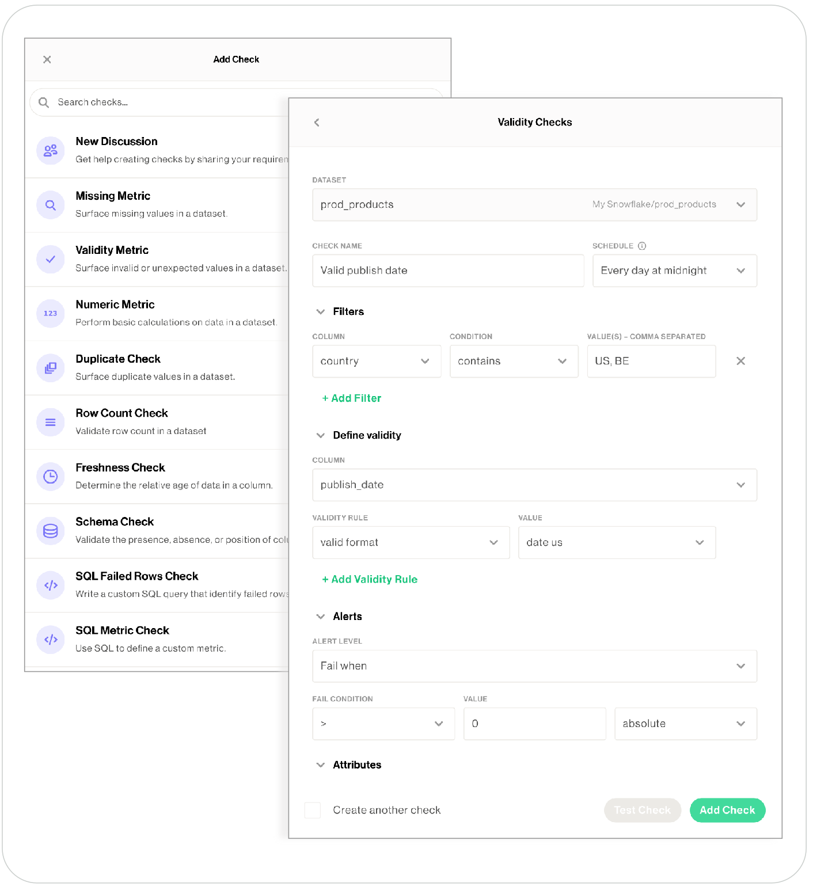
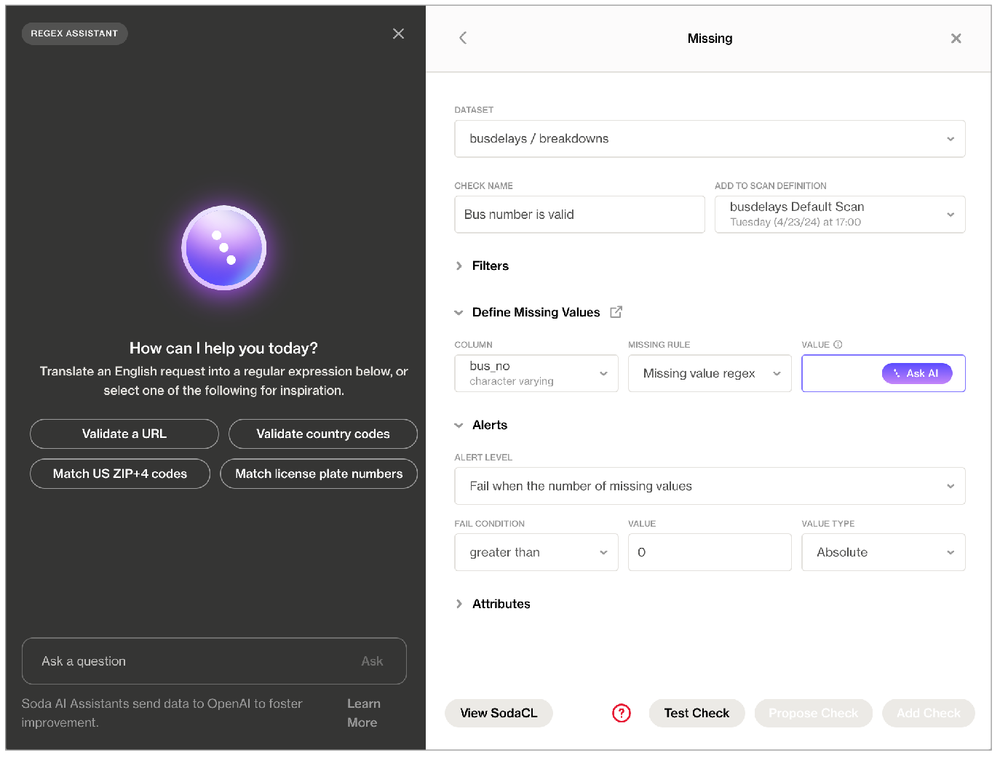

# Write SodaCL checks

**Soda Checks Language (SodaCL)** is a YAML-based, domain-specific language for data reliability. Used in conjunction with Soda tools, you use SodaCL to write checks for data quality, then run a scan of the data in your data source to execute those checks. A **Soda Check** is a test that Soda performs when it scans a dataset in your data source.

A **Soda scan** executes the checks you write in an agreement, in a checks YAML file, or inline in a programmatic invocation, and returns a result for each check: pass, fail, or error. Optionally, you can configure a check to warn instead of fail by setting an [alert configuration](../sodacl-reference/optional-config.md#add-alert-configurations).

As a step in the **Get started roadmap**, this guide offers instructions to define your first SodaCL checks in the Soda Cloud UI as no-code checks or in agreements, in a checks YAML file, or within a programmatic invocation of Soda.

#### Get started roadmap

1. ~~Choose a flavor of Soda~~
2. ~~Set up Soda: install, deploy, or invoke~~
3. **Write SodaCL checks** 📍 You are here!
4. Run scans and review results
5. Organize, alert, investigate

***

#### Examples

```yaml
# Checks for basic validations
checks for dim_customer:
  - row_count between 10 and 1000
  - missing_count(birth_date) = 0
  - invalid_percent(phone) < 1 %:
      valid format: phone number
  - invalid_count(number_cars_owned) = 0:
      valid min: 1
      valid max: 6
  - duplicate_count(phone) = 0

checks for dim_product:
  - avg(safety_stock_level) > 50
# Checks for schema changes
  - schema:
      name: Find forbidden, missing, or wrong type
      warn:
        when required column missing: [dealer_price, list_price]
        when forbidden column present: [credit_card]
        when wrong column type:
          standard_cost: money
      fail:
        when forbidden column present: [pii*]
        when wrong column index:
          model_name: 22

# Check for freshness 
  - freshness (start_date) < 1d

# Check for referential integrity
checks for dim_department_group:
  - values in (department_group_name) must exist in dim_employee (department_name)
```

## Define SodaCL checks



> 🎥 Watch a [5-minute video](https://www.soda.io/resources/introducing-no-code-checks) for no-code checks and discussions, if you like!

✖️    Requires Soda Core Scientific\
✖️    Requires Soda Core\
✖️    Requires Soda Library + Soda Cloud\
✔️    Requires Soda Agent + Soda Cloud

<figure><figcaption></figcaption></figure>

### Prerequisites <a href="#prerequisites" id="prerequisites"></a>

* You, or an Admin on your Soda Cloud account, has [deployed a Soda Agent](../quick-start-sip/deploy.md) version 0.8.52 or greater, and connected it to your Soda Cloud account.
* You, or an Admin on your Soda Cloud account, has [added a new datasource](../quick-start-sip/deploy.md#add-a-new-data-source) via the Soda Agent in your Soda Cloud account _and_ configured the data source to [discover the datasets](profile.md#add-dataset-discovery) in the data source for which you want to write no-code checks. (Soda must have access to dataset names and column names to present those values in dropdown menus during no-code check creation.)
* You must have permission to edit the dataset; see [Manage dataset roles](../collaborate/roles-dataset.md).

### Create a new check <a href="#create-a-new-check" id="create-a-new-check"></a>

SodaCL includes over 25 built-in metrics that you can use to write checks, a subset of which are accessible via no-codecheck creation. The table below lists the checks available to create via the no-code interface; access [SodaCL reference](../sodacl-reference/) for detailed information about each metric or check.

| <p>Missing<br>Validity<br>Numeric<br>Duplicate<br>Row count</p> | <p>Freshness<br>Schema<br>SQL Failed rows<br>SQL Metric<br> <br></p> |
| --------------------------------------------------------------- | -------------------------------------------------------------------- |

1. As a user with [permission](../collaborate/roles-dataset.md#dataset-roles-and-permissions) to do so of a dataset to which you wish to add checks, navigate to the dataset, then click **Add Check**. You can only create a check via the no-code interface for datasets in data sources connected via a Soda Agent.
2. Select the type of check you wish to create, then complete the form to create the check. Refer to table below for guidance on the values to enter.
3. Optionally, **Test** your check, then click **Propose check** to initiate a [**Discussion**](../learning-resources/glossary.md#discussion) with colleagues. Soda executes the check during the next scan according to the schedule you selected, or whenever a Soda Cloud user runs the schedule scan manually.\
   Be aware that a schema check requires a minimum of two measurements before it yields a useful check result because it needs at least one historical measurement of the existing schema against which to compare a new measurement to look for changes. Thus, the first time Soda executes this check, the result is `[NOT EVALUATED]`, indicated by a gray, question mark status icon.
4. Click **Add Check** to include the new, no-code check in the next scheduled scan of the dataset. Note that a user with Viewer permissions cannot add a check, they can only propose checks.
5. Optionally, you can manually execute your check immediately. From the dataset’s page, locate the check you just created and click the stacked dots, then select **Execute Check**. Soda executes _only_ your check.

| Field or Label                        | Guidance                                                                                                                                                                                                                                                                                                                                                                                                                                                        |
| ------------------------------------- | --------------------------------------------------------------------------------------------------------------------------------------------------------------------------------------------------------------------------------------------------------------------------------------------------------------------------------------------------------------------------------------------------------------------------------------------------------------- |
| Dataset                               | Select the dataset to which you want the check to apply.                                                                                                                                                                                                                                                                                                                                                                                                        |
| Check Name                            | Provide a unique name for your check.                                                                                                                                                                                                                                                                                                                                                                                                                           |
| Add to Scan Definition                | Select the scan definition to which you wish to add your check. Optionally, you can click **create a new Scan Definition** if you want Soda to execute the check more or less frequently, or at a different time of day than existing scan definitions dictate. See [Manage scheduled scans](../run-a-scan/scan-mgmt.md) for details.                                                                                                                           |
| Filter fields                         | Optionally, add an [in-check filter](../sodacl-reference/optional-config.md#add-a-filter-to-a-check) to apply conditions that specify a portion of the data against which Soda executes the check.                                                                                                                                                                                                                                                              |
| Define Metric/Values/Column/SQL       | <p>As each metric or check requires different values, refer to <a href="../sodacl-reference/metrics-and-checks.md">SodaCL reference</a> for detailed information about each metric or check.<br>Learn more about how <a href="./#about-soda-ai-assistants">Soda uses OpenAI</a> to process the input for SQL and Regex assistants in no-code checks.</p>                                                                                                        |
| Alert Level                           | <p>Select the check result state(s) for which you wish to be notified: Fail, Warn, or Fail and Warn. See <a href="../run-a-scan/#view-scan-results">View scan results</a> for details.<br>By default, alert notifications for your check go to the <strong>Dataset Owner</strong>. See <a href="./#define-alert-notification-rules">Define alert notification rules</a> to set up more alert notifications.</p>                                                 |
| Fail Condition, Value, and Value Type | <p>Set the values of these fields to specify the threshold that constitutes a fail or warn check result.<br>For example, if you are creating a <strong>Duplicate Check</strong> and you want to make sure that less than 5% of the rows in the column you identified contain duplicates, set:<br>• <strong>Fail Condition</strong> to <code>></code><br>• <strong>Value</strong> to <code>5</code><br>• <strong>Value Type</strong> to <code>Percent</code></p> |
| Attribute fields                      | Select from among the list of existing attributes to apply to your check so as to organize your checks and alert notifications in Soda Cloud. Refer to [Add check attributes](../collaborate/check-attributes.md) for details.                                                                                                                                                                                                                                  |

### **About Soda AI assistants**

Powered by OpenAI's GPT-3.5 & GPT-4, the generative SQL and regular expression assistants available in Soda Cloud's no-code checks helps you write the queries and expressions you can add to validity, missing, SQL failed rows, and SQL metric checks.

When creating a Missing or Validity check in the no-code user interface in Soda Cloud, you can click for help from the **Soda AI Regex Assistant** to translate an English request into a regular expression you can use to define missing or valid values. Similarly, access the **Soda AI SQL Assistant** in SQL Failed Rows or SQL Metric checks to generate SQL queries based on requests in plain English.

<figure><figcaption></figcaption></figure>

Soda AI SQL and Regex Assistants are enabled for _new_ Soda Cloud accounts by default. If you do not wish to use them, navigate to **your avatar** > **Organization Settings**, then click to remove the check from the box for **Enable SQL and Regex Assistants Powered By Powered by OpenAI**.

Existing Soda customers can review and accept the revised [Terms & Conditions](https://www.soda.io/terms-and-conditions), then [request access](https://go.soda.io/join-soda-ai-preview).

Soda acknowledges that the output of the assistants may not be fully accurate or reliable. Leverage the assistants’ output, but be sure to carefully review all queries and expressions you add to your checks. Refer to [Soda’s General Terms & Conditions](https://www.soda.io/terms-and-conditions) in the Use of AI for further details.

Be aware that Soda shares the content of all SQL and Regex assistant prompts/input and output with OpenAI to perform the processing that yields the output. Following OpenAI’s suggestion, Soda also sends metadata, such as schema information, to OpenAI along with the prompts/input in order to improve the quality of the output. Read more about OpenAI at [https://openai.com/policies](https://openai.com/policies).

The **Ask AI Assistant** is powered by kapa.ai and replaces SodaGPT. While Soda collaborates with third parties to develop certain AI features, it’s important to note that Soda does not disclose any primary data with our partners, such as data samples or data profiling details. We only share prompts and some schema information with OpenAI and kapa.ai to enhance the accuracy of the assistants.

Refer to [Soda’s General Terms & Conditions](https://www.soda.io/terms-and-conditions) in the **Use of AI** section for further details.

### Define alert notification rules <a href="#define-alert-notification-rules" id="define-alert-notification-rules"></a>

By default, alert notifications for your no-code check go to the **Dataset Owner** and **Check Owner**. If you wish to send alerts elsewhere, in addition to the owner, create a notification rule.

For a new rule, you define conditions for sending notifications including the severity of a check result and whom to notify when bad data triggers an alert.

In Soda Cloud, navigate to **your avatar** > **Notification Rules**, then click **New Notification Rule**. Follow the guided steps to complete the new rule. Use the table below for insight into the values to enter in the fields and editing panels.

| Field or Label   | Guidance                                                                                                                                                                                                                                                           |
| ---------------- | ------------------------------------------------------------------------------------------------------------------------------------------------------------------------------------------------------------------------------------------------------------------ |
| Name             | Provide a unique identifier for your notification.                                                                                                                                                                                                                 |
| For              | Select **All Checks**, or select **Selected Checks** to use conditions to identify specific checks to which you want the rule to apply. You can identify checks according to several attributes such as **Data Source Name**, **Dataset Name**, or **Check Name**. |
| Notify Recipient | Select the destination to which this rule sends its notifications. For example, you can send the rule’s notifications to a channel in Slack.                                                                                                                       |
| Notify About     | Identify the notifications this rule sends based on the severity of the check result: warn, fail, or both.                                                                                                                                                         |

### Edit an existing check <a href="#edit-an-existing-check" id="edit-an-existing-check"></a>

1. As a user with permission to do so, navigate to the dataset in which the no-code check exists.
2. To the right of the check you wish to edit, click the stacked dots, then select **Edit Check**. You can only edit a check via the no-code interface if it was first created as a no-code check, as indicated by the cloud icon in the **Origin** column of the table of checks.
3. Adjust the check as needed, test your check, then save. Soda executes the check during the next scan according to the scan definition you selected.
4. Optionally, you can execute your check immediately. Locate the check you just edited and click the stacked dots, then select **Execute Check**. Soda executes _only_ your check.



You can write SodaCL checks directly in the Soda Cloud user interface within an **agreement**. An agreement is a contract between stakeholders that stipulates the expected and agreed-upon state of data quality in a data source.

In an agreement, use SodaCL checks to define the state of “good quality” for data in this data source, then identify and get approval from stakeholders in your organization. Define whom Soda Cloud will notify when a check in the agreement fails, then set a schedule to regularly execute the Soda Checks to uphold the tenets of the agreement.

✖️    Requires Soda Core Scientific\
✖️    Requires Soda Core\
✖️    Requires Soda Library + Soda Cloud\
✔️    Requires Soda Agent + Soda Cloud

<figure><figcaption></figcaption></figure>

### Prerequisites <a href="#prerequisites-1" id="prerequisites-1"></a>

* You, or an Admin on your Soda Cloud account, has [deployed a Soda Agent](https://docs.soda.io/soda-agent/deploy.html) and connected it to your Soda Cloud account.
* You, or an Admin on your Soda Cloud account, has [added a new datasource](https://docs.soda.io/soda-agent/deploy.html#add-a-new-data-source) via the Soda Agent in your Soda Cloud account.

### Create a new agreement <a href="#create-a-new-agreement" id="create-a-new-agreement"></a>

For a new agreement, you define several details including which data to check, what checks to execute during a scan, and whom to notify when bad data triggers an alert.

In Soda Cloud, navigate to the **Agreements** dashboard, then click **New Agreement**. Follow the guided steps to complete the new agreement. Use the sections below for insight into the values to enter in the fields and editing panels in the guided steps.

#### **1. Select a Data Source**

You can only create an agreement that uses a data source that has been added to Soda Cloud via a Soda Agent.

| Field or Label  | Guidance                                                                                                                                                                                                                                                                                                                                       |
| --------------- | ---------------------------------------------------------------------------------------------------------------------------------------------------------------------------------------------------------------------------------------------------------------------------------------------------------------------------------------------- |
| Agreement Label | Provide a name for your agreement.                                                                                                                                                                                                                                                                                                             |
| Data Source     | <p>Select the data source that contains the datasets to which your agreement applies.<br>If you have no options to select in the dropdown, it is because you have not added a data source via a Soda Agent. You can only create agreements on datasets that are in a data source that has been onboarded into Soda Cloud via a Soda Agent.</p> |

#### **2. Write Checks**

Use SodaCL to define the checks that Soda Cloud executes on a regular schedule to uphold the tenets of this agreement. If any of these checks fail during a regularly-scheduled scan, Soda Cloud notifies the stakeholders you specify in the Notifications section.

Be sure to click **Test checks** to validate that the SodaCL syntax you have written is valid, and that Soda can execute the checks against your datasets without errors.

For help writing your first checks:

* browse the library of **SodaCL snippets** that insert correctly-formatted syntax for the most commonly-used checks for basic data quality
* use **Ask AI**, a generative AI assistant that turns natural-language requests into production-ready SodaCL checks. [Read more](https://docs.soda.io/soda-cloud/ask-ai.html)
* consider following the [Quick start for SodaCL](https://docs.soda.io/soda/quick-start-sodacl.html), including the [Tips and best practices](https://docs.soda.io/soda/quick-start-sodacl.html#tips-and-best-practices-for-sodacl) section
* refer to [SodaCL reference](https://docs.soda.io/soda-cl/metrics-and-checks.html) for exhaustive details on every type of metric and check

<figure><figcaption></figcaption></figure>

#### **3. Identify Stakeholders**

Add Stakeholders to this agreement who have an interest in maintaining or using the good-quality data in this data source. Consider adding a co-owner to your agreement for redundancy should you, as the agreement author, be absent.

Soda Cloud sends emails to request review and approval from all stakeholders, and waits to run scans which execute checks in the agreement until all stakeholders have approved the agreement.

#### **4. Set Notifications**

By default, Soda Cloud includes an out-of-the-box email notification to all the agreement’s stakeholders when a check in your agreement fails. You can remove or adjust this notification, or use the search bar to add more. Access [View scan results](https://docs.soda.io/soda-library/run-a-scan.html#view-scan-results) to learn more about pass, warn, and fail check results.

(Optional) If you have integrated your Soda Cloud account with [Slack](https://docs.soda.io/soda/integrate-slack.html) or another third-party service provider via a [webhook](https://docs.soda.io/soda/integrate-webhooks.html), use the search field to type a channel name to add the channel as a notification recipient. Alternatively, use the field to enter names of individual teammates with whom you collaborate in Soda Cloud.

#### **5. Set a Scan Definition**

After you have set up a new agreement, Soda Cloud sends approval requests to the stakeholders you identified in step 3. When stakeholders approve or reject your agreement, Soda Cloud sends you an email notification.

Regardless of the approval status of the agreement, however, Soda Cloud begins running scans of your data according to the scan definition you set. Soda Cloud sends notifications after each scan according to the settings you defined in step 4.

(Optional) You can click the link provided to create a new scan definition if you wish to run a scan to execute the checks in this agreement more or less frequently, or a different time of day, relative to the default scan definition for the data source.

To review existing scan definitions, navigate to the **Scans** menu item.

### Agreement tips and best practices <a href="#agreement-tips-and-best-practices" id="agreement-tips-and-best-practices"></a>

Further, take into account the following tips and best practices when writing SodaCL checks in an agreement.

* Avoid applying the same [customized check names](https://docs.soda.io/soda-cl/optional-config.html#customize-check-names) in multiple agreements. Soda Cloud associates check results with agreements according to name so if you reuse custom names, Soda Cloud may become confused about which agreement to which to link check results.
* If you use an [anomaly detection check](https://docs.soda.io/soda-cl/anomaly-detection.html), be aware that when you **Test Checks**, this type of checks results in `[NOT EVALUATED]`. The ML algorithm that anomaly detection checks use requires a minimum of four, regular-frequency scans before it has collected enough historic measurements against which to gauge an anomaly. Therefore, until it has collected enough historical measurements to use to gauge anomolies, Soda does not evaluate the check.
* Note that any checks you test in the context of this step in the agreements workflow _do not_ appear as “real” checks in the **Checks** dashboard.
* Except with a NOW variable with freshness checks, you cannot use variables in checks you write in an agreement in Soda Cloud as it is impossible to provide the variable values at scan time.

> See also: [Tips and best practices for SodaCL](https://docs.soda.io/soda/quick-start-sodacl.html#tips-and-best-practices-for-sodacl)



As a Data Engineer, you can write SodaCL checks directly in a `checks.yml` file, or leverage check suggestions in the Soda Library CLI to prepare a basic set of data quality checks for you. Alternatively, you can add SodaCL checks to a programmatic invocation of Soda Library.

### Manually write SodaCL checks

✔️    Some checks require Soda Core Scientific\
✔️    Supported in Soda Core\
✔️    Supported in Soda Library + Soda Cloud\
✔️    Supported in Soda Cloud Agreements + Soda Agent

***

The checks YAML file stores the Soda Checks you write using SodaCL. Use this file to manually write your own SodaCL checks.

1. Using a code editor, create a new file called `checks.yml`.
2. Copy+paste the following basic check syntax in your file, then adjust the value for `dataset_name` to correspond with the name of one of the datasets in your data source.

```yaml
checks for dataset_name:
  - row_count > 0
```

3. Save the changes to the `checks.yml` file.
4. To test the check and confirm the syntax is valid and error-free, use the following command to run a scan of the data in your data source. Replace the value for `my_datasource` with the name of the data source you added to your `configuration.yml` file. Read more about \[scans]\().

```shell
soda scan -d my_datasource -c configuration.yml checks.yml
```

Command-line Output:

```shell
Soda Library 1.0.x
Scan summary:
1/1 check PASSED: 
    dim_customer in adventureworks
      row_count > 0 [PASSED]
All is good. No failures. No warnings. No errors.
Sending results to Soda Cloud
Soda Cloud Trace: 67592***474
```

5. Add more checks to the `checks.yml` file to test for multiple data quality metrics. Consult the \[SodaCL tutorial]\() for advice and the \[Use case guides]\() for example checks. Refer to \[SodaCL reference]\() for exhaustive details on every type of metric and check.

### Use check suggestions

✔️    Requires Soda Core Scientific\
✖️    Supported in Soda Core\
✔️    Requires Soda Library + Soda Cloud\
✔️    Compatible with BigQuery, PostgreSQL, Snowflake data sources\
✖️    Supported in Soda Cloud Agreements + Soda Agent

***

**Check suggestions** assists Soda users in auto-generating basic data quality checks using the Soda Checks Language (SodaCL), a domain-specific language for data quality testing.

Instead of writing your own data quality checks from scratch, check suggestions profiles your dataset and prompts you through a series of questions so that it can leverage the built-in Soda metrics and quickly prepare data quality checks tailored to that individual dataset.

#### **Compatibility**

You can use check suggestions with the following data sources:

* GCP BigQuery
* PostgreSQL
* Snowflake

#### **Prerequisites**

* You have installed Python 3.10 or greater.
* You have installed a [Soda Library package](https://docs.soda.io/soda-library/install.html#install-soda-library-1) for BigQuery, PostgreSQL, or Snowflake in your environment and [configured](https://docs.soda.io/soda-library/install.html#configure-soda) it to connect to your data source.

#### **Run check suggestions**

Use the following command to run the check suggestions assisstant. Refer to the table below for input values for the command options.

```
soda suggest -d adventureworks -c configuration.yml -ds dataset_name
```

| Option                                                              | Required? | Value                                                                                                                                                                                   |
| ------------------------------------------------------------------- | --------- | --------------------------------------------------------------------------------------------------------------------------------------------------------------------------------------- |
| <p><code>-d TEXT</code> OR<br><code>--datasource TEXT</code></p>    | required  | Identify the name of your data source.                                                                                                                                                  |
| <p><code>-c TEXT</code> OR<br><code>--configuration TEXT</code></p> | required  | Identify the filepath and filename of your own `configuration.yml` file.                                                                                                                |
| <p><code>-o TEXT</code> OR<br><code>--output-dir TEXT</code></p>    | optional  | Specify the output directory for the `checks.yml` file check suggestions generates. If you do not specify a location, it saves the `checks.yml` file in your current working directory. |
| <p><code>-ds TEXT</code> OR<br><code>--dataset TEXT</code></p>      | optional  | Specify the dataset name for the `checks.yml` file. If you do not specify a name, it asks you to identify a dataset during the suggestion workflow.                                     |
| `--disable-color BOOLEAN`                                           | optional  | Set to `false` if don’t wish to see colors.                                                                                                                                             |

When running, check suggestions automatically prompts you with a series of questions to gather information about your data and the quality checks that you ought to apply. After you answer, or skip the questions, it generates a `checks.yml` file with suggested checks based on your input.

Following best practice, check suggestions prepares one `checks.yml` file per dataset; if you wish, you can run `soda suggest` multiple times to prepare suggested checks and `checks.yml` files for each dataset in your data source. After it generates the `checks.yml` file, you can manually add, remove, or modify data quality checks in the file as you wish.

With both a `configuration.yml` and a prepared `checks.yml` file, you can follow the assistant’s final prompt to run a scan for data quality.

#### **Select a dataset**

Check suggestions prompts you to select a dataset from the list of available datasets in the data source. It prepares one `checks.yml` file per dataset.

#### **Select checks**

The assistant prompts you to select the checks for basic data quality coverage you wish to include in the `checks.yml`. It can prepare only the following types of basic checks:

* [schema](https://docs.soda.io/soda-cl/schema.html)
* [row count](https://docs.soda.io/soda-cl/numeric-metrics.html)
* [freshness](https://docs.soda.io/soda-cl/freshness.html)
* [validity](https://docs.soda.io/soda-cl/validity-metrics.html)
* [missing](https://docs.soda.io/soda-cl/missing-metrics.html)
* [duplicate](https://docs.soda.io/soda-cl/numeric-metrics.html)

#### **Set column filtering**

If your dataset contains more than 20 columns, the assisstant prompts you to shorten the list by asking you to select the column names to which you wish to add checks for missing and duplicate values.

#### **Add a schema check**

This type of check validates the schema, or structure, of your data. It ensures that the columns you expect to exist are present in the dataset, and that they have the correct data type and index location.

Refer to [Schema checks](https://docs.soda.io/soda-cl/schema.html) for more information.

```yaml
checks for dataset_A:
  - schema:
      name: Any schema changes
      fail:
        when schema changes:
          - column delete
          - column add
          - column index change
          - column type change
```

#### **Add row count checks**

This step adds two checks: one to confirm that the dataset is not empty, and one to ensure that the current row count is not significantly different from the expected row count. Soda determines the expected row count relative to the previous row count value using a time series-based anomaly detection model.

Refer to [Anomaly detection checks](https://docs.soda.io/soda-cl/anomaly-detection.html) for more information.

```yaml
checks for dataset_A:
  - row_count > 0
  - anomaly detection for row_count
```

#### **Add time-based partitioning**

Also referred to as dataset filtering, this step prompts you to specify a time range on which to apply the data quality checks.

By default, check suggestions sets the time-based partition to one day if the column contains DATE type data, and the preceding 24 hours if the column contains DATETIME data. When generating a list of candidate columns to which to apply the time-based partition, the assisstant uses heuristic methods to automatically identify and rank column names.

<details>

<summary>Read more about heuristic ranking</summary>

The heuristic ranking strategy identifies the most suitable columns for effectively partitioning your data. The algorithm it uses for ranking applies several criteria and heuristic scoring to assess the columns' incrementality, standard deviation, maximum date, missing values, and column names.\


1. Incrementality: This criterion checks whether the values in a time-based column incrementally change over time. It assesses if the date or time values consistently increase as new records are added. Columns with higher incrementality scores are more likely to provide a meaningful partitioning mechanism.
2. Standard Deviation: Check suggestions uses standard deviation between dates to assess the uniformity or distribution of values in a time-based column. Columns with low standard deviation indicate that the dates are closely packed together, suggesting a more consistent and evenly-spaced distribution.
3. Maximum Date: This step examines the maximum date value in a column and compares it to the current date. Columns with a maximum date value that is less than the current date receive a higher score. This criterion helps identify columns with recent data.
4. Missing Value: Check suggestions considers the number of missing values in a column; those with fewer missing values receive a higher score. This criterion helps identify columns with more complete data.
5. Column Name: Check suggestions analyzes the names of the columns to determine their relevance for partitioning. The algorithm assigns higher points to columns with names that contain keywords such as "create", "insert", "generate", etc. This criterion aims to identify columns that are likely to represent meaningful, time-based information.

After calculating scores from each of the five criteria, the algorithm combines them to obtain a comprehensive score for each time-based column. The assistant then ranks the columns from highest to lowest score, providing guidance on the partitioning suitability of each column.

</details>

Refer to [Configure dataset filters](https://docs.soda.io/soda-cl/filters.html#configure-dataset-filters) for more information.

```yaml
filter customer [daily]:
where: created_at > TIMESTAMP '${NOW}' - interval '1d'

checks for customer [daily]:
  - missing_count(name) < 5
  - duplicate_count(phone) = 0
```

#### **Add a freshness check**

A freshness check ensures that the data in the dataset is up-to-date according to the latest value entered in a column containing date or timestamp values. Check suggestions uses the same heuristic methods with the time based partitioning to rank the columns. After ranking the columns, the CLI estimates the threshold by using the standard error of date differences. It then prompts you to select the column and threshold to use for the freshness check.

Refer to [Freshness checks](https://docs.soda.io/soda-cl/freshness.html) for more information.

```yaml
checks for dataset_A:
  - freshness(date_first_purchase) < 24h
```

#### **Add validity checks**

A validity check compares the data in text columns to a specific format (see the list that follows) to determine whether the content is valid. For example, such a check can validate that all rows in an `id` column contain UUID-formatted values.

Check suggestions prompts you to select the columns that are candidates for validity checks, which must contain text type data such as CHAR, VARCHAR, or TEXT.

Valid formats:

* UUID
* email
* phone number
* credit card number
* IP address (IPv4 and IPv6)
* money
* timestamp
* date
* time

Refer to [Validity metrics](https://docs.soda.io/soda-cl/validity-metrics.html) for more information.

```yaml
checks for dataset_A:
  - invalid_count(email_address) = 0:
      valid format: email
```

#### **Add missing checks**

A missing check automatically identifies any NULL values within your dataset. Check suggestions prompts you to select the columns to which you want to apply a missing check. By default, it sets each check threshold to `0`, which means that a check fails if there are any NULL values in the column.

Refer to [Missing metrics](https://docs.soda.io/soda-cl/missing-metrics.html) for more information.

```yaml
checks for dataset_A:
  - missing_count(customer_key) = 0
  - missing_count(geography_key) = 0
  - missing_count(customer_alternate_key) = 0
  - missing_count(title) = 0
  - missing_count(first_name) = 0
  - missing_count(middle_name) = 0
  - missing_count(last_name) = 0
  - missing_count(name_style) = 0
  - missing_count(birth_date) = 0
  - missing_count(marital_status) = 0
  - missing_count(suffix) = 0
  - missing_count(gender) = 0
```

#### **Add duplicate checks**

A duplicate check identifies duplicate records or entries within your dataset. By default, it sets each check threshold to `0`, which means that a check fails if there are any duplicate values in the column.

Refer to [Numeric metrics](https://docs.soda.io/soda-cl/numeric-metrics.html#list-of-numeric-metrics) for more information.

```yaml
checks for dataset_A:
  - duplicate_count(customer_key) = 0
  - duplicate_count(geography_key) = 0
  - duplicate_count(customer_alternate_key) = 0
  - duplicate_count(title) = 0
  - duplicate_count(first_name) = 0
  - duplicate_count(middle_name) = 0
  - duplicate_count(last_name) = 0
  - duplicate_count(name_style) = 0
  - duplicate_count(birth_date) = 0
  - duplicate_count(marital_status) = 0
  - duplicate_count(suffix) = 0
  - duplicate_count(gender) = 0
```

#### Programmatically add checks

✔️    Some checks require Soda Core Scientific\
✔️    Some checks supported in Soda Core\
✔️    Supported in Soda Library + Soda Cloud\
✖️    Supported in Soda Cloud Agreements + Soda Agent

***

Follow the [steps above](./#manually-write-sodacl-checks) to create a `checks.yml` file to define your checks for data quality. Then, add the file(s) to your Python program as in the example below.\
Be sure to include any variables in your programmatic scan _before_ the check YAML files. Soda requires the variable input for any variables defined in the check YAML files.

```python
from soda.scan import Scan

scan = Scan()
scan.set_data_source_name("events")

scan.add_configuration_yaml_file(file_path="~/.soda/my_local_soda_environment.yml")


# Add variables
###############
scan.add_variables({"date": "2022-01-01"})


# Add check YAML files
##################
scan.add_sodacl_yaml_file("./my_programmatic_test_scan/sodacl_file_one.yml")
scan.add_sodacl_yaml_file("./my_programmatic_test_scan/sodacl_file_two.yml")
scan.add_sodacl_yaml_files("./my_scan_dir")
scan.add_sodacl_yaml_files("./my_scan_dir/sodacl_file_three.yml")
```



## Next

1. ~~Choose a flavor of Soda~~
2. ~~Set up Soda: install, deploy, or invoke~~
3. ~~Write SodaCL checks~~
4. [**Run scans and review results**](../run-a-scan/)
5. Organize, alert, investigate


