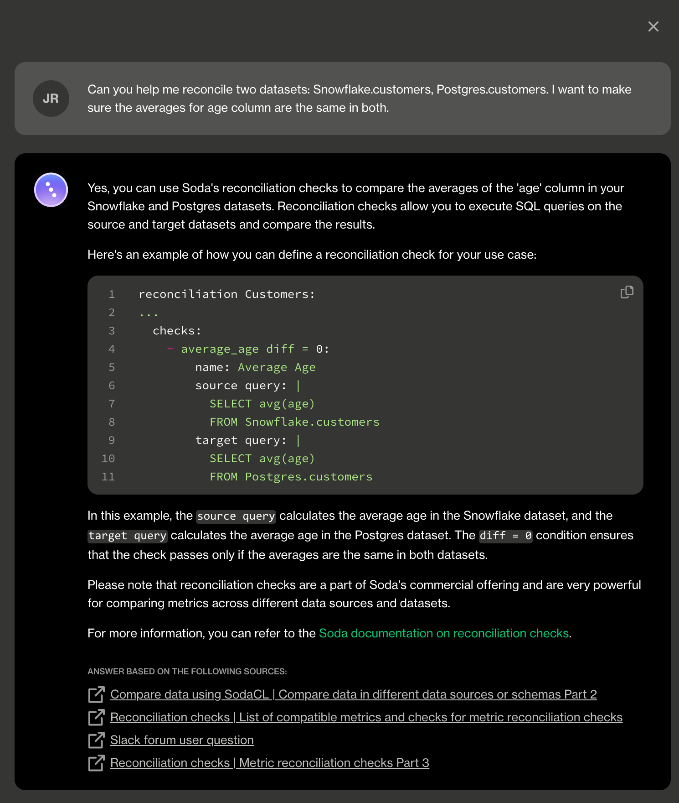
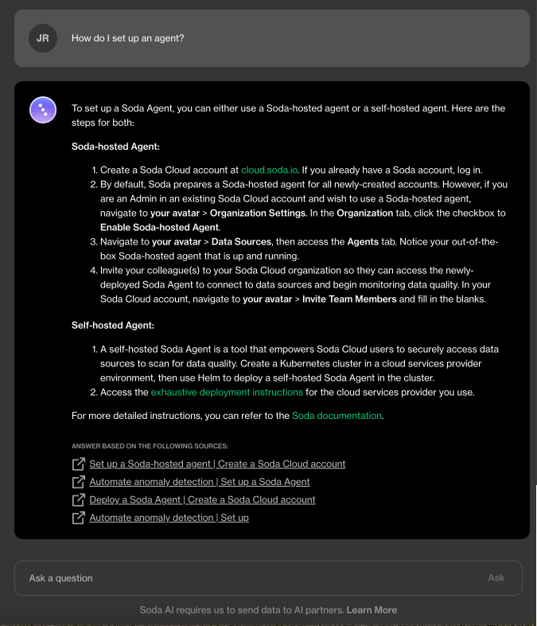
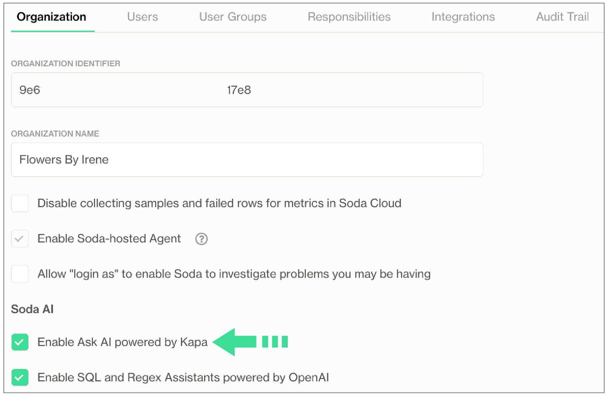

# Write checks with Ask AI

**Ask AI** is an in-product generative AI assistant for data quality testing.\
Ask AI replaces SodaGPT, the original implementation of a generative AI assistant.

✖️    Requires Soda Core Scientific (included in a Soda Agent)\
✖️    Supported in Soda Core\
✔️    Supported in Soda Library + Soda Cloud\
✔️    Supported in Soda Cloud + Soda Agent

***

[Log in](https://cloud.soda.io/login) to your **Soda Cloud** account, click the **Ask AI** button in the main nav, then provide natural language instructions to the interface to:

* receive fully-formed, syntax-correct checks in the [Soda Checks Language (SodaCL)](../sodacl-reference/metrics-and-checks.md)
* get answers to questions about how to configure or use Soda
* obtain advice about how to resolve an error while using Soda

<figure><figcaption></figcaption></figure>

<figure><figcaption></figcaption></figure>

## Enable Ask AI

If you do not already have an account, [sign up for Soda Cloud](https://cloud.soda.io/signup) for a 45-day free trial. Then, as a user with [permission](../collaborate/roles-global.md#global-roles-and-permissions) to do so, navigate to **your avatar** > **Organization Settings**, then check the box to **Enable Ask AI powered by Kapa**.

<figure><figcaption></figcaption></figure>

Can't see the Ask AI button?

If you are an existing Soda customer, you must accept Soda's revised terms and conditions for service that includes the use of third-party tools that facilitate generative AI capabilites. Reply to Soda's Terms & Conditions email to accept the revisions, or contact [Soda Support](mailto:support@soda.io) to arrange acceptance and enable the feature.\
\
If you have accepted the revised terms and conditions but still cannot see the Ask AI button, as a user with \[permission]\(/soda-cloud/roles-global.html#global-roles-and-permissions) to do so, navigate to **your avatar** > **Organization Settings**, then check the box to **Enable Ask AI powered by Kapa**.

## About Ask AI

The **Ask AI Assistant** is powered by kapa.ai and replaces SodaGPT. While Soda collaborates with third parties to develop certain AI features, it’s important to note that Soda does not disclose any primary data with our partners, such as data samples or data profiling details. We only share prompts and some schema information with OpenAI and kapa.ai to enhance the accuracy of the assistants.

Refer to [Soda’s General Terms & Conditions](https://www.soda.io/terms-and-conditions) in the **Use of AI** section for further details.

## Go further

* Create [no-code checks](./#define-sodacl-checks) via the Soda Cloud user interface.
* Get started with Soda by following a [tutorial](../quick-start-sip/).
* Consider using [check suggestions](check-suggestions.md) to profile your data and suggest basic checks for data quality.


