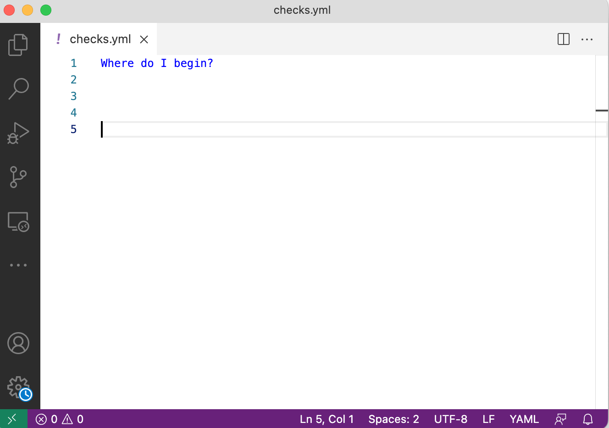

# SodaCL tutorial

If you are staring at a blank page wondering what SodaCL checks to write to surface data quality issues, this quick start tutorial is for you.

Alternatively, use the [Check suggestions](check-suggestions.md) assistant in the Soda Library CLI to profile a dataset and auto-generate basic checks for data quality.

<figure><figcaption></figcaption></figure>

✖️    Requires Soda Core Scientific (included in a Soda Agent)\
✔️    Supported in Soda Core\
✔️    Supported in Soda Library + Soda Cloud\
✔️    Supported in Soda Cloud Agreements + Soda Agent\
✔️    Some available as no-code checks}

***

## SodaCL: In brief

**Soda Checks Language (SodaCL)** is a YAML-based, domain-specific language for data reliability. Used in conjunction with Soda software, you use SodaCL to write checks for data quality, then run a scan of the data in your data source to execute those checks.

A **Soda Check** is a test that Soda performs when it scans a dataset in your data source. A **Soda scan** executes the checks you defined and returns a result for each check: pass, fail, or error. Optionally, you can configure a check to warn instead of fail by setting an [alert configuration](../sodacl-reference/optional-config.md#add-alert-configurations).

## About this tutorial

With over [25 built-in SodaCL checks and metrics](../sodacl-reference/metrics-and-checks.md#list-of-sodacl-metrics-and-checks) to choose from, it can be hard to know where to begin. This tutorial offers suggestions for some basic checks you can write to begin surfacing missing, invalid, unexpected data in your datasets.

All the example checks in this tutorial use placeholder values for dataset and column name identifiers, but you can copy+paste the examples into your own checks YAML file and adjust the details to correspond to your own data.

You do not need to follow the tutorial sequentially.

## Tutorial prerequisites

* You have completed the [Take a sip of Soda](../quick-start-sip/) tutorial\
  OR\
  you have followed the instructions to [Get started](../quick-start-sip/get-started-roadmap.md) Soda on your own.
* You have created a new YAML file in your code editor and named it `checks.yml`\
  OR\
  you are on step 2 in the guided flow to create a new Soda Agreement.
* (Optional) You have read the first two sections in [Metrics and checks](../sodacl-reference/metrics-and-checks.md) as a primer for SodaCL.

## Row count and cross checks

One of the most basic checks you can write uses the `row_count` metric. When it executes the following check during a scan, Soda simply counts the rows in the dataset you identify in the `checks for` section header to confirm that the dataset is not empty. If it counts one or more rows, the check result is pass.

```yaml
# Check that a dataset contains rows
checks for dataset_name:
  - row_count > 0
```

The check above is an example that use a numeric metric in a standard check pattern. By contrast, the following unique cross check compares row counts between datasets within the same data source without setting a threshold for volume, like `> 50`.

This type of check is useful when, for example, you want to compare row counts to validate that a transformed dataset contains the same volume of data as the source from which it came.

```yaml
# Compare row counts between datasets
checks for dataset_name:
  - row_count same as other_dataset_name
```

[Run a scan](../run-a-scan/) to execute your checks:

```yaml
soda scan -d datasource_name -c configuration.yml checks.yml
```

### Read more

* [Numeric metrics](../sodacl-reference/numeric-metrics.md)
* [Standard check pattern](../sodacl-reference/metrics-and-checks.md#check-types)
* [Cross checks](../sodacl-reference/cross-row-checks.md)

## Duplicate check

For the nearly universal use case that demands uniqueness, you can use the `duplicate_count` or `duplicate_percent` metrics. In the following example, Soda counts the number of duplicate values in the `column_name` column, identified as the argument in parentheses appended to the metric. If there is even one value that is a duplicate of another, the check result is fail.

This type of check is useful when, for example, you need to make sure that values in an `id` column are unique, such `customer_id` or `product_id`.

```yaml
# Check that a column does not contain any duplicate values
checks for dataset_name:
  - duplicate_count(column_name) = 0
```

If you wish, you can check for duplicate pairs in multiple columns. In the following example, Soda counts the number of duplicate values in both `column_name1` and `column_name2`. Be sure to add a space between the comma-separated values in the list of column names.

<details>

<summary>Example of duplicate pairs</summary>

Rows 1 and 4 are duplicates.

| -  | column 1 | column 2 |
| -- | -------- | -------- |
| 1. | apple    | banana   |
| 2. | apple    | pear     |
| 3. | banana   | pear     |
| 4. | apple    | banana   |

</details>

```yaml
# Check that duplicate pairs do not exist between columns
checks for dataset_name:
  - duplicate_count(column_name1, column_name2) = 0
```

[Run a scan](../run-a-scan/) to execute your checks:

```yaml
soda scan -d datasource_name -c configuration.yml checks.yml
```

### Read more

* [Numeric metrics](../sodacl-reference/numeric-metrics.md)

## Freshness check

If your dataset contains a column that stores timestamp information, you can configure a freshness check. This type of check is useful when, for example, you need to validate that the data feeding a weekly report or dashboard is not stale. Timely data is reliable data!

In this example, the check fails if the most-recently added row (in other words, the youngest row) in the `timestamp_column_name` column is more than 24 hours old.

```yaml
# Check that data in dataset is less than one day old
checks for dataset_name:
  - freshness(timestamp_column_name) < 1d
```

[Run a scan](../run-a-scan/) to execute your checks:

```yaml
soda scan -d datasource_name -c configuration.yml checks.yml
```

### Read more

* [Freshness checks](../sodacl-reference/freshness.md)

## Missing and invalid checks

SodaCL's missing metrics make it easy to find null values in a column. You don't even have to specify that `NULL` qualifies as a missing value because SodaCL registers null values as missing by default. The following check passes if there are no null values in `column_name`, identified as the value in parentheses.

```yaml
# Check that there are no null values in a column
checks for dataset_name:
  - missing_count(column_name) = 0
```


If the type of data a dataset contains is TEXT (string, character varying, etc.), you can use an invalid metric to surface any rows that contain ill-formatted data. This type of check is useful when, for example, you need to validate that all values in an email address column are formatted as `name@domain.extension`.

The following example fails if, during a scan, Soda discovers that more than 5% of the values in the `email_column_name` do not follow the email address format.

```yaml
# Check an email column that all values are in email format
checks for dataset_name:
  - invalid_percent(email_column_name) > 5%:
      valid format: email
```


If you want to surface more than just null values as missing, you can specify a list of values that, in the context of your business rules, qualify as missing. In the example check below, Soda registers `N/A`, `0000`, or `none` as missing values in addition to `NULL`; if it discovers more than 5% of the rows contain one of these values, the check fails.

Note that the missing value `0000` is wrapped in single quotes; all numeric values you include in such a list must be wrapped in single quotes.

```yaml
# Check that fewer than 5% of values in column contain missing values
checks for dataset_name:
  - missing_percent(column_name) < 5%:
      missing values: [N/A, '0000', none]
```

[Run a scan](https://docs.soda.io/soda-library/run-a-scan.html) to execute your checks:

```yaml
soda scan -d datasource_name -c configuration.yml checks.yml
```

### Read more

* [Missing metrics](../sodacl-reference/missing-metrics.md)
* [Validity metrics](../sodacl-reference/validity-metrics.md)

## Reference checks

If you need to validate that data in one column of a dataset exists in a column in another dataset, you can use a reference check. The following unique check compares the values of `state_code` to confirm that those values exist in `code` in the `iso_3166-2` dataset in the same data source. The check passes if the values in the `state_code` exist in `code`.

```yaml
# Check that values in a column exist in another column in a different dataset
checks for dataset_name:
  - values in (state_code) must exist in iso_3166-2 (code)
```


If you wish, you can compare the values of multiple columns in one check. Soda compares the column names respectively, so that in the following example, `column_name1` compares to `other_column1`, and `column_name2` compares to `other_column2`.

```yaml
# Check that values in two columns exist in two other columns in a different dataset
checks for dataset_name:
  - values in (column_name1, column_name2) must exist in different_dataset_name (other_column1, other_column2)
```

[Run a scan](https://docs.soda.io/soda-library/run-a-scan.html) to execute your checks:

```yaml
soda scan -d datasource_name -c configuration.yml checks.yml
```

### Read more

* [Reference checks](../sodacl-reference/reference.md)

## Schema checks

To eliminate the frustration of the silently evolving dataset schema, use schema checks with alert configurations to notify you when column changes occur.

If you have set up a Soda Cloud account, you can use a catch-all schema check, also known as a schema evolution check, that results in a warning whenever a Soda scan reveals that a column has been added, removed, moved within the context of an index, or changed data type relative to the results of the previous scan.

```yaml
# Check for any schema changes to dataset
checks for dataset_name:
  - schema:
      warn: 
        when schema changes: any
```


If you wish to apply a more granular approach to monitoring schema changes, you can specify columns in a dataset that ought to be present or which should not exist in the dataset.

The following example warns you when, during a scan, Soda discovers that `column_name` is missing in the dataset; the check fails if either `column_name1` or `column_name2` exist in the dataset. This type of check is useful when, for example, you need to ensure that datasets do not contain columns of sensitive data such as credit card numbers or personally identifiable information (PII).

```yaml
# Check for absent or forbidden columns in dataset
checks for dataset_name:
  - schema:
      warn:
        when required column missing: [column_name]
      fail:
        when forbidden column present: [column_name1, column_name2]
```

Be aware that a check that contains one or more alert configurations only ever yields a _single_ check result; one check yields one check result. If your check triggers both a warn and a fail, the check result only displays the more severe, failed check result. [Read more](../sodacl-reference/schema.md#expect-one-check-result).

[Run a scan](../run-a-scan/) to execute your checks:

```yaml
soda scan -d datasource_name -c configuration.yml checks.yml
```

### Read more

* [Alert configuration](../sodacl-reference/optional-config.md#add-alert-configurations)
* [Schema checks](../sodacl-reference/schema.md)
* [Expect one check result](../sodacl-reference/optional-config.md#expect-one-check-result)

## Tips and best practices for SodaCL

* Get your logic straight: your check defines a _passing_ state, what you expect to see in your dataset. Do not define a failed state.
* Take careful note of the data type of the column against which you run a check. For example, if numeric values are stored in a column as data type TEXT, a numeric check such as `min` or `avg` is incalculable.
* A check that uses [alert configurations](../sodacl-reference/optional-config.md#add-alert-configurations) only ever returns _one_ check result. See [Expect one check result](../sodacl-reference/optional-config.md#expect-one-check-result).
* The `invalid format` configuration key only works with data type TEXT. See [Specify valid format](../sodacl-reference/validity-metrics.md#specify-valid-format).
* Not all checks support in-check filters. See [List of compatible metrics and checks](../sodacl-reference/filters.md#list-of-compatible-metrics-and-checks).

#### Best practices

* To avoid typos or spelling errors, best practice dictates that you copy + paste any dataset or column names into your checks.
* It is good practice to add a [custom name](../sodacl-reference/numeric-metrics.md) to your check. Establish a naming convention – word order, underscores, identifiers – and apply easily-digestible check names for any colleagues with whom you collaborate.

#### Syntax tips

* Be sure to add a colon to the end of a check whenever you add a second line to a check such as for a missing or invalid configuration key, or if you add a [custom name](../sodacl-reference/numeric-metrics.md) for your check.
* Indentations in the SodaCL syntax are critical. If you encounter an error, check your indentation first.
* Spaces in the SodaCL syntax are critical. For example, be sure to add a space before and after your threshold symbol ( `=`, `>`, `>=` ); do _not_ add a space between a metric and the column to which it applies, such as `duplicate_count(column1)`.
* All comma-separated values in lists in SodaCL use a comma + space syntax, such as `duplicate_count(column1, column2)`; do not forget to add the space.
* Note that multi-word checks such as `missing_count` use underscores, but configuration keys, such as `missing regex`, do not. See [List of missing metrics](quick-start-sodacl.md#missing-and-invalid-checks) and [List of validity metrics](quick-start-sodacl.md).
* If you use `missing values` or `invalid values` configuration keys, note that values in a comma-separated list must be enclosed in square brackets. For example, `[US, BE, CN]`.
* Column names that contain colons or periods can interfere with SodaCL’s YAML-based syntax. For any column names that contain these punctuation marks, [apply quotes](../sodacl-reference/optional-config.md#use-quotes-in-a-check) to the column name in the check to prevent issues.\
  If you are using a failed row check with a CTE fail condition, however, the syntax checker does not accept an expression that begins with double-quotes. In that case, as a workaround, add a meaningless `true and` to the beginning of the CTE, as in the following example.

```yaml
checks for corp_value:
  - failed rows:
      fail condition: true and "column.name.PX" IS NOT null
```

## Go further

* Learn more about [SodaCL metrics and checks](../sodacl-reference/metrics-and-checks.md) in general.
* Read about the [Optional configurations](../sodacl-reference/optional-config.md) you can apply to SodaCL checks.
* [Take a sip of Soda](../quick-start-sip/) to run a simple data quality scan on example data.


