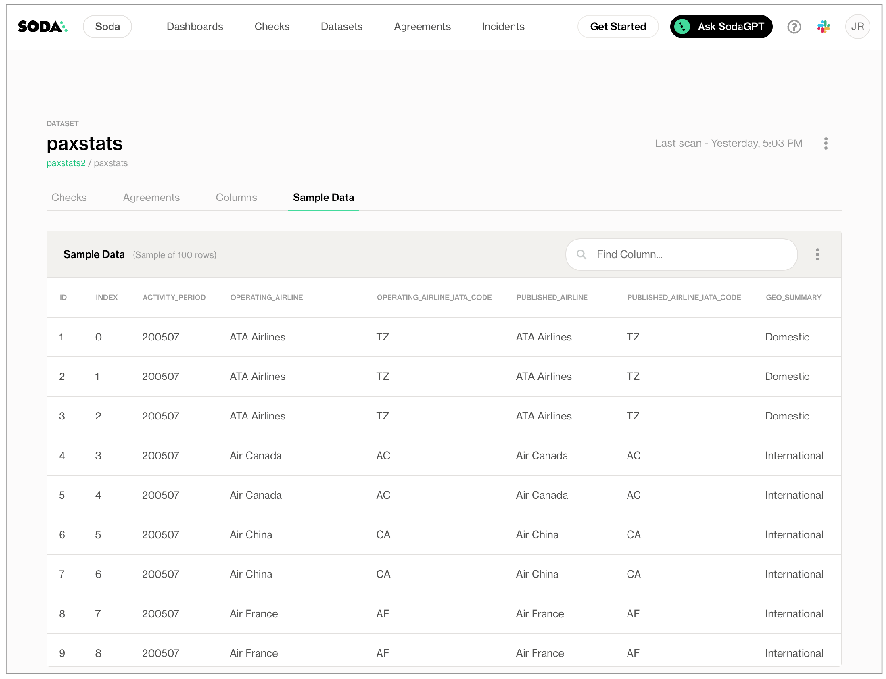

# Sample data with Soda

When you add or edit a data source in Soda Cloud, use the `sample datasets` configuration to send 100 sample rows to Soda Cloud. Examine the sample rows to gain insight into the type of checks you can prepare to test for data quality.

```yaml
sample datasets:
  datasets:
    - dim_customer
    - include prod%
    - exclude test%
```

✖️    Requires Soda Core Scientific (included in a Soda Agent)\
✖️    Supported in Soda Core\
✔️    Supported in Soda Library + Soda Cloud\
✔️    Supported in Soda Cloud Agreements + Soda Agent

***

## Sample datasets

Sample datasets captures sample rows from datasets you identify. You add sample datasets configurations as part of the guided workflow to create a new data source or edit an existing one. Navigate to **your avatar** > **Data Sources** > **New Data Source**, or select an existing data source, to begin. You can add this configuration to one of two places:

* to either step [3. Discover Datasets](../quick-start-sip/deploy.md#id-3.-discover)\
  OR
* or step [4. Profile Datasets](../quick-start-sip/deploy.md#id-4.-profile)

The example configuration below uses a wildcard character (`%`) to specify that Soda Library sends sample rows to Soda Cloud for all datasets with names that begin with `customer`, and _not_ to send samples for any dataset with a name that begins with `test`.

```yaml
sample datasets:
  datasets:
    - include customer%
    - exclude test%
```

\


You can also specify individual datasets to include or exclude, as in the following example.

```yaml
sample datasets:
  datasets:
    - include retail_orders
```

\


### Scan results in Soda Cloud

1. To review the sample rows in Soda Cloud, first [run a scan ](../run-a-scan/)of your data source so that Soda can gather and send samples to Soda Cloud.
2. In Soda Cloud, navigate to the **Datasets** dashboard, then click a dataset name to open the dataset's info page.
3. Access the **Sample Data** tab to review the sample rows.



\


## Add quotes to all datasets

If your dataset names include white spaces or use special characters, you must wrap those dataset names in quotes whenever you identify them to Soda, such as in a checks YAML file.

To add those necessary quotes to dataset names that Soda acts upon automatically – discovering, profiling, or sampling datasets, or creating automated monitoring checks – you can add a `quote_tables` configuration to your data source, as in the following example.

```yaml
data_source soda_demo:
  type: sqlserver
  host: localhost
  username: ${SQL_USERNAME}
  password: ${SQL_PASSWORD}
  quote_tables: true
```

## Inclusion and exclusion rules

* If you configure `sample datasets` to include specific datasets, Soda implicitly _excludes_ all other datasets from sampling.
* If you combine an include config and an exclude config and a dataset fits both patterns, Soda excludes the dataset from sampling.

## Disable samples in Soda Cloud

Where your datasets contain sensitive or private information, you may _not_ want to send samples from your data source to Soda Cloud. In such a circumstance, you can disable the feature completely in Soda Cloud.

To prevent Soda Cloud from receiving any sample data or failed row samples for any datasets in any data sources to which you have connected your Soda Cloud account, proceed as follows:

1. As a user with [permission](../collaborate/roles-global.md#global-roles-and-permissions) to do so, log in to your Soda Cloud account and navigate to **your avatar** > **Organization Settings**.
2. In the **Organization** tab, uncheck the box to **Allow Soda to collect sample data and failed row samples for all datasets**, then **Save**.

Alternatively, if you use Soda Library, you can adjust the configuration in your `configuration.yml` to disable all samples for an individual data source, as in the following example.

```yaml
data_source my_datasource:
  type: postgres
  ...
  sampler:
    disable_samples: True
```

Note that you cannot use an `exclude_columns` configuration to disable sample row collections from specific columns in a dataset. That configuration applies _only_ to [disabling failed rows sampling](../run-a-scan/failed-row-samples.md#disable-failed-row-samples).

## Go further

* Learn more about managing [failed row samples](../run-a-scan/failed-row-samples.md) with Soda.
* Reference [tips and best practices for SodaCL](quick-start-sodacl.md#tips-and-best-practices-for-sodacl).
* Use a [freshness check](../sodacl-reference/freshness.md) to gauge how recently your data was captured.
* Use [reference checks](../sodacl-reference/reference.md) to compare the values of one column to another.


