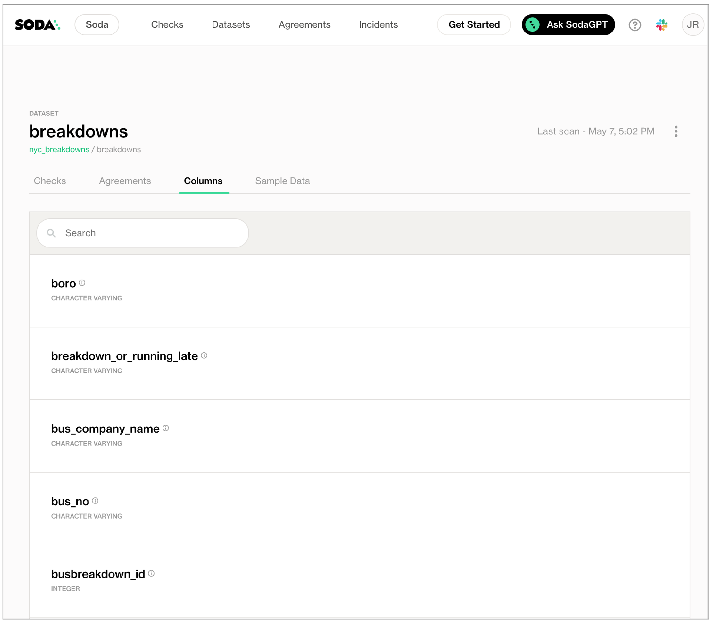

# Display profile information in Soda Cloud
*Last modified on *

Use the `discover datasets` and/or `profile columns` configurations to send information about datasets and columns to Soda Cloud. Examine the profile information to gain insight into the type checks you can prepare to test for data quality.

*Requires Soda Cloud*<br />

```yaml
discover datasets:
  datasets:
    - prod% # all datasets starting with prod
    - include prod% # same as above
    - exclude dev% # exclude all datasets starting with dev
```

```yaml
profile columns:
  columns:
    - datasetA.columnA # columnA of datasetA
    - datasetA.% # all columns of datasetA
    - dataset%.columnA # columnA of all datasets starting with dataset
    - dataset%.% # all columns of datasets starting with dataset
    - "%.%" # all datasets and all columns
    - include datasetA.% # same as datasetA.%
    - exclude datasetA.prod% # exclude  all columns starting with prod in datasetA
    - exclude dimgeography.% # exclude all columns of dimgeography dataset 
```

[Prerequisites](#prerequisites)<br />
[Limitations and known issues](#limitations-and-known-issues)<br />
[Define dataset discovery](#define-dataset-discovery) <br />
[Define column profiling](#define-column-profiling)<br />
[Compute consumption and cost considerations](#compute-consumption-and-cost-considerations)<br />
[Optional check configurations](#optional-check-configurations) <br />
[Inclusion and exclusion rules](#inclusion-and-exclusion-rules)<br />
[Go further](#go-further) <br />
<br />

## Prerequisites

<div class="warpper">
  <input class="radio" id="one" name="group" type="radio" checked>
  <input class="radio" id="two" name="group" type="radio">
  <div class="tabs">
  <label class="tab" id="one-tab" for="one">Configure in Soda Cloud</label>
  <label class="tab" id="two-tab" for="two">Configure using Soda Core </label>
    </div>
  <div class="panels">
  <div class="panel" id="one-panel" markdown="1">

* You have <a href="https://cloud.soda.io/signup?utm_source=docs" target="_blank">signed up for a Soda Cloud account</a>.
* You have [Administrator rights]() within your organization's Soda Cloud account.
* You, or an Administrator in your organization's Soda Cloud account, has [deployed a Soda Agent]() which enables you to connect to a data source in Soda Cloud.

To define discover and profile datasets, follow the guided steps to create a new data source and add the sample configuration in step 4 [Discover datasets](#3-discover-datasets). Refer to the [section below](#define-column-profiling) for how to configure profiling using SodaCL. 

  </div>
  <div class="panel" id="two-panel" markdown="1">
Note that while it is possible to configure dataset discovery and column profiling in a checks YAML file with Soda Core, the profiling information is only displayed in Soda Cloud. Thus, the requirement to have a Soda Cloud account.

* You have installed a [Soda Core package]() in your environment.
* You have [configured Soda Core]() to connect to a data source using a `configuration.yml` file. 
* You have created and [connected a Soda Cloud account]() to Soda Core. <br />

Refer to the [section below](#define-column-profiling) for how to configure profiling in a checks YAML file using SodaCL. 

  </div>
  </div>
</div>

## Limitations and known issues

* **Known issue:** Currently, SodaCL *does not* support column exclusion for the column profiling and dataset discovery configurations when connecting to a Spark DataFrame data source (`soda-core-spark-df`).
* **Data type**: Soda can only profile columns that contain NUMBERS or TEXT type data; it cannot profile columns that contain TIME or DATE data.
* **Performance:** Both column profiling and dataset discovery can lead to increased computation costs on your datasources. Consider adding these configurations to a selected few datasets to keep costs low. See [Compute consumption and cost considerations](#compute-consumption-and-cost-considerations) for more detail.
* You cannot use quotes around dataset names with either profiling or dataset discovery.
* If you wish, you can indicate to Soda to include all datasets in its dataset discovery or column profiling by using wildcard characters, as in `%.%`. Because YAML, upon which SodaCL is based, does not naturally recognize `%.%` as a string, you must wrap the value in quotes, as in the following example.

    ```yaml
    profile columns:
      columns:
        - "%.%"
    ```


## Define dataset discovery  
<!--Linked to UI, access Shlink-->

Dataset discovery captures basic information about each dataset, including a dataset's schema and the columns it contains. Dataset discovery can be resource-heavy, so carefully consider the datasets about which you truly need information. Refer to [Compute consumption and cost considerations](#compute-consumption-and-cost-considerations) for more detail.

This configuration is limited in its syntax variation, with only a couple of mutable parts to specify the datasets from which to gather and send sample rows to Soda Cloud.

SodaCL supports SQL wildcard characters such as `%`, `*`, or `_`. Refer to your data source's documentation to determine which SQL wildcard characters it suports and how to escape the characters, such as with a backslach `\`, if your dataset or column names use characters that SQL would consider wildcards. 

The example configuration below uses a wildcard character (`%`) to specify that, during a scan, Soda Core discovers all the datasets the data source contains *except* those with names that begin with `test`.

```yaml
discover datasets:
  datasets:
    - include %
    - exclude test%
```

<br />

The example configuration below uses a wildcard character (`_`). During a scan, Soda discovers all the datasets that start with `customer` and any single character after that, such as `customer1`, `customer2`, `customer3`. However, in the example below, Soda does not include dataset names that are exactly eight characters or are more than nine characters, as with `customer` or `customermain`.

```yaml
discover datasets:
  datasets:
    - include customer_
```

<br />

The example configuration below uses both an escaped wildcard character (`\_`) *and* wildcard character(`*`). During a scan, Soda discovers all the datasets that start with `north_` and any single or multiple character after that. For example, it includes `north_star`, `north_end`, `north_pole`. Note that your data source may not support backslashes to escape a character, so you may need to use a different escape character.

```yaml
discover datasets:
  datasets:
    - include north\_*
```

<br />

You can also specify individual datasets to include or exclude, as in the following example.

```yaml
discover datasets:
  datasets:
    - include retailorders
```

<br />

### Disable dataset discovery

If your data source is very large, you may wish to disable dataset discovery completely.  To do so, you can use the following configuration.

```yaml
discover datasets:
  datasets:
    - exclude %
```

<br />

### Scan results in Soda Cloud

1. To review the discovered datasets in Soda Cloud, first [run a scan]() of your data source so that Soda Core can gather and send dataset information to Soda Cloud.
2. In Soda Cloud, navigate to the **Datasets** dashboard, then click a dataset name to open the dataset's info page.
3. Access the **Columns** tab to review the datasets that Soda Core discovered, including the type of data each column contains.



## Define column profiling  
<!--Linked to UI, access Shlink-->

Column profile information includes details such as the calculated mean value of data in a column, the maximum and minimum values in a column, and the number of rows with missing data. Column profiling can be resource-heavy, so carefully consider the datasets for which you truly need column profile information. Refer to [Compute consumption and cost considerations](#compute-consumption-and-cost-considerations) for more detail.

This configuration is limited in its syntax variation, with only a couple of mutable parts to specify the datasets from which to gather and send sample rows to Soda Cloud.

The example configuration below uses a wildcard character (`%`) to specify that, during a scan, Soda Core captures the column profile information for all the columns in the dataset named `retail_orders`. The `.` in the syntax separates the dataset name from the column name. Since `_` is a wildcard character, the example escapes the character with a backslash `\`. Note that your data source may not support backslashes to escape a character, so you may need to use a different escape character.

```yaml
profile columns:
  columns:
    - retail\_orders.%
```

<br />

You can also specify individual columns to profile, as in the following example.

```yaml
profile columns:
  columns:
    - retail\_orders.billing\_address
```

Refer to the top of the page for more example configurations for column profiling.

<br />

### Disable column profiling

If you wish to disable column profiling completely, so that Soda Cloud profiles no columns at all, you can use the following configuration.

```yaml
profile columns:
  columns:
    - exclude %.%
```

<br />

### Scan results in Soda Cloud

1. To review the profiled columns in Soda Cloud, first [run a scan]() of your data source so that Soda Core can gather and send column profile information to Soda Cloud.
2. In Soda Cloud, navigate to the **Datasets** dashboard, then click a dataset name to open the dataset's info page.
3. Access the **Columns** tab to review the columns that Soda Core profiled.


## Compute consumption and cost considerations

Both column profiling and dataset discovery can lead to increased computation costs on your datasources. Consider adding these configurations to a select few datasets to keep costs low.

### Discover Datasets

Dataset discovery gathers metadata to discover the datasets in a data source and their columns.

### Profile Columns

Column profiling aims to issue the most optimized queries for your data source, however, given the nature of the derived metrics, those queries can result in full dataset scans and can be slow and costly on large datasets. Column profiling derives the following metrics:

Numeric Columns
* minimum value
* maximum value
* five smallest values
* five largest values
* five most frequent values
* average
* sum
* standard deviation
* variance
* count of distinct values
* count of missing values
* histogram

Text Columns
* five most frequent values
* count of distinct values
* count of missing values
* average length
* minimum length
* maximum length

## Optional check configurations

| Supported | Configuration | Documentation |
| :-: | ------------|---------------|
|   | Define a name for sample data configuration. |  - |
|   | Add an identity to a check. | - |
|   | Define alert configurations to specify warn and fail thresholds. | - |
|   | Apply an in-check filter to return results for a specific portion of the data in your dataset.| - | 
|   | Use quotes when identifying dataset names. <br />Note that the type of quotes you use must match that which your data source uses. For example, BigQuery uses a backtick (`) as a quotation mark. | [Use quotes in a check](#use-quotes-in-a-check) |
| ✓ | Use wildcard characters ( %  with dataset names in the check; see [example](#example-with-wildcards). | - |
|   | Use for each to apply anomaly score checks to multiple datasets in one scan. | - |
|   | Apply a dataset filter to partition data during a scan. |  -  |


#### Example with wildcards

```yaml
profile columns:
  columns:
    - retail\_orders.%
```

## Inclusion and exclusion rules

* If you configure `discover datasets` or `profile columns` to include specific datasets or columns, Soda implicitly *excludes* all other datasets or columns from discovery or profiling.
* If you combine an include config and an exclude config and a dataset or column fits both patterns, Soda excludes the dataset or column from discovery or profiling.
<!--* If you configured `discover datasets` to exclude a dataset but do not explicitly also exclude its columns in `profile columns`, Soda discovers the dataset and profiles its columns. -->

## Go further

* Need help? Join the <a href="https://community.soda.io/slack" target="_blank"> Soda community on Slack</a>.
* Reference [tips and best practices for SodaCL](#tips-and-best-practices-for-sodacl).
* Use a [freshness check]() to gauge how recently your data was captured.
* Use [reference checks]() to compare the values of one column to another.

<br />

---

Was this documentation helpful?

<!-- LikeBtn.com BEGIN -->
<span class="likebtn-wrapper" data-theme="tick" data-i18n_like="Yes" data-ef_voting="grow" data-show_dislike_label="true" data-counter_zero_show="true" data-i18n_dislike="No"></span>
<script>(function(d,e,s){if(d.getElementById("likebtn_wjs"))return;a=d.createElement(e);m=d.getElementsByTagName(e)[0];a.async=1;a.id="likebtn_wjs";a.src=s;m.parentNode.insertBefore(a, m)})(document,"script","//w.likebtn.com/js/w/widget.js");</script>
<!-- LikeBtn.com END -->


