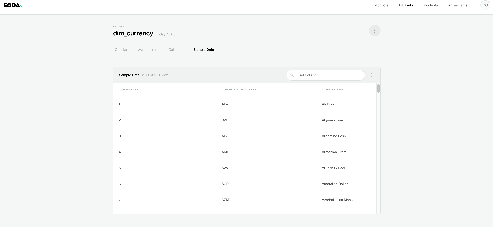

# Send sample data to Soda Cloud {:height="70px" width="70px" align="top"}



Use the `sample datasets` configuration in your checks YAML file to send 100 sample rows to Soda Cloud. Examine the sample rows to gain insight into the type checks you can prepare to test for data quality.<br />
*Requires Soda Cloud.*

```yaml
sample datasets:
  datasets:
    - dim_customer
    - include prod%
    - exclude test%
```

[Prerequisites](#prerequisites)<br />
[Define sample datasets](#define-sample-datasets)<br />
[Optional check configurations](#optional-check-configurations) <br />
[Go further](#go-further) <br />
<br />


## Prerequisites
* You have installed a [Soda Core package]() in your environment.
* You have [configured Soda Core]() to connect to a data source using a `configuration.yml` file. 
* You have created and [connected a Soda Cloud account]() to Soda Core.


## Define sample datasets

This configuration is limited in its syntax variation, with only a couple of mutable parts to specify the datasets from which to gather and send sample rows to Soda Cloud.

The example configuration below uses a wildcard character (`%`) to specify that Soda Core sends sample rows to Soda Cloud for all datasets with names that begin with `customer`, and *not* to send samples for any dataset with a name that begins with `test`.

```yaml
sample datasets:
  datasets:
    - include customer%
    - exclude test%
```

<br />

You can also specify individual datasets to include or exclude, as in the following example.

```yaml
sample datasets:
  datasets:
    - include retail_orders
```

<br />

### Scan results in Soda Cloud

1. To review the sample rows in Soda Cloud, first [run a scan]() of your data source so that Soda Core can gather and send samples to Soda Cloud.
2. In Soda Cloud, navigate to the **Datasets** dashboard, then click a dataset name to open the dataset's info page. 
3. Access the **Sample Data** tab to review the sample rows.



## Optional check configurations

| Supported | Configuration | Documentation |
| :-: | ------------|---------------|
|   | Define a name for sample data configuration. |  - |
|   | Define alert configurations to specify warn and fail thresholds. | - |
|   | Apply an in-check filter to return results for a specific portion of the data in your dataset.| - | 
| ✓ | Use quotes when identifying dataset names; see [example](#example-with-quotes) | [Use quotes in a check](#use-quotes-in-a-check) |
| ✓ | Use wildcard characters ( %  with dataset names in the check; see [example](#example-with-wildcards). | - |
|   | Use for each to apply anomaly score checks to multiple datasets in one scan. | - |
|   | Apply a dataset filter to partition data during a scan. |  -  |

#### Example with quotes

```yaml
sample datasets:
  datasets:
    - include "prod_customer"
```

#### Example with wildcards 

```yaml
sample datasets:
  datasets:
    - include prod%
    - exclude test%
```

## Go further
* Need help? Join the <a href="http://community.soda.io/slack" target="_blank"> Soda community on Slack</a>.
* Reference [tips and best practices for SodaCL](#tips-and-best-practices-for-sodacl).
* Use a [freshness check]() to gauge how recently your data was captured.
* Use [reference checks]() to compare the values of one column to another.

<br />

---

Was this documentation helpful?

<!-- LikeBtn.com BEGIN -->
<span class="likebtn-wrapper" data-theme="tick" data-i18n_like="Yes" data-ef_voting="grow" data-show_dislike_label="true" data-counter_zero_show="true" data-i18n_dislike="No"></span>
<script>(function(d,e,s){if(d.getElementById("likebtn_wjs"))return;a=d.createElement(e);m=d.getElementsByTagName(e)[0];a.async=1;a.id="likebtn_wjs";a.src=s;m.parentNode.insertBefore(a, m)})(document,"script","//w.likebtn.com/js/w/widget.js");</script>
<!-- LikeBtn.com END -->

