# Anomaly detection checks (deprecated)


This check is being **deprecated**. A new version—rebuilt from the ground up, 70% more accurate and significantly faster—was launched at the Databricks AI Summit. 2025. 👉 [Try it now!](https://app.gitbook.com/s/A2PmHkO5cBgeRPdiPPOG/data-observability)


Use an anomaly detection check to automatically discover anomalies in your check metrics.

```yaml
# Basic example for row count
checks for dim_customer:
  - anomaly detection for row_count
```

```yaml
# Advanced example with optional training and model configurations
checks for dim_customer:
  - anomaly detection for row_count:
    name: "Anomaly detection for row_count" # optional
    identity: "anomaly-detection-row-count" # optional
    severity_level_parameters: # optional
      warning_ratio: 0.1
      min_confidence_interval_ratio: 0.001
    training_dataset_parameters: # optional
        frequency: auto
        window_length: 1000
        aggregation_function: last
        auto_exclude_anomalies: True
    alert_directionality: "upper_and_lower_bounds" # optional
    model: # optional
      hyperparameters:
        static:
          profile:
            custom_hyperparameters:
              changepoint_prior_scale: 0.05
              seasonality_prior_scale: 10
              seasonality_mode: additive
              interval_width: 0.999
              changepoint_range: 0.8
        dynamic:
          objective_metric: ["mape", "rmse"]
          parallelize_cross_validation: True
          cross_validation_folds: 2
          parameter_grid:
            changepoint_prior_scale: [0.001]
            seasonality_prior_scale: [0.01, 0.1]
            seasonality_mode: ['additive', 'multiplicative']
            changepoint_range: [0.8]
            interval_width: [0.999]
```

✔️    Requires Soda Core Scientific (included in a Soda Agent)\
✖️    Supported in Soda Core\
✔️    Supported in Soda Library 1.2.2 or greater + Soda Cloud\
✔️    Supported in Soda Cloud Agreements+ Soda Agent\
✖️    Available as a no-code check

## About anomaly detection checks

The anomaly detection check is powered by a machine learning algorithm that works with measured values for a metric that occur over time. Soda leverages the [Facebook Prophet](https://facebook.github.io/prophet/) algorithm to learn patterns in your data so it can identify and flag anomalies. As a relatively easy algorithm to use and tune, Facebook Prophet is ideally suited to both analyzing metrics and giving you control over optional configurations.

As this check tracks and analyzes metrics over time, the algorithm it uses learns from historical patterns in your data, including trends and seasonal variations in the measurements it collects. After learning the normal behavior of your data, the check becomes capable of detecting variations from the norm which it flags as anomalies.

Once flagged, Soda can alert you to the anomaly so that you can take action to correct any issues with your data. Alternatively, you can add a notation to an anomalous measurement to indicate that the anomaly is something you expected to see, such as a spike in order volumes during an aggressive marketing campaign, so that the check knows to discount the measurement as an anomaly.

Importantly, you can fine tune an anomaly detection check to customize some of the algorithm's parameters and improve the check's ability to recognize truly anomalous behavior in your data.

## Install Soda Scientific

To use an anomaly detection check, you must install Soda Scientific in the same directory or virtual environment in which you installed Soda Library. Best practice recommends installing Soda Library and Soda Scientific in a virtual environment to avoid library conflicts, but you can [Install Soda Scientific locally](anomaly-detection.md#install-soda-scientific-locally) if you prefer.

Soda Scientific is included in Soda Agent deployment.

1. Set up a virtual environment, and install Soda Library in your new virtual environment.
2. Use the following command to install Soda Scientific.

```sh
pip install -i https://pypi.cloud.soda.io soda-scientific
```

<details>

<summary>List of Soda Scientific dependencies</summary>

* pandas<2.0.0
* wheel
* pydantic>=1.8.1,<2.0.0
* scipy>=1.8.0
* numpy>=1.23.3, <2.0.0
* inflection==0.5.1
* httpx>=0.18.1,<2.0.0
* PyYAML>=5.4.1,<7.0.0
* cython>=0.22
* prophet>=1.1.0,<2.0.0

</details>

> Refer to [Troubleshoot Soda Scientific installation](anomaly-detection.md#troubleshoot-soda-scientific-installation) for help with issues during installation.

## Define an anomaly detection check

The following basic examples demonstrate how to use the anomaly detection with a few metrics. You can use any [numeric](numeric-metrics.md), [freshness](freshness.md), [user-defined](user-defined.md), [missing](missing-metrics.md), or [validity](validity-metrics.md) metrics with an anomaly detection check.

The first example simply detects anomalies in `row_count` measurements for the dataset over time, while the second identifies anomalies in the calculated average of values in the `order_price` column.

```yaml
checks for dim_customer:
  - anomaly detection for row_count
```

```yaml
checks for orders:
  - anomaly detection for avg(order_price)
```

The third example gauges anomalies in timeliness of the data in the dataset based on the value of the `start_date` column.

```yaml
checks for dim_promotion:
  - anomaly detection for freshness(start_date)
```

The following example includes two user-defined metrics: the first uses a SQL query to define the metric, the second uses CTE to do so.

```yaml
checks for dim_customer
  - anomaly detection for customers:
      customers query: |
        SELECT COUNT(*)
        FROM dim_customer

checks for dim_reseller:
  - avg_order_span between 5 and 10:
      avg_order_span expression: AVG(last_order_year - first_order_year)
  - anomaly detection for avg_order_span
```

The following examples demonstrate how to define a check that detects anomalies in the number of missing values in the `id` column relative to historical volumes; the second example detects anomalies in the volume of incorrectly formatted email addresses.

```yaml
checks for orders:
  - anomaly detection for missing_count(id):
      missing values: [None, No Value] 
```

```yaml
checks for dim_customer:
  - anomaly detection for invalid_count(user_email):
      valid format: email
```

## Anomaly detection check results

Because the anomaly detection check requires at least four measurements before it can start detecting what counts as an anomalous measurement, your first few scans yield a `[NOT EVALUATED]` check result that indicates that Soda does not have enough historical data to be able to detect an anomaly.

```shell
Soda Library 1.0.x
Soda Core 3.0.0x
Anomaly Detection Frequency Warning: Coerced into daily dataset with last daily time point kept
Data frame must have at least 4 measurements
Skipping anomaly metric check eval because there is not enough historic data yet
Scan summary:
1/1 check NOT EVALUATED: 
    dim_customer in adventureworks
      anomaly detection for missing_count(last_name) [NOT EVALUATED]
        check_value: None
1 checks not evaluated.
Apart from the checks that have not been evaluated, no failures, no warnings and no errors.
Sending results to Soda Cloud
```

Though your first instinct may be to run several scans in a row to produce the four measurements that the anomaly detection needs, the measurements don’t count if the frequency of occurrence is too random, or rather, the measurements don't represent enough of a stable frequency.

If, for example, you attempt to run eight back-to-back scans in five minutes, the anomaly detection does not register the measurements resulting from those scans as a reliable pattern against which to evaluate an anomaly.

Consider using the Soda library to set up a [programmatic scan](../quick-start-sip/programmatic.md) that produces a check result for an anomaly detection check on a regular schedule.

## Migrate to anomaly detection

If you have an existing `anomaly score` check, you can migrate to use an anomaly detection check. To migrate to the new check, you have three options.

_Default_   The first option is to create a new anomaly detection check to replace an existing anomaly score check. This is the easiest path and the default behavior, but you lose all the historic check results for the anomaly score check and any feedback that you applied to the anomaly score check's measurements. This means that the algorithm starts from scratch to learn patterns in your data that eventually enable it to identify anomalous measurements.

To follow this path, revise your existing anomaly score check to use the anomaly detection syntax, as in the following example.

```yaml
checks for dim_customer:
# previous syntax
#  - anomaly score for row_count < default
# new syntax
  - anomaly detection for row_count
      name: Anomalies in dataset
```

\


_Recommended_   The second option is to create a new anomaly detection check and port the historic anomaly score check results and feedback to the new check. This path retains the anomaly score's historic check results and feedback to preserve the algorithm's memory of patterns in your data, though you cannot directly access the retained information via Soda Cloud.

To follow this path, revise your existing anomaly score check to use the anomaly detection syntax, and add the `take-over...` parameter.

```yaml
checks for dim_customer:
  - anomaly detection for row_count:
      name: Anomalies in dataset
      take_over_existing_anomaly_score_check: True
```

\


The third option is to keep the existing anomaly score check as is, and create an anomaly detection check in a separate checks YAML file, essentially running two checks in parallel. This path retains the existing anomaly score's historic check results and feedback which you can continue to access directly in Soda Cloud. At the same time, the anomaly detection check begins learning the patterns in your data and accruing separate feedback you add to help it identify anomalous measurements.

To follow this path, create a new checks YAML file, then add an anomaly detection check to the file. Be sure to include both file names in any Soda scan you run programmatically or via the Soda Library CLI, as in the following example command.

```shell
soda scan -d adventureworks -c configuration.yml checks_anomaly_score.yml checks_anomaly_detection.yml
```

## Reset anomaly history

If you wish, you can reset an anomaly detection's history, effectively recalibrating what Soda considers anomalous on a dataset.

1. In Soda Cloud, navigate to the **Check History** page of the anomaly check you wish to reset.
2. Click to select a node in the graph that represents a measurement, then click **Feedback**.
3. In the modal that appears, you can choose to exclude the individual measurement, or all previous data up to that measurement, the latter of which resets the anomaly detection's history.

<figure><figcaption></figcaption></figure>

## Optional check configurations

<table><thead><tr><th width="100" align="center">Supported</th><th>Configuration</th><th>Documentation</th></tr></thead><tbody><tr><td align="center">✓</td><td>Define a name for an anomaly detection check.</td><td><a href="optional-config.md#customize-check-names">Customize check names</a></td></tr><tr><td align="center">✓</td><td>Add an identity to a check.</td><td><a href="optional-config.md#add-a-check-identity">Add a check identity</a></td></tr><tr><td align="center"> </td><td>Define alert configurations to specify warn and fail thresholds. See alternative: <a href="anomaly-detection.md#manage-alert-severity-levels">Manage alert security levels</a></td><td>-</td></tr><tr><td align="center">✓</td><td>Apply an in-check filter to return results for a specific portion of the data in your dataset.</td><td><a href="optional-config.md#add-a-filter-to-a-check">Add an in-check filter to a check</a></td></tr><tr><td align="center">✓</td><td>Use quotes when identifying dataset names; see <a href="anomaly-detection.md#example-with-quotes">example</a>.<br>Note that the type of quotes you use must match that which your data source uses. For example, BigQuery uses a backtick (`) as a quotation mark.</td><td><a href="optional-config.md#use-quotes-in-a-check">Use quotes in a check</a></td></tr><tr><td align="center"> </td><td>Use wildcard characters ( % or * ) in values in the check.</td><td>-</td></tr><tr><td align="center">✓</td><td>Use for each to apply anomaly detection checks to multiple datasets in one scan; see <a href="anomaly-detection.md#example-with-for-each">example</a>.</td><td><a href="optional-config.md#apply-checks-to-multiple-datasets">Apply checks to multiple datasets</a></td></tr><tr><td align="center">✓</td><td>Apply a dataset filter to partition data during a scan.</td><td><a href="optional-config.md#scan-a-portion-of-your-dataset">Scan a portion of your dataset</a></td></tr></tbody></table>

### Example with quotes

```yaml
checks for dim_product:
  - anomaly detection for avg("order_price")
```

### Example with for each

```yaml
for each dataset T:
  datasets:
    - dim_customer
  checks:
    - anomaly detection for row_count
```

\


## Manage alert severity levels

You can add optional `severity_level_parameters` to an anomaly detection check to customize the way that Soda determines the severity level of an anomaly. The following example includes two optional severity level parameters.

```yaml
checks for dim_customer:
  - anomaly detection for row_count:
      severity_level_parameters:
        warning_ratio: 0.1
        min_confidence_interval_ratio: 0.001
```

| Configuration key               | Value                   | Default |
| ------------------------------- | ----------------------- | ------- |
| `warning_ratio`                 | decimal between 0 and 1 | `0.1`   |
| `min_confidence_interval_ratio` | decimal between 0 and 1 | `0.001` |

The `warning_ratio` parameter determines the area of warning range, which is a buffer on top of the confidence interval. The aim is to help the anomaly detectio ncheck distinguish between warning and critical alerts. If the check result is within the warning range, Soda flags the check result as a warning. This behavior is similar to setting `fail` and `warn` conditions in other Soda checks.

Soda calculates the warning range using the following formula:

```latex
upper confidence interval: u
lower confidence interval: l
confidence interval width: w = u - l
upper warning range = between u and (u + warning_ratio * w)
lower warning range = between l and (l - warning_ratio * w)
```

For example, if the model's confidence interval is `[10, 20]` and the `warning_ratio` is `0.1`, the upper warning range is `]20, 22]` and the lower warning range is `[9, 10[`. If the check result is within the warning ranges, Soda flags the check result as a warning. If you need wider warning ranges to decrease the amount of critical alerts, you can gradually increase the `warning_ratio` value to achieve your ideal range.

The graph below illustrates how Soda computes the warning range. The yellow area represents the warning range which is 10% of the confidence interval, as shown with blue and red arrows.

<figure>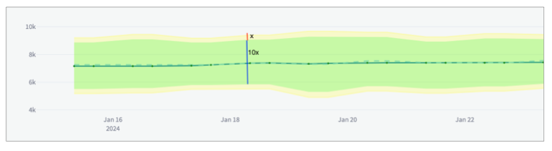<figcaption></figcaption></figure>

\


The `min_confidence_interval_ratio` parameter determines the minimum width of the confidence interval. The confidence interval is the range of values that the model predicts for the next measurement. If the prediction problem is too easy for the model, the confidence interval becomes too narrow and the model becomes too sensitive to small noises in the data.

In such cases, the model may flag normal measurements as anomalies due to small decimal differences. To avoid these scenarios, Soda uses a minimum confidence interval width parameter to handle very narrow confidence intervals. The formula that updates the confidence interval is as follows:

```latex
upper confidence interval: u
lower confidence interval: l
predicted value: y^
upper confidence interval width: w_u = u - y^
lower confidence interval width: w_l = y^ - l

u = max(u, y^ + y^ * min_confidence_interval_ratio)
l = min(l, y^ - y^ * min_confidence_interval_ratio)
```

To increase the minimum confidence interval width, you can gradually increase the `min_confidence_interval_ratio` value until you reach your ideal minimum confidence interval.

The graph below illustrates the impact of the `min_confidence_interval_ratio` parameter. For this example, the `min_confidence_interval_ratio` is set to `0` and the measurements are very easy to predict. With such a low setting, the confidence interval is very narrow and insignificant noises produce many falsely-identified anomalies.

<figure>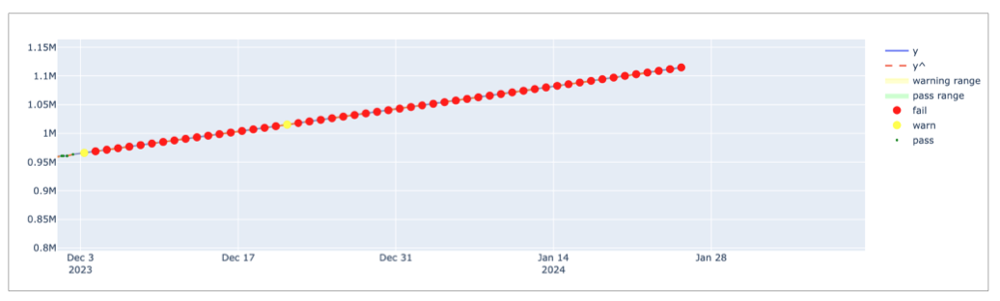<figcaption></figcaption></figure>

To artificially introduce a minimum confidence interval buffer to prevent falsely-identified anomalies, this example sets the `min_confidence_interval_ratio` to the default value of `0.001`. The result is a wider confidence interval that is far less sensitive to small noises in the data.

<figure>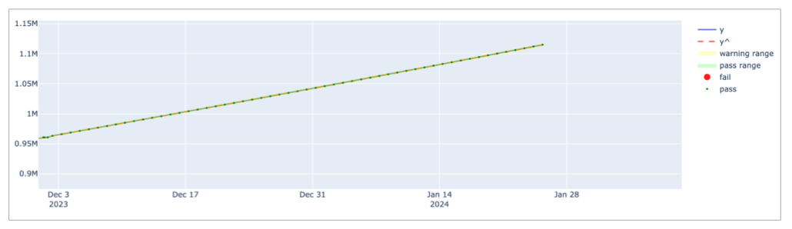<figcaption></figcaption></figure>

\


## Add optional training dataset configurations

A training dataset is one that Soda uses to teach the algorithm to identify patterns in the measurements the check collects. To enhance the flexibility of anomaly detection, you can add an optional `training_dataset_parameters` configuration to your anomaly detection check to customize the way that the check uses the training dataset. You can apply training dataset configurations to the training dataset, time-series prediction model, and/or the anomaly detection check itself.

The following example includes three optional, customizable training dataset parameters.

```yaml
checks for dim_customer:
  - anomaly detection for row_count:
      training_dataset_parameters:
        frequency: auto
        window_length: 1000
        aggregation_function: last
        auto_exclude_anomalies: False
```

| Configuration key        | Value                                                                                                                                                                                                                                                                                                                                                                                                                                                                                                         | Default                                                                                                                   |
| ------------------------ | ------------------------------------------------------------------------------------------------------------------------------------------------------------------------------------------------------------------------------------------------------------------------------------------------------------------------------------------------------------------------------------------------------------------------------------------------------------------------------------------------------------- | ------------------------------------------------------------------------------------------------------------------------- |
| `frequency`              | <p><code>auto</code>: automatically detected by Soda<br><code>T</code> or <code>min</code>: by minute<br><code>H</code>: by hour<br><code>D</code>: by calendar day<br><code>B</code>: by business day<br><code>W</code>: by week<br><code>M</code>: by month end<br><code>MS</code>: by month start<br><code>Q</code>: by quarter end<br><code>QS</code>: by quarter start<br><code>A</code>: by year end<br><code>AS</code>: by year start<br>customized, such as <code>5H</code> for every 5 hours<br></p> | `auto`                                                                                                                    |
| `window_length`          | integer, number of historical measurements                                                                                                                                                                                                                                                                                                                                                                                                                                                                    | `1000`                                                                                                                    |
| `aggregation_function`   | <p><code>last</code>: uses the last non-null value in the window<br><code>first</code>: uses the first non-null value in the window<br><code>mean</code>: calculates the average of values in the window<br><code>min</code>: uses the minimum value in the window<br><code>max</code>: uses the maximum value in the window</p>                                                                                                                                                                              | `last`                                                                                                                    |
| `auto_exclude_anomalies` | boolean, `True` or `False`                                                                                                                                                                                                                                                                                                                                                                                                                                                                                    | `False` as Soda automatically includes anomalies the training dataset unless you add this parameter and set it to `true`. |

The `frequency` parameter determines the regularity of each measurement in the training dataset. If Soda cannot detect a clear frequency, it assumes a frequency of once-daily, and uses the last measurement for each day, if there is more than one measurement per day.

The `window_length` parameter sets the number of historical measurements that Soda uses for training the model. The default value is `1000`. For instance, if your frequency is daily `D`, the model trains on the last 1000 days of available historical data to recognize anomalies, ignoring earlier measurements. Be aware that a small value for this parameter may result in less sensitivity to seasonality that Soda recognizes in your data.

When Soda collects more measurements than the automatically-detected or specified frequency, the `aggregation_function` parameter defines how Soda aggregates the data within each window. For example, if your frequency is hourly and your aggregation function is last and Soda collected two measurements for the same hour, Soda uses the most recent, or latest, measurement for that hour to gauge anomalies.

See the example below for a demonstration of how Soda aggregates the training data using the configurations.

<figure>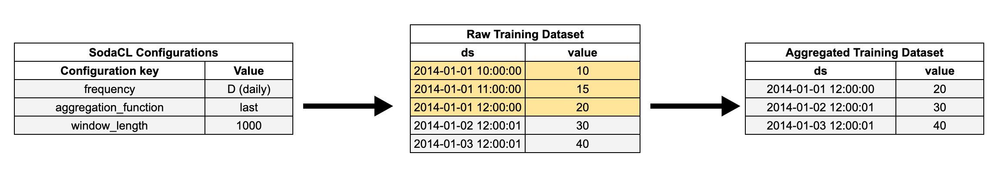<figcaption></figcaption></figure>

The `auto_exclude_anomalies` parameter determines whether Soda ignores, or includes unusual data points in the training dataset. When set to `True`, Soda excludes anomalies from future model training, without the need to manually provide feedback input in the Soda Cloud user interface. Though excluded from the training dataset, Soda still issues alerts when new anomalies occur.

To understand the effect of the parameter, the examples below present the difference between settings. In the image on the left, the parameter is set to `False`, so Soda includes existing, recorded anomalies in the training dataset which leads to broader confidence intervals indicated in green and yellow. In contrast, with the parameter to `True`, as in the image on the right, Soda excludes existing anomalies in the training dataset resulting in narrower confidence intervals over time.

<figure>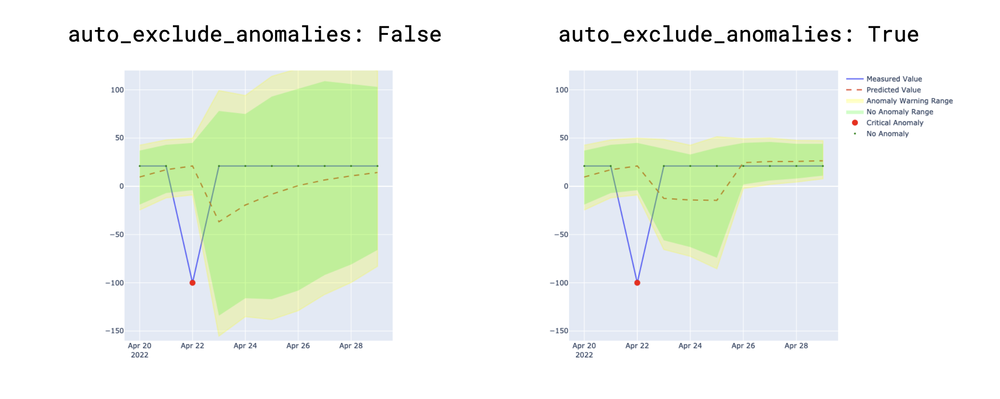<figcaption></figcaption></figure>

## Add optional alert directionality configuration

The `alert_directionality` setting lets you choose which types of anomalies you want to receive alerts for. For example, if you only want to be alerted about unusually low values (and not high ones), set `alert_directionality: "lower_bound_only"`.

By default, `alert_directionality` is set to `"upper_and_lower_bounds"`, which means you'll get alerts for both high and low anomalies, just like before this option was available. If you prefer not to be alerted about values that fall below the lower confidence interval, switch to `"upper_bound_only"`, as shown in the right of the image below.

<figure>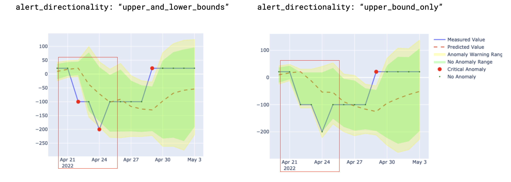<figcaption></figcaption></figure>

## Add optional model configurations

The anomaly detection check uses [Facebook Prophet](https://facebook.github.io/prophet/) to train the model that detects anomalies. If you wish, you can add a `model` configuration to customize the hyperparameters and tune the model.

Facebook Prophet uses a variety of hyperparameters that influence the model's ability to accurately detect anomalies in time-series data. Because fine-tuning these customizable parameters can be quite complex, Soda offers two out-of-the-box, fine-tuned profiles that automatically optimize the model's performance according to your anomaly sensitivity preference.

There are two values you can use for the `profile` parameter:

* `coverage`
* `MAPE`
* alternatively, you can customize your own hyperparameters; [see below](anomaly-detection.md#customize-hyperparameters)

```yaml
checks for dim_customer:
  - anomaly detection for row_count:
      name: Anomaly detection for row_count
      model: 
        hyperparameters:
          static:
            profile: coverage 
```

| Configuration key | Value                                             | Default    |
| ----------------- | ------------------------------------------------- | ---------- |
| `type`            | `prophet`                                         | `prophet`  |
| `profile`         | <p><code>coverage</code><br><code>MAPE</code></p> | `coverage` |

For each of these values, Soda has adjusted the values of a few of the model's hyperparameters to tailor its sensitivity to anomalies, particularly the `changepoint_prior_scale` and `seasonality_prior_scale` hyperparameters.

`coverage` refers to the concept of [coverage ](anomaly-detection.md)and represents the percentage of actual measurements within the model's predicted confidence intervals. For example, if a model forecasts a sales between 10-20 units on certain days and 90 out of 100 actual sales figures fall within this range, the coverage is 90%. This coverage-optimized profile is more tolerant of small noises in the data that can lead to falsely-identified anomalies since it has larger confidence intervals to cover as much as possible. However, the model might underfit the data if there is a fluctuating pattern.

For reference, the following lists the hyperparameters that Soda has set for the `coverage` profile.

```python
# hyperparameters set by Soda for the coverage profile
seasonality_mode = "multiplicative"
seasonality_prior_scale = 0.01
changepoint_prior_scale = 0.001
interval_width = 0.999

# other default hyperparameters set by Facebook Prophet 
growth = "linear"
changepoints = None
n_changepoints: = 25
changepoint_range = 0.8
yearly_seasonality = "auto"
weekly_seasonality = "auto"
daily_seasonality = "auto"
holidays = None
holidays_prior_scale = 10.0
mcmc_samples = 0
uncertainty_samples = 1000
stan_backend = None
scaling = "absmax"
holidays_mode = None
```

The `MAPE` value refers to [mean absolute percentage error (MAPE)](https://en.wikipedia.org/wiki/Mean_absolute_percentage_error) which is a statistical measure of how accurate a forecasting method is. It calculates the average percentage error between the forecasted and the actual values. This profile aims to maximize prediction precision as the lower the MAPE value, the more accurate the model's predictions are. When optimizing for MAPE, the model is more sensitive to changepoints and seasonal variations, providing a tighter fit to the training data.

For reference, the following lists the hyperparameters that Soda has set for the `MAPE` profile.

```python
# hyperparameters set by Soda for the MAPE profile
seasonality_mode = "multiplicative"
seasonality_prior_scale = 0.1
changepoint_prior_scale = 0.1
interval_width = 0.999

# other default hyperparameters set by Facebook Prophet
growth = "linear"
changepoints = None
n_changepoints: = 25
changepoint_range = 0.8
yearly_seasonality = "auto"
weekly_seasonality = "auto"
daily_seasonality = "auto"
holidays = None
holidays_prior_scale = 10.0
mcmc_samples = 0
uncertainty_samples = 1000
stan_backend = None
scaling = "absmax"
holidays_mode = None
```

`coverage` is less sensitive to anomalies than `MAPE`. If you have set the profile value to `coverage` and find that the model seems to miss some anomalies, try changing the value to `MAPE`. Conversely, if you set the value to `MAPE` and find that the model is mistakenly identifying normal measurements as anomalies, try changing the value to `coverage`.

> See [Best practices for model configuration](anomaly-detection.md#best-practices-for-model-configurations) for further guidance.

### Customize hyperparameters

If the Soda-tuned profiles do not meet your specific data and forecasting needs for model sensitivity, you can customize the Prophet's hyperparameters using the `custom_hyperparameter` configuration.

You can modify any hyperparameter supported by Facebook Prophet in the `custom_hyperparameters` section of your configuration. For in-depth guidance, refer to Prophet's [hyperparameter tuning guide](https://facebook.github.io/prophet/docs/diagnostics.html#hyperparameter-tuning).

It is important to note that customized hyperparameters overrides the soda-tuned `coverage` hyperparameter profile. For example, if you set the `changepoint_prior_scale` hyperparameter to `0.05` in the `custom_hyperparameters` section, the model uses this value instead of the `0.001` value set by Soda for the `coverage` profile. The other hyperparameters remain the same as the `coverage` profile.

The following example specifies custom values for the `seasonality_mode` and `interval_width` hyperparameters; not shown are the remaining parameters set to mimic the `coverage` profile settings.

```yaml
checks for dim_customer:
  - anomaly detection for row_count:
      name: Anomaly detection for row_count
      model:
        hyperparameters:
          static:
            profile:
              custom_hyperparameters:
                seasonality_mode: additive
                interval_width: 0.8
                ...
```

\


### Customize country-specific holidays

Add a `holidays_country_code` parameter to customize your anomaly detection check to account for country-specific holidays. Access the list of available country codes in the public [python-holidays](https://github.com/vacanza/python-holidays/) repository.

For example, the following configuration accounts for US American holidays in the model.

```yaml
checks for dim_customer:
  - anomaly detection for row_count:
      name: Anomaly detection for row_count
      model:
        holidays_country_code: US
```

Facebook Prophet's `holidays_prior_scale` hyperparameter, defaulted at `10.0`, controls how much holidays influence the model. If holidays have a minimal impact on your data, set a lower value for `holidays_prior_scale` between `0.01` and `10` as in the following example, to decrease holiday sensitivity and ensure more accurate model representation for non-holiday periods.

```yaml
checks for dim_customer:
  - anomaly detection for row_count:
      name: Anomaly detection for row_count
      model:
        holidays_country_code: US
        hyperparameters:
          static:
            profile:
              custom_hyperparameters:
                holidays_prior_scale: 0.1
```

## Add optional dynamic hyperparameter tuning configurations

To dynamically tune Prophet to evaluate and select the best hyperparameters values to use before each scan, you can add a `dynamic` parameter and any number of optional hyperparameter configurations. Be aware that hyperparameter tuning can be time-consuming and resource-intensive, so best practice dictates that you use these configurations sparingly.

The following offers an example of how to add automatic hyperparameter tuning. This configuration allows the anomaly detection model to adapt and improve over time by identifying the most effective hyperparameter settings for your specific data. Remember to weigh the benefits of improved accuracy against the increased computational demands of this process.

```yaml
checks for dim_customer:
  - anomaly detection for row_count:
      model:
        hyperparameters:
          dynamic:
            objective_metric: ["coverage", "SMAPE"]
            parallelize_cross_validation: True
            cross_validation_folds: 5
            parameter_grid:
              changepoint_prior_scale: [0.001, 0.01, 0.1, 0.5]
              seasonality_prior_scale: [0.01, 0.1, 1.0, 10.0]
              seasonality_mode: ['additive', 'multiplicative']
```

<table><thead><tr><th width="208">Configuration key</th><th width="196.33331298828125">Value</th><th>Default</th></tr></thead><tbody><tr><td><code>objective_metric</code></td><td><code>coverage</code><br><code>MSE</code><br><code>RMSE</code><br><code>MAE</code><br><code>MAPE</code><br><code>MDAPE</code><br><code>SMAPE</code></td><td>n/a</td></tr><tr><td><code>parallel</code></td><td><code>true</code><br><code>false</code></td><td><code>true</code></td></tr><tr><td><code>cross_validation_folds</code></td><td>integer</td><td><code>5</code></td></tr><tr><td><code>parameter_grid</code></td><td>any Prophet-supported hyperparameters</td><td><code>changepoint_prior_scale: [0.001, 0.01, 0.1, 0.5]</code><br><code>seasonality_prior_scale: [0.01, 0.1, 1.0, 10.0]</code><br>other hyperparameters set to the defaults in the <code>coverage</code> profile</td></tr></tbody></table>

The `objective_metric` hyperparameter evaluates the model's performance. You can set the value to use a single string, or a list of strings. If you provide a list, the model optimizes each metric in sequence. In the example above, the model first optimizes for `coverage`, then `SMAPE` in the event of a tie. Best practice dictates that you use `coverage` as the first objective metric, and `SMAPE` as the second objective metric to optimize for a model that is more tolerant of noise in your data.

The `parallel` hyperparameter specifies whether the model saves time by using multiprocess to parallelize the cross validations. Set the value to `True` if you have multiple cores.

The `cross_validation_folds` hyperparameter sets the number of periods for each cross-validation fold. For example, with the `frequency` set to daily `D` and a `cross_validation_folds` of `5`, the model conducts cross-validation in five-day intervals. It trains on the first `n-5` days, then tests on the `n-4`th day. Subsequently, it trains on `n-4` days, testing on the `n-3`rd day, and so on. The cross-validation process computes the `objective_metric` across different data segments for each hyperparameter combination. The model then uses the best `objective_metric` according to the value or list of values configured for that hyperparameter.

The `parameter_grid` hyperparameter is a dictionary that lists hyperparameters and their possible values. The model tests every possible combination of the listed values for each hyperparameter to identify the best value to use to detect anomalies. You can configure any [Prophet-supported hyperparameter](https://facebook.github.io/prophet/docs/diagnostics.html#hyperparameter-tuning).

### Execution time analysis for dynamic hyperparameter tuning

The execution time for dynamic hyperparameter tuning varies based on several factors including the number of hyperparameters and the number of folds. For example, the default hyperparameter grid has 16 combinations since `changepoint_prior_scale` and `seasonality_prior_scale` have four values each. Consider using a small number of hyperparameters to avoid long execution times. By default, the model processes each fold in parallel. If you use multiple cores, you can set the `parallel` parameter to `True` to speed up the execution time.

Use the following tables to estimate the execution time for checks with dynamic hyperparameter tuning.

|                  |                                    |
| ---------------- | ---------------------------------- |
| Model Name       | MacBook Pro                        |
| Model Identifier | MacBookPro18,3                     |
| Chip             | Apple M1 Pro                       |
| Number of Cores  | 10; 8 performance and 2 efficiency |
| Memory           | 16 GB                              |

| Parallel | Number of hyperparameters | Number of folds | Training dataset size | Execution time |
| -------- | ------------------------- | --------------- | --------------------- | -------------- |
| Yes      | 4                         | 5               | 30                    | 2.23 sec       |
| Yes      | 4                         | 5               | 90                    | 2.80 sec       |
| Yes      | 8                         | 5               | 30                    | 4.5 sec        |
| Yes      | 8                         | 5               | 90                    | 6.05 sec       |
| No       | 4                         | 5               | 30                    | 5.8 sec        |
| No       | 4                         | 5               | 90                    | 8.05 sec       |
| No       | 4                         | 10              | 30                    | 7.2 sec        |
| No       | 4                         | 10              | 90                    | 10.6 sec       |
| Yes      | 4                         | 10              | 30                    | 2.5 sec        |
| Yes      | 4                         | 10              | 90                    | 3.06 sec       |

## Best practices for model configurations

* Set the value of the `profile` parameter to `coverage`. This profile is more tolerant of small noises in the data that could lead to falsely identified anomalies. If you need a very sensitive model, then try to use `MAPE` profile.
* Only use the `custom_hyperparameters` configuration if you know how Facebook Prophet works. Before making any customizations, consult the [Facebook Prophet documentation](https://facebook.github.io/prophet/docs/diagnostics.html#hyperparameter-tuning). The`change_point_prior_scale` and `seasonality_prior_scale` hyperparameters have the most impact on the model so best practice dictates that you experiment with the values of these two hyperparameters first before customizing or tuning others.
* Adjust the value of the `interval_width` hyperparameter to obtain a more anomaly-sensitive model. The default value for this hyperparameter is `0.999` which means that the model applies a confidence interval of 99.9% which, in turn, means that if the predicted value is outside of the 99.9% interval, Soda flags it as an anomaly. If you want to have a more sensitive model, you can decrease this value though be aware that a lower value may result in more falsely-identified anomalies.
* Use the `dynamic` tuning configuration only if necessary. Hyperparameter tuning is a computationally expensive process since the model tries all possible combinations of each hyperparameter's listed values to dynamically determine the best value to use to detect anomalies. See [Execution time analysis for dynamic hyperparameter tuning](anomaly-detection.md#execution-time-analysis-for-dynamic-hyperparameter-tuning). If you need to use hyperparameter tuning, experiment with tuning the values of the `change_point_prior_scale` and `seasonality_prior_scale` hyperparameters first as these two have the most impact on the model's sensitivity.

## Test optional configuration using a simulator

_Requires Soda Library CLI_

Soda provides an anomaly detection simulator to enable you to test and observe how parameter adjustments you make impact the algorithm's confidence interval and anomaly detection sensitivity. The purpose of this local, [streamlit](https://streamlit.io/) simulator application is to help you to choose the most suitable parameter settings for your anomaly detection needs.

1. From the command-line, install the simulator package using the following command.

```bash
pip install -i https://pypi.cloud.soda.io "soda-scientific[simulator]"
```

* [ ] Ensure you have configured the connection details to both your data source and your Soda Cloud account in a `configuration.yml` file. See: [Configure Soda](https://docs.soda.io/soda-library/install.html#configure-soda).
* [ ] Log in to your Soda Cloud account, then navigate to the **Check History** page of your existing anomaly detection or anomaly score check. From your browser copy the entire URL; refer to image below.

<figure>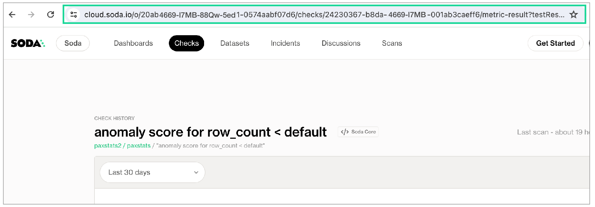<figcaption></figcaption></figure>

4\. To launch the application, use the following command. After running the command, a new tab opens in your default browser displaying the simulator as shown in the screenshot below.

```bash
soda simulate-anomaly-detection -c configuration.yaml
```

<figure>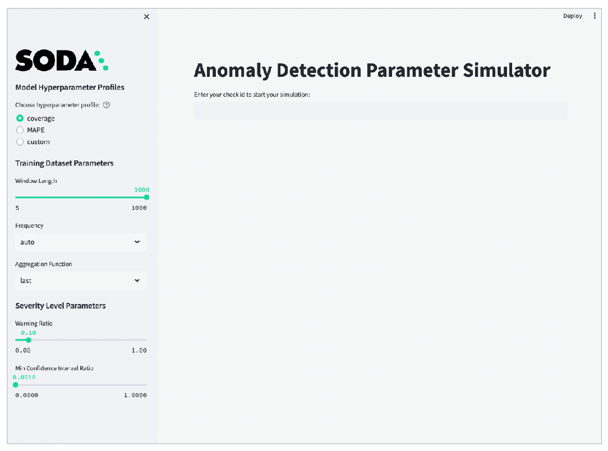<figcaption></figcaption></figure>

5.  Paste the check URL you copied for your anomaly check into the main field and press enter. Refer to the screenshot below.

    <figure>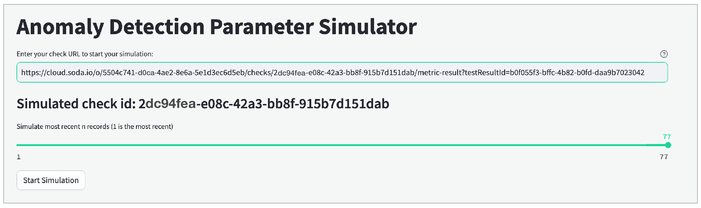<figcaption></figcaption></figure>
6. Use the slider that appears to simulate the most recent `n` measurements, ideally not more than 60 so as to keep the simulator execution time reasonable.
7. Click **Start Simulation** to display graphic results using the default parameter values.
8.  Use the tools in the sidebar to [adjust parameter settings](anomaly-detection.md#adjust-simulator-parameters) until the simulator displays your ideal anomaly sensitivity results. Apply your optimized parameter settings to the check configuration in your checks YAML file.

    <figure>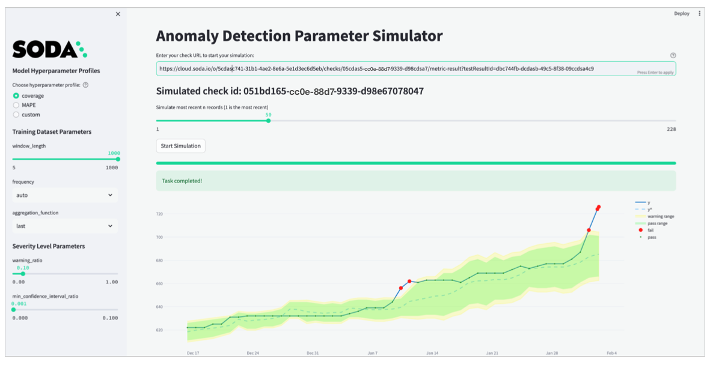<figcaption></figcaption></figure>

### Adjust advanced simulator parameters

For **Model Hyperparameter Profiles**, the first two options correspond with the `coverage`, `MAPE` profiles described in [Add optional model configuration](anomaly-detection.md#add-optional-model-configurations), and the third option, `custom` corresponds to the ability to [Customize hyperparameter](anomaly-detection.md#customize-hyperparameters). Experiment with the `coverage` and `MAPE` profiles first, before considering the `custom` profile.

For further hyperparameter customization, turn on the `Advanced` toggle in the simulator and edit hyperparameters in the `Custom Prophet Hyperparameters` field which accepts JSON, as in the example below. Note that if you do not specify a customized value for a hyperparameter, Soda uses the default values from the `coverage` profile.

```json
{
  "growth": "linear",
  "change_pointprior_scale": 0.1,
  "seasonality_prior_scale": 0.1,
  "n_changepoints": 20,
}
```

For **Training Dataset Parameters**, the adjustable settings correspond to the parameters in [Add optional training dataset configurations](anomaly-detection.md#add-optional-training-dataset-configurations).

For **Severity Level Parameters**, the adjustable settings correspond to the parameters in [Manage alert severity levels](anomaly-detection.md#manage-alert-severity-levels).

## Address common anomaly detection issues

What follows are some examples of how to adjust optional configurations to address common issues with the sensitivity of anomaly detection checks.

### Insensitive detection

The default `coverage` hyperparameter profile is more tolerant of small noises in data quality measurements. However, as in the following example, the profile may not be sensitive enough if there are fluctuating data patterns. This is because the `coverage` profile uses a low `changepoint_prior_scale=0.001` value and a low `seasonality_prior_scale=0.01` which make the model less sensitive to changepoints.

As in the following graph, the predicted `yˆ` values produce a steady trend and the algorithm does not capture the fluctuating pattern of the actual measurements. As a result, it missed the anomaly in the red rectangle.

<figure>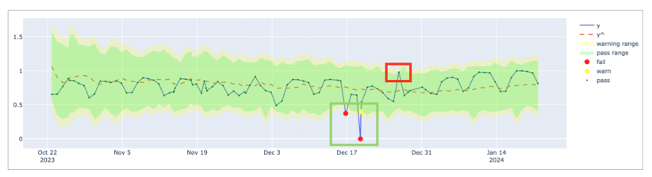<figcaption></figcaption></figure>

In such a case, consider using the `MAPE` profile which is more sensitive to changepoints and seasonal variations.

```yaml
checks for your-table-name:
  - anomaly detection for your-metric-name:
      model:
        hyperparameters:
          static:
            profile: MAPE
```

With the profile set to `MAPE`, the model uses higher `changepoint_prior_scale=0.1` and `seasonality_prior_scale=0.1` values which makes it more sensitive to changepoints and seasonal variations. The graph below illustrates the higher sensitivity wherein the algorithm recognizes more measurements as anomalous. As a result, `yˆ` values better capture the fluctuating pattern of the actual measurements over time.

<figure>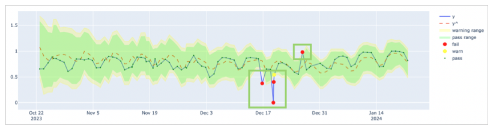<figcaption></figcaption></figure>

### Consecutive falsely-identified anomalies

To decrease the rate of falsely-detected anomalies, Soda optimized the default hyperparameters of the anomaly detection check to detect anomalies in time-series data which exhibits a stable pattern. If the data exhibits pattern changes, as illustrated in the graph below, you may need to adjust the default parameters to improve the model's ability to detect anomalies to prevent alert fatigue.

As an example, the graph below indicates that up until November 2023, the data follows a stable pattern and the `coverage` profile is sufficient to detect anomalies. However, after November 2023, the pattern changes and the model needs to adapt to the new pattern. The default `coverage` profile has very low `changepoint_prior_scale=0.001` and `seasonality_prior_scale=0.01` values which makes the model insensitive for the trend changes. For this reason, during the adaptation period, the model falsely identified consecutive measurements as anomalies for a long time; refer to the red rectangle in the graph below.

<figure>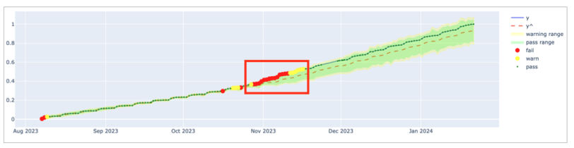<figcaption></figcaption></figure>

In such a case, consider using the `MAPE` as the first action as it is explained in the [previous section](anomaly-detection.md#Insensitive-detection). Because the `MAPE` profile is more sensitive, it converges faster than the `coverage` profile when a pattern changes; see graph below.

<figure>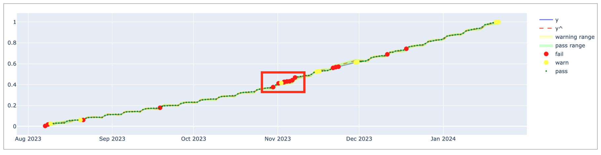<figcaption></figcaption></figure>

The `MAPE` profile achieves a much better fit since `yˆ` values closely follow the actual measurements. Compared to the `coverage` profile, `MAPE` causes fewer false positives but it still falsely identifies consecutive measurements as anomalies for a long time. This is because the model uses the last 1000 measurements to gauge pattern changes and it takes time to adapt to the new pattern which, in this case, is a weekly seasonality.

Each Monday, there is a jump in the `y` value and the other days follow a steady increase. Thus, using last four weeks' data points, or the 30 measurements, is a better way to calibrate the model than using the last 1000 measurements so it can capture the weekly seasonality effect. In such a case, consider decreasing the `window_length` parameter to `30` or experiment with different values to find the optimal `window_length` for your data and business use case. Refer to the [default model configurations](anomaly-detection.md#add-optional-training-dataset-configurations) for guidance.

```yaml
checks for your-table-name:
  - anomaly detection for your-metric-name:
      training_dataset:
        window_length: 30
      model:
        hyperparameters:
          static:
            profile: MAPE
```

Having adjusted the `window_length` and `MAPE` profile, the graph below illustrates that the model is more sensitive to recent measurements and does not create alert fatigue after November 2023; refer to the green rectangle.

<figure>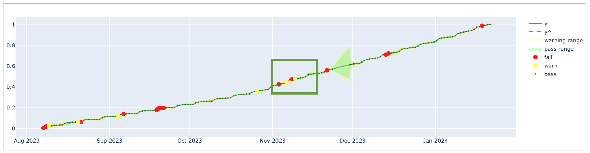<figcaption></figcaption></figure>

### Large boundaries that ignore anomalies

Anomalous records can confuse the model and cause excessively large confidence intervals if the model does not ignore anomalous measurements. Consider the graph below: because of the anomalies in the red rectangle, the model's confidence interval is very large and the model is not sensitive to anomalies in the blue rectangle.

<figure>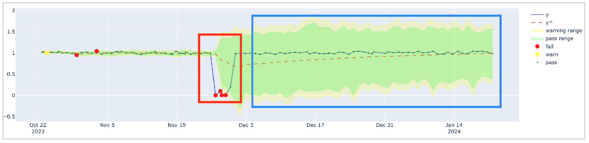<figcaption></figcaption></figure>

The anomalies create larger intervals because the model uses them for training data. To address the issue, consider removing these anomalous records from the training dataset. Use Soda Cloud to ignore the anomalies in the red rectangle by using the **Feedback** feature. Hover over the anomalous measurement in your anomaly detection check page, then click the **Feedback** button and choose to **Ignore this value in future anomaly detection** as in the screenshot below.

<figure>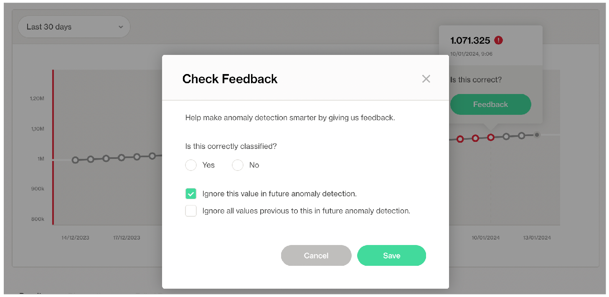<figcaption></figcaption></figure>

After instructing Soda to ignore the anomalous measurements, the model's confidence interval is smaller and the model is more sensitive to anomalies, as indicated in the graph below.

<figure>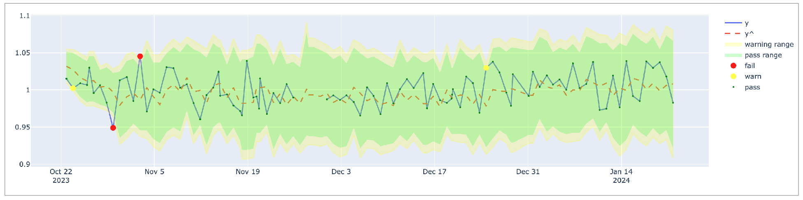<figcaption></figcaption></figure>

## Track anomalies and relative changes by group

You can use a group by configuration to detect anomalies by category, and monitor relative changes over time in each category.

✔️    Requires Soda Core Scientific for anomaly check (included in a Soda Agent)\
✖️    Supported in Soda Core\
✔️    Supported in Soda Library 1.1.27 or greater + Soda Cloud\
✔️    Supported in Soda Cloud Agreements + Soda Agent 0.8.57 or greater\
✖️    Available as a no-code check\


The following example includes three checks grouped by `gender`.

* The first check uses the custom metric `average_children` to collect measurements and gauge them against an absolute threshold of `2`.\
  Soda Cloud displays the check results grouped by gender.
* The second check uses the same custom metric to **detect anomalous measurements** relative to previous measurements. Soda must collect a minimum of four, regular-cadence, measurements to have enough data from which to gauge an anomolous measurement. Until it has enough measurements, Soda returns a check result of `[NOT EVALUATED]`.\
  Soda Cloud displays any detected anomalies grouped by gender.
* The third check uses the same custom metric to **detect changes over time** in the calculated average measurement, and gauge the measurement against a threshold of `between -5 and 5` relative to the previously-recorded measurement. See [Change-over-time thresholds](numeric-metrics.md#change-over-time-thresholds) for supported syntax variations for change-over-time checks.\
  Soda Cloud displays any detected changes grouped by gender.

```yaml
checks for dim_customer:
  - group by:
      name: Group by gender
      query: |
        SELECT gender, AVG(total_children) as average_children
        FROM dim_customer
        GROUP BY gender
      fields:
        - gender
      checks:
        - average_children > 2:
            name: Average children per gender should be more than 2
        - anomaly detection for average_children:
            name: Detect anomaly for average children
        - change for average_children between -5 and 5:
            name: Detect unexpected changes for average children
```

<figure><figcaption></figcaption></figure>

## Troubleshoot Soda Scientific installation

While installing Soda Scientific works on Linux, you may encounter issues if you install Soda Scientific on Mac OS (particularly, machines with the M1 ARM-based processor) or any other operating system. If that is the case, consider using one of the following alternative installation procedures.

* [Install Soda Scientific locally](anomaly-detection.md#install-soda-scientific-locally)
* [Troubleshoot Soda Scientific installation in a virtual env](anomaly-detection.md#troubleshoot-soda-scientific-installation-in-a-virtual-env)
* [Use Docker to run Soda Library](anomaly-detection.md#use-docker-to-run-soda-library)

> Need help? Ask the team in the [Soda community on Slack](https://community.soda.io/slack).

### Install Soda Scientific Locally

1. Set up a virtual environment, and install Soda Library in your new virtual environment.
2. Use the following command to install Soda Scientific.

```
pip install -i https://pypi.cloud.soda.io soda-scientific
```

<details>

<summary>List of Soda Scientific dependencies</summary>

* pandas<2.0.0
* wheel
* pydantic>=1.8.1,<2.0.0
* scipy>=1.8.0
* numpy>=1.23.3, <2.0.0
* inflection==0.5.1
* httpx>=0.18.1,<2.0.0
* PyYAML>=5.4.1,<7.0.0
* cython>=0.22
* prophet>=1.1.0,<2.0.0

</details>

### Use Docker to run Soda Library

Use Soda’s Docker image in which Soda Scientific is pre-installed. You need Soda Scientific to be able to use SodaCL [distribution checks](distribution.md) or [anomaly detection checks](anomaly-detection.md).

1. If you have not already done so, [install Docker](https://docs.docker.com/get-docker/) in your local environment.
2.  From Terminal, run the following command to pull Soda Library’s official Docker image; adjust the version to reflect the most [recent release](../release-notes/soda-library.md).

    ```sh
    docker pull sodadata/soda-library:v1.0.3
    ```
3.  Verify the pull by running the following command.

    ```sh
    docker run sodadata/soda-library:v1.0.3 --help
    ```

    Output:

    ```sh
     Usage: soda [OPTIONS] COMMAND [ARGS]...

       Soda Library CLI version 1.0.x, Soda Core CLI version 3.0.xx

     Options:
       --version  Show the version and exit.
       --help     Show this message and exit.

     Commands:
       ingest           Ingests test results from a different tool
       scan             Runs a scan
       suggest          Generates suggestions for a dataset
       test-connection  Tests a connection
       update-dro       Updates contents of a distribution reference file
    ```

    When you run the Docker image on a non-Linux/amd64 platform, you may see the following warning from Docker, which you can ignore.

    ```sh
    WARNING: The requested image's platform (linux/amd64) does not match the detected host platform (linux/arm64/v8) and no specific platform was requested
    ```
4.  When you are ready to run a Soda scan, use the following command to run the scan via the docker image. Replace the placeholder values with your own file paths and names.

    ```sh
    docker run -v /path/to/your_soda_directory:/sodacl sodadata/soda-library scan -d your_data_source -c /sodacl/your_configuration.yml /sodacl/your_checks.yml
    ```

    Optionally, you can specify the version of Soda Library to use to execute the scan. This may be useful when you do not wish to use the latest released version of Soda Library to run your scans. The example scan command below specifies Soda Library version 1.0.0.

    ```sh
    docker run -v /path/to/your_soda_directory:/sodacl sodadata/soda-library:v1.0.0 scan -d your_data_source -c /sodacl/your_configuration.yml /sodacl/your_checks.yml
    ```

<details>

<summary>What does the scan command do?</summary>

* `docker run` ensures that the docker engine runs a specific image.
* `-v` mounts your SodaCL files into the container. In other words, it makes the configuration.yml and checks.yml files in your local environment available to the docker container. The command example maps your local directory to `/sodacl` inside of the docker container.
* `sodadata/soda-library` refers to the image that `docker run` must use.
* `scan` instructs Soda Library to execute a scan of your data.
* `-d` indicates the name of the data source to scan.
* `-c` specifies the filepath and name of the configuration YAML file.

</details>

#### Error: mounts denied

If you encounter the following error, follow the procedure below.

```
docker: Error response from daemon: Mounts denied: 
The path /soda-library-test/files is not shared from the host and is not known to Docker.
You can configure shared paths from Docker -> Preferences... -> Resources -> File Sharing.
See https://docs.docker.com/desktop/mac for more info.
```

You need to give Docker permission to acccess your configuration.yml and checks.yml files in your environment. To do so:

1. Access your Docker Dashboard, then select Preferences (gear symbol).
2. Select Resources, then follow the [Docker instructions](https://www.docker.com/blog/file-sharing-with-docker-desktop/) to add your Soda project directory—the one you use to store your configuration.yml and checks.yml files—to the list of directories that can be bind-mounted into Docker containers.
3. Click Apply & Restart, then repeat steps 2 - 4 above.

#### **Error: Configuration path does not exist**

If you encounter the following error, double check the syntax of the scan command in step 4 above.

* Be sure to prepend `/sodacl/` to both the congifuration.yml filepath and the checks.yml filepath.
* Be sure to mount your files into the container by including the `-v` option. For example, `-v /Users/MyName/soda_project:/sodacl`.

```sh
Soda Library 1.0.x
Configuration path 'configuration.yml' does not exist
Path "checks.yml" does not exist
Scan summary:
No checks found, 0 checks evaluated.
2 errors.
Oops! 2 errors. 0 failures. 0 warnings. 0 pass.
ERRORS:
Configuration path 'configuration.yml' does not exist
Path "checks.yml" does not exist
```

### Troubleshoot Soda Scientific installation in a virtual env

If you have defined an `anomaly detection` check and you use an M1 MacOS machine, you may get a`Library not loaded: @rpath/libtbb.dylib` error. This is a known issue in the MacOS community and is caused by issues during the installation of the [prophet library](https://github.com/facebook/prophet). There currently are no official workarounds or releases to fix the problem, but the following adjustments may address the issue.

1. Install `soda-scientific` as per the local environment installation instructions and activate the virtual environment.
2.  Use the following command to navigate to the directory in which the `stan_model` of the `prophet` package is installed in your virtual environment.

    ```sh
    cd path_to_your_python_virtual_env/lib/pythonyour_version/site_packages/prophet/stan_model/
    ```

    For example, if you have created a python virtual environment in a `/venvs` directory in your home directory and you use Python 3.9, you would use the following command.

    ```
    cd ~/venvs/soda-library-prophet11/lib/python3.9/site-packages/prophet/stan_model/
    ```
3.  Use the `ls` command to determine the version number of `cmndstan` that `prophet` installed. The `cmndstan` directory name includes the version number.

    ```sh
    ls
    cmdstan-2.26.1		prophet_model.bin
    ```
4.  Add the `rpath` of the `tbb` library to your `prophet` installation using the following command.

    ```sh
    install_name_tool -add_rpath @executable_path/cmdstanyour_cmdstan_version/stan/lib/stan_math/lib/tbb prophet_model.bin
    ```

    With `cmdstan` version `2.26.1`, you would use the following command.

    ```sh
    install_name_tool -add_rpath @executable_path/cmdstan-2.26.1/stan/lib/stan_math/lib/tbb prophet_model.bin
    ```

## Go further

* Learn more about the [anomaly dashboard](../collaborate/anomaly-dashboard.md) for datasets.
* Reference [tips and best practices for SodaCL](../soda-cl-overview/quick-start-sodacl.md#tips-and-best-practices-for-sodacl).


